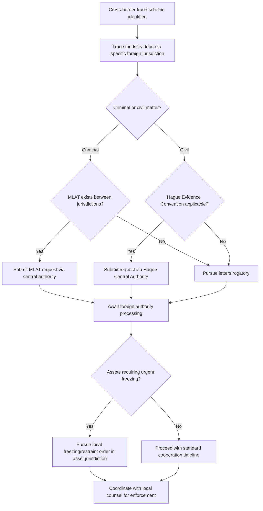

## International Legal Cooperation in Fraud Cases

### Overview

International legal cooperation in fraud cases refers to the mechanisms and frameworks through which governments, courts, and law enforcement agencies across different jurisdictions collaborate to investigate, prosecute, and recover assets in fraud schemes that cross national borders. As financial fraud increasingly involves multinational corporate structures, offshore accounts, cross-border wire transfers, and internationally distributed evidence and witnesses, forensic accountants must understand the available cooperation mechanisms, their limitations, and the timelines they typically involve.

### Why Cross-Border Cooperation Is Necessary

- **Jurisdictional limits on domestic authority**: A court or law enforcement agency generally cannot compel evidence production, testimony, or asset seizure outside its own territorial jurisdiction without invoking a formal cooperation mechanism
- **Asset flight and concealment**: Fraud proceeds are frequently moved to jurisdictions with strict bank secrecy laws or limited cooperation frameworks specifically to frustrate recovery efforts
- **Fragmented evidence**: Witnesses, documents, and transactional records relevant to a single fraud scheme are often dispersed across multiple countries, particularly in schemes involving shell companies or layered corporate structures

### Key Formal Cooperation Mechanisms

**Key Points**

**Mutual Legal Assistance Treaties (MLATs)**

Bilateral or multilateral treaties between governments establishing formal channels for requesting and providing assistance in criminal matters, including evidence gathering, witness testimony, asset freezing, and extradition-related support. MLAT requests are typically routed through designated central authorities (e.g., a justice ministry) in each treaty country and are generally reserved for criminal, rather than purely civil, matters.

**Letters Rogatory (Letters of Request)**

A more traditional, court-to-court diplomatic mechanism for requesting judicial assistance, historically slower and less standardized than MLAT processes, still used particularly with countries lacking an applicable MLAT or for civil matters where MLAT mechanisms (often criminal-focused) are unavailable.

**Hague Evidence Convention**

A multilateral treaty (formally the Hague Convention on the Taking of Evidence Abroad in Civil or Commercial Matters) providing a structured mechanism for obtaining evidence located in one signatory country for use in civil or commercial proceedings in another signatory country, operating through designated Central Authorities in each member state.

**Extradition Treaties**

Bilateral or multilateral agreements establishing the process by which one country may formally request the surrender of an individual located in another country to face criminal charges, subject to requirements such as dual criminality (the conduct must be criminal in both jurisdictions) and, in many treaties, exceptions for certain categories of offenses or nationals.

**INTERPOL Notices**

International law enforcement cooperation mechanism (not itself a legal compulsion tool) through which member countries can request international awareness or provisional arrest of a subject (e.g., via a "Red Notice"), supporting but not replacing formal extradition processes.

### International Asset Recovery Mechanisms

- **Asset freezing and restraint orders**: Many jurisdictions provide for interim relief (e.g., freezing orders) that can, subject to local recognition procedures, be sought to prevent dissipation of fraud proceeds located abroad while formal recovery proceedings are pursued
- **Civil asset recovery litigation**: Pursuing civil claims directly in the jurisdiction where assets are located, particularly relevant where local law recognizes claims such as unjust enrichment, constructive trust, or tracing remedies
- **International anti-corruption and asset recovery initiatives**: Multilateral frameworks (such as the UN Convention Against Corruption, and initiatives like the Stolen Asset Recovery Initiative) provide guidance and, in some cases, direct assistance mechanisms for cross-border recovery of proceeds of corruption-related fraud
- **Financial Action Task Force (FATF) framework**: An intergovernmental body setting international standards for anti-money laundering and countering the financing of terrorism, indirectly relevant to fraud investigations because member countries' implementation of FATF standards affects the availability and speed of financial institution cooperation in a given jurisdiction

### Bank Secrecy and Data Protection Obstacles

- **Bank secrecy jurisdictions**: Some jurisdictions maintain strict statutory bank secrecy protections that limit disclosure of financial account information absent a qualifying treaty mechanism, court order recognized under local law, or narrow statutory exception
- **Data protection regimes**: Regulations such as the EU's GDPR impose specific restrictions and procedural requirements on the cross-border transfer of personal data, which can create friction with foreign discovery or investigative requests, particularly for civil matters where the underlying legal basis for data transfer may be more contested than in a formal criminal MLAT context
- [Inference] Because the interaction between bank secrecy laws, data protection regimes, and international cooperation mechanisms is highly jurisdiction-specific and subject to ongoing legal and regulatory development, forensic accountants working on cross-border matters typically rely on local counsel in the relevant foreign jurisdiction rather than assuming home-jurisdiction discovery norms will apply.

### Practical Timelines and Limitations

[Unverified] Formal international cooperation mechanisms — particularly MLAT requests and letters rogatory — are widely reported in professional and legal literature to often take many months to over a year to complete, depending on the requesting and requested countries, the complexity of the request, and the responsiveness of the foreign central authority; specific timelines vary considerably by jurisdiction pair and are not amenable to a single reliable estimate.

Additional practical limitations include:

- **Dual criminality requirements**: Many cooperation mechanisms (particularly extradition and some MLAT provisions) require that the underlying conduct be criminal in both the requesting and requested jurisdiction
- **Political and diplomatic considerations**: Cooperation requests can be affected by the broader diplomatic relationship between the countries involved, independent of the legal merits of the request
- **Resource constraints**: Central authorities processing MLAT and letters rogatory requests often face significant caseloads, contributing to processing delays
- **Sovereignty and public policy exceptions**: Requested countries generally retain discretion to decline cooperation where the request conflicts with fundamental public policy or sovereignty interests

### Regional and Specialized Cooperation Frameworks

- **European Investigation Order (EIO)**: A streamlined mechanism among EU member states, generally faster than traditional MLAT processes for cooperation within the EU
- **Egmont Group**: An international network of Financial Intelligence Units (FIUs) facilitating the exchange of financial intelligence relevant to money laundering and associated fraud, operating alongside (but distinct from) formal judicial cooperation mechanisms
- **Bilateral tax information exchange agreements and the Common Reporting Standard (CRS)**: Frameworks facilitating cross-border exchange of financial account information for tax purposes, which can also surface information relevant to broader fraud investigations

### The Forensic Accountant's Role in Cross-Border Matters

- Identifying which jurisdictions are likely to hold relevant evidence or assets early in the investigation, to allow adequate lead time for slow formal cooperation mechanisms
- Working with local counsel and, where applicable, government authorities to understand which cooperation mechanism is applicable to the specific evidence or asset sought
- Structuring investigative timelines and litigation strategy around realistic expectations for the pace of cross-border evidence gathering
- Assisting in tracing funds across multiple jurisdictions to identify the specific accounts, entities, or assets that should be the target of a formal cooperation request

### Cross-Border Cooperation Workflow

### Example

**Example**

An investigation reveals that funds embezzled from a domestic company were wired through accounts in a jurisdiction with strict bank secrecy protections before being invested in real property in a third country. The forensic accounting team traces the fund flow using available banking records and open-source property registries, then works with counsel to pursue two parallel tracks: an MLAT request to the secrecy jurisdiction (given the existence of an applicable treaty and a parallel criminal referral) to obtain the underlying account records, and a civil asset-freezing application filed directly in the third country where the real property is located, pursued through local counsel to prevent the property's sale while the broader investigation and MLAT request proceed.

### Common Pitfalls

- **Underestimating the time required** for formal cooperation mechanisms, leading to delayed action that allows asset dissipation
- **Applying home-jurisdiction discovery expectations** to a cross-border matter without confirming applicable local law and treaty frameworks
- **Failing to distinguish civil from criminal cooperation channels**, given that many mechanisms (e.g., MLATs) are criminal-focused and inapplicable to a purely civil claim
- **Overlooking data protection restrictions** on cross-border information transfer, particularly involving EU-based data
- **Inadequate early identification of relevant foreign jurisdictions**, resulting in lost time that could have been used to initiate slow-moving cooperation requests earlier in the investigation

### Conclusion

**Conclusion**

International legal cooperation in fraud cases relies on a patchwork of treaty-based and multilateral mechanisms — MLATs, letters rogatory, the Hague Evidence Convention, extradition treaties, and specialized regional and financial-intelligence frameworks — each with distinct scope, applicable case types, and practical limitations. Because these mechanisms are frequently slow, jurisdiction-dependent, and subject to sovereignty and public policy constraints, forensic accountants involved in cross-border fraud investigations should identify relevant foreign jurisdictions early, coordinate closely with local counsel, and build realistic timelines into investigative and litigation strategy from the outset.

**Related Topics**

- Subpoenas and third-party record requests
- Cross-border data privacy compliance (GDPR) in investigations
- Asset tracing and recovery methodologies
- Anti-money laundering frameworks and Financial Intelligence Units
- Bank secrecy jurisdictions and beneficial ownership transparency
- Extradition and dual criminality requirements
- Parallel civil and criminal proceedings coordination