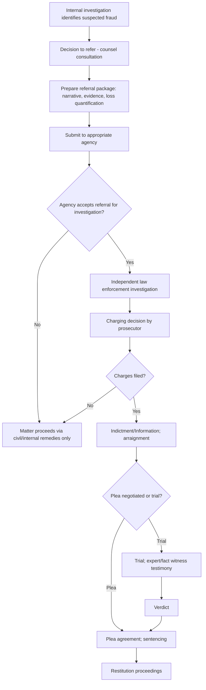

## Criminal Referral and Prosecution Process

### Overview

The criminal referral and prosecution process describes the sequence of steps by which a suspected fraud matter moves from initial detection through referral to law enforcement or prosecutorial authorities, and ultimately through the formal criminal justice process. Forensic accountants play a significant role at multiple stages of this process — from preparing the referral package that persuades authorities to open an investigation, through providing ongoing analytical support during prosecution, to serving as expert or fact witnesses at trial.

### The Decision to Refer

Before a matter is referred to criminal authorities, an organization (often guided by counsel) typically weighs several considerations:

- **Strength of the evidence**: Whether the internal investigation has developed sufficient factual support to justify law enforcement's limited investigative resources and to survive prosecutorial screening
- **Materiality and public interest**: The magnitude of the loss, the nature of the conduct, and whether it implicates broader public interests (e.g., securities markets, public funds, healthcare systems) that make criminal referral more likely to be accepted
- **Reputational and business considerations**: The organization's own assessment of the reputational, operational, and relationship consequences of pursuing a criminal referral, as distinct from pursuing purely internal discipline or civil remedies
- **Regulatory or statutory reporting obligations**: In some contexts, referral is not discretionary — regulated entities (e.g., financial institutions filing Suspicious Activity Reports) may have mandatory reporting obligations triggered by certain suspected conduct
- **Insurance and recovery considerations**: Some insurance policies (e.g., fidelity bonds, crime coverage) may require or incentivize a criminal referral as a condition of coverage or to support a claim

[Inference] Because the decision to refer carries significant strategic, legal, and reputational implications, this decision is generally made in close consultation with legal counsel rather than unilaterally by the forensic accounting or internal audit function.

### Preparing the Referral Package

**Key Points**

A well-prepared criminal referral package typically includes:

- **A clear, chronological narrative** summarizing the suspected fraudulent conduct in terms accessible to investigators and prosecutors who may lack specialized accounting background
- **Organized supporting documentation**: Key financial records, communications, and other evidence, indexed and cross-referenced to the narrative
- **A summary of the applicable legal elements** the evidence appears to support (e.g., mapping evidence to the elements of wire fraud or embezzlement), prepared in consultation with counsel
- **Quantification of loss**, presented with a clear, defensible methodology
- **Identification of potential witnesses** and a summary of what each is expected to be able to establish
- **A summary of the internal investigation process** itself, including methodology, scope, and any limitations, to support the credibility and completeness of the referral

### Referral Recipients and Initial Case Screening

Depending on the nature and jurisdiction of the suspected fraud, referrals may be directed to:

- **Local or state/provincial law enforcement and prosecutors**: Typically appropriate for fraud without a strong federal or cross-border nexus
- **Federal law enforcement agencies** (e.g., FBI, Secret Service, or equivalent agencies in other countries): Often appropriate for larger-scale fraud, matters involving interstate or international elements, or specific statutory jurisdiction (e.g., securities fraud, healthcare fraud, tax fraud referred to specialized units)
- **Regulatory agencies with independent enforcement authority**: Agencies such as securities regulators or tax authorities may pursue their own administrative or civil enforcement in parallel with, or instead of, a criminal referral
- **Multi-agency or task force referrals**: Complex fraud matters spanning multiple statutory areas may be referred to coordinated task forces involving multiple agencies

Upon receiving a referral, the relevant agency typically conducts an initial screening to assess whether the matter merits opening a formal investigation, considering factors such as resource availability, the strength of the referral package, and prosecutorial priorities.

### The Formal Investigation Stage

If a referral is accepted, law enforcement typically conducts its own independent investigation, which may include:

- Issuing grand jury subpoenas (in jurisdictions using a grand jury process) or equivalent formal investigative demands
- Conducting search warrants where probable cause supports doing so
- Interviewing witnesses independently of the referring organization's internal investigation
- Engaging government forensic accountants or financial analysts, who may request cooperation or clarification from the referring organization's own forensic accounting team

Forensic accountants involved in the original internal investigation are frequently asked to provide ongoing assistance during this stage, subject to appropriate privilege and cooperation agreements established by counsel.

### The Charging Decision

Prosecutorial authorities generally exercise significant discretion regarding whether to pursue formal charges, informed by:

- **Sufficiency of evidence** to meet the applicable "beyond a reasonable doubt" standard at trial
- **Prosecutorial guidelines and priorities**, which vary by agency and jurisdiction and often prioritize cases involving larger losses, vulnerable victims, or particular categories of misconduct
- **Likelihood of conviction** relative to the resources required to prosecute
- **Availability of cooperating witnesses or defendants**, which can affect both the charging decision and subsequent plea negotiations

### Formal Charging Mechanisms

- **Indictment**: In jurisdictions using a grand jury system, a grand jury reviews evidence presented by the prosecution and votes on whether sufficient evidence exists to formally charge the defendant
- **Information**: In some jurisdictions, or for certain offense categories, a prosecutor may file charges directly without grand jury review, subject to the defendant's right to a preliminary hearing in some frameworks
- **Complaint**: An initial charging document, often used to support an arrest, subsequently followed by an indictment or information for the matter to proceed to trial

### Pre-Trial and Trial Process

1. **Arraignment**: The defendant is formally informed of the charges and enters a plea
2. **Pre-trial motions**: Including motions to suppress evidence, motions to dismiss, and evidentiary motions regarding expert testimony
3. **Plea negotiations**: A substantial proportion of criminal fraud matters resolve through negotiated plea agreements rather than proceeding to trial; forensic accountants may be asked to provide input on loss quantification relevant to sentencing considerations even where a plea is reached
4. **Trial**: If the matter proceeds to trial, forensic accountants may serve as expert or fact witnesses, presenting financial analysis to the trier of fact
5. **Sentencing**: In many jurisdictions, sentencing for fraud offenses is influenced significantly by the quantified loss amount, making the forensic accountant's loss calculation directly relevant to sentencing outcomes even after a conviction or plea is secured

### Restitution and Victim Recovery

- Many jurisdictions provide for restitution orders as part of criminal sentencing, requiring the defendant to compensate victims for quantified losses
- Forensic accountants often play a continuing role in supporting restitution proceedings, including tracing recoverable assets and updating loss calculations as additional facts emerge
- Restitution obtained through criminal proceedings does not necessarily preclude parallel civil recovery efforts, though courts and counsel typically coordinate to avoid double recovery

### Criminal Referral and Prosecution Workflow

### Example

**Example**

A mid-sized manufacturer's internal investigation confirms that a controller diverted approximately $1.2 million through a fictitious vendor scheme over three years. Counsel decides to refer the matter to the local FBI field office given the interstate wire transfers involved. The forensic accounting team prepares a referral package including a chronological narrative, an indexed set of supporting bank and vendor records, and a detailed loss quantification schedule. Following acceptance of the referral, the FBI conducts its own investigation, including additional subpoenas, and the matter proceeds to a negotiated guilty plea; the forensic accountant's updated loss calculation, incorporating additional transactions identified during the government's investigation, becomes the basis for both the sentencing court's loss determination and a subsequent restitution order.

### Common Pitfalls

- **Referring prematurely**, before the internal investigation has developed sufficient evidentiary support, risking a declined referral or a compromised future investigation
- **Poorly organized referral packages**, requiring investigators to spend disproportionate time simply understanding the allegation rather than acting on it
- **Failing to anticipate sentencing-relevant loss quantification needs**, since the methodology and support for a loss figure prepared early in an investigation may need to withstand scrutiny much later at sentencing
- **Inadequate coordination between internal counsel and law enforcement** regarding privilege, ongoing cooperation, and information-sharing protocols
- **Overlooking mandatory reporting obligations** that may make referral non-discretionary in certain regulated contexts

### Conclusion

**Conclusion**

The criminal referral and prosecution process moves a suspected fraud matter from internal detection through a deliberate referral decision, agency screening, independent investigation, charging, and ultimately trial or plea resolution and sentencing. Forensic accountants contribute at nearly every stage — preparing persuasive and well-organized referral packages, supporting the government's independent investigation, quantifying losses for both charging and sentencing purposes, and providing expert testimony — making a clear understanding of this process essential to providing effective, well-timed support throughout a criminal fraud matter.

**Related Topics**

- Overview of civil and criminal legal systems
- Elements of fraud under civil and criminal law
- Loss quantification methodologies for sentencing and restitution
- Expert witness testimony in criminal fraud trials
- Coordinating fraud investigations with legal counsel and law enforcement
- Parallel civil and criminal proceedings coordination
- Plea negotiations and their impact on civil recovery strategy