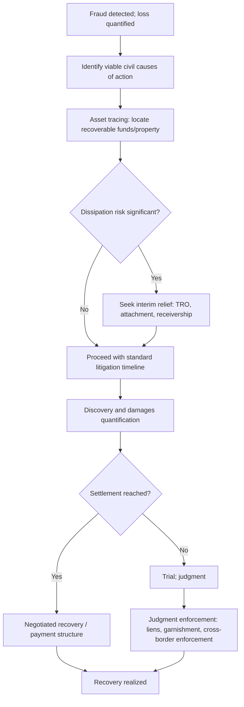

## Civil Litigation and Recovery Actions

<syllabot_broad_topic/>

### Overview

Civil litigation and recovery actions encompass the private legal remedies available to victims of fraud seeking to recover financial losses, distinct from and often pursued alongside criminal prosecution. Because criminal proceedings are directed at punishing the offender rather than compensating the victim, and because criminal restitution is often limited by the defendant's ability to pay, civil litigation frequently represents the primary or sole practical avenue for meaningful financial recovery. Forensic accountants play a central role in civil recovery actions, from tracing assets and quantifying damages to supporting settlement negotiations and enforcement of judgments.

### Common Civil Causes of Action in Fraud Recovery

**Key Points**

- **Common law fraud/deceit**: Requiring proof of false representation, scienter, intent to induce reliance, justifiable reliance, and damages
- **Breach of fiduciary duty**: Applicable against officers, directors, trustees, partners, or other parties owing a duty of loyalty or care to the plaintiff
- **Unjust enrichment**: A restitutionary remedy allowing recovery where the defendant has been unjustly enriched at the plaintiff's expense, potentially available even absent a formal contractual relationship
- **Conversion**: A common law tort addressing the wrongful exercise of dominion over another's property, often applicable to misappropriated funds or assets
- **Civil conspiracy**: Extending liability to multiple parties who agreed to participate in the fraudulent scheme, even where individual roles varied
- **Aiding and abetting liability**: In some jurisdictions, extending liability to third parties (e.g., professional advisors, financial institutions) who knowingly assisted the fraud, subject to jurisdiction-specific standards for the required knowledge and level of assistance
- **Statutory civil remedies**: Many jurisdictions provide specific statutory causes of action for fraud-related conduct, such as securities fraud civil liability provisions, consumer protection statutes, or racketeering-style statutes (e.g., civil RICO in the U.S.) that can provide enhanced remedies such as treble damages

### Asset Tracing as a Predicate to Recovery

Effective civil recovery is generally dependent on first identifying where fraudulently obtained assets are located:

- **Following the money trail**: Tracing funds through bank accounts, investment vehicles, real property acquisitions, and other assets, often across multiple institutions and, in cross-border matters, multiple jurisdictions
- **Tracing through commingled funds**: Applying established tracing doctrines (such as the "lowest intermediate balance" principle in some jurisdictions) to identify recoverable funds even where fraudulently obtained money has been mixed with legitimate funds
- **Identifying assets titled in third-party names**: Uncovering assets transferred to family members, shell entities, or associates to frustrate recovery, which may support additional claims (see fraudulent transfer, below)

### Fraudulent Transfer / Fraudulent Conveyance Actions

- A distinct civil cause of action addressing transfers made by a debtor with the intent to hinder, delay, or defraud creditors, or transfers made for less than reasonably equivalent value while the debtor was insolvent or became insolvent as a result
- Allows a plaintiff to potentially unwind transfers made to third parties (including family members or affiliated entities) who received fraudulently transferred assets, subject to defenses such as good faith purchaser for value
- Forensic accountants often play a central analytical role in these actions, reconstructing the debtor's financial condition at the time of the challenged transfer and analyzing whether reasonably equivalent value was exchanged

### Provisional and Interim Remedies

Given the risk of asset dissipation during the pendency of litigation, civil recovery actions frequently involve requests for interim relief:

- **Temporary restraining orders and preliminary injunctions**: Court orders restraining a defendant from transferring or dissipating specific assets pending resolution of the litigation
- **Prejudgment attachment**: Allowing a plaintiff to secure specific assets or property in advance of a final judgment, subject to jurisdiction-specific procedural requirements
- **Receivership**: Appointment of a court-supervised receiver to take control of assets or a business entity, often used in complex fraud matters where ongoing dissipation or mismanagement risk is significant, and where forensic accountants are frequently engaged to assist the receiver

### Damages Quantification in Civil Recovery

Forensic accountants typically apply one or more established damages methodologies depending on the nature of the claim:

- **Out-of-pocket loss method**: Measuring the actual financial loss suffered, typically the difference between what was paid or invested and the actual value received
- **Benefit-of-the-bargain method**: Measuring the difference between the value as represented and the actual value received, applicable in certain fraud contexts and jurisdictions
- **Disgorgement/unjust enrichment measure**: Measuring the defendant's ill-gotten gains rather than the plaintiff's loss, relevant particularly where the two figures diverge significantly
- **Consequential damages**: Additional losses flowing from the fraud beyond the direct transaction loss, subject to jurisdiction-specific limitations on foreseeability and certainty

### Settlement Considerations

A substantial proportion of civil fraud recovery actions resolve through settlement rather than trial. Forensic accountants support settlement negotiations by:

- Providing a range of defensible damages calculations under alternative legal theories or assumptions
- Assessing the realistic collectability of a judgment against the specific defendant's identified assets, which often drives settlement value more than the theoretical damages figure alone
- Structuring settlement terms that may include payment schedules, asset transfers, or cooperation provisions relevant to related criminal or regulatory matters

### Judgment Enforcement

Obtaining a favorable judgment does not guarantee recovery; enforcement mechanisms include:

- **Judgment liens**: Attaching to the defendant's real property to secure eventual satisfaction of the judgment
- **Garnishment**: Directing a third party (e.g., an employer or bank) holding the defendant's assets or wages to pay amounts toward the judgment
- **Charging orders**: Directing a debtor's interest in certain business entities (e.g., partnership or LLC interests) toward judgment satisfaction, subject to jurisdiction-specific procedures
- **Cross-border enforcement**: Recognition and enforcement of a domestic judgment in a foreign jurisdiction where assets are located, which can require separate legal proceedings and is subject to the foreign jurisdiction's own recognition standards and any applicable treaty framework

### Interaction with Criminal Proceedings

- **Restitution vs. civil judgment**: Criminal restitution orders and civil judgments can coexist, though courts and counsel typically coordinate to avoid double recovery for the same loss
- **Stay of civil proceedings**: Courts may stay civil discovery or proceedings pending resolution of a related criminal matter, particularly to protect a defendant's Fifth Amendment rights, which can affect the pace of civil recovery efforts
- **Use of criminal findings in civil proceedings**: A criminal conviction can, in some jurisdictions, have preclusive or persuasive evidentiary effect in a related civil proceeding, potentially streamlining proof of certain elements

### Civil Recovery Workflow

### Example

**Example**

A private equity fund discovers that a portfolio company's former CEO diverted funds through a fraudulent consulting arrangement with an entity secretly controlled by the CEO's spouse. The fund's forensic accounting team traces the diverted funds to a real property purchase in the spouse's name. Given the risk that the property could be sold or further encumbered, counsel seeks a prejudgment attachment on the property while pursuing civil claims for fraud, breach of fiduciary duty, and fraudulent transfer against both the CEO and the spouse's entity. The forensic accountant's damages analysis presents both an out-of-pocket loss calculation and a disgorgement calculation reflecting the total diverted funds plus any investment gains realized, supporting settlement negotiations that ultimately result in a structured payment plan secured by the previously attached property.

### Common Pitfalls

- **Pursuing litigation without first assessing collectability**, resulting in a costly judgment against a defendant with no recoverable assets
- **Delaying asset tracing and interim relief requests**, allowing dissipation of assets that could otherwise have been secured
- **Overlooking fraudulent transfer claims** against third parties who received diverted assets
- **Failing to coordinate civil damages theories with parallel criminal restitution efforts**, risking inconsistent positions or double-recovery complications
- **Underestimating cross-border enforcement complexity** when recoverable assets are located outside the judgment jurisdiction

### Conclusion

**Conclusion**

Civil litigation and recovery actions provide victims of fraud with a range of causes of action, provisional remedies, and enforcement mechanisms aimed at actual financial recovery — a distinct objective from the punitive focus of criminal prosecution. Effective civil recovery depends heavily on early and thorough asset tracing, realistic assessment of collectability, well-supported damages quantification under appropriate legal theories, and, where assets are at risk of dissipation, timely pursuit of interim relief such as attachment or receivership, all coordinated closely with related criminal or regulatory proceedings where they exist.

**Related Topics**

- Elements of fraud under civil and criminal law
- Asset tracing and recovery methodologies
- Fraudulent transfer and conveyance analysis
- Damages quantification methodologies in fraud litigation
- Criminal referral and prosecution process
- Cross-border enforcement of civil judgments
- Receivership and court-appointed fiduciary roles in fraud matters