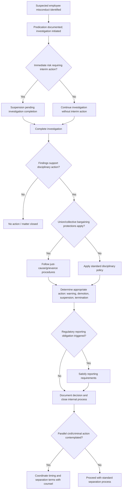

## Employment Actions and Internal Discipline

### Overview

Employment actions and internal discipline refer to the range of organizational responses — short of criminal referral or civil litigation — that a company may take against an employee found to have engaged in, or suspected of engaging in, fraudulent conduct. These actions include termination, suspension, demotion, and other disciplinary measures, and are frequently pursued in parallel with or as an alternative to criminal and civil remedies. Forensic accountants support this process by providing the factual and financial basis for disciplinary decisions, while employment law considerations govern how that process must be conducted to minimize the organization's legal exposure.

### The Relationship Between Internal Discipline and Other Remedies

Internal discipline, civil litigation, and criminal referral are not mutually exclusive and are often pursued in combination, though each involves different standards, objectives, and procedural requirements:

- **Standard of proof**: Internal disciplinary decisions generally require a lower evidentiary threshold than criminal prosecution (beyond a reasonable doubt) or even civil litigation (preponderance of the evidence in many jurisdictions) — many organizations apply a "reasonable belief" or "substantial evidence" standard for internal action, though this varies by organizational policy and applicable employment law
- **Timing considerations**: Internal disciplinary action can often proceed more quickly than criminal or civil processes, but premature termination before an investigation is complete can compromise evidence-gathering (e.g., losing access to the employee's systems or cooperation) and may affect subsequent legal proceedings
- **Sequencing**: Organizations often coordinate the timing of termination with law enforcement referral and civil filing decisions, since termination can trigger asset dissipation risk (if the employee anticipates further legal action) or, conversely, may be delayed at law enforcement's request to avoid compromising an ongoing covert investigation

### The Internal Investigation Process Preceding Disciplinary Action

Before employment action is taken, most organizations conduct or complete a defensible internal investigation, generally involving:

- **Predication and scoping**: Establishing a documented, reasonable basis for the investigation before disciplinary action is contemplated
- **Evidence gathering**: Document review, data analysis, and witness interviews consistent with established fraud examination methodology
- **Documentation of findings**: A clear factual record supporting whatever conclusion the organization reaches, since this record may later be scrutinized in a wrongful termination claim, unemployment benefits proceeding, or related litigation

[Inference] Because disciplinary decisions based on an inadequately documented or investigated basis are more vulnerable to legal challenge, organizations generally treat thorough documentation of the investigative basis as important protection even where the applicable legal standard for internal discipline is comparatively low.

### Categories of Employment Action

**Key Points**

- **Termination for cause**: The most severe employment action, generally requiring the most robust evidentiary support given its significant consequences for the employee and potential legal exposure for the employer
- **Suspension (with or without pay)**: Often used during the pendency of an investigation, allowing the organization to restrict the employee's access to systems and records while avoiding a premature final determination
- **Demotion or reassignment**: A less severe action that may be appropriate where misconduct is established but does not rise to a level warranting termination, or where mitigating factors are present
- **Formal warnings and performance improvement plans**: Documented disciplinary measures short of removal, often used for less severe or unintentional conduct, or as part of a progressive discipline framework
- **Compensation clawback**: Recovery of previously paid compensation (bonuses, incentive pay) tied to misconduct, particularly relevant where compensation was based on financial results later found to be misstated, and increasingly addressed by specific regulatory requirements in some jurisdictions (e.g., executive compensation clawback rules tied to financial restatements)

### Employment Law Considerations

- **At-will employment vs. for-cause protections**: In jurisdictions recognizing at-will employment, employers generally retain broad discretion to terminate absent a specific contractual, statutory, or public-policy limitation; in jurisdictions or contexts with greater job security protections (e.g., unionized employees, civil service positions, or jurisdictions with stronger general employment protections), termination for cause typically requires a more substantial and well-documented factual basis
- **Union and collective bargaining considerations**: Unionized employees may be entitled to specific procedural protections (e.g., "just cause" standards under a collective bargaining agreement, grievance and arbitration procedures) that must be followed before or in connection with disciplinary action
- **Anti-discrimination and retaliation considerations**: Disciplinary decisions must be applied consistently to avoid claims that the action was motivated by a protected characteristic or was retaliatory (e.g., following a protected whistleblower disclosure), independent of whether the underlying misconduct allegation is substantiated
- **Defamation risk**: Statements made during or following the disciplinary process — particularly to third parties, prospective employers via reference checks, or within the organization beyond those with a legitimate need to know — can create defamation exposure if allegations are not adequately substantiated or are communicated inaccurately
- **Whistleblower protections**: Where the employee facing discipline has also made a protected disclosure, heightened care is needed to ensure the disciplinary action is demonstrably unrelated to the protected activity

### Documentation Standards for Defensible Disciplinary Action

- A clear, contemporaneous investigative record establishing the factual basis for the decision
- Consistency with the organization's own policies and past disciplinary practice for comparable conduct, to avoid claims of disparate treatment
- Clear documentation of the decision-making process, including who was involved in the decision and what evidence was considered
- Where termination is based on specific financial findings, a clear, well-supported quantification prepared or reviewed by the forensic accounting function

### Interaction with Regulatory Reporting Obligations

- In regulated industries, certain findings of employee misconduct may trigger mandatory reporting obligations to regulators (e.g., securities industry self-regulatory organization reporting requirements) independent of, and sometimes with specific timing requirements distinct from, the organization's internal disciplinary timeline
- Coordination between HR, legal, compliance, and forensic accounting functions is generally necessary to ensure all applicable reporting obligations are satisfied in connection with the disciplinary action

### Severance and Separation Agreement Considerations

- Organizations sometimes negotiate separation agreements even in cases involving suspected misconduct, particularly where the evidentiary basis is contested or where the organization wishes to avoid the cost and publicity of further proceedings
- Such agreements may include confidentiality provisions, non-disparagement clauses, cooperation obligations (e.g., requiring the former employee's continued cooperation with any ongoing investigation or litigation), and, in some cases, partial compensation clawback or repayment terms
- [Inference] Because separation agreements involving suspected fraud can affect the organization's ability to pursue subsequent civil or criminal remedies (and vice versa), such agreements are generally negotiated in close coordination with counsel handling any parallel legal proceedings.

### Employment Action Decision Workflow

### Example

**Example**

A financial controller is suspected of manipulating expense reports to inflate reimbursements over an eighteen-month period. The forensic accounting team completes an investigation quantifying approximately $85,000 in improper reimbursements, supported by expense system records and vendor confirmations. Given the employee's union-represented status, HR and legal ensure the applicable collective bargaining agreement's just-cause and grievance procedures are followed before termination, including providing the employee an opportunity to respond to the findings. The organization documents its decision-making process thoroughly, given the anticipated grievance arbitration, and separately evaluates whether the amount and nature of the conduct warrant referral to law enforcement or a civil recovery action in addition to the completed termination.

### Common Pitfalls

- **Taking disciplinary action before the investigation is adequately documented**, weakening the organization's position if the action is later challenged
- **Inconsistent application of disciplinary standards** across similarly situated employees, inviting discrimination or disparate treatment claims
- **Premature termination that compromises evidence gathering** needed for a subsequent civil or criminal proceeding
- **Failing to coordinate with counsel on the interaction between internal discipline and parallel legal proceedings**, potentially compromising strategy in either process
- **Overlooking mandatory regulatory reporting obligations** triggered by the underlying findings

### Conclusion

**Conclusion**

Employment actions and internal discipline provide organizations with a comparatively fast and lower-evidentiary-threshold mechanism for responding to suspected employee fraud, but require careful navigation of employment law protections, documentation standards, and coordination with any parallel civil, criminal, or regulatory processes. A well-documented, consistently applied, and appropriately sequenced disciplinary process — informed by a thorough forensic accounting investigation — reduces the organization's legal exposure while supporting whatever broader legal remedies it may ultimately pursue.

**Related Topics**

- Structuring the fraud examination interview
- Legal and ethical considerations in interviewing
- Criminal referral and prosecution process
- Civil litigation and recovery actions
- Whistleblower protections and anti-retaliation statutes
- Executive compensation clawback provisions
- Defamation risk in internal investigation communications