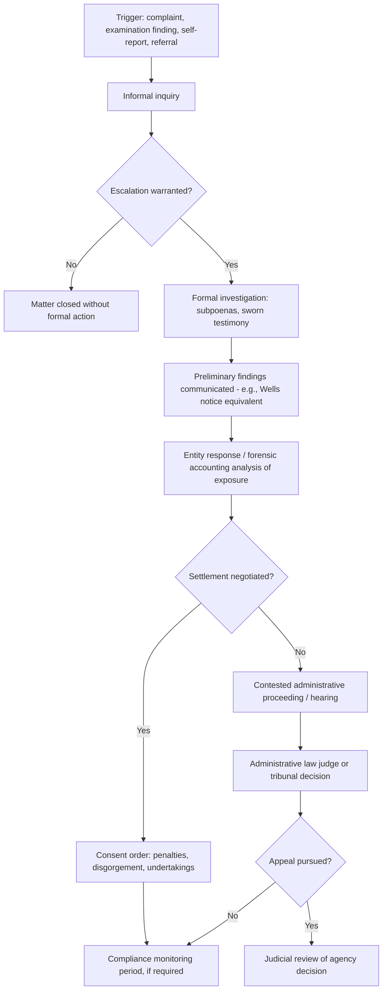

## Regulatory and Administrative Proceedings

### Overview

Regulatory and administrative proceedings occupy a distinct space between civil litigation and criminal prosecution, involving enforcement actions brought by government regulatory agencies exercising statutory authority over specific industries or conduct. In fraud matters, these proceedings are frequently pursued by securities regulators, banking regulators, tax authorities, healthcare program administrators, and similar bodies, often in parallel with — or as an alternative to — civil litigation and criminal referral. Forensic accountants play a substantial role in supporting both the regulated entities responding to these proceedings and, in some engagements, the regulatory agencies themselves.

### Distinguishing Features of Regulatory/Administrative Proceedings

**Key Points**

- **Statutory and regulatory basis**: Regulatory proceedings are grounded in specific enabling statutes and implementing regulations applicable to the regulated industry or activity, distinct from general common law causes of action
- **Specialized adjudicative bodies**: Many regulatory proceedings are heard before administrative law judges or specialized tribunals within the agency itself, rather than general civil courts, at least in the first instance
- **Investigative authority**: Regulatory agencies often possess independent investigative tools (administrative subpoenas, examination authority, civil investigative demands) that can be exercised without the same warrant/probable cause requirements applicable to criminal search warrants
- **Standard of proof**: Generally analogous to civil proceedings (preponderance of the evidence or a similar standard), though this varies by agency and jurisdiction
- **Available sanctions**: Can include monetary penalties, disgorgement of ill-gotten gains, license suspension or revocation, cease-and-desist orders, industry bars, and mandatory remedial undertakings — generally not incarceration, which remains the province of criminal prosecution

### Common Regulatory Bodies Relevant to Fraud Matters

- **Securities regulators** (e.g., the SEC in the U.S., and equivalent bodies internationally): Enforcement authority over securities fraud, disclosure violations, insider trading, and related misconduct affecting public and private securities markets
- **Banking and financial services regulators**: Oversight of financial institution safety and soundness, consumer protection, and anti-money laundering compliance
- **Tax authorities**: Civil and administrative enforcement of tax reporting and payment obligations, including civil penalty proceedings distinct from criminal tax prosecution
- **Healthcare program administrators and regulators**: Oversight of billing, coding, and program integrity issues in government and private healthcare payment systems
- **Professional licensing boards**: Oversight of licensed professionals (accountants, attorneys, financial advisors) with authority to suspend or revoke professional licenses for misconduct
- **Insurance regulators**: Oversight of insurance industry conduct, including fraud affecting policyholders or the broader insurance market
- **Anti-corruption and trade enforcement authorities**: Oversight of statutory frameworks addressing bribery, corruption, and related cross-border misconduct (e.g., the U.S. Foreign Corrupt Practices Act and analogous frameworks in other jurisdictions)

### The Regulatory Investigation Process

1. **Initiation**: Triggered by a whistleblower complaint, a referral from another agency, a routine examination finding an anomaly, self-reporting by the regulated entity, or media/public reporting
2. **Informal inquiry**: Many agencies begin with an informal request for information before escalating to formal investigative authority
3. **Formal investigation**: Involving administrative subpoenas, document requests, and sworn testimony (often called examinations under oath or investigative testimony, depending on the agency)
4. **Wells notice or equivalent**: Some agencies (e.g., the SEC) provide the subject an opportunity to respond in writing before a formal enforcement recommendation is finalized, presenting an opportunity to address the agency's preliminary findings
5. **Enforcement recommendation and authorization**: Internal agency review and approval process before formal charges or a settlement offer is presented
6. **Settlement or contested proceeding**: Many regulatory matters resolve through negotiated settlement (often without admission of wrongdoing, depending on the agency's policies), while contested matters proceed to an administrative hearing or referral to court

### Settlement Considerations in Regulatory Proceedings

- **Consent orders/settlements**: A substantial proportion of regulatory enforcement matters resolve through negotiated settlements, which may include monetary penalties, disgorgement, undertakings (e.g., compliance program enhancements, independent monitor appointments), and, in some frameworks, no formal admission of liability
- **Cooperation credit**: Many regulatory frameworks provide reduced sanctions in exchange for self-reporting, substantial cooperation with the investigation, and remedial measures undertaken by the regulated entity
- **Independent compliance monitors**: In more serious matters, settlements may require the appointment of an independent monitor (in which forensic accountants are frequently engaged) to oversee the entity's compliance with settlement terms over a defined period

### The Forensic Accountant's Role in Regulatory Proceedings

- **Supporting the regulated entity**: Conducting internal investigations in anticipation of or in response to regulatory inquiry, preparing responses to information requests, and quantifying potential exposure (penalties, disgorgement) to inform settlement strategy
- **Serving as an independent compliance monitor or consultant**: Engaged pursuant to a settlement to assess and report on the entity's ongoing compliance
- **Assisting the regulatory agency**: In some jurisdictions, agencies engage outside forensic accounting expertise to support complex financial investigations
- **Expert testimony**: Providing testimony in contested administrative proceedings regarding financial analysis, damages, or disgorgement calculations

### Disgorgement and Civil Penalty Calculations

- **Disgorgement**: Generally intended to recover the amount of unjust gain obtained through the violation, requiring careful forensic accounting analysis to distinguish ill-gotten gains from legitimate business activity, particularly in complex, multi-year schemes
- **Civil monetary penalties**: Often calculated based on statutory formulas (e.g., per-violation penalty amounts, or a multiple of the underlying gain or loss), requiring the forensic accountant to accurately identify the number and nature of discrete violations
- [Inference] Because disgorgement and penalty calculation methodologies are often the subject of dispute in contested regulatory proceedings, and because specific statutory formulas and interpretive guidance vary by agency and evolve through case law, forensic accountants supporting these calculations typically coordinate closely with counsel regarding the specific legal standard applicable to the particular regulatory regime at issue.

### Interaction with Parallel Civil and Criminal Proceedings

- **Parallel proceedings coordination**: Regulatory investigations frequently proceed alongside related civil litigation and criminal referrals, requiring careful coordination regarding privilege, the Fifth Amendment implications of testimony given in one proceeding, and potential collateral estoppel effects
- **Information sharing between agencies**: Many regulatory agencies have formal or informal information-sharing arrangements with criminal law enforcement and with regulators in other jurisdictions, meaning that a matter initiated in one regulatory context may expand to involve multiple agencies
- **Collateral consequences**: A regulatory enforcement action or settlement can carry collateral consequences beyond the direct sanction, such as triggering mandatory disclosure obligations, affecting eligibility for certain licenses or government contracts, or supporting subsequent civil litigation by private plaintiffs

### Regulatory Proceeding Workflow

### Example

**Example**

A publicly traded company self-identifies revenue recognition irregularities and voluntarily discloses the matter to its securities regulator. The regulator opens a formal investigation, issuing document requests and taking sworn testimony from several executives. The forensic accounting team, engaged by outside counsel, prepares a detailed analysis distinguishing properly recognized revenue from improperly accelerated revenue across the relevant period, informing both the company's public restatement and its settlement negotiations with the regulator. The matter ultimately resolves through a consent order including a civil penalty, disgorgement of the estimated improperly recognized amounts, and a two-year independent compliance monitorship — with the forensic accounting firm subsequently engaged in a separate role to serve as part of the monitoring team.

### Common Pitfalls

- **Underestimating the independence of regulatory investigative authority**, which often does not require the same procedural showing as a criminal search warrant
- **Failing to prepare adequately for a Wells notice-equivalent response opportunity**, which can be a significant opportunity to influence the ultimate enforcement outcome
- **Overlooking cooperation credit opportunities**, particularly the potential benefits of early self-reporting and substantial cooperation
- **Inconsistent disgorgement or penalty methodology** that does not clearly align with the specific statutory or regulatory formula applicable to the matter
- **Failing to coordinate regulatory response strategy with parallel civil and criminal exposure**, given the potential for information sharing and collateral consequences across proceedings

### Conclusion

**Conclusion**

Regulatory and administrative proceedings provide government agencies with specialized enforcement tools — investigative authority, administrative adjudication, and remedies such as disgorgement and civil penalties — distinct from both criminal prosecution and private civil litigation. Forensic accountants play a critical role throughout these proceedings, from investigating and quantifying exposure in response to regulatory inquiry, to supporting settlement negotiations, to serving as independent compliance monitors, requiring careful coordination with legal counsel given the frequent overlap between regulatory, civil, and criminal fraud matters.

**Related Topics**

- Overview of civil and criminal legal systems
- Criminal referral and prosecution process
- Civil litigation and recovery actions
- Disgorgement and civil penalty calculation methodologies
- Independent compliance monitorships
- Parallel civil, criminal, and regulatory proceedings coordination
- Whistleblower programs and regulatory self-reporting incentives