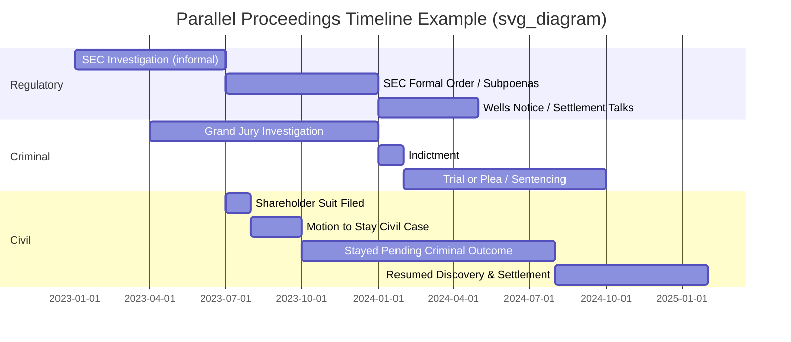

## Parallel Proceedings Considerations

### Overview

Parallel proceedings arise when the same underlying conduct triggers multiple, simultaneously pending legal actions across different forums — typically a criminal prosecution alongside one or more civil, regulatory, or administrative proceedings. In forensic accounting engagements, this occurs routinely in fraud matters: a Department of Justice or state attorney general criminal investigation may run concurrently with an SEC civil enforcement action, a private civil lawsuit (e.g., shareholder class action), and an internal or board-level investigation. The forensic accountant must understand how these tracks interact procedurally, evidentially, and strategically, since work product, testimony, and disclosures in one forum can materially affect the others.

### Why Parallel Proceedings Occur

**Key Points**

- Different forums serve different objectives: criminal prosecution punishes and deters (proof beyond a reasonable doubt); civil actions compensate victims (preponderance of the evidence); regulatory actions (SEC, banking regulators, professional licensing boards) protect market integrity or enforce industry standards (often preponderance or "substantial evidence" standards).
- The same set of facts (e.g., a revenue recognition fraud) can independently violate criminal statutes (e.g., mail/wire fraud, securities fraud under 18 U.S.C. § 1348), civil securities law (Section 10(b)/Rule 10b-5), and trigger private tort/contract claims (breach of fiduciary duty, common law fraud, breach of contract).
- Regulators and prosecutors frequently coordinate informally (parallel investigations) even though the proceedings remain formally separate, since agencies such as the DOJ and SEC have long-standing cooperation protocols in securities fraud matters.

### The Core Tension: Fifth Amendment vs. Civil Discovery

**Key Points**

- A defendant/witness in the criminal matter retains the Fifth Amendment privilege against self-incrimination, which can be asserted in the civil or regulatory proceeding as well.
- Civil litigants generally cannot compel testimony that would incriminate a party in a pending or anticipated criminal case; the privilege is invoked question-by-question, not blanket, in deposition settings.
- Courts have discretion to stay the civil case pending resolution of the criminal matter (a "stay of parallel civil proceedings"), balancing factors such as:
  - The extent to which the issues in the criminal and civil cases overlap
  - The status of the criminal case (indicted vs. under investigation)
  - The plaintiff's interest in expeditious resolution
  - The burden on the defendant if forced to defend both simultaneously
  - The interests of the courts and public
- [Unverified] Specific multi-factor tests (e.g., the balancing framework used in *Securities and Exchange Commission v. Dresser Industries* and its progeny) vary by circuit, so the forensic accountant should confirm the controlling test with counsel in the relevant jurisdiction rather than assume uniform national standards.

### Adverse Inference in Civil Proceedings

**Key Points**

- Unlike criminal proceedings, where invoking the Fifth Amendment cannot be used against the defendant, civil and administrative proceedings generally permit the trier of fact to draw an **adverse inference** from a witness's refusal to testify on Fifth Amendment grounds (*Baxter v. Palmigiano* framework).
- This asymmetry creates strategic pressure: a defendant who stays silent to protect the criminal case may effectively concede the civil case by adverse inference, while testifying to defend the civil case creates a fully discoverable transcript usable by criminal prosecutors.
- Forensic accountants engaged in the civil matter must be alert to gaps in testimony caused by privilege assertions and document how those gaps affect the completeness of financial reconstruction or damages analysis.

### Discovery Coordination and Conflicts

**Key Points**

- Grand jury materials (Federal Rule of Criminal Procedure 6(e)) are subject to strict secrecy and generally cannot be shared with civil litigants or regulators without a court order.
- Civil discovery (depositions, document requests, interrogatories) is typically broader in scope than criminal discovery, which is more constrained by rules like *Brady*/*Giglio* disclosure obligations (prosecution) and reciprocal discovery limits (defense).
- A civil plaintiff's document requests can sometimes be used, intentionally or not, as a back-door mechanism to obtain information that criminal prosecutors could not yet compel — raising "improper use of civil discovery" objections.
- Protective orders and confidentiality stipulations in civil cases must be drafted carefully to address whether/how documents may later be shared with or subpoenaed by criminal authorities.
- Regulatory subpoenas (e.g., SEC Wells process, formal orders of investigation) run on their own timelines and often precede indictment; forensic accountants may be asked to prepare responses to an SEC subpoena while criminal charges remain sealed or uncharged.

### Sequencing Strategy

**Key Points**

- Defense counsel frequently seeks a stay of the civil case until the criminal matter concludes, to avoid the discovery/privilege conflicts above.
- Plaintiffs and regulators often resist a full stay, arguing prejudice from delay (evidence staleness, witness memory decay, statute of limitations pressure on civil claims).
- Courts may issue a **partial stay** — permitting document discovery while deferring depositions of key individual defendants, allowing the forensic accountant's document-based analysis (tracing, reconciliation) to proceed even while testimonial evidence is frozen.
- Global resolution mechanics: many corporate fraud matters conclude with simultaneous or sequential settlements (e.g., a Deferred Prosecution Agreement with DOJ concurrent with an SEC consent order), each often incorporating a **stipulated set of facts** the company will not contest, which the forensic accountant's own findings frequently underpin.

### Evidentiary Cross-Use Issues

**Key Points**

- **Collateral estoppel (issue preclusion):** a fact established in one proceeding (e.g., a criminal conviction) may bind the parties in a later civil proceeding on the identical issue, subject to jurisdiction-specific rules — a criminal conviction is generally admissible as substantive evidence in a later civil case, whereas an acquittal typically is not conclusive of civil non-liability due to the different burdens of proof.
- **Res judicata (claim preclusion)** rarely applies cleanly across criminal/civil lines because the causes of action, parties, and remedies differ, but consent judgments and settlement stipulations can create preclusive effect on specific factual issues.
- Expert reports and forensic accounting work product prepared for one proceeding may be discoverable in a parallel proceeding depending on privilege/work-product protections; a report prepared for a testifying expert generally loses more protection than internal consulting-expert analysis (see Federal Rule of Civil Procedure 26(b)(4)).
- [Inference] Because the discoverability of a forensic accountant's draft materials, notes, and communications can differ sharply between a "testifying expert" and "non-testifying consulting expert" designation, engagement letters should specify this role explicitly at the outset, and any change in role mid-engagement should be treated as a material event requiring counsel consultation.

### Practical Implications for the Forensic Accountant

**Key Points**

- **Engagement letter clarity:** define at the outset which forum(s) the engagement covers, whether the accountant may be called to testify, and how findings/work product may be shared across the criminal defense team, civil counsel, and any regulatory response team.
- **Segregation of workstreams:** where privilege concerns are acute, some engagements deliberately wall off the forensic team's work product between civil and criminal tracks (separate teams, separate file repositories) to avoid inadvertent waiver of privilege.
- **Consistency of factual findings:** because inconsistent numbers across forums (e.g., a different "loss amount" reported to the SEC than testified to in a criminal sentencing memorandum) can be used for impeachment, findings should be reconciled and any differences (e.g., due to different legal definitions of "loss" under sentencing guidelines vs. securities damages models) explicitly documented and explained.
- **Timing of disclosure obligations:** a company facing parallel proceedings often must weigh voluntary self-disclosure to regulators/DOJ (which can earn cooperation credit) against the risk that early disclosure accelerates civil plaintiffs' claims or waives privilege over the underlying investigation.
- **Restitution vs. civil damages overlap:** criminal sentencing often includes a restitution order (Mandatory Victims Restitution Act in federal cases); forensic accountants must track whether civil judgments or settlements offset restitution obligations to avoid double recovery for victims, and coordinate methodology between the sentencing restitution calculation and the civil damages model.

### Illustrative Timeline

### Roles and Information Flow Diagram

<svg xmlns="http://www.w3.org/2000/svg" viewBox="0 0 900 480" font-family="Arial, sans-serif">
<text x="450" y="28" text-anchor="middle" font-size="18" font-weight="bold">Parallel Proceedings — Information Flow (svg_diagram)</text>

<rect x="40" y="70" width="230" height="140" rx="10" fill="#fde2e2" stroke="#c0392b" stroke-width="2" />
<text x="155" y="95" text-anchor="middle" font-size="14" font-weight="bold">Criminal Prosecution</text>
<text x="155" y="118" text-anchor="middle" font-size="11">DOJ / State AG</text>
<text x="155" y="136" text-anchor="middle" font-size="11">Grand Jury (Rule 6(e))</text>
<text x="155" y="154" text-anchor="middle" font-size="11">Beyond reasonable doubt</text>
<text x="155" y="172" text-anchor="middle" font-size="11">5th Amendment fully protects</text>
<text x="155" y="190" text-anchor="middle" font-size="11">silence (no adverse inference)</text>

<rect x="335" y="70" width="230" height="140" rx="10" fill="#fdf2ce" stroke="#b8860b" stroke-width="2" />
<text x="450" y="95" text-anchor="middle" font-size="14" font-weight="bold">Regulatory Action</text>
<text x="450" y="118" text-anchor="middle" font-size="11">SEC / Banking Regulator</text>
<text x="450" y="136" text-anchor="middle" font-size="11">Formal Order / Wells Process</text>
<text x="450" y="154" text-anchor="middle" font-size="11">Preponderance /</text>
<text x="450" y="172" text-anchor="middle" font-size="11">substantial evidence</text>
<text x="450" y="190" text-anchor="middle" font-size="11">Adverse inference permitted</text>

<rect x="630" y="70" width="230" height="140" rx="10" fill="#e2f0fd" stroke="#2166ac" stroke-width="2" />
<text x="745" y="95" text-anchor="middle" font-size="14" font-weight="bold">Civil Litigation</text>
<text x="745" y="118" text-anchor="middle" font-size="11">Shareholder / Private Suit</text>
<text x="745" y="136" text-anchor="middle" font-size="11">Broad discovery</text>
<text x="745" y="154" text-anchor="middle" font-size="11">Preponderance of evidence</text>
<text x="745" y="172" text-anchor="middle" font-size="11">Adverse inference permitted</text>
<text x="745" y="190" text-anchor="middle" font-size="11">May be stayed pending criminal</text>

<line x1="270" y1="140" x2="335" y2="140" stroke="#555" stroke-width="2" marker-end="url(#arrow)" />
<line x1="565" y1="140" x2="630" y2="140" stroke="#555" stroke-width="2" marker-end="url(#arrow)" />
<line x1="335" y1="160" x2="270" y2="160" stroke="#999" stroke-width="1.5" stroke-dasharray="4,3" marker-end="url(#arrowgray)" />
<line x1="630" y1="160" x2="565" y2="160" stroke="#999" stroke-width="1.5" stroke-dasharray="4,3" marker-end="url(#arrowgray)" />

<text x="302" y="130" text-anchor="middle" font-size="9">informal coordination</text>

<text x="597" y="130" text-anchor="middle" font-size="9">public filings /</text>

<text x="597" y="142" text-anchor="middle" font-size="9">settled facts</text>

<rect x="335" y="290" width="230" height="150" rx="10" fill="#e6f5e6" stroke="#2e7d32" stroke-width="2" />
<text x="450" y="315" text-anchor="middle" font-size="14" font-weight="bold">Forensic Accountant</text>
<text x="450" y="338" text-anchor="middle" font-size="11">Engagement letter defines role</text>
<text x="450" y="356" text-anchor="middle" font-size="11">Testifying vs. consulting expert</text>
<text x="450" y="374" text-anchor="middle" font-size="11">Work product privilege scope</text>
<text x="450" y="392" text-anchor="middle" font-size="11">Reconciled loss/damages figures</text>
<text x="450" y="410" text-anchor="middle" font-size="11">across all three forums</text>
<line x1="155" y1="210" x2="400" y2="290" stroke="#c0392b" stroke-width="1.5" stroke-dasharray="3,3" marker-end="url(#arrowred)" />
<line x1="450" y1="210" x2="450" y2="290" stroke="#b8860b" stroke-width="1.5" stroke-dasharray="3,3" marker-end="url(#arrowgold)" />
<line x1="745" y1="210" x2="500" y2="290" stroke="#2166ac" stroke-width="1.5" stroke-dasharray="3,3" marker-end="url(#arrowblue)" />
</svg>

### Example

A public company discloses an accounting fraud involving inflated revenue via channel-stuffing. Within the same year: (1) DOJ opens a grand jury investigation into the CFO for securities fraud; (2) the SEC issues a formal order of investigation and later a Wells Notice; (3) shareholders file a class action alleging Rule 10b-5 violations; (4) the audit committee retains a forensic accounting firm for an independent internal investigation. The forensic accountant working for the audit committee must recognize that: findings shared with the board may be discoverable by shareholders' counsel absent privilege protections; the same findings, if voluntarily disclosed to DOJ/SEC to obtain cooperation credit, could be used as admissions in the civil case; and the CFO's silence in the internal investigation (asserting Fifth Amendment rights) will support an adverse inference in the civil case but cannot be held against them in the criminal trial.

### Related Topics

- Fifth Amendment privilege and *Baxter v. Palmigiano* adverse inference doctrine
- Grand jury secrecy under Federal Rule of Criminal Procedure 6(e)
- SEC Wells Notice process and parallel DOJ/SEC coordination protocols
- Deferred Prosecution Agreements (DPAs) and Non-Prosecution Agreements (NPAs)
- Collateral estoppel and issue preclusion across criminal/civil judgments
- Testifying expert vs. consulting expert work-product protection (FRCP 26(b)(4))
- Mandatory Victims Restitution Act and coordination with civil damages models
- Motions to stay civil proceedings pending criminal resolution (multi-factor balancing tests)