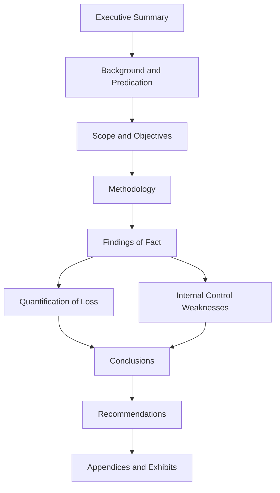

## Structuring the Fraud Examination Report

### Purpose and Governing Standards

**Key Points**

- The fraud examination report is the primary work product communicating findings, methodology, and conclusions from a forensic investigation to its intended users (management, audit committee, board, counsel, law enforcement, regulators, or a court).
- Reports are generally shaped by professional standards such as the ACFE's *Fraud Examiners Manual* guidance and Association of Certified Fraud Examiners (ACFE) Code of Professional Ethics, AICPA Statement on Standards for Forensic Services (SSFS No. 1), and, where litigation is anticipated, applicable expert-witness disclosure rules (e.g., Federal Rule of Civil Procedure 26(a)(2)(B) for testifying experts).
- [Unverified] The specific report format required may be dictated by engagement letter terms, counsel's litigation strategy, or a regulator's investigative protocol, so no single "universal" template applies across all engagements; the structure below reflects common, defensible practice rather than a mandated format.
- The report must be crafted with audience and eventual use in mind: a report intended solely for internal management action may differ substantially in tone and detail from one anticipated to be produced in discovery or admitted at trial.

### Core Principles Governing Report Content

**Key Points**

- **Objectivity and fact-based presentation:** the report should present findings supported by evidence, avoiding legal conclusions (e.g., avoid stating "X committed fraud" — a legal determination — in favor of "the evidence indicates X directed the recording of fictitious sales").
- **Sufficiency and relevance of evidence:** every material finding should be traceable to specific, cited evidence (documents, testimony, data analysis) rather than presented as unsupported opinion.
- **Non-privileged vs. privileged considerations:** where the engagement is conducted at the direction of counsel for the purpose of providing legal advice, care must be taken in drafting to preserve attorney-client privilege and work-product protection; drafting practices (e.g., addressing the report to counsel, marking privileged, limiting distribution) should follow counsel's specific instructions.
- **Avoiding overstatement:** conclusions should be calibrated to the strength of the evidence — a report that reaches conclusions beyond what the evidence supports undermines credibility and can be attacked in cross-examination or during regulatory review.
- **Reproducibility:** the methodology section should be detailed enough that another qualified examiner could understand and, in principle, replicate the analytical steps taken.

### Standard Report Structure

**Key Points**

The following sections represent a widely used structure for a comprehensive fraud examination report, though sequencing and depth vary by engagement scope and audience.

**1. Executive Summary**

- Concise overview (typically 1-3 pages) covering the nature of the allegation, scope of the investigation, key findings, and overall conclusion.
- Written for a reader who may only read this section — avoid jargon, avoid overly technical accounting terminology without brief explanation.

**2. Background and Predication**

- Describes how the investigation was initiated (the "predication" — the totality of circumstances that led to the reasonable belief that fraud may have occurred).
- Identifies who requested the investigation, when, and the initial allegation or anomaly that triggered it (e.g., whistleblower tip, audit finding, unexplained variance).

**3. Scope and Objectives**

- Defines what the investigation was engaged to examine (specific accounts, time periods, transactions, individuals, or business units) and explicitly states what was excluded from scope.
- Clarifies any limitations imposed (e.g., limited document access, non-cooperation of a witness, time constraints).

**4. Methodology**

- Details the investigative techniques applied: document review, data analytics (e.g., Benford's Law testing, duplicate payment testing), interviews conducted, forensic technology used (e.g., e-discovery review platforms, digital forensics imaging), and any sampling methodology with its statistical basis.
- Should specify applicable standards followed (e.g., generally accepted forensic accounting standards, computer forensics chain-of-custody protocols).

**5. Findings of Fact**

- The evidentiary core of the report — organized logically (chronologically, by scheme, or by account/entity) rather than as a raw data dump.
- Each finding should tie specific evidence to a specific conclusion, using consistent citation conventions (e.g., referencing exhibit numbers, document Bates ranges, or workpaper references).
- Common sub-organization by fraud scheme type (per the ACFE Fraud Tree): asset misappropriation, corruption, and financial statement fraud, each detailed separately if multiple schemes are identified.

**6. Quantification of Loss / Financial Impact**

- Presents the calculated loss, fraudulent overstatement, or diverted funds, with the calculation methodology fully shown (not just a final number).
- Should distinguish between amounts that are [Verified] via direct documentary evidence versus amounts that are [Inference] based on extrapolation, sampling, or circumstantial reconstruction (e.g., estimated loss where records were destroyed).
- Where multiple loss measures are relevant (e.g., direct diversion vs. consequential/indirect losses such as reputational harm or remediation costs), each should be clearly separated and labeled.

**7. Internal Control Weaknesses / Root Cause Analysis**

- Identifies the control failures (e.g., lack of segregation of duties, absent three-way match, override of approval hierarchies) that allowed the fraud to occur or go undetected.
- Often organized using a recognized internal control framework (e.g., COSO Internal Control–Integrated Framework components: control environment, risk assessment, control activities, information and communication, monitoring activities).

**8. Conclusions**

- Summarizes what the evidence supports, calibrated appropriately (e.g., "the evidence is consistent with," "the evidence supports a finding that," rather than definitive legal guilt determinations).
- Should tie back explicitly to the original scope/objectives stated in Section 3.

**9. Recommendations**

- Actionable remediation steps: control enhancements, personnel actions (a determination reserved for management/HR/legal, not the examiner), referral considerations (law enforcement, regulator, insurer for fidelity bond claims).
- Should be practical and proportionate to the root causes identified in Section 7.

**10. Appendices / Exhibits**

- Supporting schedules, transaction listings, interview memoranda summaries (subject to privilege considerations), data analytics outputs, and a glossary of terms/individuals if the case involves numerous entities.

### Report Structure Flow Diagram

### Distinguishing Fact, Inference, and Opinion in Drafting

**Key Points**

- **Fact:** directly evidenced by a document, data record, or admission (e.g., "Invoice #4521, dated March 3, records a payment of $50,000 to Vendor X").
- **Inference:** a reasoned conclusion drawn from a pattern of facts where direct evidence is unavailable (e.g., estimating total fraudulent disbursements over a period using a statistically valid sample extrapolation where full population testing was not feasible).
- **Opinion:** the examiner's professional judgment based on training and experience (e.g., an opinion on whether a control design was adequate) — permissible when clearly labeled as opinion and grounded in the examiner's stated qualifications, but should not be confused with a legal conclusion (guilt, intent as a legal element, or damages as a legal term of art), which is reserved for the trier of fact or retained legal counsel.
- Consistent labeling throughout the report (e.g., bracketed tags, a stated convention explained in the methodology section) improves defensibility under cross-examination.

### Report Drafting Considerations for Litigation Readiness

**Key Points**

- If the report may become a testifying expert report subject to FRCP 26(a)(2)(B) disclosure, it generally must include: a complete statement of all opinions and the basis/reasons for them, the facts or data considered, any exhibits used to summarize or support opinions, the witness's qualifications (including publications from the preceding 10 years), a list of other cases in which the witness testified as an expert in the preceding 4 years, and a statement of compensation.
- Draft reports and preliminary notes may be discoverable depending on jurisdiction and the testifying/consulting expert distinction (FRCP 26(b)(4)); examiners should coordinate with counsel on document retention and drafting protocols before beginning to write.
- Where the report will not be used in litigation but rather for internal remediation or insurance claims (e.g., fidelity bond/crime policy proof of loss), the structure may be streamlined but the loss quantification section still needs rigor sufficient to withstand insurer scrutiny or audit.

### Common Structural Pitfalls

**Key Points**

- Burying the key finding deep in a lengthy narrative rather than surfacing it in the executive summary.
- Mixing findings of fact with unlabeled opinion or legal conclusions, weakening the report's credibility and admissibility.
- Failing to tie the quantification of loss transparently to underlying schedules, making the number appear unsupported.
- Omitting an explicit statement of scope limitations, which can later be used to argue the investigation was incomplete or the conclusions overreaching.
- Inconsistent terminology for the same individual, account, or entity across sections, creating ambiguity during cross-examination or regulatory review.

### Example

A forensic accountant investigating suspected vendor fraud structures a report as follows: Executive Summary states a $1.2 million fraudulent disbursement scheme was identified involving a shell vendor controlled by an accounts payable manager. Background explains the investigation was predicated on a whistleblower hotline tip. Scope specifies the review covered accounts payable disbursements from January 2023 through December 2025 for three subsidiaries, excluding payroll and expense reimbursement systems. Methodology describes matching vendor master file addresses against employee address records, Benford's Law testing on invoice amounts, and five witness interviews. Findings of Fact present a chronological narrative citing specific invoice numbers, bank records, and an admission captured in an interview memo. Quantification of Loss separately states $950,000 in [Verified] traced disbursements and an additional $250,000 in [Inference] estimated losses based on extrapolation from a sample of unresolved invoices where supporting documentation was destroyed. Root Cause identifies the absence of a vendor master file segregation-of-duties control. Recommendations propose implementing a vendor onboarding approval workflow and periodic vendor-employee address matching as a continuous monitoring control.

### Next Steps

- **Related Topics**
  - Predication and case initiation standards under the ACFE framework
  - Interview memoranda drafting and privilege preservation
  - Loss quantification methodologies (direct tracing vs. statistical sampling/extrapolation)
  - COSO Internal Control–Integrated Framework application to root cause analysis
  - Expert witness disclosure requirements under FRCP 26(a)(2)(B) and Daubert admissibility standards
  - Report review and quality control protocols prior to issuance