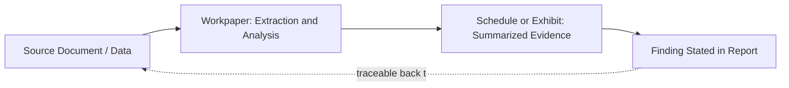

## Documenting Findings Objectively and Defensibly

### Overview

Documenting findings objectively and defensibly refers to the discipline of recording forensic accounting and fraud examination work — workpapers, interview notes, analytical schedules, and narrative conclusions — in a manner that withstands adversarial scrutiny: cross-examination, regulatory review, peer review, or a *Daubert*/*Frye* admissibility challenge. Defensibility is not a single technique but a cumulative property arising from consistent evidentiary discipline applied throughout the engagement, not retrofitted at the reporting stage.

### Core Principles of Objectivity

**Key Points**

- **Neutrality of language:** documentation should describe what the evidence shows without advocacy framing. Compare "the ledger entry appears designed to conceal the diversion" (interpretive/opinion) against "the ledger entry recorded the $45,000 disbursement under the account code for 'office supplies' rather than the vendor's actual classification of 'consulting services' per Invoice #3312" (factual, evidence-grounded).
- **Following the evidence, not a predetermined conclusion:** an examiner should document contrary or exculpatory evidence encountered during the investigation, not only evidence supporting an initial hypothesis. Selective documentation is a common basis for challenging an examiner's independence.
- **Separation of roles:** the examiner documenting findings should distinguish between fact-finding (an investigative function) and any subsequent legal characterization (a role reserved for counsel or the trier of fact) — e.g., documenting "funds were transferred to an account controlled by Employee A" rather than "Employee A embezzled funds," since embezzlement is a legal conclusion requiring proof of intent.
- **Consistency across the engagement:** entity names, account references, date formats, and terminology should remain consistent from initial workpapers through the final report; inconsistencies are a frequent point of cross-examination attack even when substantively immaterial.

### The Evidentiary Chain: From Source to Conclusion

**Key Points**

- Defensible documentation maintains a traceable path from underlying source evidence, to the workpaper analysis performed, to the finding stated in the report — sometimes called the "evidentiary chain" or "audit trail" of the investigation.
- Each link in the chain should be independently verifiable: a reviewer (or opposing expert) should be able to start from a stated conclusion, trace back through supporting schedules, and reach the original source document without unexplained gaps.
- Practical implementation includes: unique workpaper reference numbers cited in the narrative report, cross-referenced exhibit/Bates numbering, and a master index or "evidence log" tying every cited fact to its source.

### Chain of Custody for Digital and Physical Evidence

**Key Points**

- Where evidence includes electronic records (emails, accounting system exports, digital forensic images) or physical documents, a documented chain of custody establishes who collected the evidence, when, how it was preserved, and who accessed it thereafter.
- Standard chain-of-custody documentation includes: collection date/time, collector's name, method of collection (e.g., forensic imaging with write-blocker hardware, hash value verification), storage location, and a log of every subsequent access or transfer.
- Cryptographic hash values (e.g., MD5, SHA-256) computed at collection and re-verified before analysis are standard practice for demonstrating that digital evidence was not altered.
- [Unverified] Specific chain-of-custody protocols may be dictated by applicable jurisdictional rules of evidence or by counsel's litigation hold procedures, so examiners should confirm the applicable standard with counsel rather than assume a single universal protocol.

### Contemporaneous Documentation Standards

**Key Points**

- Notes, interview memoranda, and analytical observations should be documented as close in time to the observation or interview as possible ("contemporaneous documentation"), since delayed or reconstructed notes are more vulnerable to challenge on accuracy and reliability grounds.
- Interview memoranda should distinguish the interviewee's direct statements (ideally close to verbatim for key admissions) from the interviewer's own observations or impressions (e.g., demeanor notes), with each clearly labeled.
- Dating, initialing, or otherwise version-controlling workpapers as they are created (rather than only at final sign-off) supports a defensible narrative that the analysis was performed methodically rather than reverse-engineered to fit a conclusion.

### Workpaper Standards and Review

**Key Points**

- Workpapers should independently stand as a complete record: including the objective of the specific test performed, the data source, the procedure applied, the result, and the preparer's initials/date.
- A structured review hierarchy (preparer, then a second reviewer, often a supervising or engagement-lead forensic accountant) provides a documented quality-control layer, mirroring audit workpaper review practices.
- Retention of superseded drafts or corrected schedules, rather than deletion, is generally advisable so that the analytical evolution is documented — provided this is consistent with counsel's guidance on privilege and document retention policy, since draft retention practices interact directly with discovery obligations.

### Using the Fraud Triangle and Established Frameworks to Ground Objectivity

**Key Points**

- Framing findings against a recognized analytical framework — such as the Fraud Triangle (pressure/incentive, opportunity, rationalization) or the ACFE Fraud Tree taxonomy — helps ground conclusions in an established methodology rather than ad hoc reasoning, improving defensibility.
- Documenting the "opportunity" element (e.g., a specific control gap) with objective, verifiable facts (segregation-of-duties matrix, system access logs) is more defensible than documenting subjective assessments of an individual's character or motive.

### Distinguishing and Labeling Levels of Certainty

**Key Points**

- Defensible documentation explicitly separates:
  - **[Verified]** — directly supported by primary source evidence (bank statement, signed contract, system audit log).
  - **[Inference]** — a reasoned conclusion drawn from a pattern of indirect or incomplete evidence, with the underlying reasoning and assumptions stated explicitly (e.g., statistical extrapolation methodology and its margin of error).
  - **[Unverified]/[Uncorroborated]** — information obtained from a single source (e.g., one interviewee's uncorroborated allegation) that has not been independently confirmed against documentary or testimonial evidence.
- This labeling should be applied consistently at the workpaper level, not introduced only in the final report, so that the underlying analytical record matches the stated confidence level throughout.

### Handling Corrections and Superseding Findings

**Key Points**

- Where a preliminary finding is later revised (e.g., additional evidence changes a loss estimate), the documentation should explicitly state that a correction has been made, reference the prior figure, and explain why the finding changed — rather than silently overwriting the earlier conclusion.
- This practice both preserves audit trail integrity and pre-empts a common cross-examination tactic of suggesting the examiner is concealing an error or inconsistency.

### Common Defensibility Failures

**Key Points**

- Conclusory statements unsupported by cited evidence ("the pattern is clearly fraudulent" without specifying which transactions and why).
- Undocumented assumptions embedded in a calculation (e.g., an unstated growth rate assumption in a lost-profits model) that surface only under cross-examination.
- Failure to document or consider alternative innocent explanations for an anomaly, which can be characterized as confirmation bias.
- Gaps in the chain of custody for key digital evidence, which can lead to evidentiary exclusion or reduced weight regardless of the underlying analytical quality.
- Mixing personal opinion about an individual's credibility or character with the factual record, which is generally outside the scope of a forensic accountant's expertise and role.

### Example

During an investigation into suspected expense reimbursement fraud, the examiner documents a workpaper showing: (1) the source data — an export of the expense management system's transaction log for Employee B, dated and hash-verified at collection; (2) the analysis performed — a comparison of submitted receipts against corporate credit card statements for the same period, cross-referenced by transaction date and amount; (3) the finding — 14 instances where the same receipt image was submitted for reimbursement and separately charged to the corporate card, totaling $8,400, each instance cited by transaction ID; and (4) an explicit note that Employee B, in interview, stated the duplication was accidental — preserving the countervailing explanation rather than omitting it. The report's Findings of Fact section states the objective fact pattern (duplicate submissions) as [Verified], separately notes Employee B's explanation, and refrains from concluding that the duplication was intentional, leaving that determination to management or legal counsel based on the totality of the evidence.

### Related Topics

- Chain-of-custody protocols for digital forensic evidence
- Interview memoranda drafting standards and privilege considerations
- Workpaper review hierarchies and quality control in forensic engagements
- Statistical sampling and extrapolation methodology documentation
- Structuring the fraud examination report
- Expert witness credibility and cross-examination preparation