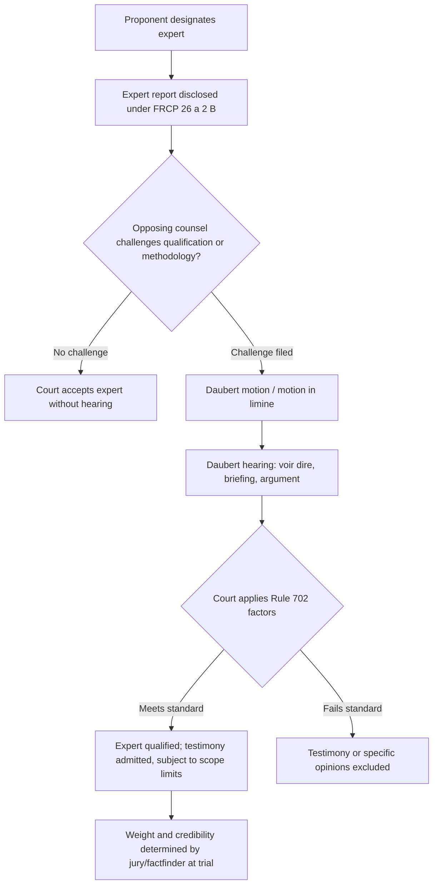

## Expert Witness Qualification Standards

### Overview

Expert witness qualification standards govern whether a forensic accountant (or any specialized witness) may be permitted by a court to offer opinion testimony, as distinguished from ordinary fact witnesses who may testify only to personally observed facts. Qualification is a threshold legal determination made by the trial judge, separate from — though related to — the reliability of the expert's methodology and the ultimate weight a jury gives the testimony.

### Federal Rule of Evidence 702: The Baseline Standard

**Key Points**

- Federal Rule of Evidence 702 permits a witness "qualified as an expert by knowledge, skill, experience, training, or education" to testify in the form of an opinion if certain conditions are met.
- As amended effective December 2023, Rule 702 requires the proponent of the expert testimony to demonstrate to the court, by a preponderance of the evidence, that: (1) the expert's scientific, technical, or other specialized knowledge will help the trier of fact understand the evidence or determine a fact in issue; (2) the testimony is based on sufficient facts or data; (3) the testimony is the product of reliable principles and methods; and (4) the expert's opinion reflects a reliable application of the principles and methods to the facts of the case.
- [Unverified] The 2023 amendment was intended to clarify that these reliability requirements are questions of admissibility for the court to decide (not merely weight for the jury), and to counter perceived inconsistent application by courts; practitioners should confirm current circuit-level interpretation since case law continues to develop post-amendment.
- Rule 702 establishes five independent, non-substitutable bases for qualification: **knowledge, skill, experience, training, or education** — a witness need not hold a specific credential if sufficient practical experience establishes expertise in the relevant subject matter.

### The Daubert Framework

**Key Points**

- *Daubert v. Merrell Dow Pharmaceuticals, Inc.* (1993) established the trial judge's "gatekeeping" role in assessing the reliability of expert testimony, displacing the older *Frye* "general acceptance" test in federal courts and many state courts that have adopted *Daubert* or a similar standard.
- The *Daubert* factors (non-exhaustive, flexible, and not all applicable in every case) include:
  - Whether the theory or technique has been tested
  - Whether it has been subjected to peer review and publication
  - The known or potential error rate
  - The existence and maintenance of standards controlling the technique's operation
  - Whether the theory or technique is generally accepted within the relevant scientific/professional community
- *Kumho Tire Co. v. Carmichael* (1999) extended the *Daubert* gatekeeping function beyond purely scientific testimony to all expert testimony, including technical and other specialized knowledge — directly relevant to forensic accounting, which is typically treated as "technical" or "specialized" rather than "scientific" expertise.
- [Unverified] Not all U.S. states have adopted *Daubert*; some retain *Frye* or a hybrid standard, so the controlling standard must be confirmed for the specific jurisdiction (state or federal) in which testimony will be offered.

### Qualification Criteria Specific to Forensic Accountants

**Key Points**

- **Professional credentials** commonly considered relevant include: Certified Public Accountant (CPA), Certified Fraud Examiner (CFE), Certified in Financial Forensics (CFF, an AICPA credential building on the CPA license), Chartered Financial Analyst (CFA), and Certified Valuation Analyst (CVA), among others depending on the specific subject matter (valuation, fraud, tracing, damages).
- **Relevant experience** — years of practice in forensic accounting, number and nature of prior engagements, industry-specific experience relevant to the case (e.g., healthcare billing fraud experience for a healthcare fraud matter) — can independently establish qualification even absent a specific credential.
- **Continuing education and specialized training** in areas such as fraud examination methodology, forensic data analytics, or valuation standards can support qualification, particularly for niche subject matter.
- **Publications and teaching** in the relevant field (a factor explicitly required to be disclosed for testifying experts under FRCP 26(a)(2)(B)) can bolster — or, if absent or inconsistent with testimony, undermine — perceived expertise.
- Courts assess qualification specific to the **scope of opinions offered** — an expert generally accepted as qualified to testify on fraud scheme mechanics may not automatically be qualified to testify on a complex business valuation or lost-profits damages calculation if that requires distinct specialized expertise.

### Voir Dire and Challenges to Qualification

**Key Points**

- Opposing counsel may conduct **voir dire** of the proposed expert (questioning specifically directed at qualifications, methodology, and potential bias) before the court rules on admissibility, either in a pretrial *Daubert* hearing or at trial outside the jury's presence.
- A **motion in limine** (specifically a "*Daubert* motion" in federal practice) is the standard procedural vehicle for challenging an expert's qualification or methodology before trial.
- Grounds for disqualification or exclusion include: lack of relevant credentials/experience for the specific opinions offered, unreliable methodology (failure to satisfy the *Daubert*/Rule 702 reliability factors), insufficient factual basis (opinions not grounded in case-specific facts or data), or opinions that exceed the scope of the expert's demonstrated expertise ("scope creep").
- Even where an expert is qualified generally, specific opinions within their testimony can be excluded individually if those particular opinions lack a reliable basis, while other opinions from the same expert are admitted.

### Independence and Bias Considerations

**Key Points**

- Courts and opposing counsel scrutinize an expert's independence, including: compensation structure (a fee contingent on case outcome is a well-recognized and problematic bias concern), the frequency with which the expert testifies for one side (e.g., always for plaintiffs vs. always for defendants), and prior relationships with the retaining party or counsel.
- ACFE and AICPA codes of professional ethics generally require forensic accountants to maintain objectivity and disclose conflicts of interest, and violations can be raised to challenge credibility even if not fatal to formal qualification.
- Disclosure of "other cases in which, during the previous 4 years, the witness testified as an expert at trial or by deposition" (FRCP 26(a)(2)(B)(v)) allows opposing counsel to assess a pattern of one-sided advocacy.

### Qualification Determination Process Flow

### Distinguishing Qualification from Reliability of Methodology

**Key Points**

- Qualification (is this person permitted to give expert opinions at all, and on what subjects) is analytically distinct from reliability (is the specific methodology used sound and properly applied) — though both are assessed under the Rule 702/*Daubert* framework and both function as gatekeeping admissibility questions for the court.
- A highly qualified expert can still have specific testimony excluded if the methodology applied to reach a particular opinion is unreliable or was not reliably applied to the facts of the case (e.g., a qualified valuation expert using an internally inconsistent discounted cash flow model).
- Conversely, a sound methodology does not cure an underlying qualification deficiency if the witness lacks the requisite knowledge, skill, experience, training, or education to apply it credibly in the specific subject area.

### Common Pitfalls Affecting Qualification Challenges

**Key Points**

- Offering opinions outside one's demonstrated area of expertise (e.g., a fraud examiner without valuation credentials or experience opining on enterprise value).
- Inconsistent or exaggerated CV/credential claims that surface during cross-examination or opposing counsel's background investigation, undermining credibility even where formal qualification is not defeated.
- Failure to stay current with evolving methodology or standards in a specialized field, which can be used to argue the expert's approach reflects outdated practice.
- Retaining an expert too late in litigation to develop a fully supported, case-specific factual basis for opinions, resulting in a report vulnerable to a "insufficient facts or data" challenge under Rule 702(b).

### Example

In a shareholder securities fraud case, plaintiff's counsel retains a CPA holding the CFF credential with 20 years of experience investigating revenue recognition fraud to opine that the defendant company's channel-stuffing scheme inflated reported revenue by $40 million. Defense counsel files a *Daubert* motion arguing the expert lacks specific experience in the company's industry (specialty pharmaceutical distribution) and that the loss calculation methodology deviates from generally accepted damages methodologies. At the *Daubert* hearing, the expert testifies to prior engagements involving pharmaceutical distributor accounting, publications on revenue recognition fraud detection, and explains the extrapolation methodology's basis in industry-standard sampling techniques. The court finds the expert qualified to testify on the existence and mechanics of the fraud scheme (grounded in extensive fraud examination experience) but excludes a specific opinion on total shareholder damages, finding that opinion required specialized securities damages/event-study methodology outside the expert's demonstrated qualification — illustrating that qualification and admissibility are assessed opinion-by-opinion, not as an all-or-nothing determination.

### Related Topics

- Federal Rule of Civil Procedure 26(a)(2)(B) expert report disclosure requirements
- *Daubert* hearing procedure and preparation strategies
- Distinguishing testifying vs. non-testifying consulting experts
- Direct and cross-examination techniques for forensic accounting experts
- Damages and loss quantification methodologies in securities fraud matters
- ACFE and AICPA codes of professional ethics for forensic practitioners