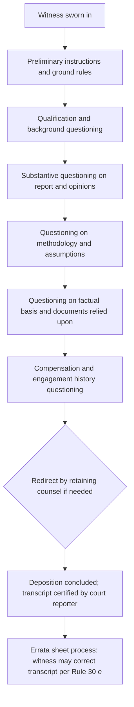

## Deposition Preparation and Testimony

### Overview

Deposition preparation and testimony encompasses the process by which a forensic accountant, retained as a testifying expert or occasionally deposed as a fact witness, prepares for and delivers sworn out-of-court testimony under oath, recorded by a court reporter (and often videotaped), in response to questioning by opposing counsel. Depositions serve discovery, credibility-testing, and testimony-preservation functions, and for an expert witness, deposition performance frequently shapes settlement dynamics and pretrial motion practice long before any trial occurs.

### Purpose and Procedural Context

**Key Points**

- Depositions in U.S. civil litigation are governed primarily by Federal Rule of Civil Procedure 30 (or state-equivalent rules), allowing any party to examine a witness under oath outside the courtroom, with both direct examining counsel and opposing counsel typically present.
- For a retained testifying expert, the deposition typically follows disclosure of the expert's written report under FRCP 26(a)(2)(B), meaning opposing counsel has already reviewed the opinions, methodology, and basis before the deposition occurs.
- Depositions serve three main functions relevant to a forensic accounting expert: (1) discovery of the full basis for the expert's opinions, (2) locking in testimony for later use to impeach any inconsistent trial testimony, and (3) assessing the expert's credibility and communication effectiveness as a preview of trial performance, which frequently informs settlement negotiations.

### Pre-Deposition Preparation: Substantive Review

**Key Points**

- **Complete mastery of the expert report:** the expert must be able to explain, without notes, every opinion, the reasoning behind it, and the specific evidence supporting it, since the report itself will be used as the roadmap for questioning.
- **Review of all underlying workpapers and data:** the expert should re-review the complete file, including schedules, source documents, and any assumptions embedded in models (e.g., growth rates in a damages calculation), anticipating that opposing counsel will probe the factual basis for each input.
- **Review of deposition or trial transcripts of related witnesses:** understanding what fact witnesses have already testified to helps the expert anticipate challenges to the factual assumptions underlying the opinions.
- **Familiarity with opposing expert's report (if exchanged):** where a rebuttal or opposing expert report exists, the testifying expert should understand points of disagreement and be prepared to explain, in professional and non-adversarial terms, why their own methodology or conclusion differs.
- **Reconfirming credential and prior testimony disclosures:** verifying that CV, publication list, and prior testimony history (required disclosures under FRCP 26(a)(2)(B)) are current and accurate, since discrepancies are a common impeachment target.

### Pre-Deposition Preparation: Procedural and Behavioral Coaching

**Key Points**

- **Preparation sessions with retaining counsel** (privileged attorney work-product, though the underlying facts and opinions discussed are generally still discoverable if directly related to the expert's testimony) typically cover likely question topics, document review, and testimony delivery technique — but counsel must avoid improperly scripting testimony, since an expert's opinions must remain the expert's own independent conclusions.
- **Understanding privilege boundaries:** communications between retaining counsel and a testifying expert are subject to more limited work-product protection than with a non-testifying consulting expert; under FRCP 26(b)(4)(C), certain categories of attorney-expert communications (e.g., those relating to compensation, or identifying facts/data/assumptions counsel provided that the expert considered) remain generally discoverable even for testifying experts.
- Common testimony delivery guidance includes:
  - Listen to the complete question before answering; do not anticipate where the question is heading.
  - Answer only the question asked — avoid volunteering additional information beyond the scope of the question.
  - It is appropriate to say "I don't know," "I don't recall," or "I would need to review that document" rather than guessing.
  - Pause before answering to allow counsel the opportunity to object (objections in deposition are generally preserved for later ruling, but certain objections, such as privilege, may direct the witness not to answer).
  - Maintain a measured, professional tone regardless of an examiner's tone or repetition, since demeanor is being assessed for potential video use at trial.

### Anticipated Cross-Examination Themes for Forensic Accounting Experts

**Key Points**

- **Qualification challenges:** probing credentials, relevant experience, and whether the expert has testified predominantly for one side (plaintiff vs. defense) across their career.
- **Methodology challenges:** questioning whether the methodology applied is generally accepted, whether alternative methodologies were considered and why they were rejected, and whether the methodology was consistently applied throughout the analysis.
- **Factual basis challenges:** testing whether opinions rest on a complete and accurate factual record, including whether the expert considered evidence that might undermine the stated conclusion.
- **Assumption challenges:** isolating specific assumptions (e.g., a discount rate, a growth rate, an extrapolation basis) and testing whether alternative reasonable assumptions would materially change the outcome — often to characterize the opinion as result-driven rather than methodology-driven.
- **Compensation and bias challenges:** examining the fee arrangement, hours billed, percentage of the expert's practice devoted to litigation support versus other forensic accounting work, and history of engagement by the same law firm or client.
- **Report consistency challenges:** comparing statements in the report, deposition testimony, and any prior publications or testimony for inconsistency.

### Deposition Testimony Flow

### Handling Documents and Exhibits During Deposition

**Key Points**

- The expert should be prepared to locate and reference specific workpapers or exhibits quickly, since an inability to locate supporting documentation for a stated opinion undermines credibility in real time.
- When shown a document not previously reviewed, it is appropriate to request adequate time to read and understand it fully before answering questions about it.
- If a hypothetical question changes the underlying facts from those actually present in the case, the expert should clearly note that the hypothetical differs from the actual facts as understood, rather than simply accepting the altered premise.

### Errata Sheets and Post-Deposition Corrections

**Key Points**

- Under Federal Rule of Civil Procedure 30(e), a deponent may review the transcript and submit an errata sheet noting changes in form or substance, along with a statement of reasons, generally within 30 days of being notified the transcript is available.
- [Unverified] Courts vary in how liberally they permit substantive changes via errata sheet (some apply a stricter "sham affidavit"-type scrutiny to changes that contradict prior testimony), so counsel's guidance on the scope of permissible corrections should be sought given jurisdictional variation.
- Errata corrections do not erase the original testimony from the record; both the original answer and the correction, along with the stated reason, typically remain part of the record and can be used at trial.

### Trial Testimony Distinctions from Deposition

**Key Points**

- Trial testimony occurs before the judge and jury (or judge alone in a bench trial), with direct examination conducted by retaining counsel followed by cross-examination — unlike a deposition, where opposing counsel typically leads questioning throughout.
- Visual aids, demonstrative exhibits, and simplified explanations become more important at trial, where the audience (a lay jury) may lack the technical/legal audience characteristics of a deposition record primarily created for attorneys.
- Prior deposition testimony is commonly used at trial for impeachment if trial testimony is inconsistent, making deposition accuracy and consistency directly consequential to trial credibility.

### Common Pitfalls in Deposition Testimony

**Key Points**

- Volunteering unsolicited information or explanations beyond the scope of the question asked, which can open new lines of questioning or provide unintended ammunition.
- Guessing rather than acknowledging uncertainty, especially on numerical specifics that can later be checked against the record.
- Becoming argumentative or defensive under repetitive or aggressive questioning, which can affect perceived objectivity and credibility.
- Failing to distinguish between what the expert independently verified versus facts or data provided by counsel and relied upon as assumed true — this distinction is often central to methodology challenges.
- Inconsistent characterization of the same fact or figure between the written report and deposition testimony, creating an easy impeachment opportunity.

### Example

A forensic accountant retained to calculate lost profits in a breach of contract dispute is deposed after submitting a report projecting $3.2 million in damages using a discounted cash flow model with a 12% discount rate and a 5-year projection period. During the deposition, opposing counsel questions why a 5-year rather than 3-year projection period was used, whether the 12% discount rate reflects the company's actual weighted average cost of capital, and whether the expert considered the company's declining revenue trend in the two years preceding the breach. The expert, having thoroughly reviewed the underlying financial statements and industry discount rate benchmarks before the deposition, is able to explain the basis for each assumption by reference to specific supporting schedules, acknowledges that a shorter projection period would reduce the damages figure but explains why the longer period better reflects the contract's stated term, and declines to speculate on an alternative discount rate not supported by the engagement's own research, instead offering to recalculate under a stated alternative if requested — preserving both accuracy and professional credibility under sustained questioning.

### Related Topics

- Federal Rule of Civil Procedure 26(a)(2)(B) expert report disclosure requirements
- Expert witness qualification standards and *Daubert* challenges
- Direct and cross-examination technique for trial testimony
- Privilege and work-product boundaries in attorney-expert communications (FRCP 26(b)(4))
- Structuring the fraud examination report
- Documenting findings objectively and defensibly