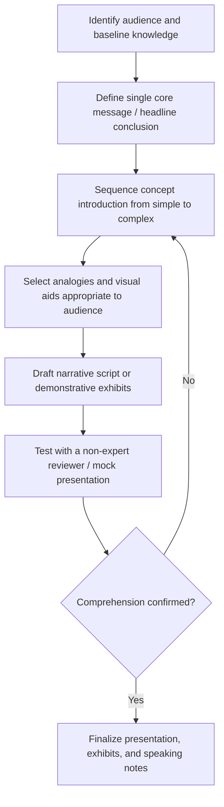

## Communicating Findings to Non-Financial Audiences

### Overview

Communicating findings to non-financial audiences addresses how a forensic accountant translates complex accounting analysis, fraud schemes, and quantitative conclusions into language, visuals, and structure accessible to audiences without accounting or financial training — jurors, judges without financial backgrounds, boards of directors, journalists, regulators' non-accounting staff, or the general public. This is a distinct communication skill from the technical documentation discussed in report drafting, focused on comprehension and persuasion rather than evidentiary completeness alone.

### Why This Skill Matters

**Key Points**

- A juror deciding a fraud case, a board member overseeing a remediation plan, or a judge issuing a bench ruling typically lacks the technical accounting vocabulary to independently evaluate a debit/credit-level explanation of a financial statement fraud scheme.
- Even highly rigorous, technically accurate analysis fails its purpose if the intended decision-maker cannot understand and act on it — the forensic accountant's credibility and the case's persuasive force depend on comprehension, not just correctness.
- [Inference] Because juries in particular decide cases based on their understanding of the evidence presented rather than the underlying technical rigor alone, effective simplification without loss of accuracy is often treated by trial counsel as comparably important to the technical soundness of the underlying analysis.

### Core Principles of Audience-Appropriate Communication

**Key Points**

- **Know the audience's baseline knowledge:** a juror pool, a lay judge, an audit committee with some financial literacy, and a journalist each require different levels of foundational explanation before the specific finding can be introduced.
- **Lead with the conclusion, not the methodology:** non-technical audiences generally absorb "what happened and why it matters" more effectively when it precedes "how the number was calculated," reversing the sequencing sometimes used in technical workpapers.
- **Use concrete analogies grounded in everyday experience:** translating accounting concepts (e.g., channel stuffing, round-tripping, cookie-jar reserves) into familiar terms (e.g., comparing channel stuffing to a store recording a sale before the customer has actually taken the product) aids comprehension without sacrificing accuracy.
- **Avoid unnecessary jargon; define necessary jargon immediately:** where a technical term is unavoidable (e.g., "materiality," "revenue recognition"), it should be defined in plain language at first use and reinforced consistently thereafter.
- **Use round, simplified figures for the headline conclusion while preserving precision for the record:** stating "the company overstated revenue by approximately $40 million" as an opening framing, with the exact figure and calculation reserved for supporting detail, aids retention without sacrificing accuracy in the underlying record.

### Techniques for Simplifying Complex Financial Concepts

**Key Points**

- **The "story" or narrative arc technique:** presenting a fraud scheme chronologically as a sequence of events (what was set up, what happened, how it was discovered) rather than as an abstract accounting concept, since narrative structure is a more universally accessible cognitive frame than tabular financial analysis.
- **Building complexity incrementally:** introducing one concept at a time (e.g., first explaining what a legitimate sales return looks like, then explaining how the fraudulent scheme deviated from that baseline) rather than presenting the full scheme's complexity at once.
- **Visual aids and demonstratives:** timelines, flow diagrams showing the movement of funds, simplified bar charts comparing "reported" versus "actual" figures, and annotated document excerpts (blown up and highlighted) are standard tools for translating quantitative findings into visually intuitive form.
- **Comparative framing:** anchoring an unfamiliar dollar figure to something tangible and relatable (e.g., expressing an embezzlement amount in terms of "equivalent to X years of the victim organization's annual budget for Y program") to convey materiality/scale, so long as the comparison is factually accurate and not unfairly prejudicial or inflammatory.
- **The "waterfall" or bridge technique for variance explanation:** visually showing how a reported figure moves to a corrected figure through discrete, sequential adjustments (each individually simple) rather than presenting only the net variance.

### Visual Communication: A Sample Waterfall Concept

**Key Points**

- A "bridge" or "waterfall" chart is commonly used to show, step-by-step, how reported revenue is adjusted down to a restated or "true" figure by isolating each fraudulent component individually — a technique that breaks a single large, abstract number into several small, individually intuitive steps.

<svg xmlns="http://www.w3.org/2000/svg" viewBox="0 0 800 380" font-family="Arial, sans-serif">
<text x="400" y="26" text-anchor="middle" font-size="16" font-weight="bold">Revenue Restatement Bridge (svg_diagram)</text>

<line x1="60" y1="320" x2="760" y2="320" stroke="#333" stroke-width="1.5" />

<rect x="70" y="100" width="90" height="220" fill="#2166ac" />
<text x="115" y="90" text-anchor="middle" font-size="12" font-weight="bold">\$500M</text>
<text x="115" y="340" text-anchor="middle" font-size="11">Reported Revenue</text>

<rect x="190" y="150" width="90" height="70" fill="#c0392b" />
<text x="235" y="140" text-anchor="middle" font-size="12" font-weight="bold">-\$28M</text>
<text x="235" y="340" text-anchor="middle" font-size="10">Channel Stuffing</text>

<rect x="310" y="185" width="90" height="35" fill="#c0392b" />
<text x="355" y="175" text-anchor="middle" font-size="12" font-weight="bold">-\$9M</text>
<text x="355" y="340" text-anchor="middle" font-size="10">Fictitious Invoices</text>

<rect x="430" y="220" width="90" height="20" fill="#c0392b" />
<text x="475" y="210" text-anchor="middle" font-size="12" font-weight="bold">-\$3M</text>
<text x="475" y="340" text-anchor="middle" font-size="10">Premature Recognition</text>

<rect x="550" y="240" width="90" height="80" fill="#2e7d32" />
<text x="595" y="230" text-anchor="middle" font-size="12" font-weight="bold">\$460M</text>
<text x="595" y="340" text-anchor="middle" font-size="11">Restated Revenue</text>

<line x1="160" y1="150" x2="190" y2="150" stroke="#999" stroke-width="1" stroke-dasharray="3,2" />
<line x1="280" y1="185" x2="310" y2="185" stroke="#999" stroke-width="1" stroke-dasharray="3,2" />
<line x1="400" y1="220" x2="430" y2="220" stroke="#999" stroke-width="1" stroke-dasharray="3,2" />
<line x1="520" y1="240" x2="550" y2="240" stroke="#999" stroke-width="1" stroke-dasharray="3,2" />
</svg>

### Process for Preparing a Non-Technical Presentation

### Communicating in Testimony Settings

**Key Points**

- On direct examination, counsel and the expert typically structure questioning to build the narrative incrementally, with the expert pausing to explain each concept before it is used to support the next step of the analysis.
- Analogies used in testimony should be pre-vetted with counsel to ensure they do not inadvertently mischaracterize the legal standard or invite an objection (e.g., analogies that stray into stating a legal conclusion, such as directly equating an accounting irregularity with "theft," can draw an objection).
- Pacing matters: pausing after introducing a new concept, checking for follow-up cues from the judge or jury (where courtroom dynamics allow), and avoiding a rapid-fire recitation of technical detail all support comprehension in a live testimony setting distinct from a written report.

### Communicating to Boards, Audit Committees, and Executive Stakeholders

**Key Points**

- Board and audit committee presentations typically favor an executive-summary-first structure: headline finding, financial/reputational impact, root cause, and recommended action — often condensed into a small number of slides or a one-page summary memo, with detailed technical schedules held in reserve as backup material.
- Given that many board members may have general business acumen but not specialized accounting training, technical terms (e.g., "held constant," "non-GAAP adjustment," "cut-off testing") should still be briefly defined rather than assumed to be understood.
- Where the finding has legal or regulatory implications, communication to the board should be carefully coordinated with counsel regarding privilege preservation, since board materials can become discoverable.

### Common Pitfalls in Communicating to Non-Financial Audiences

**Key Points**

- Over-simplifying to the point of factual inaccuracy or overstatement, which can undermine credibility if challenged on cross-examination or later scrutiny (simplification of presentation should never come at the expense of factual precision in the underlying record).
- Presenting too much quantitative detail at once, causing the core message to be lost in supporting figures.
- Using analogies that are technically imprecise or potentially inflammatory/prejudicial, risking an evidentiary objection or perceived advocacy bias.
- Assuming a false baseline of audience knowledge (over- or under-estimating what jurors, board members, or reporters already understand), leading to either condescension or confusion.
- Failing to rehearse or pilot-test a demonstrative exhibit or explanation with a non-expert reviewer before deployment in a high-stakes setting (trial, regulatory hearing, board meeting).

### Example

A forensic accountant must explain to a jury how a company's CFO used "bill-and-hold" transactions to inflate quarterly revenue. Rather than opening with the technical accounting definition of bill-and-hold arrangements and the relevant revenue recognition criteria, the expert begins with an analogy: "Imagine a bakery recording a sale for a wedding cake the day the order is placed, even though the cake hasn't been baked yet and won't be picked up for another two months — that's the core problem here." The expert then introduces a simple two-column visual contrasting "what the accounting rules require" against "what the company actually did," using a small number of real (but simplified and enlarged) invoice excerpts as visual anchors. Only after establishing this conceptual foundation does the expert introduce the specific dollar figures and the bridge chart showing how reported revenue reconciles to restated revenue, ensuring the jury has the conceptual scaffolding needed to understand why the dollar figures matter before being asked to absorb the numbers themselves.

### Related Topics

- Structuring the fraud examination report
- Deposition preparation and testimony
- Demonstrative exhibits and visual aids in fraud trials
- Direct and cross-examination technique for expert witnesses
- Board and audit committee reporting protocols in internal investigations
- Root cause analysis and internal control communication frameworks