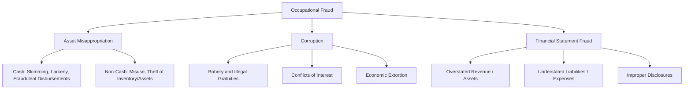
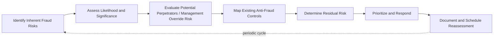

## Fraud Risk Assessment Frameworks

### Overview

Fraud risk assessment frameworks provide structured methodologies for identifying, evaluating, and prioritizing fraud risks within an organization, forming the foundation of a proactive anti-fraud program. Rather than reacting to fraud after detection, these frameworks systematically map where fraud could occur (schemes), who could perpetrate it, how it could be concealed, and what controls exist to prevent or detect it — enabling organizations to allocate audit, investigative, and control resources to areas of highest risk.

### Purpose and Role in the Anti-Fraud Program

**Key Points**

- A fraud risk assessment is generally the foundational component of a comprehensive fraud risk management program, informing the design of internal controls, the scope of internal audit testing, and the allocation of forensic/compliance resources.
- Fraud risk assessments differ from general enterprise risk assessments in that they specifically focus on intentional, deceptive acts for illicit gain, rather than the broader universe of operational, strategic, or compliance risks.
- Regulatory and standard-setting bodies increasingly expect documented fraud risk assessments: for example, SEC-registered companies' internal control over financial reporting (ICFR) programs under Sarbanes-Oxley Section 404 are commonly built around COSO's Internal Control–Integrated Framework, which explicitly requires fraud risk assessment as **Principle 8** of the framework.

### The COSO Framework's Fraud Risk Principle

**Key Points**

- COSO's 2013 Internal Control–Integrated Framework includes **Principle 8: "The organization considers the potential for fraud in assessing risks to the achievement of objectives"** under the Risk Assessment component.
- Principle 8's points of focus (per COSO guidance) include consideration of: various types of fraud (fraudulent financial reporting, possible loss of assets, corruption resulting from illegal acts), assessment of incentive and pressure, assessment of opportunity, and assessment of attitudes and rationalizations.
- [Unverified] While COSO's framework is widely referenced in U.S. public company internal control assessments, its application and the specific documentation expected can vary by external auditor interpretation and by company size/complexity, so specific implementation details should be confirmed against current auditor guidance and company-specific control documentation practices.

### The Fraud Triangle as an Assessment Lens

**Key Points**

- Developed from criminologist Donald Cressey's research, the **Fraud Triangle** posits that fraud typically requires three simultaneous elements: **pressure/incentive** (a perceived financial or non-financial need), **opportunity** (a perceived ability to commit the act without detection, often due to a control weakness), and **rationalization** (the perpetrator's internal justification for the act).
- Fraud risk assessment frameworks commonly organize risk identification around systematically evaluating each leg of the triangle for a given role, process, or business unit — e.g., assessing whether sales-incentive compensation structures create pressure, whether segregation-of-duties gaps create opportunity, and whether a permissive "tone at the top" enables rationalization.
- The **Fraud Diamond** (an extension proposed by Wolfe and Hermanson) adds a fourth element, **capability** — the perpetrator's personal traits, position, and skills enabling them to recognize and exploit the opportunity — which some frameworks incorporate for a more nuanced person-specific risk assessment, particularly for higher-level executive fraud risk.

### The ACFE Fraud Tree (Classification Taxonomy)

**Key Points**

- The ACFE's **Occupational Fraud and Abuse Classification System** ("Fraud Tree") organizes fraud schemes into three primary branches, each further subdivided:
  - **Asset Misappropriation** — theft or misuse of an organization's assets (e.g., skimming, larceny, fraudulent disbursements, misuse of inventory/equipment).
  - **Corruption** — schemes involving the misuse of influence in a business transaction for personal benefit (e.g., bribery, illegal gratuities, conflicts of interest, economic extortion).
  - **Financial Statement Fraud** — intentional misstatement or omission in financial reports (e.g., improper revenue recognition, overstatement of assets, understatement of liabilities/expenses).
- Fraud risk assessment frameworks frequently use this taxonomy as a checklist structure, systematically evaluating the organization's exposure to each specific scheme sub-type within the relevant business processes.

### The Fraud Risk Assessment Process (COSO/ACFE-Aligned Methodology)

**Key Points**

- A widely referenced methodology (aligned with COSO guidance and the AICPA/ACFE *Fraud Risk Management Guide*) follows an iterative cycle:
  1. **Identify inherent fraud risks** — brainstorm potential fraud schemes and scenarios relevant to the organization's industry, geographic footprint, business model, and organizational structure, often through facilitated workshops involving management, internal audit, and relevant business unit personnel.
  2. **Assess likelihood and significance** — evaluate each identified risk for probability of occurrence and potential financial/reputational/legal impact, often using a qualitative or semi-quantitative rating scale (e.g., high/medium/low, or numerical scoring).
  3. **Evaluate people and departments (perpetrators and conspirators)** — consider which roles or individuals have both motive and opportunity for each identified risk, including consideration of management override risk given management's unique position to override otherwise effective controls.
  4. **Evaluate existing anti-fraud controls** — map existing preventive and detective controls against each identified risk to determine residual risk after considering current mitigation.
  5. **Prioritize residual risks and respond** — rank residual (net) fraud risks and design a response: control enhancement, increased monitoring, or targeted internal audit/forensic testing.
  6. **Document and monitor** — formally document the assessment and establish a process for periodic reassessment, since fraud risk assessment is intended to be a dynamic, recurring process rather than a one-time exercise.

### Risk Rating and Heat Map Techniques

**Key Points**

- Many frameworks use a **likelihood × significance (impact) matrix**, commonly visualized as a heat map, to communicate relative fraud risk priority to management and the audit committee.
- Likelihood ratings typically consider historical incidence (industry-wide and organization-specific), the existence and strength of current controls, and known environmental risk indicators (e.g., rapid growth, decentralized operations, significant estimates/judgments in financial reporting).
- Significance ratings typically consider potential financial statement impact, regulatory/legal exposure, reputational damage, and the risk of business disruption.
- Management override of controls is generally treated as a distinct, elevated risk category within COSO-aligned assessments, given management's unique capability to circumvent otherwise well-designed controls — a point of focus explicitly referenced in COSO Principle 8 guidance and PCAOB audit standards addressing fraud risk.

### Data Analytics Integration in Modern Fraud Risk Assessment

**Key Points**

- Contemporary fraud risk assessment frameworks increasingly incorporate continuous or periodic data analytics as both a risk-identification tool and an ongoing monitoring mechanism, rather than relying solely on qualitative workshops and interviews.
- Common analytical techniques integrated into the assessment process include: Benford's Law analysis on transaction populations, duplicate payment/vendor testing, related-party transaction identification via master data matching, journal entry testing focused on unusual timing/amounts/preparer patterns, and anomaly detection using statistical or machine-learning models.
- [Inference] Because these analytical techniques can surface previously unidentified risk areas not captured in traditional interview-based brainstorming, many practitioners treat data analytics as complementary to — rather than a replacement for — the qualitative risk identification workshop, since analytics identify statistical anomalies that still require human judgment to interpret as genuine fraud risk versus benign explanation.

### Industry-Specific and Regulatory Variations

**Key Points**

- Certain industries carry sector-specific fraud risk assessment expectations layered onto the general COSO/ACFE framework: financial institutions (Bank Secrecy Act/anti-money laundering risk assessments), healthcare (billing fraud and Stark Law/Anti-Kickback Statute risk), government contractors (False Claims Act exposure), and public companies with foreign operations (Foreign Corrupt Practices Act corruption risk assessments).
- [Unverified] The specific regulatory expectations for documented fraud risk assessment (frequency, board reporting requirements, required methodology) vary considerably by industry and applicable regulator, so the general framework described here should be tailored to the specific regulatory regime governing the organization in question.

### Common Pitfalls in Fraud Risk Assessment

**Key Points**

- Treating the fraud risk assessment as a one-time compliance exercise rather than a recurring, dynamic process responsive to organizational change (new markets, M&A activity, system implementations, personnel changes).
- Underweighting management override risk because senior management is perceived as trustworthy, rather than assessing the risk based on structural opportunity and incentive factors independent of individual character judgments.
- Relying solely on interview-based identification without corroborating or supplementing with data analytics, missing schemes that would only surface through transactional pattern analysis.
- Failing to involve a sufficiently broad and cross-functional group in the risk identification workshop, resulting in blind spots specific to business units not represented in the assessment process.
- Documenting identified risks without a clear linkage to specific mitigating controls, making it difficult to identify true residual risk gaps.

### Example

A mid-sized manufacturing company conducts its annual fraud risk assessment. In the risk identification workshop, participants from finance, procurement, and operations identify a risk of fraudulent disbursements through fictitious vendors, given recent rapid growth in the procurement function and decentralized purchasing authority across three plant locations. Applying the likelihood × significance matrix, the risk is rated "high likelihood / high significance" due to the absence of a centralized vendor master file review control and known industry incidence of shell vendor schemes. The team maps existing controls (a $10,000 purchase order approval threshold) and determines this control does not mitigate the specific risk, since the identified scheme pattern in the industry typically involves multiple invoices below the threshold. The residual risk is rated high, and the response plan includes implementing a periodic vendor-employee address/bank account matching analytic, lowering the approval threshold for new vendor additions, and scheduling a targeted internal audit procurement fraud test within the next two quarters — with the assessment documented and scheduled for reassessment at the next annual cycle or sooner if a significant business change (e.g., an ERP system migration) occurs.

### Related Topics

- COSO Internal Control–Integrated Framework and Principle 8 application
- ACFE Fraud Tree classification and occupational fraud schemes
- Fraud Triangle and Fraud Diamond theoretical models
- Data analytics and continuous monitoring for fraud detection
- Management override of controls as a distinct audit risk category
- Industry-specific fraud risk regimes (BSA/AML, FCPA, False Claims Act)