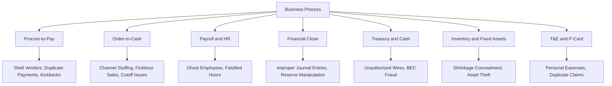

## Identifying Fraud Risk Factors by Business Process

### Overview

Identifying fraud risk factors by business process involves systematically mapping fraud risk indicators to the specific operational cycles where transactions originate, are authorized, recorded, and settled — rather than assessing fraud risk generically at the organizational level. Because fraud schemes exploit process-specific control weaknesses, timing, and documentation practices, a process-based lens allows the assessment to identify concrete, testable risk points tied to actual transaction flows (e.g., procure-to-pay, order-to-cash, payroll, financial close) rather than abstract risk categories alone.

### Rationale for a Process-Based Approach

**Key Points**

- Fraud schemes are typically embedded within the mechanics of a specific business process — a fraudulent disbursement scheme exploits procure-to-pay control gaps, while channel stuffing exploits order-to-cash cutoff and revenue recognition practices; a generic organization-wide risk assessment often fails to surface these process-specific mechanics.
- Mapping risk to process also aligns the fraud risk assessment with how internal audit, external audit, and internal control documentation are typically organized (by significant process/cycle), facilitating integration of fraud risk consideration into existing control testing and SOX 404 documentation.
- A process-based approach naturally surfaces the specific control points (authorization, segregation of duties, reconciliation, review) where a preventive or detective control could interrupt a given scheme, supporting more actionable remediation recommendations than a purely risk-category-based assessment.

### Procure-to-Pay (Purchasing and Accounts Payable)

**Key Points**

- **Common fraud schemes:** fictitious/shell vendor schemes, duplicate payments, invoice manipulation (billing schemes), kickback/conflict-of-interest arrangements between employees and vendors, split purchases to circumvent approval thresholds, and unauthorized changes to vendor banking details (business email compromise-facilitated payment redirection).
- **Key risk factors:** inadequate segregation of duties between vendor master file maintenance, purchase order approval, receiving, and payment processing; absence of three-way match (purchase order, receiving report, invoice) enforcement; decentralized purchasing authority without centralized oversight; lack of periodic vendor master file review against employee address/bank account data; high-value or high-volume vendor relationships with limited competitive bidding documentation.
- **Typical red flags:** vendor addresses matching employee addresses, sequential or suspiciously round invoice numbers/amounts, invoices just below approval thresholds, a vendor with no physical presence or verifiable business registration, unusually rapid vendor onboarding-to-first-payment cycles.

### Order-to-Cash (Sales and Accounts Receivable)

**Key Points**

- **Common fraud schemes:** channel stuffing (recording sales for goods not genuinely sold to willing, unconditional buyers), bill-and-hold arrangements used improperly to accelerate revenue recognition, fictitious sales to related parties or shell customers, improper cutoff (recording next-period sales in the current period), and lapping schemes concealing accounts receivable skimming.
- **Key risk factors:** sales-based incentive compensation creating pressure near period-end, decentralized sales order entry without independent shipping/revenue recognition verification, related-party customer relationships without adequate disclosure controls, aggressive or unusual sales terms (extended payment terms, generous return rights) concentrated near quarter/year-end.
- **Typical red flags:** disproportionate revenue recognized in the final days of a reporting period, unusual spikes in sales to a small number of customers near period-end, subsequent high return/credit memo rates following period-end sales spikes, and customer confirmations that do not match recorded terms.

### Payroll and Human Resources

**Key Points**

- **Common fraud schemes:** ghost employee schemes (fictitious employees on payroll), falsified hours/overtime, commission or bonus manipulation, and unauthorized payroll rate changes.
- **Key risk factors:** lack of segregation of duties between HR (employee setup/termination) and payroll processing/disbursement functions, absence of periodic payroll register review against active HR headcount records, decentralized time-entry approval without independent verification, and inadequate termination-to-payroll-deactivation timing controls.
- **Typical red flags:** employees with no tax withholding variation or benefits elections, duplicate bank account or address information across employee records, payroll disbursements continuing after a documented termination date, and unusually high or unexplained overtime concentrated with a specific supervisor's approval.

### Financial Close and Reporting

**Key Points**

- **Common fraud schemes:** improper journal entries (manual "top-side" adjustments bypassing normal transaction processing), earnings management through reserve manipulation (cookie-jar reserves), improper capitalization of expenses, and management override of otherwise effective controls at period-end.
- **Key risk factors:** limited segregation of duties over journal entry preparation and approval, inadequate review of manual/non-routine journal entries (particularly those posted by senior personnel with system override capability), significant judgment/estimate areas (allowances, reserves, impairments) subject to management discretion, and compressed close timelines increasing pressure for shortcuts.
- **Typical red flags:** journal entries posted by individuals outside their normal job function, entries lacking adequate supporting documentation, entries posted late at night/weekends or immediately before period close, round-dollar entries, and entries that reverse shortly after the period-end reporting date.

### Treasury and Cash Management

**Key Points**

- **Common fraud schemes:** unauthorized wire transfers (including business email compromise-driven fraudulent payment instructions), check tampering/forgery, and misappropriation through unreconciled bank accounts.
- **Key risk factors:** inadequate segregation between initiating and approving wire transfers, absence of independent bank reconciliation review, lack of dual authorization/callback verification procedures for changes to payment instructions, and dormant or rarely reconciled bank accounts.
- **Typical red flags:** wire transfer requests received via email with urgency/secrecy framing, last-minute changes to established vendor or payroll banking details, unreconciled bank account variances persisting over multiple periods, and unusual timing of large transfers (e.g., immediately before a holiday or weekend).

### Inventory and Fixed Assets

**Key Points**

- **Common fraud schemes:** inventory shrinkage concealment, fictitious inventory to support financial statement fraud, theft or misappropriation of fixed assets, and improper capitalization/depreciation manipulation.
- **Key risk factors:** infrequent or non-independent physical inventory counts, inadequate reconciliation between perpetual inventory records and physical counts, weak fixed asset tagging/tracking systems, and decentralized custody without independent verification.
- **Typical red flags:** recurring unexplained inventory variances, inventory counts consistently performed by the same individuals with custodial responsibility, fixed assets that cannot be physically located during audit verification, and unusual patterns in asset disposal/write-off approval.

### Procurement Card and Expense Reimbursement

**Key Points**

- **Common fraud schemes:** personal expenses charged to corporate cards, duplicate submission of the same expense for reimbursement, inflated mileage/per diem claims, and fictitious receipts.
- **Key risk factors:** inadequate receipt-level review (approval based on total amount rather than itemized detail), infrequent or non-independent expense report audit, and lack of systematic duplicate-detection controls (e.g., cross-referencing card statements against reimbursement claims).
- **Typical red flags:** expenses just below receipt-requirement thresholds, weekend/holiday charges inconsistent with business purpose, recurring vendors inconsistent with stated business activity, and identical or near-identical receipt images submitted across multiple reimbursement claims.

### Process-Risk Mapping Diagram

### Integrating Process-Level Risk Factors into the Overall Assessment

**Key Points**

- Once process-specific risk factors are identified, they should be integrated back into the broader fraud risk assessment methodology (likelihood/significance rating, control mapping, residual risk prioritization) rather than treated as a standalone exercise disconnected from the organization-wide risk register.
- Process-level risk identification often benefits from involving process owners directly (procurement managers, controllers, HR/payroll leads) alongside internal audit and forensic specialists, since process owners possess granular operational knowledge of actual practice that may differ from documented policy.
- [Inference] Because business processes evolve with system implementations, organizational restructuring, and changes in personnel, process-level fraud risk factors identified in one assessment cycle may become outdated; many practitioners treat significant process changes (e.g., an ERP migration, outsourcing of a function, entry into a new business line) as a trigger for interim reassessment rather than waiting for the next scheduled annual cycle.

### Common Pitfalls

**Key Points**

- Applying generic, industry-standard risk factors without validating whether they actually apply to the organization's specific process design (e.g., assuming three-way match risk in a fully automated ERP environment that already enforces it systemically).
- Failing to consider process interdependencies — a control weakness in one process (e.g., inadequate vendor master file governance in procurement) can create risk exposure in an adjacent process (e.g., payment/treasury).
- Overlooking manual workaround processes that exist alongside formally documented system controls, particularly in legacy systems or recently acquired business units not yet integrated into standard controls.
- Assessing risk factors only at a point in time without considering how process changes (system migrations, outsourcing, remote work arrangements) alter the risk profile between assessment cycles.

### Example

During a process-based fraud risk assessment of the procure-to-pay cycle at a multi-location retail company, the assessment team maps the process flow from vendor onboarding through payment disbursement and identifies that vendor master file additions require only single-person approval at the plant level, with no centralized cross-check against employee records. Combined with a recent expansion into three new distribution centers (increasing decentralized purchasing activity), the team rates this a high-likelihood risk for fictitious vendor schemes. The assessment further notes that while a three-way match control exists in the ERP system, it can be manually overridden by any user with "AP supervisor" system access, and 14 individuals across the organization currently hold that access level — a finding that would not have surfaced from a generic, non-process-specific fraud risk discussion. The recommended response includes narrowing AP supervisor override access, implementing a centralized quarterly vendor-employee data match, and adding an internal audit test step targeting override transaction reports.

### Related Topics

- Fraud risk assessment frameworks (COSO Principle 8, ACFE Fraud Tree)
- Segregation of duties analysis and control matrix design
- Data analytics techniques for procure-to-pay and order-to-cash monitoring
- Management override of controls as a distinct risk category
- Journal entry testing and financial statement fraud detection techniques
- Vendor master file governance and shell company detection