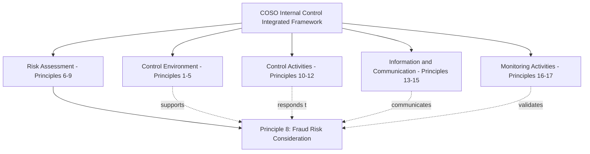
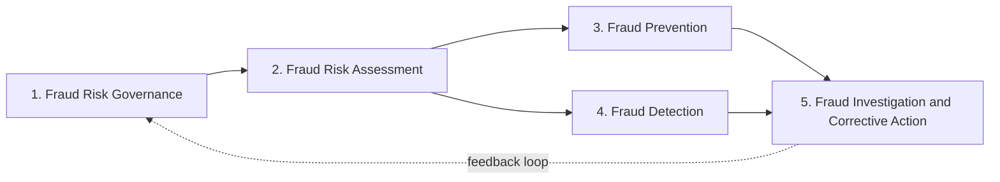

## COSO Fraud Risk Management Principles

### Overview

COSO fraud risk management principles refer to the fraud-specific guidance embedded within the Committee of Sponsoring Organizations of the Treadway Commission's (COSO) Internal Control–Integrated Framework, and elaborated further in COSO's dedicated **Fraud Risk Management Guide** (developed jointly with the ACFE). These principles establish the expectation that fraud consideration is not a standalone compliance activity but an integrated element of an organization's overall internal control system, spanning governance, risk assessment, control activities, information/communication, and monitoring.

### COSO's Internal Control–Integrated Framework Structure

**Key Points**

- The COSO 2013 Framework (updating the original 1992 framework) organizes internal control around **five integrated components**: Control Environment, Risk Assessment, Control Activities, Information and Communication, and Monitoring Activities.
- These five components are operationalized through **17 principles**, each representing a fundamental concept associated with its component; an entity can only conclude that internal control is effective if all five components and their relevant principles are present and functioning together.
- Fraud consideration is explicitly embedded primarily within **Principle 8** (Risk Assessment component) but is understood to interact with and depend upon principles across all five components, since fraud risk cannot be effectively addressed by risk assessment alone without a supporting control environment and monitoring structure.

### Principle 8: Fraud Risk Consideration in Detail

**Key Points**

- Principle 8 states that **"the organization considers the potential for fraud in assessing risks to the achievement of objectives."**
- COSO's points of focus for Principle 8 direct management to consider:
  - **Various types of fraud:** fraudulent financial reporting, fraudulent (non-financial) reporting, asset misappropriation, illegal acts, and corruption arising from the ways management and employees might engage in or rationalize inappropriate actions.
  - **Assessment of incentive and pressure:** consideration of incentives and pressures that could lead individuals to commit fraud (e.g., aggressive performance targets, compensation structures tied to specific financial outcomes).
  - **Assessment of opportunity:** consideration of opportunities that could exist for unauthorized acquisition, use, or disposal of assets, or for altering the entity's reporting records, generally arising from control gaps.
  - **Assessment of attitudes and rationalizations:** consideration of how management and other personnel might engage in or justify inappropriate actions.
- [Unverified] The precise documentation and testing expectations an external auditor will apply to Principle 8 compliance can vary based on audit firm methodology and engagement-specific risk assessment, so specific evidentiary expectations should be confirmed against current auditor guidance for a given engagement.

### Fraud Risk Consideration Across All Five Components

**Key Points**

- **Control Environment (Principles 1-5):** establishes "tone at the top" — the board and senior management's commitment to integrity and ethical values (Principle 1), the board's oversight responsibility including oversight of fraud risk (Principle 2), and accountability structures (Principle 5) that collectively shape whether employees perceive fraud as tolerated or actively deterred.
- **Risk Assessment (Principles 6-9):** beyond Principle 8's direct fraud focus, Principle 6 (specifying clear objectives) and Principle 7 (identifying and analyzing risk generally) provide the foundation against which fraud-specific risks are assessed, while Principle 9 (identifying and assessing significant change) requires reassessing fraud risk when the organization undergoes significant change (restructuring, new systems, M&A activity).
- **Control Activities (Principles 10-12):** Principle 10 (selecting and developing control activities that mitigate risk to acceptable levels) and Principle 11 (selecting and developing general controls over technology) directly translate identified fraud risks into specific preventive/detective controls; Principle 12 (deploying policies and procedures) ensures controls are actually implemented in practice, not merely designed.
- **Information and Communication (Principles 13-15):** Principle 13 (using relevant, quality information) and Principle 14 (internal communication, including a functioning whistleblower/reporting mechanism) are particularly significant for fraud risk management, since whistleblower tips remain, according to ACFE research, the most common initial detection method for occupational fraud; Principle 15 covers communication with external parties (e.g., regulators, auditors).
- **Monitoring Activities (Principles 16-17):** Principle 16 (ongoing and/or separate evaluations) and Principle 17 (evaluating and communicating deficiencies) ensure that fraud risk controls, once implemented, are periodically tested for continued operating effectiveness and that identified deficiencies are escalated and remediated.

### COSO's Fraud Risk Management Guide: The Five Principles

**Key Points**

- COSO, in conjunction with the ACFE, published a dedicated **Fraud Risk Management Guide** that elaborates a more granular set of **five fraud risk management principles**, designed to help organizations implement Principle 8 in practice:
  1. **Fraud Risk Governance:** the organization establishes and communicates a fraud risk management program (policy) demonstrating the expectations of the board and senior management regarding managing fraud risk.
  2. **Fraud Risk Assessment:** the organization performs comprehensive fraud risk assessments to identify specific fraud risks, assess likelihood and significance, evaluate existing fraud control activities, and implement actions to mitigate residual fraud risks.
  3. **Fraud Prevention:** the organization selects, develops, and deploys preventive fraud control activities to mitigate the likelihood and/or impact of fraud.
  4. **Fraud Detection:** the organization selects, develops, and deploys detective fraud control activities to identify fraud that has occurred (recognizing that fraud can circumvent even well-designed prevention controls).
  5. **Fraud Investigation and Corrective Action:** the organization establishes a communication process to obtain information about potential fraud and deploys a coordinated approach to investigation and corrective action to address fraud appropriately and timely.
- [Unverified] These five principles from the dedicated Fraud Risk Management Guide are complementary to, but formally distinct from, the 17 principles of the core Internal Control–Integrated Framework; practitioners should not conflate the Guide's five fraud-specific principles with the framework's numbered Principle 8, though they are designed to work together.

### Management Override of Controls

**Key Points**

- COSO guidance and related auditing standards give particular attention to **management override of controls** as a distinct and elevated fraud risk category, since management's unique position (system access, authority to direct subordinates, ability to make significant accounting judgments/estimates) provides a capability to circumvent otherwise well-functioning controls.
- Fraud risk assessments performed under COSO-aligned methodology typically require an explicit, separate consideration of management override risk rather than assuming that generally effective process-level controls are sufficient to address risks posed by senior personnel.
- Common mitigating approaches include: heightened board/audit committee scrutiny of significant or unusual transactions and journal entries, mandatory whistleblower/hotline reporting channels bypassing direct management, and periodic unpredictable/surprise audit procedures.

### Integration with SOX 404 and External Audit Expectations

**Key Points**

- For SEC-registered companies, COSO's framework (including Principle 8) is the most commonly referenced framework for management's assessment of internal control over financial reporting under Sarbanes-Oxley Section 404.
- External auditors performing an integrated audit under PCAOB standards are required to specifically assess fraud risk as part of their audit risk assessment (addressed in PCAOB Auditing Standards addressing consideration of fraud, conceptually aligned with but formally separate from COSO's Principle 8 management self-assessment requirement).
- [Unverified] The specific interplay between management's Principle 8 self-assessment documentation and the external auditor's independent fraud risk assessment procedures can vary by audit firm methodology, so coordination between internal control documentation teams and external auditors on evidentiary expectations is generally advisable.

### Practical Implementation Considerations

**Key Points**

- Organizations commonly document Principle 8 compliance through a combination of: a documented fraud risk assessment (see the broader fraud risk assessment framework methodology), a code of conduct and ethics policy addressing fraud-related expectations, a whistleblower hotline with documented case tracking, and periodic fraud risk training for employees at varying organizational levels.
- Board and audit committee oversight of fraud risk (tying back to Control Environment Principle 2) is often evidenced through periodic fraud risk briefings, review of hotline statistics and significant investigation outcomes, and explicit board minutes reflecting fraud risk discussion.
- Smaller or less complex entities may implement Principle 8 through less formal documentation than large public companies, but COSO's framework is explicitly designed to be scalable, meaning the underlying principle (considering fraud potential in risk assessment) applies regardless of entity size, even where the specific implementation mechanics differ.

### Common Pitfalls in COSO Fraud Principle Implementation

**Key Points**

- Treating Principle 8 as satisfied by a single annual checklist exercise disconnected from the broader risk assessment and control activity design process, rather than as an integrated consideration influencing control design.
- Underemphasizing management override risk due to trust in senior leadership rather than structurally assessing the risk based on position and capability.
- Failing to link identified fraud risks (Principle 8) to specific control activity responses (Principles 10-12), leaving a documented risk without a corresponding, testable mitigating control.
- Inadequate whistleblower mechanism visibility or perceived retaliation risk, undermining the Information and Communication component's practical effectiveness even where a formal hotline policy exists on paper.
- Failing to reassess fraud risk following significant organizational change (Principle 9), such as a merger, new ERP implementation, or entry into a new geographic market with different regulatory/cultural risk factors.

### Example

A publicly traded company's internal audit function documents its annual COSO Principle 8 assessment by first referencing its enterprise-wide fraud risk assessment, which identified elevated risk in the company's newly acquired subsidiary due to a lack of integrated financial systems. The assessment explicitly considers management override risk given the subsidiary's General Manager's broad authority over both operations and financial reporting sign-off in the transition period. Consistent with the Fraud Risk Management Guide's five principles, the company's response includes: reaffirming the fraud risk governance policy to the subsidiary's management team (Governance), documenting the specific residual risks identified in the subsidiary (Risk Assessment), implementing a temporary dual-approval requirement for subsidiary disbursements above a lowered threshold (Prevention), adding the subsidiary to the corporate data analytics monitoring program for unusual journal entries (Detection), and confirming the subsidiary's employees have access to and awareness of the corporate whistleblower hotline (supporting future Investigation and Corrective Action capability). The audit committee receives a briefing summarizing this integrated response as part of its ongoing Principle 2 oversight responsibility.

### Related Topics

- Fraud risk assessment frameworks and the assessment process cycle
- Identifying fraud risk factors by business process
- Management override of controls and heightened audit procedures
- Sarbanes-Oxley Section 404 internal control over financial reporting
- Whistleblower hotline design and ACFE detection method statistics
- PCAOB auditing standards addressing fraud risk in the financial statement audit