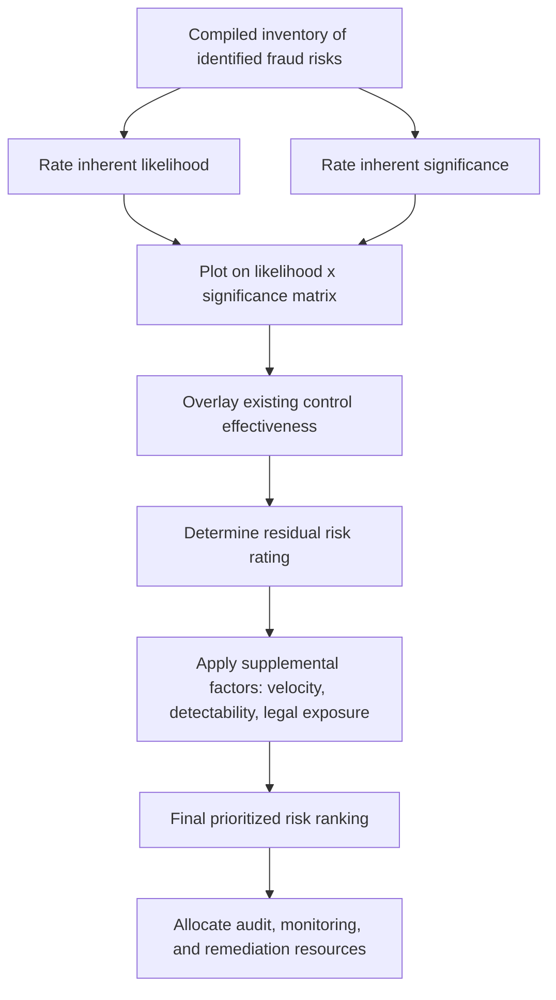

## Prioritizing and Documenting Fraud Risks

### Overview

Prioritizing and documenting fraud risks is the stage of the fraud risk assessment process where identified risks are ranked by relative significance to guide resource allocation, and formally recorded to create an auditable, defensible record supporting the organization's risk management decisions. Without disciplined prioritization, organizations risk spreading limited control and audit resources evenly across risks of vastly different consequence; without disciplined documentation, the assessment cannot demonstrate to auditors, regulators, or the board that fraud risk was genuinely considered as required under frameworks such as COSO Principle 8.

### Purpose of Prioritization

**Key Points**

- Organizations face a large universe of theoretically possible fraud schemes; prioritization translates a broad risk inventory into a focused, resource-appropriate action plan by distinguishing risks warranting immediate control enhancement or investigative attention from those adequately mitigated by existing controls.
- Prioritization supports defensible resource allocation decisions — internal audit plans, forensic monitoring analytics scope, and control investment — by providing an objective, documented basis for why certain areas received more scrutiny than others.
- A well-prioritized risk register also supports board and audit committee oversight (COSO Principle 2) by presenting fraud risk in a digestible, ranked format rather than an undifferentiated list.

### Risk Rating Dimensions: Likelihood and Significance

**Key Points**

- The most common prioritization approach rates each identified fraud risk along two dimensions: **likelihood** (probability of occurrence) and **significance/impact** (magnitude of consequence if it occurs), then combines these into a composite priority ranking.
- **Likelihood factors** typically considered include: historical incidence (organization-specific and industry-wide), strength of existing controls in the relevant process, environmental risk indicators (rapid growth, decentralization, recent system changes), and specific fraud triangle factors present (pressure, opportunity, rationalization) for the relevant role or process.
- **Significance factors** typically considered include: potential direct financial statement impact, regulatory/legal exposure (including potential for criminal referral or civil enforcement action), reputational damage, operational disruption, and the risk of triggering a broader loss of stakeholder confidence.
- Ratings are commonly expressed on a simple ordinal scale (e.g., High/Medium/Low) or a numerical scale (e.g., 1-5), with the specific scale and rating criteria documented in the assessment methodology to support consistency and defensibility.

### The Likelihood × Significance Heat Map

**Key Points**

- A **heat map** (risk matrix) plotting likelihood on one axis and significance on the other is the most widely used visual tool for communicating relative fraud risk priority, allowing management and the board to quickly identify risks falling in the highest-priority quadrant (high likelihood, high significance).
- Risks plotted in the top-right/highest-priority zone typically warrant immediate management attention, dedicated control enhancement, and potentially targeted forensic or internal audit testing; risks in the lowest zone may be accepted or monitored with existing controls without incremental investment.
- [Inference] Because heat map placement inherently involves qualitative judgment even when using numerical scoring inputs, many practitioners treat the heat map as a communication and prioritization aid rather than a precise, purely objective measurement, and supplement it with narrative justification for the placement of risks near quadrant boundaries.

<svg xmlns="http://www.w3.org/2000/svg" viewBox="0 0 620 500" font-family="Arial, sans-serif">
<text x="310" y="26" text-anchor="middle" font-size="16" font-weight="bold">Fraud Risk Heat Map (svg_diagram)</text>

<line x1="90" y1="440" x2="560" y2="440" stroke="#333" stroke-width="2" />
<line x1="90" y1="440" x2="90" y2="60" stroke="#333" stroke-width="2" />
<text x="325" y="475" text-anchor="middle" font-size="13">Likelihood →</text>
<text x="40" y="250" text-anchor="middle" font-size="13" transform="rotate(-90 40 250)">Significance →</text>

<rect x="90" y="60" width="157" height="127" fill="#c8e6c9" />
<rect x="247" y="60" width="157" height="127" fill="#fff9c4" />
<rect x="404" y="60" width="156" height="127" fill="#ffccbc" />
<rect x="90" y="187" width="157" height="126" fill="#c8e6c9" />
<rect x="247" y="187" width="157" height="126" fill="#fff9c4" />
<rect x="404" y="187" width="156" height="126" fill="#ffccbc" />
<rect x="90" y="313" width="157" height="127" fill="#dcedc8" />
<rect x="247" y="313" width="157" height="127" fill="#c8e6c9" />
<rect x="404" y="313" width="156" height="127" fill="#fff9c4" />

<line x1="247" y1="60" x2="247" y2="440" stroke="#999" stroke-width="1" />
<line x1="404" y1="60" x2="404" y2="440" stroke="#999" stroke-width="1" />
<line x1="90" y1="187" x2="560" y2="187" stroke="#999" stroke-width="1" />
<line x1="90" y1="313" x2="560" y2="313" stroke="#999" stroke-width="1" />

<text x="168" y="460" text-anchor="middle" font-size="11">Low</text>

<text x="325" y="460" text-anchor="middle" font-size="11">Medium</text>

<text x="482" y="460" text-anchor="middle" font-size="11">High</text>

<text x="75" y="380" text-anchor="end" font-size="11">Low</text>

<text x="75" y="253" text-anchor="end" font-size="11">Medium</text>

<text x="75" y="127" text-anchor="end" font-size="11">High</text>

<circle cx="480" cy="100" r="7" fill="#b71c1c" />
<text x="480" y="90" text-anchor="middle" font-size="9">Shell Vendor Scheme</text>
<circle cx="330" cy="150" r="7" fill="#e65100" />
<text x="330" y="140" text-anchor="middle" font-size="9">Channel Stuffing</text>
<circle cx="180" cy="350" r="7" fill="#2e7d32" />
<text x="180" y="370" text-anchor="middle" font-size="9">P-Card Misuse</text>
<circle cx="470" cy="230" r="7" fill="#e65100" />
<text x="470" y="220" text-anchor="middle" font-size="9">Mgmt Override</text>
</svg>

### Additional Prioritization Factors Beyond Likelihood and Significance

**Key Points**

- **Velocity/speed of onset:** some fraud risks can materialize and cause significant damage very quickly (e.g., a wire transfer fraud), while others develop more gradually (e.g., slow-building inventory shrinkage), which can affect prioritization even at similar likelihood/significance ratings, since fast-onset risks may warrant more immediate preventive control investment.
- **Detectability:** risks that are inherently difficult to detect through normal business monitoring (e.g., sophisticated collusion between multiple parties circumventing segregation of duties) may warrant elevated priority even at moderate likelihood, since the absence of a reliable detective control increases the risk of prolonged, undetected loss accumulation.
- **Regulatory/legal consequence severity:** risks carrying potential criminal exposure, regulatory enforcement action, or significant civil litigation exposure (e.g., FCPA corruption risk, securities fraud) may be prioritized above risks of similar direct financial magnitude but lower legal/regulatory consequence.
- **Existing control reliance versus known control gaps:** a risk mitigated by a control that has itself shown recent testing exceptions or deficiencies should generally be prioritized higher than the same inherent risk with a control demonstrating consistent effective operation.

### Prioritization Process Flow

### Documentation Standards for the Fraud Risk Register

**Key Points**

- A **fraud risk register** is the standard documentation artifact recording the assessment's outputs, typically structured as a table or database with columns including: risk description, relevant business process, applicable ACFE Fraud Tree category, inherent likelihood rating, inherent significance rating, existing mitigating controls, residual risk rating, risk owner, and planned response/action with target completion date.
- Documentation should explicitly state the **rating scale and criteria** used (e.g., what specifically distinguishes "high" from "medium" likelihood) so that the assessment is reproducible and defensible to a reviewer or auditor who was not present during the original risk workshop.
- The register should identify a **specific risk owner** (an accountable individual or function) for each documented risk, since unassigned risks tend to receive no follow-through action regardless of their documented priority.
- Documentation should record the **date of assessment and participants involved**, supporting a defensible record that the assessment reflects current organizational knowledge and appropriate cross-functional input at the time it was performed.

### Linking Documentation to Governance and Audit Requirements

**Key Points**

- For SOX 404-applicable entities, the fraud risk register and its prioritization typically feed directly into the scoping of internal control testing and, where fraud risk is elevated, into the design of specific fraud-responsive control testing procedures under COSO Principle 8.
- External auditors performing an integrated audit generally expect to see evidence of management's fraud risk consideration; a documented, prioritized fraud risk register (even if using different terminology or format from the audit firm's own risk assessment) supports management's ability to demonstrate Principle 8 compliance during the audit.
- Board and audit committee reporting typically references only the highest-priority risks and any changes since the prior assessment cycle, with the full detailed register available as supporting documentation rather than presented in full at the board level.

### Reassessment and Version Control

**Key Points**

- Fraud risk registers should be treated as living documents subject to periodic reassessment (commonly annual, though more frequent for higher-risk industries or following significant organizational change), with prior versions retained to demonstrate the evolution of the organization's risk profile over time.
- Documentation practices should distinguish clearly between the current assessment cycle's ratings and prior cycles' ratings, explicitly noting where a risk's priority has increased, decreased, or remained stable, along with a brief explanation for any significant change in rating.
- [Unverified] The specific retention period expected for historical fraud risk assessment documentation may be governed by the organization's records retention policy and applicable regulatory requirements, so retention practices should be confirmed against current company policy and counsel guidance rather than assumed uniformly.

### Common Pitfalls in Prioritization and Documentation

**Key Points**

- Rating risks based on generic industry benchmarks without documenting the organization-specific factors that justify the assigned likelihood and significance levels, undermining defensibility if challenged.
- Failing to distinguish inherent risk (before considering controls) from residual risk (after considering controls) in the documentation, conflating the two and obscuring whether existing controls are actually effective.
- Producing a static register that is not revisited between annual cycles, missing emerging risks introduced by mid-year organizational changes.
- Documenting risks without a named owner or specific target date for remediation action, resulting in identified high-priority risks receiving no actual follow-through.
- Overloading heat maps and registers with excessive risk granularity (dozens of narrowly defined risks) that obscures rather than clarifies true priority, rather than consolidating related risks into a manageable, decision-useful set.

### Example

An internal audit and forensic accounting team completes its annual fraud risk identification workshop, generating an inventory of 22 potential fraud risks across procurement, sales, payroll, and financial reporting processes. The team rates each risk's inherent likelihood and significance, documents existing controls for each, and calculates residual risk ratings, recording all inputs in a structured fraud risk register with defined rating criteria (e.g., "High likelihood" defined as "known industry incidence combined with an identified specific control gap in the current process"). Plotting the risks on a heat map, the team identifies that "unauthorized wire transfer via business email compromise" and "fictitious vendor schemes in the newly acquired subsidiary" both fall in the highest-priority quadrant. The register assigns the Treasury Director as risk owner for the wire transfer risk with a 60-day target to implement dual-authorization callback verification, and assigns the subsidiary's Controller as owner for the vendor risk with a 90-day target for vendor master file remediation. The completed register, heat map, and methodology documentation are presented to the audit committee, which approves the resource allocation reflected in the resulting internal audit plan, and the full register is retained with a version history for comparison against the following year's reassessment.

### Related Topics

- Fraud risk assessment frameworks (COSO Principle 8, ACFE Fraud Tree)
- Identifying fraud risk factors by business process
- Inherent risk versus residual risk analysis
- Internal audit plan scoping based on fraud risk prioritization
- Board and audit committee fraud risk oversight reporting
- Continuous monitoring and data analytics for high-priority fraud risks