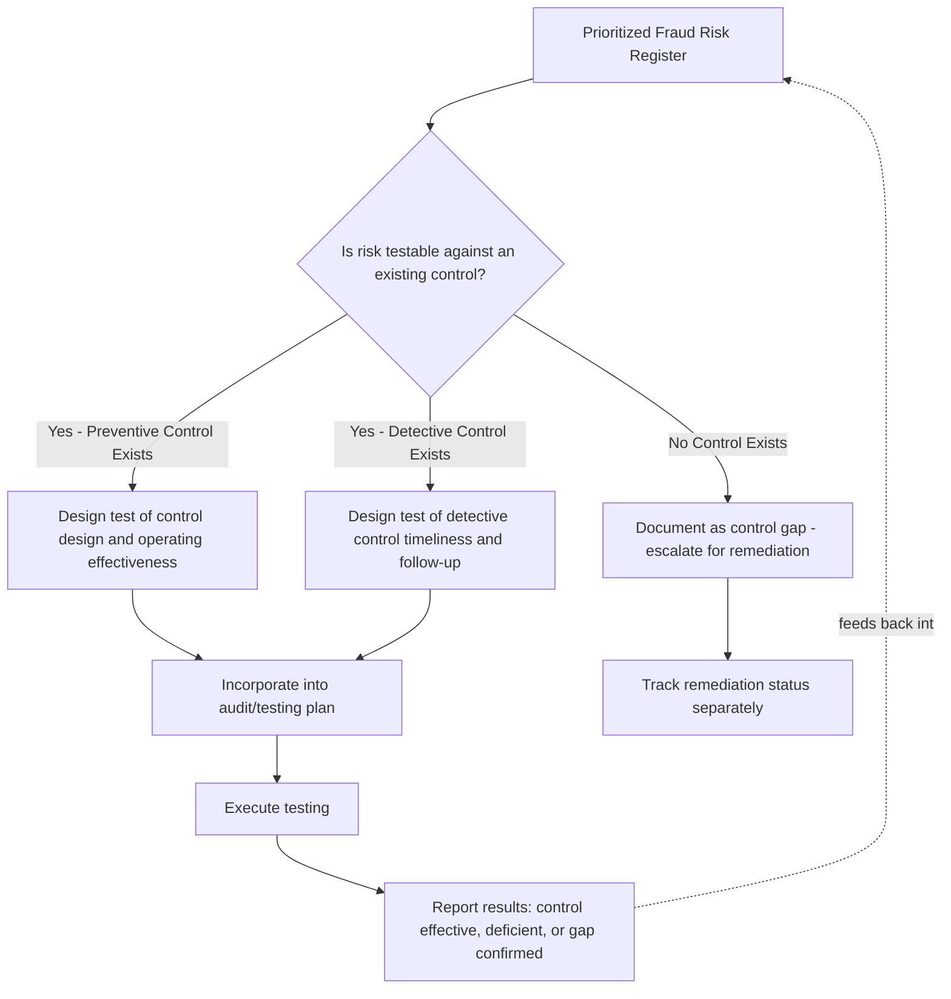

## Linking Fraud Risk Assessment to Control Testing

### Overview

Linking fraud risk assessment to control testing is the process of translating a documented, prioritized fraud risk register into a concrete, risk-responsive internal audit and control testing plan. A fraud risk assessment that identifies and prioritizes risks but is not systematically connected to actual testing procedures provides limited practical assurance — the value of the assessment is realized only when identified risks drive specific, tailored testing designed to determine whether controls are actually operating effectively against the specific schemes identified.

### Why This Linkage Matters

**Key Points**

- A fraud risk assessment performed in isolation from the audit plan risks becoming a compliance exercise ("checking the box" on COSO Principle 8) rather than a genuine driver of assurance activity.
- Generic, standardized control testing programs (e.g., a templated accounts payable test plan applied uniformly across all locations) may fail to address the specific, elevated risks identified for a particular business unit, process, or period.
- Regulatory and audit standards increasingly expect a demonstrable connection between risk assessment and testing scope: PCAOB auditing standards addressing the auditor's consideration of fraud require the auditor's assessed fraud risks to directly inform the nature, timing, and extent of audit procedures performed, and internal audit standards (e.g., IIA International Professional Practices Framework) similarly expect a risk-based audit plan.

### From Risk Register to Test Plan: The Translation Process

**Key Points**

- Each documented fraud risk in the prioritized risk register should be evaluated for **testability** — i.e., whether the risk can be addressed through a specific, executable audit or monitoring procedure, and if so, what that procedure should be.
- The translation process typically involves: (1) identifying the specific control(s) intended to mitigate the risk, (2) determining whether the control is a **preventive** control (stops the fraud before it occurs, e.g., segregation of duties, system-enforced approval limits) or a **detective** control (identifies fraud after it has occurred, e.g., reconciliations, exception reports, data analytics monitoring), and (3) designing a test procedure appropriate to the control type.
- For preventive controls, testing typically assesses whether the control is designed effectively and operating consistently (e.g., testing a sample of transactions to confirm required approvals were obtained before processing).
- For detective controls, testing typically assesses both the control's design (would it actually catch the targeted scheme if it occurred) and its operating effectiveness (is it being performed timely and are exceptions being investigated and resolved).
- Where no existing control adequately addresses a high-priority identified risk, the output of this translation process is not a test procedure but a **control gap finding**, which should be escalated for remediation (new control design) rather than tested against a nonexistent control.

### Risk-Based Audit Plan Scoping

**Key Points**

- Internal audit functions typically use the prioritized fraud risk register as a primary input (alongside broader operational and financial risk considerations) to determine which processes, locations, or business units receive audit coverage in a given period, and at what depth.
- Higher-priority residual fraud risks (from the heat map/prioritization exercise) generally warrant more frequent testing cycles, larger sample sizes, and more specialized testing techniques (e.g., forensic data analytics) compared to lower-priority risks addressed through standard rotational audit coverage.
- [Inference] Because audit resources are inherently finite, many internal audit functions formally document the linkage between specific risk register entries and specific audit plan line items (sometimes through a risk-to-procedure mapping matrix) to demonstrate, if questioned by the audit committee or external auditor, that the audit plan is genuinely risk-responsive rather than a fixed, unchanged rotational schedule.

### Designing Fraud-Specific Test Procedures

**Key Points**

- **Sampling approach:** for fraud-specific testing, sampling should generally be risk-based or targeted (e.g., focusing on transactions matching known fraud scheme red flags) rather than purely random/statistical sampling designed for general control effectiveness testing, since fraud is by nature a low-frequency, concealed event that random sampling may fail to detect.
- **Data analytics-driven testing:** for higher-priority risks, testing increasingly incorporates full-population data analytics (e.g., testing 100% of vendor master file additions for address matches to employee records, rather than a sample) rather than traditional sample-based testing, given the availability of transactional data and analytical tools.
- **Surprise/unpredictable testing elements:** for risks involving management override or heightened opportunity/rationalization concerns, testing plans often incorporate an element of unpredictability (unannounced site visits, testing periods not previously disclosed to process owners) to address the specific risk that a predictable testing pattern could be anticipated and circumvented.
- **Testing journal entries for financial statement fraud risk:** for financial close-related fraud risks, testing typically includes procedures targeting late, unusual, or management-initiated journal entries, consistent with the elevated management override risk category discussed in COSO-aligned fraud risk guidance.

### Coordinating Internal Audit and External Audit Fraud Risk Testing

**Key Points**

- Internal audit's risk-based testing (informed by the internal fraud risk assessment) and the external auditor's independent fraud risk assessment under applicable auditing standards are formally separate processes, but coordination between the two can improve overall assurance coverage and reduce duplicative effort.
- [Unverified] The extent to which an external auditor can rely on internal audit's fraud-related testing work varies based on auditing standards governing the use of internal audit's work and the external auditor's own independent assessment of internal audit's objectivity and competence, so the specific reliance parameters should be confirmed with the engagement's external audit team rather than assumed.
- Audit committees often expect a combined or coordinated reporting view of fraud risk testing coverage across both internal and external audit functions, particularly for the highest-priority risks on the fraud risk register.

### Documenting the Linkage for Defensibility

**Key Points**

- A documented **risk-to-control-to-test mapping** (sometimes structured as a matrix with columns for risk description, relevant control, control type, test procedure, testing frequency, and most recent test result) provides the evidentiary record demonstrating that the fraud risk assessment genuinely drove testing scope.
- This mapping is particularly valuable in supporting management's COSO Principle 8 assertion (for SOX 404 purposes) and in demonstrating a defensible, systematic approach if the organization later faces a fraud incident and must show that reasonable risk-responsive controls and testing were in place.
- Test results should feed back into the fraud risk register's residual risk ratings: a control that consistently tests as effective may support maintaining or lowering a residual risk rating, while a control testing exception should trigger a re-evaluation of the associated risk's residual rating and potentially escalate the priority for remediation or expanded testing scope.

### Handling Confirmed Control Gaps and Testing Exceptions

**Key Points**

- Where testing reveals a control gap (no control exists) or a control deficiency (a control exists but is not operating effectively), the finding should be documented with sufficient specificity to support a remediation plan, including root cause (e.g., inadequate system configuration versus inconsistent manual execution) and a proposed corrective action with an accountable owner and target date.
- Deficiencies identified through fraud-specific testing should be evaluated for potential financial statement or disclosure impact, distinct from general operational deficiency reporting, given the elevated implications a fraud-related control gap can carry for external financial reporting and regulatory considerations.
- [Unverified] The specific classification thresholds (e.g., distinguishing a "control deficiency" from a "significant deficiency" or "material weakness" under applicable auditing standards) require professional judgment calibrated to entity-specific facts and should be evaluated in coordination with the external auditor and, where applicable, disclosure counsel.

### Common Pitfalls

**Key Points**

- Maintaining a fraud risk register and an audit test plan as disconnected documents, with no explicit, traceable linkage demonstrating that identified high-priority risks actually received corresponding testing coverage.
- Applying generic, unchanged testing procedures year over year regardless of shifts in the risk register's prioritization, failing to adapt testing intensity as residual risk ratings change.
- Using purely random statistical sampling for testing designed to detect low-frequency, concealed fraud schemes, rather than targeted, red-flag-based, or full-population analytical approaches better suited to fraud detection objectives.
- Failing to feed testing results (particularly exceptions and control gaps) back into the risk register, so residual risk ratings become stale and disconnected from actual, current control performance.
- Treating a confirmed control gap the same as a routine testing exception, without appropriately escalating the finding given its elevated fraud risk implications.

### Example

Following a fraud risk assessment that rated "unauthorized changes to vendor banking details" as a high-priority residual risk in the procure-to-pay process, the internal audit function translates this into a specific test procedure: a full-population analytics query identifying all vendor banking detail changes over the past 12 months, cross-referenced against required dual-approval documentation and independent verification callback records. Testing reveals that 12 of 340 changes lacked documented callback verification, a control deficiency directly relevant to the identified fraud risk. This finding is documented with root cause (inconsistent enforcement of the callback policy at one regional processing center), escalated to the Accounts Payable Director as remediation owner with a 45-day corrective action target, and fed back into the fraud risk register, where the residual risk rating for this specific risk is elevated pending confirmed remediation and a follow-up test in the next quarter — directly linking the original risk assessment, the testing procedure performed, and the resulting risk register update in a single traceable record.

### Related Topics

- Fraud risk assessment frameworks and the assessment process cycle
- Prioritizing and documenting fraud risks
- Data analytics techniques for fraud detection testing
- COSO fraud risk management principles and management override of controls
- Internal audit risk-based planning methodology
- Control deficiency classification and disclosure considerations under SOX 404