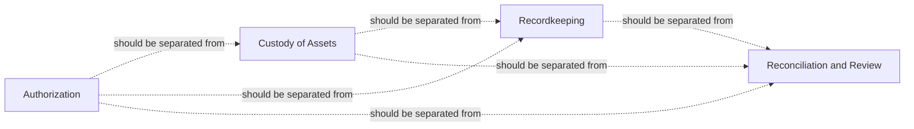
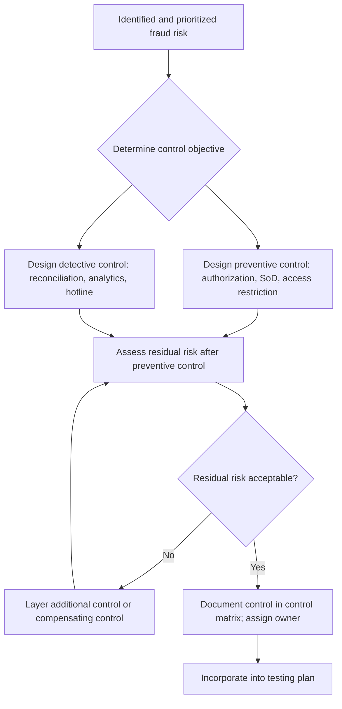

## Designing Internal Controls to Prevent and Detect Fraud

### Overview

Designing internal controls to prevent and detect fraud involves architecting a system of policies, procedures, segregation of responsibilities, and monitoring mechanisms specifically calibrated to interrupt fraud schemes at the points where they are most likely to occur, and to surface fraud that circumvents preventive measures as early as possible. Effective control design translates the outputs of the fraud risk assessment process into concrete, operational safeguards, recognizing that prevention and detection serve distinct but complementary functions within a comprehensive fraud control system.

### Prevention Versus Detection: A Foundational Distinction

**Key Points**

- **Preventive controls** are designed to stop a fraudulent act before it occurs or before it can be completed — examples include segregation of duties, system-enforced approval hierarchies, access restrictions, and pre-transaction authorization requirements.
- **Detective controls** are designed to identify fraud after it has occurred (or is in progress), enabling timely response — examples include reconciliations, exception reports, data analytics monitoring, and periodic audits.
- No system of preventive controls can be assumed to eliminate fraud risk entirely, particularly given management override risk and the possibility of collusion circumventing segregation of duties; a well-designed control environment therefore layers detective controls behind preventive controls rather than relying on prevention alone.
- [Inference] Because preventive controls are generally understood to be more cost-effective than detecting and remediating fraud after loss has occurred, control design typically prioritizes preventive measures where feasible, while reserving detective controls as a necessary complement for risks that cannot be fully prevented or where prevention costs would be disproportionate to the risk.

### Segregation of Duties

**Key Points**

- Segregation of duties (SoD) is a foundational preventive control principle requiring that no single individual controls all phases of a transaction — commonly divided into **authorization**, **custody** (of assets), **recordkeeping**, and **reconciliation/review** functions.
- Effective SoD design requires identifying, for each significant process, which roles hold each of these functions and ensuring no single individual (or unmonitored group of colluding individuals) controls more than one incompatible function.
- Common SoD conflicts requiring specific control design attention include: the same individual maintaining the vendor master file and approving payments, the same individual receiving cash and posting the related receivable, and the same individual initiating and approving journal entries.
- In smaller organizations where complete SoD is not feasible due to limited headcount, compensating controls (e.g., independent management review, mandatory approval by an owner/executive for specific transaction types) are commonly designed to mitigate the residual risk.

### Authorization and Approval Controls

**Key Points**

- Tiered approval thresholds (requiring progressively higher levels of authorization for larger transaction amounts) are a standard preventive control design element, calibrated to balance operational efficiency against fraud risk exposure.
- System-enforced (as opposed to purely policy-based) approval controls are generally considered more robust, since a system configuration requiring electronic approval before transaction processing removes reliance on manual policy adherence.
- Approval thresholds should be periodically reviewed and adjusted, since thresholds set without consideration of known fraud scheme patterns (e.g., a scheme deliberately structuring transactions just below a threshold) may provide limited practical protection.
- Designated approval authority should be documented in a formal delegation of authority (DOA) matrix, specifying which roles may approve which transaction types and amounts, supporting both control design clarity and subsequent testing.

### Physical and System Access Controls

**Key Points**

- Physical access controls (restricted access to inventory, cash, checks, signature stamps, and sensitive documents) limit the opportunity for asset misappropriation schemes.
- System access controls (role-based access provisioning, periodic access recertification, and segregation enforced through system permissions rather than solely through policy) limit the opportunity for both asset misappropriation and financial statement fraud schemes involving unauthorized system-level transaction entry or master data changes.
- Access provisioning should follow a "least privilege" design principle — granting individuals only the system access necessary for their specific job function — and access should be promptly revoked upon role change or termination, an area frequently associated with control gaps enabling ghost employee or unauthorized transaction schemes.
- Periodic access reviews (management or IT-led recertification of who has access to what systems/functions) serve as a hybrid preventive/detective control, identifying and correcting access creep (accumulated, no-longer-necessary access rights) that can otherwise silently erode SoD design over time.

### Reconciliation and Independent Verification Controls

**Key Points**

- Reconciliation controls (bank reconciliations, subledger-to-general-ledger reconciliations, physical inventory counts against perpetual records) function as detective controls identifying discrepancies that may indicate fraud, error, or both.
- Effective reconciliation control design requires: performance by an individual independent of the underlying transaction processing function, a defined and enforced frequency (e.g., monthly), documented review and sign-off by a supervisor independent of the preparer, and a defined process for investigating and resolving identified variances on a timely basis.
- Reconciliations performed but not genuinely reviewed (a "rubber stamp" approval without substantive investigation of variances) represent a common control design or operating effectiveness gap that undermines the control's actual detective value despite its formal existence.

### Whistleblower and Reporting Mechanisms

**Key Points**

- A confidential (and where legally required, anonymous) whistleblower hotline or reporting mechanism is a widely recommended detective control, given that tips are consistently identified by ACFE research as the most common initial detection method for occupational fraud, substantially exceeding detection via internal audit, external audit, or management review.
- Effective hotline design includes: accessibility to all employees (and often external parties such as vendors and customers), a reporting channel independent of the standard management chain (e.g., routed to internal audit, legal, or a third-party administrator rather than solely to direct supervisors), protection against retaliation, and a documented case management/investigation follow-up process.
- Publicizing the existence and use of the hotline (without necessarily disclosing case-specific details) can reinforce both the detective function and the deterrent effect associated with employees' awareness that reporting channels exist and are taken seriously.

### Data Analytics and Continuous Monitoring as Detective Controls

**Key Points**

- Data analytics techniques — Benford's Law analysis, duplicate payment/vendor testing, related-party transaction matching, unusual journal entry pattern detection, and statistical/machine-learning anomaly detection — increasingly serve as scalable detective controls capable of continuously monitoring full transaction populations rather than relying solely on periodic sample-based review.
- Continuous monitoring systems, when properly designed, generate exception reports requiring timely investigation and resolution by a designated owner, converting raw analytical output into an actionable detective control rather than merely a data reporting exercise.
- [Inference] Because analytics-based detection systems can generate a high volume of false positives if not properly calibrated to the organization's specific risk profile and normal transaction patterns, effective control design typically includes an iterative tuning process and a clearly defined escalation/investigation workflow to ensure exceptions receive appropriate and timely attention rather than being deprioritized due to volume.

### Control Environment and Anti-Fraud Culture Elements

**Key Points**

- Beyond specific transactional controls, broader control environment elements support fraud prevention: a documented code of conduct addressing fraud-related expectations, mandatory ethics/fraud awareness training, clear consequences for policy violations consistently applied regardless of position or seniority, and visible board/senior management commitment to ethical conduct ("tone at the top").
- Management override risk is generally addressed through control environment design elements layered onto transactional controls: heightened board/audit committee scrutiny of significant or unusual transactions, mandatory vacation/job rotation policies (which can surface concealment schemes requiring continuous perpetrator presence), and unpredictable audit procedures.
- Job rotation and mandatory vacation policies function as a hybrid control: they can serve a preventive function (disrupting an individual's sole, continuous control over a process) and a detective function (schemes concealed through continuous manual intervention often surface when the perpetrator is temporarily absent and a substitute performs the role).

### Control Design Process

### Cost-Benefit and Practical Design Considerations

**Key Points**

- Control design should generally be proportionate to the significance of the risk being addressed; over-engineering controls for low-priority risks consumes resources without commensurate risk reduction, while under-controlling high-priority risks leaves the organization exposed disproportionate to potential consequence.
- Control friction (the operational burden a control imposes on legitimate business activity) should be explicitly considered in design, since excessively burdensome controls can create incentive for employees to develop informal workarounds that undermine the control's intended function.
- [Unverified] The specific balance between control rigor and operational efficiency is inherently organization-specific and involves management judgment informed by risk appetite, so no universal quantitative formula determines the "correct" level of control investment for a given risk; this determination should reflect the organization's specific risk tolerance as set by senior management and the board.

### Common Pitfalls in Control Design

**Key Points**

- Designing controls based on generic industry templates without validating relevance to the organization's specific risk profile, process design, and system environment.
- Relying exclusively on preventive controls without a complementary layer of detective controls, leaving no mechanism to identify fraud that circumvents or overrides preventive measures.
- Designing SoD conflicts around formal job titles without validating actual system access and practical role execution, which may differ from the documented job description.

  – Failing to address management override risk with control environment-level safeguards, treating only transaction-level control design as sufficient.
- Implementing detective analytics without a defined, resourced investigation and escalation workflow, resulting in generated exceptions that are never actually reviewed or resolved.
- Neglecting periodic reassessment of control design as business processes, systems, and organizational structure evolve, allowing controls to become misaligned with actual current risk.

### Example

A mid-sized company designing controls for its procure-to-pay process, informed by a fraud risk assessment identifying shell vendor risk as high-priority, implements a layered control design: preventive controls include system-enforced segregation between vendor master file maintenance (assigned to a dedicated master data team independent of procurement and accounts payable) and payment processing, along with a mandatory dual-approval workflow for any new vendor addition or banking detail change. Detective controls include a quarterly automated analytic matching vendor addresses and bank account details against the employee master file, and a confidential whistleblower hotline promoted through periodic employee communications. Control environment elements include mandatory annual fraud awareness training referencing the specific shell vendor scheme pattern, and an audit committee-approved policy requiring internal audit to perform unannounced testing of vendor onboarding controls at least once annually. Each control is documented in a control matrix specifying the responsible owner, and the matrix is directly linked to the internal audit test plan, ensuring the designed controls receive periodic testing consistent with the broader risk assessment-to-testing linkage.

### Related Topics

- Segregation of duties analysis and control matrix design
- Linking fraud risk assessment to control testing
- Data analytics and continuous monitoring techniques for fraud detection
- Whistleblower hotline design and case management
- COSO fraud risk management principles and management override of controls
- Code of conduct and ethics program design