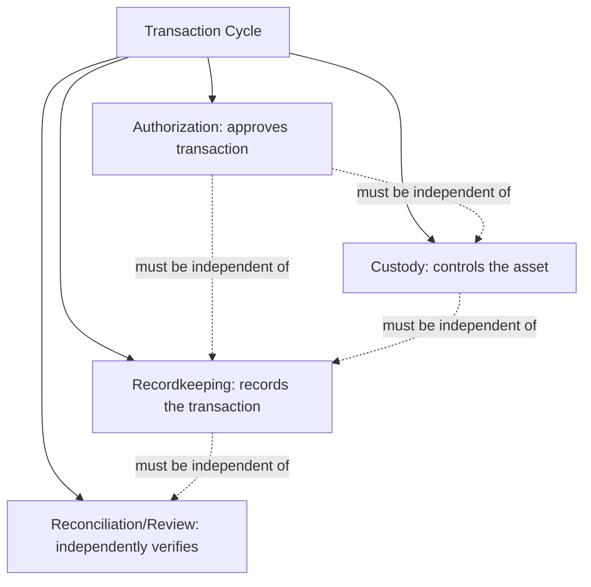
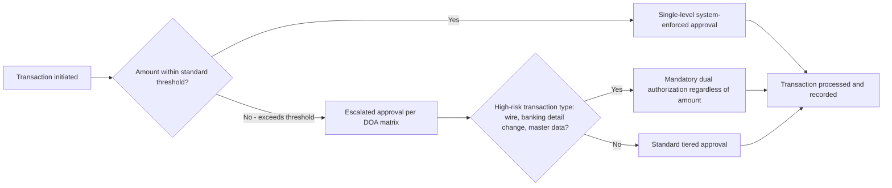

## Segregation of Duties and Authorization Controls

### Overview

Segregation of duties (SoD) and authorization controls form the structural backbone of preventive fraud control design, addressing the "opportunity" leg of the Fraud Triangle by ensuring that no single individual possesses unchecked control over a complete transaction cycle, and that transactions require appropriate, verified approval before execution. While closely related — authorization is often one of the functions being segregated — each concept carries distinct design principles and testing considerations warranting focused treatment.

### The Four Incompatible Functions Framework

**Key Points**

- Classical SoD theory divides transaction-related responsibilities into four functions that should generally be held by different individuals: **authorization** (approving that a transaction should occur), **custody** (physical or system control over the related asset), **recordkeeping** (recording the transaction in the accounting records), and **reconciliation/review** (independently verifying that recorded transactions match actual activity).
- The underlying rationale is that concentrating two or more of these functions in a single individual creates the opportunity to both perpetrate and conceal a fraudulent act without requiring collusion with another party — for example, an individual who can both authorize a disbursement and record it in the general ledger could create and conceal a fictitious payment without needing anyone else's cooperation.
- Effective SoD design requires organizations to map, for each significant transaction cycle, which specific roles or positions perform each of the four functions, and to identify and remediate instances where a single role (or a single individual holding multiple roles) spans more than one incompatible function.

### Common Segregation of Duties Conflicts by Process

**Key Points**

- **Procure-to-pay:** the same individual should not both maintain the vendor master file (custody of vendor data) and approve vendor payments (authorization), nor should the same individual both approve purchase requisitions and receive/inspect goods.
- **Order-to-cash:** the same individual should not both record cash receipts and post the related reduction to accounts receivable (recordkeeping) without an independent reconciliation function, since this combination enables lapping schemes concealing cash skimming.
- **Payroll:** HR functions (employee setup, rate changes, termination processing) should be segregated from payroll processing and disbursement functions, preventing a single individual from creating and paying a ghost employee.
- **Financial close:** journal entry preparation should be segregated from journal entry approval, and both should be segregated from the individual reconciling the affected accounts, reducing the risk of unauthorized or fictitious entries going undetected.
- **Treasury/cash management:** wire transfer initiation should be segregated from wire transfer approval, and bank reconciliation should be performed by an individual independent of both functions.

### Building a Segregation of Duties Matrix

**Key Points**

- A SoD matrix is the standard documentation tool mapping specific job roles or system roles (rows and columns) against transaction functions or system permissions, with cells flagged where a single role combines two or more incompatible functions.
- Modern SoD analysis for ERP-based environments typically operates at the level of specific system transaction codes or permissions (e.g., specific SAP T-codes or Oracle responsibilities) rather than only job titles, since actual system access — not job description — determines real-world capability to execute a conflicting combination of functions.
- SoD matrices should be periodically refreshed to reflect organizational changes (role redesigns, system implementations, personnel changes) and should be validated against actual granted system access rather than assumed based on documented policy, since access provisioned outside formal role definitions ("access creep") is a common source of undetected SoD violations.
- [Unverified] Automated SoD analysis tools (commonly integrated with GRC — Governance, Risk, and Compliance — platforms) are widely used in larger ERP environments to continuously scan system access against defined conflict rules, but the specific configuration and rule sets require organization-specific customization, so generic vendor rule sets should be validated against the organization's actual process design before reliance.

### Compensating Controls Where Full Segregation Is Not Feasible

**Key Points**

- Smaller organizations, or specific functions with limited headcount, often cannot achieve theoretically complete SoD; in these situations, **compensating controls** are designed to mitigate the residual risk created by the unavoidable functional overlap.
- Common compensating controls include: mandatory independent review and approval by a business owner or executive not otherwise involved in the process, more frequent or more granular reconciliation procedures, enhanced management review of exception reports, and periodic rotation of duties among available personnel.
- [Inference] Because compensating controls are inherently a risk-mitigation substitute rather than a full structural solution, many practitioners treat residual risk in functions relying primarily on compensating controls as elevated relative to functions achieving full structural SoD, warranting closer monitoring or more frequent testing even when the compensating control is operating as designed.

### Authorization Control Design Principles

**Key Points**

- Authorization controls establish that a transaction has been reviewed and approved by an individual with appropriate authority before it is executed or recorded, serving as a preventive gate distinct from (though often paired with) SoD's structural role separation.
- **Tiered authorization thresholds** — requiring increasingly senior approval as transaction value increases — are a standard design element, typically documented in a formal **Delegation of Authority (DOA) matrix** specifying approval limits by role or position.
- **System-enforced authorization** (electronic workflow approval built into the ERP or financial system, preventing transaction processing without recorded approval) is generally considered more robust than policy-based authorization relying on manual compliance, since system enforcement removes the possibility of a transaction proceeding without the required approval step being completed.
- Authorization limits should be periodically reviewed against known fraud scheme patterns; a threshold set without consideration of scheme behavior (e.g., structuring transactions just below the threshold to avoid required approval) may provide materially less protection than intended.
- **Dual authorization** (requiring two independent approvals) is commonly applied to higher-risk transaction types regardless of dollar value, such as wire transfers, vendor banking detail changes, and payroll master file changes, reflecting the elevated fraud risk associated with these specific transaction types independent of transaction size.

### Authorization Workflow Design

### Management Override Risk in SoD and Authorization Design

**Key Points**

- Senior management and executives, by virtue of position, frequently possess (or can obtain) system access and authority that formally spans multiple incompatible functions, or the practical ability to direct subordinates to bypass normal SoD/authorization controls — a risk that structural SoD design alone cannot fully address.
- Control design addressing this risk typically layers governance-level safeguards on top of transactional SoD: board/audit committee-approved authorization limits applicable even to senior executives, mandatory independent review of any executive-initiated or executive-approved transaction exceeding a defined threshold, and periodic unannounced audit testing specifically targeting senior management transaction activity.
- [Unverified] The specific governance mechanisms an organization implements to address management override risk vary considerably based on organizational size, ownership structure (public versus private), and board composition, so no single universal design applies across all entities.

### Testing Segregation of Duties and Authorization Controls

**Key Points**

- SoD testing typically involves both a **design assessment** (does the documented role structure and system access configuration avoid incompatible function combinations) and an **operating effectiveness assessment** (is the designed segregation actually being maintained in practice, including verification that no unauthorized access has been granted outside the intended role design).
- Authorization control testing typically involves selecting a sample (or, increasingly, testing a full population via analytics) of transactions and verifying that required approvals were obtained, from an individual with appropriate documented authority, before the transaction was processed.
- Testing should specifically probe for threshold circumvention patterns (e.g., analyzing transaction populations for unusual clustering just below approval thresholds) as a targeted detective procedure complementing standard control operating effectiveness testing.

### Common Pitfalls in SoD and Authorization Control Design

**Key Points**

- Designing SoD matrices based on formal job titles or organizational charts without validating actual granted system access, which frequently diverges from documented role design due to accumulated access changes over time.
- Failing to extend SoD and authorization scrutiny to system administrator or "superuser" accounts, which can possess broad access spanning multiple incompatible functions by technical necessity but require compensating monitoring controls given their elevated risk profile.
- Setting authorization thresholds without periodic review, allowing thresholds to become stale relative to inflation, transaction volume growth, or known fraud scheme patterns.
- Treating compensating controls implemented due to headcount constraints as a permanent, unreviewed solution rather than periodically reassessing whether organizational growth now permits fuller structural segregation.
- Overlooking SoD conflicts introduced by system implementations or process outsourcing, where a third-party provider or a newly configured system role may inadvertently combine incompatible functions not present in the prior manual process.

### Example

A company implementing a new ERP system engages an internal audit team to design and validate SoD controls for the procure-to-pay cycle prior to go-live. The team builds a SoD matrix mapping each system role (e.g., "AP Clerk," "Procurement Manager," "Vendor Master Data Administrator") against the four incompatible functions, identifying that the proposed "AP Supervisor" role, as initially configured, would have system access to both approve vendor payments and modify the vendor master file — a direct authorization/custody conflict enabling an undetectable shell vendor scheme. The team recommends splitting this access into two distinct system roles requiring separate personnel, and separately recommends implementing mandatory dual authorization specifically for vendor banking detail changes regardless of the requestor's role, given the elevated risk associated with this specific transaction type. Post-implementation, the internal audit team performs a full-population analytics test of all vendor master file changes in the first quarter to confirm the redesigned controls are operating as intended, feeding results back into the organization's broader control testing and fraud risk assessment cycle.

### Related Topics

- Designing internal controls to prevent and detect fraud
- Delegation of Authority (DOA) matrix design and threshold setting
- Management override of controls and governance-level safeguards
- ERP system access controls and GRC-based automated SoD monitoring
- Identifying fraud risk factors by business process
- Linking fraud risk assessment to control testing