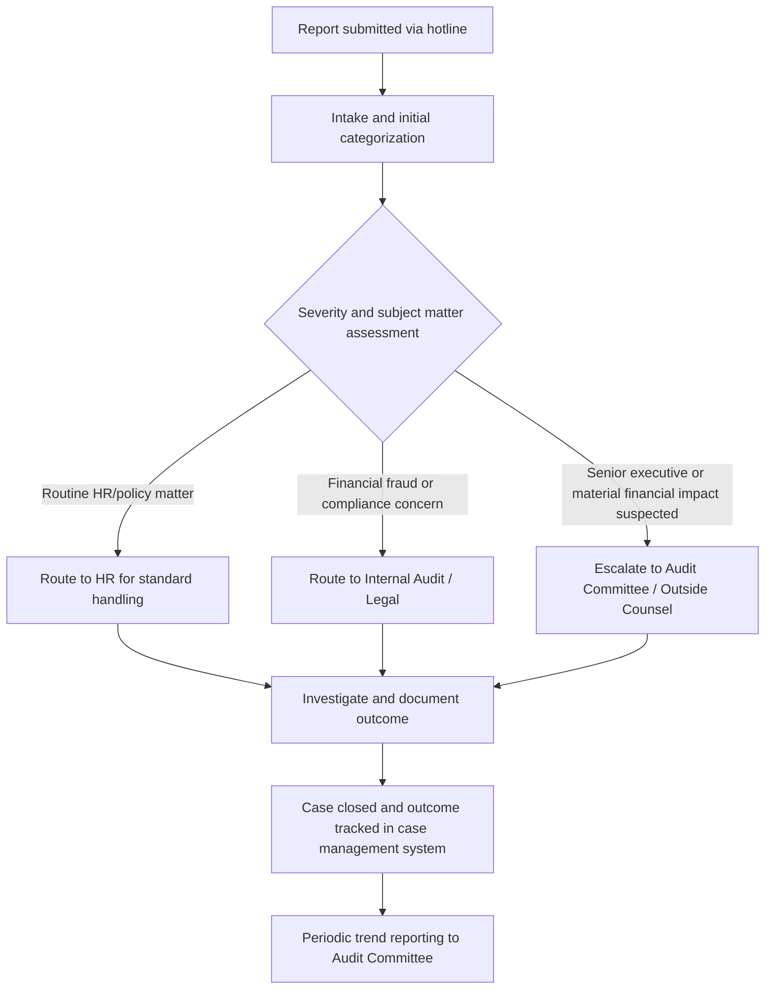

## Whistleblower Programs and Reporting Hotlines

### Overview

Whistleblower programs and reporting hotlines establish formal channels through which employees, vendors, customers, and other stakeholders can report suspected misconduct — including fraud, corruption, and financial reporting irregularities — confidentially and, where designed to permit it, anonymously. These programs consistently rank as one of the most effective fraud detection mechanisms available to organizations, and their design, governance, and integration with legal/regulatory frameworks represent a distinct area of fraud prevention program expertise.

### Empirical Significance of Tips as a Detection Method

**Key Points**

- ACFE's biennial *Report to the Nations* research has consistently identified tips as the single most common method by which occupational fraud is initially detected, substantially outpacing detection via internal audit, management review, external audit, or accident.
- [Unverified] The specific percentage figures for tip-based detection versus other methods vary by report edition/year, so current figures should be verified against the most recent ACFE *Report to the Nations* publication rather than assumed static over time.
- Organizations with a formal hotline in place are generally associated in ACFE research with faster fraud detection and lower median losses compared to organizations without a formal reporting mechanism, underscoring the hotline's role not only in detection likelihood but in limiting the duration and magnitude of undetected fraud schemes.

### Core Design Elements of an Effective Hotline

**Key Points**

- **Accessibility:** the reporting channel should be available through multiple methods (phone, web portal, email, and increasingly mobile app-based reporting) to accommodate different reporter preferences and circumstances, and should be accessible outside normal business hours given that reporters may prefer to report from outside the workplace.
- **Confidentiality and anonymity options:** the program should clearly communicate whether reports can be made anonymously (identity never collected or knowable, including by the hotline administrator) versus confidentially (identity known to a limited group but not disclosed to the subject of the complaint or general workforce), since these are meaningfully different assurances that affect reporter willingness to come forward.
- **Independence from normal management chain:** an effective hotline routes reports to a function independent of the reporter's direct management line — commonly internal audit, legal/compliance, or a third-party hotline administrator — since routing complaints through standard management channels can suppress reports involving management misconduct or create retaliation risk.
- **Broad scope of eligible reporters:** while employees are the primary intended reporter population, well-designed programs extend access to vendors, customers, contractors, and other third parties, since these external stakeholders may observe misconduct not visible to internal personnel.
- **Multi-language support:** for organizations with a geographically or linguistically diverse workforce, hotline accessibility in relevant languages is a practical design consideration supporting genuine accessibility rather than nominal availability.

### Third-Party Hotline Administration

**Key Points**

- Many organizations engage a third-party hotline administrator (an independent vendor) rather than operating an internal-only reporting channel, since third-party administration can enhance perceived independence and reporter confidence, particularly for anonymous reporting where reporters may distrust that an internally-operated system genuinely protects anonymity.
- Third-party administrators typically provide initial intake, categorization, and routing of reports to designated internal recipients (e.g., legal, internal audit, HR) based on report type, along with case tracking and reporting analytics across the reporting population.
- [Unverified] Specific vendor platform capabilities and pricing models vary considerably and change over time, so current vendor evaluation should be based on direct research into presently available options rather than assumed from general industry familiarity.

### Case Management and Investigation Workflow

**Key Points**

- An effective hotline program requires a defined case management process specifying: who receives and triages incoming reports, how reports are categorized and prioritized (e.g., financial fraud versus HR policy violation versus safety concern), what investigative resources are engaged based on category and severity, and how outcomes are documented and tracked to closure.
- Case tracking systems should maintain records of report volume, categorization, investigation outcomes, time-to-resolution, and substantiation rates, supporting both individual case management and periodic trend reporting to the audit committee or board.
- A documented escalation protocol should specify criteria for elevating certain reports (e.g., allegations involving senior executives, allegations suggesting potential securities law violations, or allegations of a scale suggesting material financial statement impact) to the audit committee or outside counsel rather than routine internal handling alone.

### Anti-Retaliation Protections

**Key Points**

- Anti-retaliation policy and enforcement is a critical design element, since perceived or actual retaliation risk is widely recognized as a primary deterrent to whistleblower reporting regardless of how robust the technical reporting channel itself is designed.
- In the United States, statutory whistleblower protections relevant to forensic accounting and fraud contexts include provisions under the Sarbanes-Oxley Act (Section 806, protecting employees of publicly traded companies who report suspected securities fraud or violations of SEC rules) and the Dodd-Frank Act (which additionally created SEC and CFTC whistleblower award programs providing financial incentives for reporting original information leading to successful enforcement actions).
- [Unverified] Specific statutory whistleblower protection scope, covered conduct, and procedural requirements (e.g., filing deadlines, covered employer definitions) involve detailed legal criteria that continue to be interpreted through evolving case law, so specific legal protection questions should be directed to qualified employment or securities counsel rather than treated as settled by general reference here.
- Effective anti-retaliation program design includes: clear policy communication that retaliation will not be tolerated and will itself result in disciplinary action, monitoring mechanisms to detect potential retaliation against known reporters (e.g., unusual performance review changes or termination shortly following a report), and periodic culture surveys assessing employee perception of psychological safety in reporting.

### Regulatory Whistleblower Programs: SEC and CFTC

**Key Points**

- The SEC's whistleblower program, established under the Dodd-Frank Act, allows individuals who voluntarily provide original information leading to a successful SEC enforcement action resulting in monetary sanctions over a specified threshold to receive a monetary award within a statutorily defined percentage range of sanctions collected.
- The CFTC operates an analogous whistleblower award program for original information relating to violations of the Commodity Exchange Act.
- [Unverified] Specific award percentage ranges, minimum sanction thresholds, and procedural filing requirements for SEC and CFTC whistleblower programs are subject to periodic regulatory guidance and specific case determinations, so current program parameters should be verified directly against SEC/CFTC current published rules rather than assumed static.
- The existence of external regulatory whistleblower programs offering direct financial incentives has implications for internal hotline program design: organizations generally cannot condition severance or other agreements on employees waiving their right to report directly to the SEC or receive a whistleblower award, and internal reporting policies should be drafted to avoid inadvertently discouraging or appearing to restrict external regulatory reporting.

### Integration with the Broader Fraud Risk Management Program

**Key Points**

- The whistleblower hotline functions as the primary Information and Communication component (COSO Principle 14) supporting the broader fraud risk management framework, and its case data provides valuable ongoing input into the periodic fraud risk assessment process — recurring complaint themes or categories may indicate an under-identified or under-controlled risk area warranting reassessment.
- Audit committee oversight responsibilities (COSO Principle 2) typically include periodic review of hotline activity summaries, including volume trends, categorization breakdowns, substantiation rates, and status of any significant open investigations, without necessarily reviewing case-specific details for lower-severity matters.
- Hotline design and case handling protocols should be developed in coordination with legal counsel given the potential for hotline reports to trigger privilege considerations, mandatory disclosure obligations, or parallel regulatory/law enforcement interest depending on the nature of the allegation.

### Promoting Program Awareness and Utilization

**Key Points**

- A technically well-designed hotline provides limited detective value if employees are unaware of its existence, do not understand how to access it, or do not trust that reports will be taken seriously and handled without retaliation.
- Common awareness-building practices include: mandatory inclusion in new employee onboarding, periodic refresher communications and training, visible posting of hotline contact information in physical workplaces and on internal digital platforms, and periodic (anonymized) communication of program outcomes (e.g., "X reports were received and investigated this year") to reinforce that the program is active and consequential.
- [Inference] Because reporter trust is understood to develop over time through observed program credibility, many practitioners view sustained, consistent program communication and visible follow-through on reported concerns as more influential to utilization rates than the initial launch communication alone.

### Common Pitfalls in Hotline Program Design

**Key Points**

- Establishing a hotline as a nominal compliance requirement without adequate promotion, resulting in low employee awareness and correspondingly low utilization despite the channel's formal existence.
- Routing reports through a process that is not genuinely independent of the standard management chain, undermining reporter confidence particularly for reports involving management-level misconduct.
- Inadequate or inconsistent enforcement of anti-retaliation policy, allowing even isolated perceived retaliation incidents to substantially undermine broader employee trust in the program.
- Failing to track and analyze case data in aggregate, missing the opportunity to use hotline trends as an input into the broader fraud risk assessment process.
- Overlooking the interaction between internal reporting channel design and external regulatory whistleblower program rights, potentially creating policy language that could be viewed as improperly restricting protected external reporting.

### Example

A publicly traded manufacturing company engages a third-party hotline administrator to operate a confidential, multi-channel (phone and web portal) reporting system available to employees, vendors, and customers in English and Spanish, reflecting its workforce composition. Reports are routed by the third-party administrator directly to the company's General Counsel and Chief Audit Executive, bypassing the standard management chain, with a defined escalation protocol requiring any report involving a member of senior management or suggesting potential securities law implications to be immediately communicated to the Audit Committee Chair. The company promotes the hotline through mandatory annual training, break-room posters, and an anonymized annual summary shared company-wide noting the number of reports received and general categories of outcomes (without disclosing case-specific details). When the audit committee's periodic hotline trend review identifies a cluster of reports concerning expense reimbursement irregularities within a specific regional office, this pattern is fed back into the company's next fraud risk assessment cycle as a specific elevated risk factor warranting targeted testing, directly linking the hotline's case data to the broader fraud risk management process.

### Related Topics

- Designing internal controls to prevent and detect fraud
- COSO fraud risk management principles (Information and Communication component)
- Sarbanes-Oxley Section 806 and Dodd-Frank whistleblower protections
- SEC and CFTC whistleblower award programs
- Fraud risk assessment frameworks and using case data as a risk indicator
- Investigation case management and escalation protocols