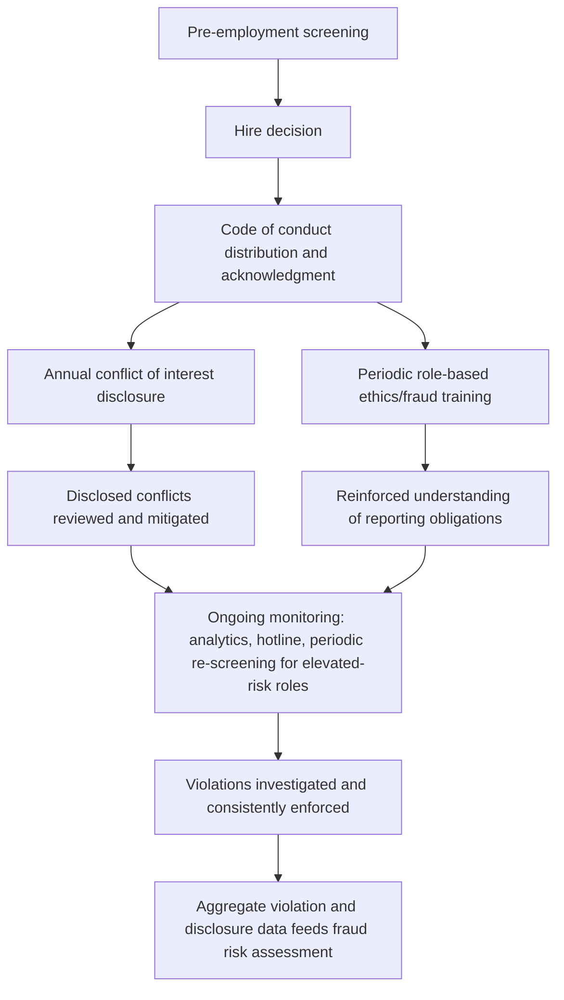

## Employee Screening and Code of Conduct Programs

### Overview

Employee screening and code of conduct programs address the "capability" and "rationalization" dimensions of fraud risk at the human resources and organizational culture level, functioning as foundational control environment elements rather than transaction-level controls. Pre-employment screening seeks to reduce the likelihood of hiring or promoting individuals with a demonstrated propensity for dishonest conduct, while codes of conduct establish and reinforce the ethical standards and behavioral expectations against which rationalization for misconduct becomes more difficult to sustain.

### Pre-Employment Background Screening

**Key Points**

- Standard pre-employment screening components relevant to fraud risk typically include: criminal history checks, employment verification (confirming prior employment dates, titles, and reasons for departure), education verification, professional license/certification verification, and credit history checks for positions with significant financial responsibility or access.
- Screening scope and depth are commonly calibrated to position risk level — positions with direct financial transaction authority, cash handling, or system access to sensitive financial data typically warrant more extensive screening than positions without such access.
- [Unverified] The legal permissibility and scope of specific screening components (particularly credit history checks and criminal history checks) are subject to considerable jurisdictional variation, including "ban the box" laws restricting criminal history inquiry timing, credit check restrictions in certain states, and Fair Credit Reporting Act (FCRA) compliance requirements for U.S. employers using third-party screening reports; specific screening program design should be developed in coordination with employment counsel given this jurisdictional variability.
- Reference checks, while sometimes limited in practical value due to employers' general reluctance to provide substantive references beyond dates of employment (a common risk-avoidance practice), remain a standard element of a documented screening process.

### Enhanced Screening for Elevated-Risk Positions

**Key Points**

- Positions with elevated fraud risk exposure — treasury/cash management roles, roles with system administrator or override access, senior financial reporting roles, and procurement roles with vendor selection authority — often warrant enhanced screening beyond standard baseline checks, potentially including more extensive credit history review, professional reference verification, and periodic (not solely pre-employment) re-screening.
- Executive and board-level candidates typically undergo more extensive due diligence, sometimes including litigation history searches, regulatory disciplinary history checks (e.g., FINRA BrokerCheck for financial services roles, state licensing board checks for licensed professionals), and media/reputational searches, reflecting the elevated capability and opportunity such positions carry for potential fraud or override risk.
- [Inference] Because a single pre-employment screening captures only a point-in-time assessment, some organizations implement periodic re-screening (particularly for elevated-risk positions) recognizing that an employee's circumstances — and associated pressure/incentive factors under the Fraud Triangle — can change materially after initial hire.

### Screening Program Governance and Consistency

**Key Points**

- Effective screening programs apply consistent standards across similarly situated positions, since inconsistent application (whether by design or informal practice) can create both fraud risk gaps and potential employment discrimination exposure.
- Screening criteria and adverse action processes (what disqualifies a candidate, and the process for adverse decisions based on screening results) should be clearly documented, consistently applied, and compliant with applicable FCRA and state-law adverse action notice requirements where third-party consumer reports are used.
- Screening records and decisions should be retained consistent with the organization's records retention policy and applicable employment law requirements, supporting both consistency review and defensibility if a screening decision is later challenged.

### Code of Conduct: Purpose and Core Content

**Key Points**

- A code of conduct (sometimes styled as a code of ethics or code of business conduct) formally articulates the organization's expected standards of behavior, providing an explicit reference point that supports the Control Environment component of internal control (COSO Principles 1 and 5) and directly counters the "rationalization" element of the Fraud Triangle by removing ambiguity about whether specific conduct is acceptable.
- Core content typically addresses: general ethical expectations and integrity standards, conflicts of interest (disclosure requirements and prohibited relationships), gifts and entertainment policies, confidentiality and information protection, compliance with applicable laws (anti-corruption, antitrust, insider trading where relevant), accurate recordkeeping and financial reporting expectations, and the whistleblower/reporting mechanism through which violations should be reported.
- Codes of conduct for publicly traded companies typically address topics with heightened securities law relevance, including insider trading policy compliance and accurate books and records/internal control expectations, reflecting obligations under securities laws and stock exchange listing standards.

### Conflict of Interest Disclosure Programs

**Key Points**

- A structured conflict of interest disclosure process — typically an annual (or more frequent, for elevated-risk roles) written disclosure requiring employees to identify outside business interests, family relationships with vendors/customers/competitors, board memberships, and other potential conflicts — is a standard code of conduct implementation mechanism directly relevant to corruption-scheme fraud risk (per the ACFE Fraud Tree's Corruption branch).
- Disclosed conflicts should be reviewed by a designated function (often compliance, legal, or HR) with a documented process for evaluating whether a disclosed relationship requires mitigation (e.g., recusal from vendor selection decisions involving a disclosed related party).
- Undisclosed conflicts discovered through other means (e.g., data analytics matching vendor ownership records against employee/family information) represent both a code of conduct violation and a potential red flag warranting closer fraud risk scrutiny of the underlying relationship.

### Code of Conduct Distribution, Acknowledgment, and Training

**Key Points**

- Effective code of conduct programs require documented distribution to all employees (and often extended to relevant third parties such as vendors or agents, particularly for anti-corruption compliance purposes) with a periodic (commonly annual) written acknowledgment of receipt, understanding, and agreement to comply.
- Training reinforcing code of conduct content — often role-specific, with enhanced training for positions carrying elevated corruption or financial reporting risk — supports genuine comprehension beyond a documented acknowledgment alone, and training completion records provide evidentiary support for the program's actual implementation if later scrutinized.
- [Inference] Because a documented acknowledgment alone does not establish that an employee genuinely understood the code's requirements, many practitioners view interactive or scenario-based training (rather than passive document review) as more effective for reinforcing practical application of code of conduct principles, particularly for topics such as conflicts of interest and anti-corruption compliance where nuanced judgment is often required.

### Consistent Enforcement and Consequence Management

**Key Points**

- A code of conduct's practical deterrent value depends substantially on consistent enforcement — disciplinary consequences for violations applied uniformly regardless of the violator's seniority or performance value to the organization — since inconsistent enforcement (particularly leniency toward high-performing or senior personnel) undermines both the control environment's credibility and the perceived legitimacy of the broader fraud risk management program.
- Documented disciplinary action records, tracked in aggregate, provide both an accountability mechanism and, similar to whistleblower hotline case data, a potential input into the broader fraud risk assessment process if recurring violation patterns emerge in a specific area or business unit.
- Board and audit committee oversight of code of conduct enforcement (particularly for violations involving senior management, given management override risk considerations) is generally viewed as a component of the board's broader fraud risk oversight responsibility.

### Program Integration Flow

### Common Pitfalls

**Key Points**

- Applying inconsistent screening depth across similarly situated positions, creating unaddressed risk gaps for positions informally treated as lower-risk despite carrying meaningful financial or system access.
- Treating pre-employment screening as a one-time, point-in-time control without considering periodic re-screening for elevated-risk positions where post-hire circumstances (financial pressure, for example) may change materially over an employee's tenure.
- Distributing a code of conduct with a signed acknowledgment but without substantive training, resulting in nominal compliance without genuine comprehension of practical application, particularly for nuanced conflict-of-interest scenarios.
- Inconsistent disciplinary enforcement, particularly leniency toward senior or high-performing personnel, which undermines both the code's deterrent credibility and the broader control environment.
- Collecting conflict-of-interest disclosures without a documented review and mitigation process, rendering the disclosure exercise a paperwork formality rather than an operative fraud risk control.
- Failing to extend code of conduct expectations and, where relevant, screening-equivalent due diligence to third parties (agents, distributors, joint venture partners) who can create fraud or corruption exposure on the organization's behalf.

### Example

A company revises its employee screening and code of conduct program following a fraud risk assessment finding that its procurement function's onboarding process for new hires with vendor selection authority lacked enhanced screening. The revised program requires standard background screening (criminal history, employment verification) for all hires, with enhanced screening — including more extensive reference verification and a review of any disclosed outside business interests — for procurement, treasury, and senior financial reporting roles specifically. The company's code of conduct is revised to include a more detailed conflicts-of-interest section with concrete examples relevant to procurement decision-making, distributed with a mandatory annual acknowledgment, and reinforced through scenario-based training specific to the procurement function. An annual conflict-of-interest disclosure process is implemented, reviewed by the compliance function, with one disclosed family relationship between a procurement employee and a prospective vendor resulting in documented recusal of that employee from the related vendor selection decision. Aggregate disclosure and training completion data, along with any code of conduct violations identified during the year, are summarized and presented to the audit committee as part of its periodic fraud risk oversight review, and the pattern of disclosures is considered as an input into the following year's fraud risk assessment cycle.

### Related Topics

- Designing internal controls to prevent and detect fraud
- COSO fraud risk management principles and Control Environment component
- Fraud Triangle and Fraud Diamond theoretical models
- Whistleblower programs and reporting hotlines
- Corruption schemes under the ACFE Fraud Tree classification
- Anti-corruption compliance programs and third-party due diligence