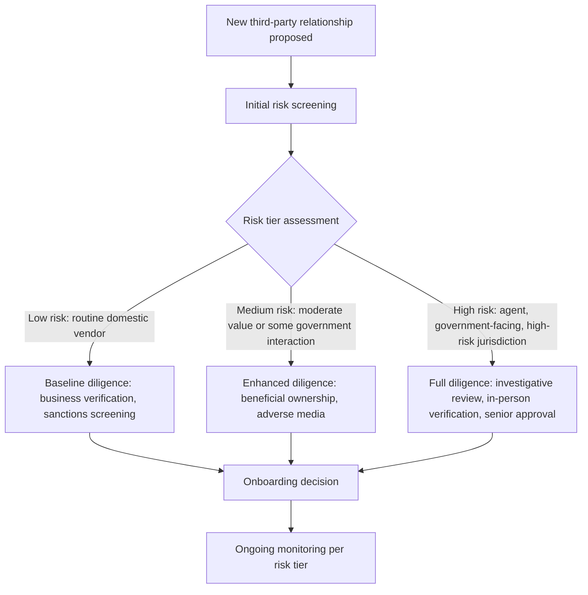

## Vendor and Third-Party Due Diligence

### Overview

Vendor and third-party due diligence encompasses the systematic processes an organization applies to evaluate, onboard, and continuously monitor external parties — vendors, suppliers, agents, distributors, joint venture partners, and other intermediaries — to mitigate fraud, corruption, and related legal/reputational risk arising from those relationships. Because organizations extend transactional trust, payment access, and sometimes agency authority to third parties outside their direct employment and control, third-party relationships represent a distinct fraud risk category requiring dedicated due diligence processes beyond standard internal control design.

### Why Third-Party Relationships Present Elevated Fraud Risk

**Key Points**

- Third parties often operate with less direct oversight than internal employees, creating opportunity for fraud schemes such as fictitious/shell vendor arrangements, kickback schemes involving collusion between an employee and an external party, and bribery or corrupt payments channeled through an intermediary to obscure the originating organization's direct involvement.
- Under anti-corruption laws such as the U.S. Foreign Corrupt Practices Act (FCPA) and the UK Bribery Act, an organization can face liability for corrupt payments made by third-party agents or intermediaries acting on its behalf, even where the organization's own employees did not directly make the improper payment — making third-party due diligence a direct legal compliance requirement in addition to a general fraud prevention practice.
- [Unverified] The specific scope of third-party liability exposure under these statutes involves detailed legal elements (e.g., knowledge standards, "conscious avoidance" doctrine) that require case-specific legal analysis, so organizations should consult qualified FCPA/anti-corruption counsel for entity-specific risk assessment rather than relying on general summary description.

### Risk-Based Tiering of Third-Party Due Diligence

**Key Points**

- Effective third-party due diligence programs typically apply a **risk-based tiering approach**, calibrating due diligence depth to the relationship's inherent risk profile rather than applying uniform diligence to all vendors regardless of risk.
- Common risk factors driving tier classification include: the third party's role (e.g., a sales agent or government-facing intermediary generally carries higher corruption risk than a routine office supplies vendor), the jurisdiction of operation (countries with higher perceived corruption risk, as reflected in indices such as Transparency International's Corruption Perceptions Index, generally warrant enhanced diligence), the nature and structure of compensation (unusually high commissions or success-fee structures can indicate elevated corruption risk), government interaction (vendors or agents interacting directly with government officials on the organization's behalf warrant particular FCPA-related scrutiny), and transaction volume/materiality.
- Lower-risk vendors (e.g., routine, low-value, domestic suppliers with no government interaction) typically receive baseline diligence (basic business verification, sanctions screening), while higher-risk relationships warrant enhanced diligence including beneficial ownership verification, adverse media searches, and in some cases in-person or third-party investigative due diligence.

### Core Due Diligence Components

**Key Points**

- **Business existence and legitimacy verification:** confirming the third party is a genuine, operating business entity through business registration verification, physical address confirmation, and, where feasible, site visits for higher-risk or higher-value relationships — directly addressing shell vendor fraud risk.
- **Beneficial ownership identification:** determining the individuals who ultimately own or control the third-party entity, which is critical both for conflict-of-interest detection (matching beneficial owners against employee/family records) and for corruption risk assessment (identifying whether a beneficial owner is a government official or closely associated with one, sometimes termed a "politically exposed person" or PEP).
- **Sanctions and watchlist screening:** screening the third party and its known beneficial owners against relevant government sanctions lists (e.g., OFAC's Specially Designated Nationals list in the U.S.) and other regulatory watchlists, both at onboarding and on a recurring basis given that sanctions designations can change after initial onboarding.
- **Adverse media and litigation history search:** reviewing publicly available media and litigation records for indications of prior fraud, corruption, regulatory action, or other reputational red flags associated with the third party or its principals.
- **Financial stability assessment:** for vendors carrying operational dependency risk (critical suppliers), assessing financial stability to identify pressure factors (per the Fraud Triangle) that could motivate the vendor to engage in fraudulent billing or misrepresentation to sustain cash flow.
- **Reference and track record verification:** obtaining and verifying references from other clients or business partners, particularly relevant for agents and intermediaries being engaged for the first time.

### Contractual Safeguards

**Key Points**

- Due diligence findings should inform and be reinforced by contractual provisions, commonly including: anti-corruption representations and warranties (confirming the third party will not make improper payments on the organization's behalf), audit rights (allowing the organization to review the third party's relevant books and records related to the engagement), termination rights for breach of anti-corruption or compliance provisions, and, for agents/intermediaries, transparent and reasonable compensation structures avoiding red-flag commission arrangements.
- Payment terms and banking detail verification protocols should be explicitly incorporated into vendor onboarding contractual documentation, supporting the broader control design addressing unauthorized banking detail change fraud risk.
- [Unverified] Specific contractual language addressing anti-corruption compliance and audit rights should be developed or reviewed by legal counsel familiar with applicable anti-corruption statutes and the specific jurisdictions involved, given the legal precision required for such provisions to be enforceable and effective.

### Ongoing Monitoring Beyond Initial Onboarding

**Key Points**

- Third-party due diligence should not be treated as a one-time onboarding event; ongoing monitoring — periodic re-screening against sanctions/watchlists, periodic refresh of beneficial ownership information, and monitoring for adverse media developments — addresses the risk that a third party's risk profile changes materially after initial approval.
- Transactional monitoring of vendor activity (unusual invoice patterns, changes in banking details, unusual payment timing or amounts relative to historical patterns) functions as a detective control complementing the preventive due diligence performed at onboarding, directly connecting third-party due diligence to the broader data analytics and continuous monitoring control framework.
- Periodic re-certification of high-risk third-party relationships (e.g., annual renewal of due diligence findings and contractual compliance representations for agents and intermediaries) is a common practice for maintaining currency of the risk assessment over the life of the relationship.

### Integration with Vendor Master File Governance

**Key Points**

- Third-party due diligence findings and risk tier classifications should be integrated into the vendor master file governance process (discussed in the broader context of procure-to-pay fraud risk factors), ensuring that vendor onboarding approval workflows incorporate the required due diligence step before a vendor is activated for payment processing.
- Centralized vendor master file governance — with a dedicated function responsible for vendor onboarding, periodic review, and deactivation — supports consistent application of due diligence requirements across the organization, reducing the risk that decentralized purchasing units bypass required diligence for expedience.
- Matching vendor beneficial ownership and address data against employee master file records (a standard fraud detection analytic) depends on due diligence having actually captured beneficial ownership information at onboarding; without this data capture, the downstream analytic control cannot function effectively.

### Mergers, Acquisitions, and Third-Party Risk Inheritance

**Key Points**

- Third-party due diligence considerations extend to M&A due diligence, since an acquiring organization can inherit an acquired entity's existing vendor and agent relationships, including any associated undisclosed fraud or corruption risk, upon closing.
- [Inference] Because pre-existing third-party relationships at an acquired entity may not have been subject to the acquirer's own due diligence standards, many organizations treat post-acquisition third-party risk assessment (reviewing and re-screening the acquired entity's existing vendor and agent population against the acquirer's standards) as a priority integration activity rather than assuming inherited relationships carry equivalent risk profiles to the acquirer's pre-existing vendor base.

### Common Pitfalls in Third-Party Due Diligence

**Key Points**

- Applying uniform, minimal due diligence across all vendors regardless of risk profile, failing to allocate enhanced scrutiny to genuinely higher-risk relationships (agents, government-facing intermediaries, high-risk jurisdictions).
- Treating due diligence as a one-time onboarding checklist without ongoing monitoring, missing risk profile changes (new sanctions designations, adverse media developments, ownership changes) arising after initial approval.
- Failing to capture or verify beneficial ownership information, undermining both conflict-of-interest detection and corruption risk assessment capability.
- Allowing decentralized business units to bypass centralized due diligence requirements for operational expedience, creating inconsistent risk coverage across the organization.
- Overlooking third-party risk inherited through M&A activity, assuming an acquired entity's existing vendor relationships carry equivalent risk to the acquirer's own vetted vendor base.
- Contractual anti-corruption provisions that exist on paper but are not actually monitored or enforced through exercised audit rights, reducing their practical risk mitigation value to a documentation formality.

### Example

A multinational manufacturing company engaging a new sales agent to support market entry in a jurisdiction rated high-risk on relevant corruption indices applies its highest due diligence tier: the process includes beneficial ownership identification confirming the agent's principal is not a government official or closely connected to one, sanctions and watchlist screening, an adverse media search revealing no prior enforcement actions, and a review of the proposed commission structure, which is found to be consistent with market-standard rates rather than an unusually high, red-flag commission. The engagement contract incorporates anti-corruption representations, audit rights over records related to the engagement, and a termination clause for compliance breaches. The relationship is classified as high-risk, triggering annual re-certification and recurring sanctions re-screening. Eighteen months later, a data analytics review of vendor payment patterns flags an unusual spike in expense reimbursement claims submitted by the agent coinciding with a period of government contract negotiation activity, triggering an internal review under the established monitoring protocol — illustrating the connection between initial risk-tiered due diligence, contractual safeguards, and ongoing transactional monitoring as complementary elements of the overall program.

### Related Topics

- Identifying fraud risk factors by business process (procure-to-pay corruption risk)
- Foreign Corrupt Practices Act and anti-corruption compliance programs
- Vendor master file governance and shell company detection
- Data analytics and continuous monitoring for fraud detection
- Employee screening and code of conduct programs
- M&A fraud risk due diligence considerations