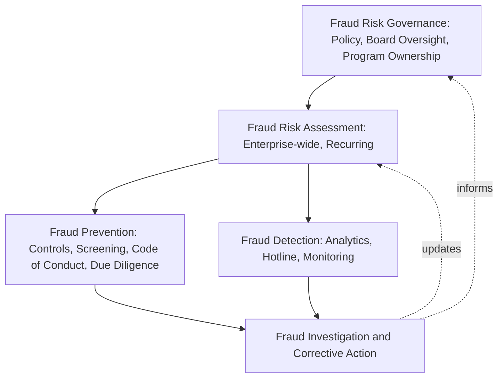

## Enterprise Fraud Risk Management Programs

### Overview

Enterprise fraud risk management (ERM-aligned fraud program) refers to an organization-wide, integrated approach to managing fraud risk that connects governance, risk assessment, prevention, detection, and response into a single coordinated program rather than a collection of disconnected initiatives. Where earlier chapters addressed individual components — risk assessment methodology, specific control design, whistleblower hotlines, third-party due diligence — an enterprise fraud risk management program is the overarching structure that integrates these components under unified governance, consistent methodology, and coordinated oversight across the entire organization.

### Distinguishing Enterprise Fraud Risk Management from Component Initiatives

**Key Points**

- A mature enterprise fraud risk management program differs from a collection of standalone fraud controls in that it operates under a formal governance structure with defined ownership, applies consistent methodology and risk taxonomy across all business units and geographies, and maintains a centralized (or centrally coordinated) view of fraud risk that informs resource allocation across the entire organization rather than within isolated silos.
- [Inference] Because fraud schemes frequently exploit gaps at the boundaries between organizational functions or business units (e.g., a scheme spanning procurement and treasury, or exploiting inconsistent controls between a newly acquired subsidiary and the parent organization), an enterprise-level (rather than purely business-unit-level) perspective is often considered necessary to identify and address risks that would not be visible from any single function's localized view.
- Enterprise fraud risk management is typically positioned as a component of, or closely coordinated with, the organization's broader Enterprise Risk Management (ERM) program, reflecting the reality that fraud risk is one category within the organization's total risk universe alongside operational, strategic, financial, and compliance risks.

### The Five Principles of Fraud Risk Management (COSO/ACFE Guide) as the Program Foundation

**Key Points**

- As introduced in the discussion of COSO fraud risk management principles, the COSO/ACFE *Fraud Risk Management Guide* articulates five principles — Fraud Risk Governance, Fraud Risk Assessment, Fraud Prevention, Fraud Detection, and Fraud Investigation and Corrective Action — that collectively define the structural components an enterprise fraud risk management program is expected to address.
- An enterprise program operationalizes these five principles not as sequential, one-time activities but as an integrated, continuously operating cycle, with governance structures ensuring that outputs from each principle area (e.g., risk assessment findings, detection analytics results, investigation outcomes) feed back into and inform the others.

### Governance Structure: Roles and Accountability

**Key Points**

- Effective enterprise fraud risk management programs designate clear accountability at multiple organizational levels: **board/audit committee oversight** (setting risk appetite, receiving periodic program reporting, overseeing management's fraud risk management responsibilities per COSO Principle 2), **executive program ownership** (frequently a Chief Compliance Officer, Chief Audit Executive, General Counsel, or a dedicated Chief Risk Officer holding overall program accountability), and **business unit/process-level ownership** (individual risk owners accountable for specific identified risks and associated control remediation, as reflected in the fraud risk register discussed under prioritization and documentation).
- Many organizations establish a **fraud risk management committee** or similar cross-functional governance body (typically including representation from internal audit, legal/compliance, finance, HR, and IT security) to coordinate program activities, review enterprise-wide risk assessment results, and oversee significant investigations, providing a forum for cross-functional risk visibility that individual business units cannot achieve in isolation.
- A formally documented and board-approved **fraud risk management policy** typically articulates the program's objectives, governance structure, roles and responsibilities, and the organization's overall risk appetite and tolerance for fraud risk, serving as the foundational governance document from which subsequent program elements derive authority.

### Enterprise-Wide Risk Assessment Coordination

**Key Points**

- Rather than conducting isolated, business-unit-specific fraud risk assessments using inconsistent methodology, an enterprise program applies a **standardized risk assessment methodology and taxonomy** (commonly built on the ACFE Fraud Tree and COSO Principle 8 guidance, as previously discussed) consistently across all business units, subsidiaries, and geographies, enabling meaningful risk aggregation and comparison at the enterprise level.
- Enterprise-level risk assessment coordination typically involves a **centralized risk assessment calendar and process**, ensuring that individual business unit assessments occur on a coordinated schedule and that results are rolled up into a consolidated enterprise fraud risk register presented to the fraud risk management committee and, for the highest-priority enterprise-wide risks, the audit committee.
- The enterprise view enables identification of **cross-cutting risks** that might not reach a "high priority" threshold within any single business unit's isolated assessment but that, when aggregated across the enterprise (e.g., a common control gap replicated across multiple decentralized locations), represent a materially significant enterprise-wide exposure.

### Integrating Prevention and Detection Programs at the Enterprise Level

**Key Points**

- Enterprise fraud risk management programs typically establish **minimum baseline control standards** applicable across all business units (e.g., mandatory segregation of duties requirements, minimum authorization thresholds, required vendor due diligence tiers) while allowing for business-unit-specific control customization above the established baseline where local risk factors warrant.
- **Centralized or centrally coordinated detection capabilities** — enterprise-wide data analytics monitoring, a single enterprise whistleblower hotline serving all business units and geographies, and consistent case management protocols — support both operational efficiency and the ability to identify patterns spanning multiple business units that would not be visible through fragmented, business-unit-specific detection systems.
- [Unverified] The specific degree of centralization versus business-unit autonomy in control and detection program design varies considerably based on organizational structure (e.g., highly decentralized holding company structures versus centrally managed operating companies), so the appropriate balance is organization-specific rather than governed by a single universal model.

### Investigation Protocols and Corrective Action Coordination

**Key Points**

- An enterprise program establishes a **consistent investigation protocol** applicable regardless of where within the organization a suspected fraud arises, including standardized case intake, evidence preservation, investigation methodology, and documentation standards (connecting to the broader objectivity and defensibility principles discussed in reporting findings).
- A **coordinated escalation framework** specifies criteria for when a business-unit-level matter must be escalated to enterprise-level governance (the fraud risk management committee, General Counsel, or audit committee), commonly triggered by factors such as dollar magnitude, involvement of senior management, potential regulatory/legal exposure, or cross-business-unit scope.
- **Lessons-learned integration** — systematically feeding root cause findings from completed investigations back into the enterprise risk assessment and control design process — closes the loop between the Investigation and Corrective Action principle and the Risk Assessment and Prevention principles, ensuring that identified control failures inform enterprise-wide (not merely local) remediation where the underlying vulnerability may exist elsewhere in the organization.

### Program Maturity Assessment

**Key Points**

- Organizations commonly assess enterprise fraud risk management program maturity along a spectrum, from ad hoc/reactive (fraud addressed only after specific incidents, with no formal enterprise structure) through developing (some formal elements exist but are inconsistently applied or siloed by business unit) to mature/integrated (a fully governed, consistently applied, continuously operating program with demonstrated feedback loops between all five principle areas).
- [Inference] Because maturity assessment inherently involves qualitative judgment about the consistency, integration, and demonstrated effectiveness of program elements rather than a purely objective measurement, many practitioners use maturity assessment primarily as an internal benchmarking and improvement-planning tool rather than as a standardized external certification, since no single universally recognized maturity rating framework governs fraud risk management programs analogous to, for example, formal quality management certification standards.
- Common maturity indicators include: existence of a board-approved fraud risk management policy, consistency of risk assessment methodology across business units, degree of centralized detection capability and case management, documented feedback loops between investigation findings and risk assessment updates, and the frequency and substantive depth of board/audit committee fraud risk reporting.

### Reporting to the Board and Audit Committee

**Key Points**

- Enterprise fraud risk management program reporting to the board or audit committee typically includes: a periodic (commonly annual, though the highest-priority items may be reported more frequently) summary of the enterprise fraud risk register and any significant changes since the prior reporting period, hotline/whistleblower activity trends, summary of significant investigations and outcomes (with appropriate privilege and confidentiality safeguards), status of remediation efforts for previously identified control gaps, and an overall assessment of the program's operating effectiveness.
- Given the board's oversight responsibility under COSO Principle 2, reporting should be structured to enable meaningful board engagement and challenge rather than serving merely as an informational summary, supporting the board's ability to fulfill its governance role regarding fraud risk.

### Common Pitfalls in Enterprise Fraud Risk Management Program Design

**Key Points**

- Building an enterprise program as a paper governance structure (policy documents and organizational charts) without genuine operational integration, resulting in business units continuing to operate largely independent, inconsistent fraud risk practices despite the formal enterprise framework.
- Failing to establish meaningful feedback loops between investigation outcomes and risk assessment/control design updates, causing the same root cause vulnerabilities to recur across different business units or over time.
- Over-centralizing program design without sufficient flexibility for legitimate business-unit-specific risk factors, resulting in either excessive control burden in lower-risk areas or insufficiently tailored controls in higher-risk specialized areas.
- Inconsistent escalation practices, where genuinely significant matters are handled at the business-unit level without appropriate enterprise-level visibility, undermining the audit committee's ability to fulfill its oversight responsibility.
- Treating program maturity assessment as a one-time exercise rather than a periodic self-assessment used to drive continuous program improvement.

### Example

A multinational company with operations across 15 countries establishes an enterprise fraud risk management program following a significant fraud incident at one subsidiary that revealed the absence of any consistent fraud risk methodology across the organization's decentralized business units. The company's General Counsel is designated as executive program owner, supported by a newly formed fraud risk management committee including representatives from internal audit, compliance, finance, and regional business unit leadership. A board-approved fraud risk management policy establishes minimum baseline control standards (mandatory segregation of duties requirements, standardized vendor due diligence tiers, and a single enterprise-wide whistleblower hotline replacing several previously fragmented, inconsistent local reporting mechanisms). A standardized enterprise-wide risk assessment methodology, built on the ACFE Fraud Tree taxonomy, is rolled out across all business units on a coordinated annual calendar, with results consolidated into a single enterprise fraud risk register presented quarterly to the fraud risk management committee and annually in detail to the audit committee. When a subsequent investigation at a different subsidiary identifies a similar vendor master file governance gap to the one that triggered the original incident, the enterprise program's lessons-learned protocol triggers a review of vendor master file controls across all business units rather than remediation limited to the single affected subsidiary — directly demonstrating the enterprise-level integration and feedback loop distinguishing this program from the organization's prior fragmented, business-unit-siloed approach.

### Related Topics

- COSO fraud risk management principles and the five-principle framework
- Fraud risk assessment frameworks and enterprise-wide methodology standardization
- Board and audit committee fraud risk oversight responsibilities
- Whistleblower programs and centralized hotline design
- Linking fraud risk assessment to control testing
- Investigation protocols and escalation frameworks