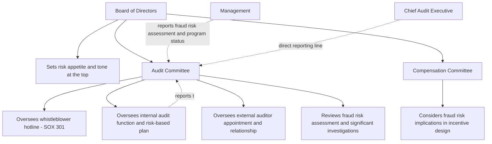

## Role of the Board and Audit Committee

### Overview

The role of the board and audit committee in fraud risk management encompasses the ultimate governance oversight responsibility for ensuring management establishes, maintains, and operates an effective fraud risk management program. While management holds primary responsibility for designing and executing fraud prevention, detection, and response processes, the board — and the audit committee specifically, as the board's typical delegate for this function — bears fiduciary oversight responsibility for ensuring these processes are adequate, are actually functioning, and receive appropriate resources and attention.

### Foundational Governance Principle: Oversight, Not Execution

**Key Points**

- A foundational distinction in corporate governance separates management's responsibility for **designing and operating** internal controls (including fraud risk management processes) from the board's responsibility for **overseeing** management's performance of that function — the board does not itself perform fraud risk assessments or design controls, but is responsible for ensuring management does so effectively.
- This oversight-versus-execution distinction is explicitly reflected in COSO's Internal Control–Integrated Framework **Principle 2**: "The board of directors demonstrates independence from management and exercises oversight of the development and performance of internal control," which encompasses fraud risk management as a component of the overall internal control system.
- [Inference] Because the board's oversight role is necessarily premised on the information management provides to it, many governance practitioners emphasize that the quality and independence of information flow to the board — including direct access to internal audit, compliance, and whistleblower hotline data without exclusive filtering through the executives whose performance is being overseen — is itself a critical element of effective board oversight capability.

### Audit Committee as the Board's Primary Delegate for Fraud Oversight

**Key Points**

- While the full board retains ultimate responsibility, the audit committee typically serves as the board's designated committee for direct oversight of financial reporting integrity, internal control effectiveness, and fraud risk management, reflecting both stock exchange listing requirements (for public companies) and general governance best practice.
- For U.S. public companies, applicable stock exchange listing standards (NYSE and Nasdaq) and SEC rules under the Sarbanes-Oxley Act establish specific audit committee composition and responsibility requirements, including independence requirements for audit committee members and a requirement that the audit committee be directly responsible for the appointment, compensation, and oversight of the external auditor.
- [Unverified] Specific audit committee composition, independence, and financial expertise requirements are governed by detailed SEC rules and stock exchange listing standards that are periodically updated, so current specific requirements should be verified against the applicable exchange's current listing standards and SEC rules rather than assumed static.
- Some organizations establish a separate risk committee or delegate certain fraud-related oversight to other board committees (e.g., a compliance committee), but the audit committee generally retains primary responsibility for financial statement fraud risk oversight given its direct relationship with the external auditor and financial reporting process.

### Specific Audit Committee Fraud Oversight Responsibilities

**Key Points**

- **Reviewing management's fraud risk assessment:** the audit committee typically reviews the results of management's periodic enterprise fraud risk assessment, including the prioritized fraud risk register, and challenges management's risk ratings and proposed responses where warranted.
- **Overseeing whistleblower hotline function:** the audit committee, under SEC rules implementing Sarbanes-Oxley Section 301, is specifically required to establish procedures for the receipt, retention, and treatment of complaints regarding accounting, internal accounting controls, or auditing matters, and for confidential, anonymous submission of employee concerns regarding questionable accounting or auditing matters — making hotline oversight a distinct, statutorily grounded audit committee function rather than a general best practice alone.
- **Overseeing the internal audit function:** the audit committee typically oversees the internal audit function's charter, resourcing, and risk-based audit plan (including the fraud risk-informed testing scope discussed in linking fraud risk assessment to control testing), and often has direct reporting line authority over the Chief Audit Executive independent of management.
- **Overseeing the external audit relationship:** the audit committee is directly responsible for appointing, compensating, and overseeing the external auditor, including discussing the external auditor's fraud risk assessment and any identified fraud risk factors or control deficiencies arising from the audit.
- **Reviewing significant investigations:** the audit committee typically receives reporting on significant fraud investigations (particularly those involving senior management, material financial impact, or potential regulatory/legal exposure), and in some cases directly oversees or commissions independent investigations, particularly where management itself may be implicated.
- **Assessing management override risk:** given management's unique capability to override otherwise effective controls, the audit committee bears particular responsibility for scrutinizing unusual or significant transactions, management estimates and judgments, and any indicators suggesting inappropriate management influence over the financial reporting process.

### Board-Level Responsibilities Beyond the Audit Committee

**Key Points**

- The full board retains overall responsibility for setting the organization's **risk appetite and tone at the top**, including explicit commitment to ethical conduct and zero tolerance for fraud, which cascades through the organization's control environment (COSO Principle 1).
- Board involvement in **executive compensation design** carries fraud risk implications, since compensation structures creating excessive pressure tied to specific financial metrics can themselves constitute a fraud risk factor under the Fraud Triangle's "pressure/incentive" element; compensation committees (a distinct board committee) accordingly bear some responsibility for considering fraud risk implications in incentive plan design.
- The board's role in **CEO and senior executive succession and performance evaluation** provides a mechanism for addressing management override risk at the most senior organizational level, since the board (rather than management itself) holds ultimate authority over senior executive accountability.
- Boards of organizations with elevated fraud risk profiles (financial institutions, government contractors, multinational companies with FCPA exposure) may establish specialized board-level expertise or dedicated committees addressing sector-specific risk (e.g., a dedicated compliance or risk committee alongside the audit committee).

### Governance Structure Diagram

### Legal and Regulatory Basis for Board/Audit Committee Fraud Oversight

**Key Points**

- Beyond COSO framework guidance, board and audit committee fraud oversight responsibility derives from state corporate law fiduciary duty principles (duty of care and, in some jurisdictions, an articulated duty of oversight, sometimes referenced in case law addressing director liability for failure of oversight systems), federal securities law requirements (Sarbanes-Oxley Act provisions, SEC rules), and stock exchange listing standards.
- [Unverified] The specific legal standard governing director oversight liability (sometimes referenced by practitioners in connection with Delaware case law addressing board-level monitoring systems, though specific case citations and evolving legal standards require current legal research) varies by jurisdiction and continues to develop through case law, so specific director liability questions should be directed to qualified corporate governance counsel rather than treated as settled by general reference here.
- For SEC-registered companies, management's assessment of internal control over financial reporting under Sarbanes-Oxley Section 404, which explicitly incorporates fraud risk consideration through COSO Principle 8, is itself subject to audit committee review as part of the financial reporting oversight function.

### Board and Audit Committee Reporting Expectations

**Key Points**

- Effective board/audit committee fraud oversight depends on receiving substantive, timely reporting from management — not merely summary assurances — including the enterprise fraud risk register and any significant changes, whistleblower hotline activity trends and significant case outcomes, internal audit findings related to fraud risk, and status updates on remediation of previously identified control gaps.
- The audit committee's ability to fulfill its oversight role is generally considered dependent on having **direct, unfiltered access** to key control functions — private sessions with the Chief Audit Executive, external auditor, and General Counsel without management present are a common governance practice supporting the audit committee's ability to receive candid input independent of management's potential self-interest in downplaying identified issues.
- Reporting frequency and depth are commonly calibrated to risk significance: routine program status updates might occur quarterly or annually, while significant investigations or emerging high-priority risks typically warrant more immediate, ad hoc reporting outside the standard reporting calendar.

### Common Pitfalls in Board and Audit Committee Fraud Oversight

**Key Points**

- Receiving only high-level, reassuring summary reporting from management without sufficient detail or challenge to enable genuine oversight, effectively rubber-stamping management's self-assessment rather than exercising independent scrutiny.
- Inadequate audit committee financial expertise or insufficient time allocated to fraud risk topics within a broader, crowded audit committee agenda, limiting the depth of genuine engagement possible.
- Lack of direct, private access to internal audit, external audit, and compliance functions, leaving the audit committee dependent entirely on management-filtered information flow.
- Insufficient scrutiny of management override risk specifically, given the natural tendency to extend trust to senior executives with whom board members have an ongoing working relationship.
- Failing to ensure adequate resourcing (budget, staffing, authority) for the internal audit and compliance functions that provide the audit committee's primary independent assurance mechanisms.
- Treating whistleblower hotline oversight (a specific statutory audit committee responsibility under SOX Section 301) as a delegated management function without direct audit committee visibility into aggregate hotline data and significant case outcomes.

### Example

A public company's audit committee, in fulfilling its fraud risk oversight responsibility, establishes a structured annual calendar including: a dedicated agenda session reviewing management's updated enterprise fraud risk register with direct questioning of the Chief Audit Executive regarding methodology and risk rating rationale, a quarterly summary of whistleblower hotline activity presented directly by the compliance function (consistent with the committee's SOX Section 301 responsibility), a private session with the external auditor discussing any fraud risk factors identified during the audit without management present, and an annual private session with the Chief Audit Executive assessing internal audit's resourcing adequacy and any instances where management resistance affected audit scope or access. When a significant investigation arises involving a regional finance director's potential involvement in a fraud scheme, the audit committee, recognizing the management override risk implications and the individual's proximity to the finance organization's normal reporting chain, directs that the investigation be conducted by outside counsel reporting directly to the audit committee rather than through the normal internal audit reporting line to the CFO — reflecting the committee's active exercise of independent oversight authority rather than passive reliance on management's standard investigation process.

### Related Topics

- Enterprise fraud risk management programs and governance structure
- COSO fraud risk management principles (Principle 2: Board Oversight)
- Whistleblower programs and Sarbanes-Oxley Section 301 requirements
- Management override of controls as a distinct oversight focus area
- Sarbanes-Oxley Section 404 internal control over financial reporting
- Director fiduciary duty and oversight liability considerations