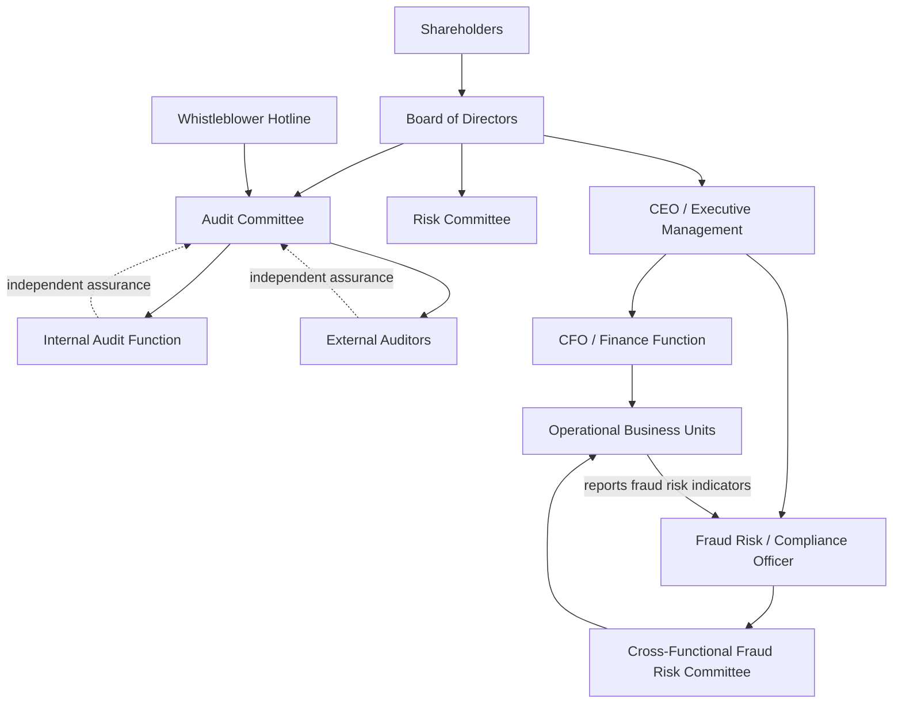

## Governance Structures for Fraud Oversight

### Overview

Governance structures for fraud oversight refer to the formal system of bodies, roles, reporting lines, and control mechanisms that an organization establishes to prevent, deter, detect, and respond to fraud. These structures operationalize the "tone at the top" concept and distribute fraud-related responsibilities across the board, management, internal audit, and specialized committees so that no single individual or function has unchecked authority over financial reporting or asset custody.

### Conceptual Foundation

**Key Points**

- Governance for fraud oversight rests on the separation of three lines of defense: operational management (first line), risk/compliance functions (second line), and internal audit (third line).
- The board of directors, particularly through its audit committee, holds ultimate oversight responsibility for the integrity of financial reporting and the fraud risk management program.
- Effective governance structures are designed around the Fraud Triangle (pressure, opportunity, rationalization) and the COSO Enterprise Risk Management (ERM) Framework, which explicitly embeds fraud risk assessment as a component of internal control.
- The COSO 2013 Internal Control–Integrated Framework, Principle 8, requires that "the organization considers the potential for fraud in assessing risks to the achievement of objectives." This is a documented framework requirement rather than an inference.

### Core Governance Bodies

#### 1. Board of Directors

The board is the apex of the governance structure. Its fraud oversight duties typically include:

- Setting the ethical tone and approving a code of conduct.
- Approving the overall risk appetite, including fraud risk tolerance.
- Ensuring management has designed an adequate system of internal controls.
- Receiving periodic reports on fraud risk assessments, whistleblower activity, and investigation outcomes.

[Inference] The specific frequency and depth of board-level fraud reporting varies significantly by jurisdiction, industry regulation, and company size; no single universal standard mandates a fixed cadence.

#### 2. Audit Committee

A subcommittee of the board, usually composed of independent, financially literate directors. Core responsibilities:

- Overseeing the external audit relationship, including auditor independence.
- Overseeing the internal audit function's charter, budget, and reporting line (functionally to the audit committee, administratively to the CEO/CFO).
- Reviewing significant accounting estimates and judgments prone to manipulation (e.g., revenue recognition, reserves, impairment).
- Maintaining a whistleblower hotline and reviewing complaints related to accounting, internal controls, or auditing matters — a requirement under Sarbanes-Oxley Section 301 for U.S. listed companies.

#### 3. Management (Executive Level)

Management, led by the CEO and CFO, is responsible for the day-to-day design and operation of internal controls. Under Sarbanes-Oxley Section 302 and 404, CEOs and CFOs must personally certify the accuracy of financial statements and the effectiveness of internal controls over financial reporting (ICFR).

#### 4. Internal Audit Function

Internal audit provides independent, objective assurance over the fraud risk management program. Its structural independence is preserved through:

- A dual reporting line: functional reporting to the audit committee (for objectivity), administrative reporting to management (for day-to-day operations).
- A charter defining scope, authority, and access to records, personnel, and physical properties relevant to any engagement, including fraud investigations.

#### 5. Fraud Risk / Compliance Officer and Fraud Risk Committee

Many organizations, particularly larger or regulated ones, establish a dedicated fraud risk management function or cross-functional fraud risk committee comprising representatives from finance, legal, HR, IT security, and internal audit. This committee typically:

- Conducts periodic fraud risk assessments mapped against business processes.
- Maintains a fraud risk register.
- Coordinates investigation protocols when allegations arise.

#### 6. External Auditors

While not part of internal governance, external auditors interact directly with the governance structure. Under auditing standards such as ISA 240 / AU-C 240 ("The Auditor's Responsibilities Relating to Fraud in an Audit of Financial Statements"), external auditors must maintain professional skepticism, discuss fraud risk with those charged with governance, and evaluate management override of controls as a presumed risk in every audit.

### Governance Structure Diagram

### The Three Lines of Defense Model Applied to Fraud

| Line | Function | Fraud Oversight Role |
| --- | --- | --- |
| First Line | Operational management, process owners | Day-to-day control execution: segregation of duties, authorization limits, reconciliations |
| Second Line | Risk management, compliance, fraud risk officer | Designs fraud risk assessment methodology, monitors control effectiveness, maintains fraud risk register |
| Third Line | Internal audit | Independently tests controls, investigates allegations, reports findings to audit committee |

**Example**

A mid-sized manufacturing company implements the following structure: the audit committee meets quarterly and reviews a fraud risk dashboard prepared by the compliance officer. The dashboard flags that journal entries posted by the controller near period-end have increased 40% quarter-over-quarter. Internal audit, reporting functionally to the audit committee, is tasked with performing a targeted review of manual journal entries. This illustrates how the governance layers interact: second-line monitoring identifies an anomaly, the audit committee directs action, and third-line assurance performs the independent test — all without the controller (first line) being able to suppress the inquiry, since internal audit's reporting line bypasses executive management.

### Regulatory and Framework Anchors

- **Sarbanes-Oxley Act (2002)**: Sections 301 (audit committee responsibilities, whistleblower mechanisms), 302 (officer certifications), 404 (management assessment of ICFR), and 406 (code of ethics for senior financial officers).
- **COSO ERM Framework (2017 update)**: Integrates fraud risk into the broader enterprise risk management structure, linking governance, strategy, and performance.
- **COSO Fraud Risk Management Guide (2016, co-published with ACFE)**: Establishes five principles of fraud risk governance, including that the organization should establish a Fraud Risk Management Policy as part of its governance structure.
- **IIA International Professional Practices Framework (IPPF)**: Defines internal audit's role and required independence in fraud-related engagements.

[Unverified] Specific regulatory requirements vary by jurisdiction outside the United States (e.g., UK Corporate Governance Code, EU Audit Directive); organizations operating multinationally should map local statutory requirements separately rather than assuming U.S.-centric rules apply uniformly.

### Whistleblower and Reporting Mechanisms as a Governance Layer

An effective governance structure for fraud oversight is incomplete without a protected reporting channel:

- Anonymous hotline or web-based reporting tool, typically operated by a third party to preserve anonymity.
- A documented escalation protocol specifying who receives complaints (commonly routed directly to the audit committee chair or general counsel to avoid management interference).
- Non-retaliation policies, which in the U.S. are reinforced by whistleblower protections under SOX Section 806 and Dodd-Frank.

### Common Structural Weaknesses (Red Flags in Design)

- Internal audit reporting solely to the CFO (compromises independence, since the CFO is often the party best positioned to override controls).
- Audit committee members lacking financial literacy or sufficient independence from management.
- Absence of a documented fraud risk assessment process separate from the general enterprise risk assessment.
- Fraud risk committee existing on paper but not meeting regularly or lacking authority to escalate findings directly to the board.

**Conclusion**

Governance structures for fraud oversight function as a layered defense system in which independence of reporting lines — particularly for internal audit and whistleblower channels — is the structural feature that most directly determines whether fraud is likely to be detected and escalated rather than concealed. The audit committee sits at the structural center, receiving assurance inputs from internal audit, external audit, and compliance functions while maintaining a reporting line that bypasses operational management.

**Related Topics**

- Fraud risk assessment methodologies and the fraud risk register
- Management override of controls and auditor responses under ISA 240
- Whistleblower protection frameworks (SOX 806, Dodd-Frank)
- Segregation of duties as a preventive control
- COSO Fraud Risk Management Guide's five principles
- Forensic accounting engagement protocols following governance-triggered investigations
- Board financial literacy requirements and audit committee composition rules