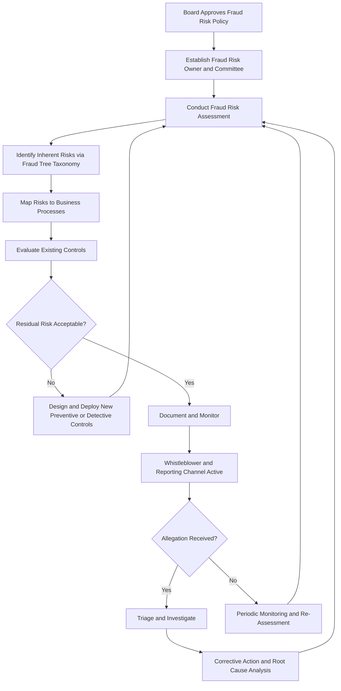

## Fraud Risk Management Guide Implementation

### Overview

The Fraud Risk Management Guide, co-published by COSO and the Association of Certified Fraud Examiners (ACFE) in 2016, provides the leading framework for designing, implementing, and evaluating a fraud risk management (FRM) program. Implementation refers to the practical process of translating the Guide's five principles into operational policies, structures, and controls within an organization. This is distinct from governance structures in isolation (the "who"); implementation focuses on the "how" — the program lifecycle, documentation artifacts, and continuous improvement cycle.

### The Five Principles of the COSO/ACFE Fraud Risk Management Guide

**Key Points**

1. **Principle 1 — Fraud Risk Governance**: The organization establishes and communicates a Fraud Risk Management Policy demonstrating the expectations of the board and senior management regarding fraud.
2. **Principle 2 — Fraud Risk Assessment**: The organization performs comprehensive fraud risk assessments to identify specific fraud risks, assess likelihood and significance, evaluate existing controls, and implement actions to mitigate residual risk.
3. **Principle 3 — Fraud Control Activities**: The organization selects, develops, and deploys preventive and detective fraud control activities to mitigate the impact of fraud risks not otherwise avoided or transferred.
4. **Principle 4 — Fraud Investigation and Corrective Action**: The organization establishes a communication process to obtain information about potential fraud and deploys a coordinated approach to investigation and corrective action.
5. **Principle 5 — Fraud Risk Management Monitoring Activities**: The organization selects, develops, and performs ongoing evaluations to ascertain whether each of the five principles is present and functioning, communicating FRM program deficiencies in a timely manner.

These five principles are documented directly in the COSO/ACFE Guide and are not an inference; they are structured to align with the five components of the broader COSO 2013 Internal Control Framework (Control Environment, Risk Assessment, Control Activities, Information & Communication, Monitoring Activities).

### Implementation Lifecycle

#### Phase 1: Program Charter and Policy Development (Principle 1)

- Draft a **Fraud Risk Management Policy** approved by the board, defining scope, objectives, roles, and a zero-tolerance statement.
- Establish or designate a **Fraud Risk Owner** (often the Chief Compliance Officer, Chief Audit Executive, or a dedicated Fraud Risk Manager) with a documented charter.
- Define escalation thresholds — dollar amounts or risk severities that trigger board notification.

#### Phase 2: Fraud Risk Assessment (Principle 2)

The core analytical exercise. Standard implementation steps:

1. **Identify inherent fraud risks** across three categories: financial reporting fraud, asset misappropriation, and corruption (bribery, conflicts of interest).
2. **Map risks to business processes** (procurement, payroll, revenue recognition, treasury, expense reimbursement).
3. **Assess likelihood and impact**, typically on a qualitative scale (e.g., Low/Medium/High) or a quantitative scoring matrix.
4. **Identify the fraud scheme** using a taxonomy such as the ACFE's Fraud Tree (Occupational Fraud Classification System), which segments fraud into Asset Misappropriation, Corruption, and Financial Statement Fraud.
5. **Evaluate existing controls** against each identified risk to determine residual risk.
6. **Respond to residual risk** — accept, avoid, transfer (e.g., fidelity insurance), or mitigate through new controls.

**Example**

A regional utility company implementing the Guide identifies "fictitious vendor creation combined with fraudulent invoice approval" as a high-likelihood, high-impact risk within accounts payable. The existing control — single-level manager approval — is assessed as inadequate. The mitigation response adds: (a) a three-way match between purchase order, receiving report, and invoice, (b) a vendor master file change log reviewed monthly by an independent party, and (c) data analytics screening for vendors sharing addresses or bank details with employees.

#### Phase 3: Fraud Control Activities Deployment (Principle 3)

Controls are generally categorized as:

- **Preventive controls**: segregation of duties, authorization matrices, pre-employment background checks, vendor due diligence.
- **Detective controls**: exception reporting, continuous auditing/data analytics, surprise audits, account reconciliations, whistleblower hotlines.

[Inference] The optimal ratio of preventive to detective controls is context-dependent on industry, control environment maturity, and cost constraints; the Guide does not prescribe a fixed ratio.

#### Phase 4: Investigation and Corrective Action Protocol (Principle 4)

Implementation requires a documented, pre-approved investigation protocol, typically including:

- Intake procedures for allegations (hotline, direct report, audit finding).
- A triage process to determine investigation scope and assign investigators (internal audit, legal, external forensic accountants for complex matters).
- Evidence preservation procedures (litigation hold, forensic imaging of devices) to maintain chain of custody.
- Defined outcomes: disciplinary action, restitution, referral to law enforcement, or civil litigation.
- Root-cause analysis feeding back into the control environment (closing the loop to Principle 3).

#### Phase 5: Monitoring (Principle 5)

- Periodic re-performance of the fraud risk assessment (commonly annual, or triggered by significant business changes such as M&A, new systems, or geographic expansion).
- Internal audit testing of fraud controls as part of the annual audit plan.
- Management self-assessments and control attestations.
- Key Risk Indicator (KRI) dashboards reported to the fraud risk committee and audit committee.

### Implementation Process Flow

### Key Implementation Artifacts

| Artifact | Purpose | Owner |
| --- | --- | --- |
| Fraud Risk Management Policy | Board-approved statement of intent and scope | Board / Audit Committee |
| Fraud Risk Register | Living document listing identified risks, controls, residual risk ratings | Fraud Risk Officer |
| Fraud Risk Assessment Matrix | Likelihood x impact scoring per identified scheme | Fraud Risk Committee |
| Investigation Protocol Manual | Step-by-step response procedures | Legal / Internal Audit |
| KRI Dashboard | Ongoing monitoring metrics reported to audit committee | Compliance Function |

### Integration with the ACFE Fraud Tree

Implementation typically uses the ACFE's Occupational Fraud Classification System as the risk identification taxonomy:

- **Asset Misappropriation**: Cash theft, skimming, larceny, fraudulent disbursements (billing schemes, payroll schemes, expense reimbursement schemes, check tampering).
- **Corruption**: Bribery, illegal gratuities, economic extortion, conflicts of interest.
- **Financial Statement Fraud**: Overstatement or understatement of assets, revenues, or expenses; improper disclosures.

[Unverified] The relative prevalence of each fraud category (commonly cited in ACFE's biennial "Report to the Nations") shifts across survey years and industries; organizations should reference the most current ACFE report rather than assuming static percentages hold indefinitely.

### Common Implementation Pitfalls

- Treating the fraud risk assessment as a one-time compliance exercise rather than an iterative, living process.
- Failing to tailor the ACFE Fraud Tree categories to entity-specific risks (e.g., grant fraud for nonprofits, procurement fraud for government entities).
- Under-resourcing the investigation function, leading to inconsistent evidence handling that undermines subsequent legal or disciplinary action.
- Lack of integration between the fraud risk register and the broader Enterprise Risk Management (ERM) risk register, causing duplicated or conflicting risk ratings.

**Conclusion**

Implementing the COSO/ACFE Fraud Risk Management Guide converts abstract governance intent into an operational, cyclical program: policy establishes intent, risk assessment identifies specific exposures using the Fraud Tree taxonomy, control activities mitigate residual risk, investigation protocols ensure consistent response, and monitoring closes the loop by feeding findings back into reassessment. The five principles are interdependent — deficiency in any one (e.g., a policy that exists on paper without a functioning investigation protocol) compromises the effectiveness of the program as a whole.

**Related Topics**

- ACFE Occupational Fraud Classification System (Fraud Tree) in depth
- Designing a fraud risk register and heat map
- Forensic data analytics for continuous fraud monitoring
- Whistleblower hotline design and case management systems
- Root-cause analysis methodologies in fraud investigations
- Integrating fraud risk assessment with enterprise risk management (ERM)
- ACFE Report to the Nations: benchmarking fraud statistics