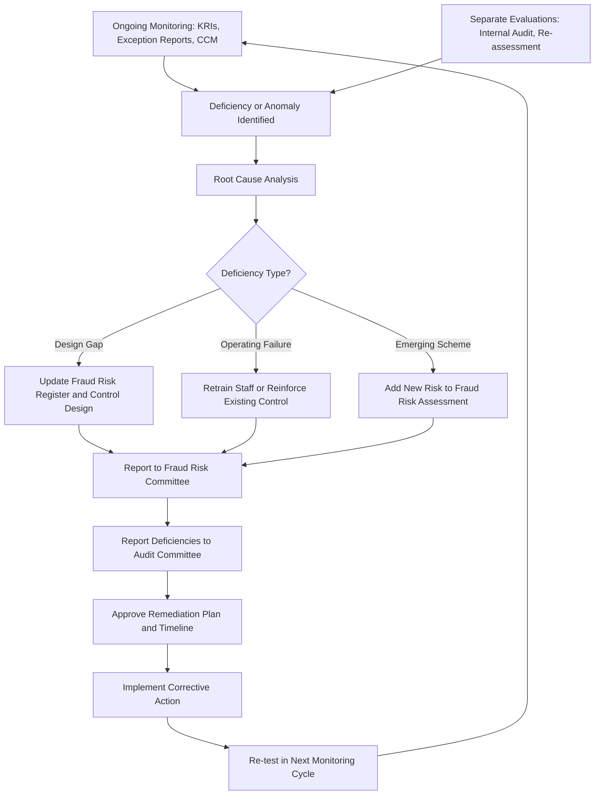

## Monitoring and Continuous Improvement of Anti-Fraud Programs

### Overview

Monitoring and continuous improvement constitutes the fifth and final principle of the COSO/ACFE Fraud Risk Management Guide, but functions as the feedback mechanism that sustains the other four principles over time. Without effective monitoring, a fraud risk management (FRM) program degrades: risk assessments become stale, controls fail silently, and emerging schemes go undetected. This topic covers the mechanisms, metrics, and organizational processes used to evaluate whether an anti-fraud program remains present and functioning, and how findings are fed back to strengthen the program.

### Conceptual Foundation

**Key Points**

- COSO Principle 5 (Fraud Risk Management Guide) requires the organization to select, develop, and perform ongoing evaluations to ascertain whether each of the five FRM principles is present and functioning, and to communicate deficiencies in a timely manner to parties responsible for corrective action.
- Monitoring operates on two levels, consistent with the broader COSO Internal Control Framework: **ongoing monitoring** (built into routine business processes) and **separate evaluations** (periodic, standalone assessments such as internal audits).
- The objective is not merely detecting individual fraud instances but assessing the **design and operating effectiveness** of the entire FRM program.

### Two-Tier Monitoring Model

#### 1. Ongoing Monitoring

Embedded into daily operations and automated where possible:

- **Exception reports**: automated flags for transactions breaching thresholds, unusual timing (e.g., journal entries posted outside business hours), or duplicate payments.
- **Continuous auditing / continuous controls monitoring (CCM)**: scripted data analytics run against 100% of transactions rather than samples, testing for control breaches in near-real time.
- **Management self-assessments**: periodic attestations by process owners confirming controls are operating as designed.
- **Key Risk Indicators (KRIs)**: quantitative metrics tracked over time (e.g., percentage of vendor master file changes reviewed, average days to close whistleblower cases, ratio of manual journal entries to total entries).

#### 2. Separate Evaluations

Periodic, independent assessments performed outside routine operations:

- **Internal audit engagements** specifically scoped to test fraud controls, often informed by the fraud risk register's highest-rated risks.
- **External audit fraud risk procedures** under ISA 240 / AU-C 240, which, while primarily for financial statement audit purposes, can surface control gaps relevant to the FRM program.
- **Fraud risk re-assessment cycles**, typically annual or triggered by a significant business change (mergers, new ERP system, geographic expansion, regulatory change).
- **Benchmarking against external data**, such as the ACFE's biennial Report to the Nations, to validate whether the organization's fraud risk profile and detection methods remain aligned with observed industry trends.

[Inference] The appropriate frequency of separate evaluations depends on organizational risk appetite, regulatory requirements, and prior audit findings; no universal fixed interval applies across all entities.

### The Monitoring-to-Improvement Feedback Loop

Monitoring is only valuable if findings are systematically routed back into program design. The standard feedback cycle:

### Governance Reporting Structure for Monitoring Results

| Reporting Level | Frequency (typical) | Content |
| --- | --- | --- |
| Process owners to Fraud Risk Officer | Monthly | Exception report summaries, control attestations |
| Fraud Risk Officer to Fraud Risk Committee | Quarterly | KRI dashboard, emerging risk flags, investigation status |
| Fraud Risk Committee to Audit Committee | Quarterly or semi-annual | Program-level deficiencies, remediation status, benchmarking results |
| Internal Audit to Audit Committee | Per audit plan (often annual for high-risk areas) | Independent test results on fraud control design and operation |

[Inference] Reporting frequencies shown above reflect common practice observed across mid-to-large organizations; smaller entities or those in lightly regulated industries may adopt less formal or less frequent cadences.

### Continuous Improvement Techniques

#### Root Cause Analysis (RCA)

When a control failure or fraud incident is identified, RCA determines whether the failure stems from:

- **Design deficiency**: the control, even if operating exactly as designed, would not have prevented or detected the fraud.
- **Operating deficiency**: the control was properly designed but not executed as intended (e.g., approver did not actually review supporting documentation).
- **Emerging risk gap**: a new fraud scheme not previously contemplated in the risk assessment.

#### Data Analytics Maturity Progression

Organizations typically mature their monitoring capability along a spectrum:

1. **Reactive**: investigations triggered only by tips or complaints.
2. **Periodic sampling**: internal audit tests samples of transactions on a cyclical basis.
3. **Continuous controls monitoring**: automated scripts test 100% of transactions against defined rules on a scheduled basis (daily/weekly).
4. **Predictive analytics**: statistical or machine-learning models score transactions or entities for fraud likelihood, prioritizing investigation resources.

[Speculation] The extent to which predictive/ML-based fraud scoring has been adopted varies widely by industry and organizational size; smaller entities may rely primarily on rules-based exception reporting rather than predictive models due to cost and data infrastructure constraints.

**Example**

A hospital system's continuous controls monitoring script flags that 12% of purchase orders in the past quarter were split into amounts just below the $10,000 approval threshold — a classic "invoice splitting" red flag. Internal audit performs a separate evaluation, confirming the pattern is concentrated in one department. Root cause analysis reveals a design deficiency: the approval workflow did not aggregate purchase orders from the same vendor within a rolling 30-day window. The fraud risk register is updated to reflect this specific scheme, the ERP system's controls are reconfigured to aggregate vendor spend, and the revised control is scheduled for re-testing in the next quarterly monitoring cycle — closing the loop from detection to design improvement.

### Metrics Commonly Used to Evaluate FRM Program Health

- Number of substantiated vs. unsubstantiated fraud allegations (trend over time).
- Average time from allegation intake to investigation closure.
- Percentage of identified control deficiencies remediated within target timelines.
- Whistleblower hotline usage rate and anonymity retention rate.
- Coverage ratio: percentage of high-risk processes subjected to continuous controls monitoring vs. periodic sampling only.
- Recurrence rate of previously remediated deficiencies (a high recurrence rate signals superficial rather than root-cause remediation).

### Common Weaknesses in Monitoring and Improvement Processes

- Monitoring limited to compliance "checkbox" attestations without substantive testing.
- KRIs tracked but never reviewed by a committee with authority to act.
- Root cause analysis stopping at "employee error" without probing underlying control design gaps.
- Fraud risk register not updated after investigations conclude, causing the same scheme to recur undetected.
- Continuous controls monitoring rules never recalibrated as business processes or systems change, causing rule decay and rising false-negative rates.

**Conclusion**

Monitoring and continuous improvement transforms a fraud risk management program from a static, point-in-time compliance artifact into an adaptive system. The two-tier structure — ongoing monitoring embedded in daily operations paired with periodic separate evaluations — generates the data needed to detect both individual control failures and systemic weaknesses. The critical success factor is not the sophistication of detection tools alone, but whether a disciplined feedback loop exists to route root-cause findings back into risk register updates, control redesign, and audit committee oversight, ensuring the program evolves alongside emerging fraud schemes.

**Related Topics**

- Continuous controls monitoring (CCM) system design and rule calibration
- Root cause analysis methodologies in internal audit
- Key Risk Indicator (KRI) design for fraud programs
- Predictive analytics and machine learning in fraud detection
- Internal audit's role in independent fraud control testing
- ACFE Report to the Nations as an external benchmarking tool
- Remediation tracking and audit committee reporting cadence