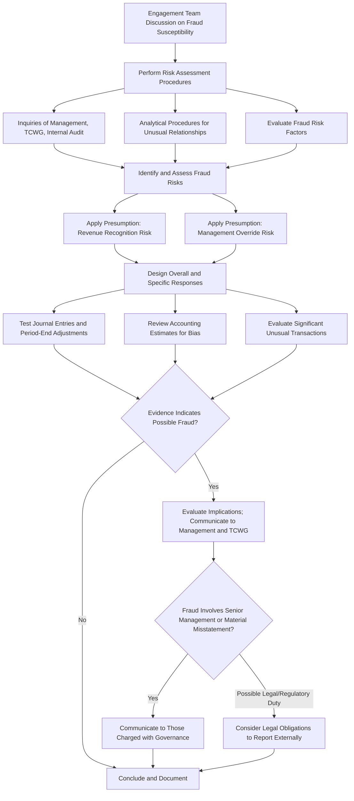

## External Auditor Responsibilities Under Professional Standards

### Overview

External auditor responsibilities for fraud are codified primarily in international and U.S. auditing standards: ISA 240 ("The Auditor's Responsibilities Relating to Fraud in an Audit of Financial Statements") issued by the IAASB, and its U.S. counterpart AU-C 240 (AICPA clarified standards) along with PCAOB AS 2401 for issuers. These standards define the scope, limits, and specific procedures auditors must perform, distinguishing the auditor's role from that of management and those charged with governance.

### Foundational Distinction: Responsibility Allocation

**Key Points**

- **Management and those charged with governance** bear primary responsibility for the prevention and detection of fraud, through establishing a strong control environment and culture of honesty (ISA 240, para 4).
- **The external auditor's responsibility** is to obtain **reasonable assurance** that the financial statements as a whole are free from material misstatement, whether caused by fraud or error — not to guarantee fraud detection.
- Reasonable assurance is a high, but not absolute, level of assurance, because of inherent limitations of an audit that affect the auditor's ability to detect material misstatements, particularly those from fraud (ISA 240, para 5).

### Why Fraud Detection Is Inherently Limited for Auditors

ISA 240 explicitly identifies factors that make fraud harder to detect than error:

- Fraud may involve sophisticated and carefully organized schemes designed to conceal it, such as forgery, deliberate failure to record transactions, or intentional misrepresentations to the auditor.
- **Management override of controls** can occur in unpredictable ways.
- Collusion between two or more individuals can make fraud harder to detect than error, since collusion may cause the auditor to believe audit evidence is persuasive when it is, in fact, false.
- The risk of the auditor not detecting a material misstatement from fraud is higher than the risk of not detecting one from error, because fraud involves sophisticated, carefully organized schemes designed to conceal it.

[Inference] The relative difficulty of detecting different fraud schemes (e.g., revenue recognition fraud vs. asset misappropriation) depends heavily on the specific scheme's complexity and the auditor's risk assessment quality; this is not uniformly quantified in the standard itself.

### The Two Types of Misstatement Relevant to Fraud

ISA 240 categorizes fraud-related misstatements into two types:

1. **Fraudulent financial reporting**: intentional misstatements or omissions of amounts or disclosures in financial statements designed to deceive users. Examples include manipulation of accounting records, misrepresentation of transactions, or intentional misapplication of accounting principles.
2. **Misappropriation of assets**: theft of an entity's assets, often accompanied by false or misleading records to conceal the fact that the assets are missing.

### Core Auditor Responsibilities and Required Procedures

#### 1. Professional Skepticism

The auditor must maintain professional skepticism throughout the audit, recognizing the possibility of a material misstatement due to fraud, notwithstanding the auditor's past experience of the honesty and integrity of management and those charged with governance.

#### 2. Engagement Team Discussion

Prior to and during the performance of risk assessment procedures, the engagement team must discuss the susceptibility of the entity's financial statements to material misstatement due to fraud, emphasizing the need to maintain professional skepticism.

#### 3. Risk Assessment Procedures Specific to Fraud

The auditor must perform procedures to obtain information used to identify fraud risks, including:

- Inquiries of management, those charged with governance, and internal audit regarding their assessment of fraud risk and knowledge of any actual, suspected, or alleged fraud.
- Evaluating unusual or unexpected relationships identified through analytical procedures.
- Considering fraud risk factors (the "fraud triangle" indicators: incentive/pressure, opportunity, rationalization/attitude).
- Evaluating whether identified risks relate pervasively to the financial statements or to specific assertions.

#### 4. Presumption of Risk: Revenue Recognition

ISA 240 requires the auditor to presume there is a risk of material misstatement due to fraud related to revenue recognition, and to evaluate which types of revenue give rise to that risk. This is a **rebuttable presumption**: if the auditor concludes revenue recognition is not a significant fraud risk in a given engagement, the rationale must be documented.

#### 5. Presumption of Risk: Management Override of Controls

Because management is often in a position to directly or indirectly manipulate accounting records, the auditor must design and perform procedures to address this presumed risk **regardless of the auditor's specific assessment** of the risk of management override. Required procedures include:

- Testing the appropriateness of journal entries and other adjustments, with particular attention to entries made at period-end or by unusual personnel.
- Reviewing accounting estimates for biases that could result in material misstatement due to fraud.
- Evaluating the business rationale for significant transactions outside the normal course of business, or that otherwise appear unusual.

#### 6. Responding to Assessed Fraud Risks

Overall responses may include:

- Assigning more experienced staff or those with specialized skills (e.g., forensic specialists).
- Incorporating additional unpredictability in the selection of audit procedures.
- Reconsidering the nature, timing, and extent of procedures to obtain more reliable, relevant evidence, or to obtain additional corroborative evidence.

At the assertion level, auditors may perform more extensive substantive procedures, larger sample sizes, or procedures at period-end rather than an interim date.

### Auditor's Fraud Responsibility Workflow

### Communication Requirements

If the auditor identifies or suspects fraud, ISA 240 requires specific communications:

- **To appropriate level of management**: communicate on a timely basis, even if the matter might be considered inconsequential, unless prohibited by law.
- **To those charged with governance**: required when fraud involves management, employees with significant roles in internal control, or others where the fraud results in a material misstatement.
- **To regulatory and enforcement authorities**: the auditor's professional duty of confidentiality ordinarily precludes reporting fraud to a party outside the entity, but legal responsibilities may override this in some circumstances, and the auditor may need to obtain legal advice.

[Unverified] Specific statutory reporting obligations to external regulators (e.g., under anti-money laundering laws, or sector-specific regulations such as banking or securities law) vary substantially by jurisdiction; auditors must consult applicable local law rather than relying solely on the auditing standard.

### Documentation Requirements

The auditor must document:

- Significant decisions reached during the engagement team discussion regarding fraud susceptibility.
- Identified and assessed risks of material misstatement due to fraud at the financial statement and assertion levels.
- Overall responses to assessed fraud risks and the nature, timing, and extent of audit procedures linking them to assessed risks.
- Results of procedures addressing the risk of management override of controls.
- Communications about fraud made to management, those charged with governance, regulators, and others.
- Rationale, if the auditor concluded that the presumption of revenue recognition fraud risk was not applicable in the engagement circumstances.

**Example**

During an audit of a mid-cap manufacturer, the engagement team's brainstorming session identifies pressure indicators consistent with the fraud triangle: the CFO's compensation is heavily tied to meeting an EPS target, and the company is close to breaching a debt covenant. Applying the presumed risk of management override, the audit team selects a sample of manual journal entries posted in the final week of the fiscal year and finds three large entries reclassifying operating expenses as capitalized assets, approved solely by the CFO with no supporting documentation. The team escalates this to the audit partner, who communicates the finding to the audit committee under ISA 240's requirement to report fraud involving senior management, and expands substantive testing over capitalized asset additions company-wide.

### Limitations the Auditor Must Acknowledge

- An audit conducted in accordance with ISAs is designed to obtain reasonable, not absolute, assurance.
- Detection risk for fraud is higher than for error, particularly for fraud involving collusion, forgery, or deliberate omission of transactions.
- If, despite properly planned and performed audit procedures, the auditor is unable to obtain sufficient appropriate audit evidence, this may constitute a scope limitation potentially warranting a qualified opinion or disclaimer of opinion.

**Conclusion**

External auditor responsibilities under professional standards center on obtaining reasonable — not absolute — assurance that financial statements are free from material misstatement due to fraud, achieved through mandatory professional skepticism, structured risk assessment, and two non-rebuttable-in-effort presumed risks (revenue recognition and management override) that require specific procedures regardless of the auditor's own risk assessment. The framework explicitly acknowledges the auditor cannot guarantee fraud detection given the inherent concealment techniques used in fraudulent schemes, while imposing clear, documented communication obligations once fraud is identified or suspected.

**Related Topics**

- Fraud triangle indicators used in auditor risk assessment
- Journal entry testing techniques for management override
- PCAOB AS 2401 vs. ISA 240 — comparative analysis for issuer audits
- Auditor communications with those charged with governance (ISA 260)
- Forensic accountant engagement as a specialist resource during audits
- Auditor legal liability and professional negligence in fraud cases
- Revenue recognition fraud schemes and audit response design