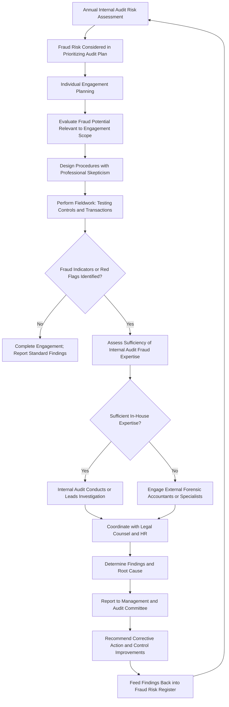

## Internal Audit's Role in Fraud Detection

### Overview

Internal audit occupies a distinct position from external audit in the fraud detection landscape: rather than opining on financial statements for external users, internal audit provides independent, objective assurance and consulting services designed to add value and improve an organization's operations, including its fraud risk management processes. Its role is governed primarily by the Institute of Internal Auditors' (IIA) International Professional Practices Framework (IPPF), particularly the Global Internal Audit Standards (effective January 2025, superseding the prior International Standards for the Professional Practice of Internal Auditing).

### Foundational Distinction from External Audit

**Key Points**

- Internal audit's mandate is broader than financial statement fraud — it covers operational fraud, compliance fraud, and misconduct across the entire organization, not solely matters material to external financial reporting.
- Internal audit reports functionally to the audit committee and administratively to senior management, a dual reporting line intended to preserve independence when investigating fraud that could involve management.
- Internal audit is not required to detect all fraud, but the IPPF requires internal auditors to have sufficient knowledge to identify indicators of fraud, not the expertise of someone whose primary responsibility is detecting and investigating fraud.

### IIA Standards Governing Internal Audit and Fraud

The IIA's Global Internal Audit Standards (2024 revision) organize requirements around five domains, with fraud-related expectations embedded primarily within:

- **Domain III (Governance)**: internal audit must assess the adequacy of governance processes, including those relating to ethics and fraud risk management.
- **Domain IV (Managing the Internal Audit Function)**: requires the internal audit plan to be informed by a risk assessment that considers the potential for fraud.
- **Domain V (Performing Internal Audit Services)**: requires internal auditors to evaluate the potential for fraud when developing engagement objectives, and to exercise professional skepticism throughout engagements.

[Inference] The precise numbering and structure of standards may be referenced differently depending on whether an organization has transitioned to the 2024 Global Internal Audit Standards or still references the legacy 2017 International Standards; both share substantially similar fraud-related expectations.

### Internal Audit's Specific Fraud-Related Responsibilities

#### 1. Fraud Risk Assessment Contribution

Internal audit must have sufficient knowledge of fraud to identify indicators that fraud may have been committed. This knowledge feeds into:

- The **annual internal audit risk assessment**, which should explicitly consider fraud risk when prioritizing audit engagements.
- Providing input into the organization's broader fraud risk assessment led by the fraud risk officer or compliance function (Principle 2 of the COSO/ACFE Fraud Risk Management Guide).

#### 2. Evaluating Fraud Risk Management Program Effectiveness

Internal audit periodically evaluates whether each of the five COSO/ACFE FRM principles is present and functioning:

- Assessing whether the fraud risk policy is communicated and understood.
- Testing whether fraud risk assessments are current and comprehensive.
- Evaluating design and operating effectiveness of anti-fraud controls.
- Reviewing whether investigation protocols are followed consistently.
- Confirming monitoring mechanisms (KRIs, continuous controls monitoring) are functioning as intended.

#### 3. Engagement-Level Fraud Consideration

During any individual audit engagement (e.g., an audit of the procurement cycle), internal auditors must:

- Evaluate the potential for fraud relevant to the engagement scope, incorporating this into the engagement's objectives and procedures.
- Exercise due professional care by considering the probability of significant errors, fraud, or noncompliance.
- Maintain sufficient skepticism to remain alert to conditions and indicators (red flags) that could suggest fraud may have occurred.

#### 4. Investigation Support and Execution

When fraud is suspected or reported, internal audit's role typically includes:

- Conducting or supporting fraud investigations, often in coordination with legal counsel, HR, and (for complex financial statement fraud) external forensic accountants.
- Determining whether the internal audit team has sufficient competency for a given investigation or should recommend engaging outside specialists.
- Reporting investigation results and recommending corrective action to management and the audit committee.

[Inference] Whether internal audit leads investigations directly or plays a coordinating/oversight role varies by organization size, the internal audit function's specialized fraud expertise (e.g., presence of Certified Fraud Examiners on staff), and the severity/complexity of the suspected fraud.

#### 5. Communication and Reporting

- If internal audit identifies significant fraud indicators during an engagement, this must be reported to the appropriate levels of management and, depending on severity, to the audit committee.
- Internal audit typically maintains or has visibility into the whistleblower hotline case log, tracking case status, disposition, and trends.

### Internal Audit Fraud Detection Workflow

### Internal Audit vs. External Audit: Comparative Fraud Responsibilities

| Dimension | Internal Audit | External Audit |
| --- | --- | --- |
| Primary objective | Improve governance, risk management, and control processes organization-wide | Opine on whether financial statements are free from material misstatement |
| Scope of fraud concern | Operational, compliance, and financial fraud across all functions | Fraud materially affecting the financial statements |
| Reporting line | Functionally to audit committee, administratively to management | Independent third party reporting to shareholders/audit committee |
| Frequency of fraud consideration | Continuous, embedded in ongoing audit plan and engagements | Primarily during the annual (or interim) audit cycle |
| Investigation role | Often directly conducts or coordinates investigations | Generally does not conduct investigations; may recommend forensic specialists |
| Governing standards | IIA Global Internal Audit Standards (IPPF) | ISA 240 / AU-C 240 / PCAOB AS 2401 |

### Required Competencies

The IIA framework specifies that internal auditors should possess sufficient knowledge to evaluate the risk of fraud, which includes understanding:

- Characteristics of fraud (the fraud triangle: pressure, opportunity, rationalization).
- Techniques used to commit fraud (common schemes per the ACFE Fraud Tree: asset misappropriation, corruption, financial statement fraud).
- The types of fraud associated with the activities being audited.

[Unverified] Whether a given internal audit function possesses specialized fraud expertise (e.g., staff holding the Certified Fraud Examiner credential) is organization-specific and not mandated uniformly by the IIA standards, which require general fraud awareness rather than certified specialist status for every internal auditor.

**Example**

During a routine engagement auditing the expense reimbursement process, an internal auditor at a logistics company notices that one employee's reimbursement submissions consistently fall just under the $75 receipt-required threshold and are approved by a manager who reports to the same employee in an informal dotted-line relationship not reflected in the organizational chart. Recognizing these as classic red flags (deliberate threshold avoidance and inadequate segregation of approval authority), the auditor escalates the observation rather than closing it as a minor finding. Internal audit expands the sample to the employee's full expense history over 18 months, identifies a pattern consistent with a fraudulent disbursement scheme, and refers the matter for a formal investigation coordinated with HR and legal, while separately recommending that the organizational chart and approval hierarchy be corrected to eliminate the segregation-of-duties gap organization-wide.

### Common Limitations and Challenges

- Internal audit's independence, while structurally protected via the audit committee reporting line, can still be compromised in practice if administrative reporting to the CFO or CEO creates pressure regarding resourcing, budget, or engagement scope.
- Internal audit typically does not have the specialized forensic accounting skills needed for complex financial statement fraud investigations (e.g., valuation manipulation, complex revenue recognition schemes) and must know when to escalate to outside forensic specialists.
- Internal audit's engagement-level fraud consideration may be limited by sampling — full-population continuous controls monitoring, where available, provides broader coverage than traditional sample-based testing.

**Conclusion**

Internal audit's role in fraud detection is embedded rather than episodic: fraud consideration is required at both the annual risk-assessment level (shaping which areas get audited) and the individual engagement level (shaping how each audit is performed), supported by mandatory professional skepticism under the IIA's Global Internal Audit Standards. Unlike external audit's materiality-bound, financial-statement-focused mandate, internal audit's fraud responsibility spans the entire organization, positioning it as the primary internal mechanism for investigating suspected fraud, evaluating the fraud risk management program's ongoing effectiveness, and feeding findings back into the fraud risk register — while relying on its independent reporting line to the audit committee to preserve objectivity when investigations touch management itself.

**Related Topics**

- IIA Global Internal Audit Standards (2024) — full domain structure
- Red flag indicators of fraud in operational audits
- Certified Fraud Examiner (CFE) qualification and its role in internal audit teams
- Coordinating internal audit investigations with legal counsel and HR
- Continuous controls monitoring as a complement to internal audit sampling
- Audit committee oversight of the internal audit charter and independence
- Comparative analysis: ISA 240 vs. IIA fraud-related standards