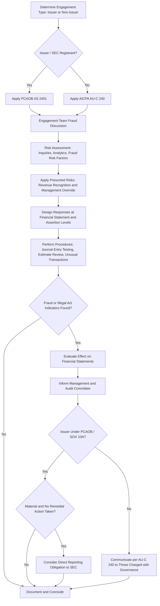

## PCAOB and AICPA Standards Related to Fraud

### Overview

In the United States, auditor responsibilities for fraud are governed by two parallel but distinct standard-setting bodies, applicable to different populations of audited entities. The **PCAOB (Public Company Accounting Oversight Board)** sets auditing standards for audits of issuers (public companies) and broker-dealers registered with the SEC, primarily through **AS 2401 — Consideration of Fraud in a Financial Statement Audit**. The **AICPA (American Institute of Certified Public Accountants)**, through its Auditing Standards Board (ASB), sets standards for audits of private (non-issuer) entities, primarily through **AU-C 240 — Consideration of Fraud in a Financial Statement Audit**, part of the clarified Statements on Auditing Standards (SAS).

### Jurisdictional Scope: Which Standard Applies

**Key Points**

- **PCAOB AS 2401** applies to audits of "issuers" — companies required to file with the SEC — and broker-dealers, following the Sarbanes-Oxley Act of 2002's creation of the PCAOB as the auditor of public companies' regulatory overseer.
- **AICPA AU-C 240** applies to audits of private companies, nonprofits, governmental entities, and other non-issuers, performed under Generally Accepted Auditing Standards (GAAS).
- Both standards derive from a common lineage — the pre-Sarbanes-Oxley AICPA Statement on Auditing Standards No. 99 (SAS 99), "Consideration of Fraud in a Financial Statement Audit" — and both are substantially converged with the IAASB's ISA 240 in overall structure and intent, though specific wording and some procedural details differ.

### PCAOB AS 2401: Core Structure

AS 2401 (originally adopted as AU Section 316 and later reorganized as part of the PCAOB's 2015 standard reorganization) requires auditors to:

#### 1. Exercise Professional Skepticism

The auditor should conduct the engagement with a mindset that recognizes the possibility that a material misstatement due to fraud could be present, regardless of any past experience with the entity and its management's honesty and integrity.

#### 2. Discussion Among Engagement Personnel

Members of the audit team should discuss the potential for material misstatement due to fraud, emphasizing the importance of maintaining a questioning mind throughout the audit.

#### 3. Obtain Information to Identify Fraud Risks

Required procedures include:

- Inquiries of management, the audit committee, internal audit, and others within the entity about fraud risks.
- Considering results of analytical procedures performed in planning.
- Considering fraud risk factors.
- Considering other information that may be helpful in identifying risks (e.g., discussions with the predecessor auditor).

#### 4. Identify and Assess Risks of Material Misstatement Due to Fraud

Including the presumption that improper revenue recognition is a fraud risk, and the presumption of risk of management override of controls — both presumptions substantially mirror ISA 240.

#### 5. Respond to the Results of the Assessment

- At the overall financial statement level (e.g., assigning more experienced staff, increasing supervision).
- At the assertion level (nature, timing, extent of procedures).
- Specific procedures to address management override, including examining journal entries, reviewing accounting estimates for bias, and evaluating significant unusual transactions.

#### 6. Evaluate Audit Evidence

Assessing whether analytical procedures performed near the end of the audit indicate previously unrecognized fraud risk, and evaluating identified misstatements to determine if they are indicative of fraud.

#### 7. Communicate About Fraud

To management, the audit committee, and in some cases regulatory authorities.

#### 8. Document

Similar documentation requirements to ISA 240: engagement team discussion, identified fraud risks, responses, and results.

### AICPA AU-C 240: Core Structure

AU-C 240 is structurally very similar to ISA 240 (the AICPA's Auditing Standards Board deliberately converged U.S. GAAS with international standards during the "Clarity Project" completed around 2012). Its core requirements include:

- Maintaining professional skepticism throughout the audit.
- Engagement team discussion of fraud susceptibility.
- Risk assessment procedures including inquiries of management and those charged with governance about fraud risk.
- Identifying fraud risks, including the presumed risks of revenue recognition and management override of controls.
- Designing and implementing responses to assessed fraud risks.
- Evaluating audit evidence and communicating fraud-related matters.

[Inference] Because AU-C 240 and ISA 240 share nearly identical structure following the Clarity Project convergence, practitioners often treat detailed procedural guidance as interchangeable between the two; however, auditors should verify current text for jurisdiction-specific nuances rather than assuming complete identity.

### Standard Comparison Table

| Dimension | PCAOB AS 2401 | AICPA AU-C 240 | IAASB ISA 240 |
| --- | --- | --- | --- |
| Applies to | Issuers, broker-dealers (SEC-registered) | Private/non-issuer entities (U.S. GAAS) | International jurisdictions adopting ISAs |
| Standard-setter | PCAOB (created by Sarbanes-Oxley 2002) | AICPA Auditing Standards Board | IAASB (IFAC) |
| Revenue recognition fraud presumption | Yes | Yes | Yes |
| Management override presumption | Yes | Yes | Yes |
| Engagement team "brainstorming" session | Required | Required | Required |
| Communication to audit committee | Required, with specific SOX-related linkages (e.g., Section 10A) | Required to those charged with governance | Required to those charged with governance |
| Related SOX linkage | Directly tied to Sarbanes-Oxley Section 10A and PCAOB inspection regime | Not directly tied to SOX (applies to non-issuers) | Not applicable (non-U.S. framework) |

### Sarbanes-Oxley Section 10A Linkage (PCAOB Context Specific)

A distinguishing feature of the PCAOB/issuer audit environment is the direct statutory linkage to **Section 10A of the Securities Exchange Act of 1934** (as amended by SOX), which requires that if the auditor detects or otherwise becomes aware of information indicating an illegal act (which may include or overlap with fraud) has or may have occurred, the auditor must:

1. Determine the possible effect on the financial statements.
2. Inform the appropriate level of management and ensure the audit committee is adequately informed, unless clearly inconsequential.
3. If the illegal act is material and senior management or the board fails to take appropriate remedial action, the auditor may be required to report directly to the SEC.

[Unverified] The precise threshold for "clearly inconsequential" and the exact triggering conditions for direct SEC reporting under Section 10A involve legal judgment specific to each situation; auditors typically consult legal counsel before making such determinations, and this analysis is not purely a technical accounting standard question.

### PCAOB Fraud Standard Application Workflow

### PCAOB Inspection and Enforcement Context

Because AS 2401 applies to issuer audits, compliance is subject to the PCAOB's inspection program, under which PCAOB inspectors review audit firms' fraud-related procedures (journal entry testing, revenue recognition testing, management override procedures) as part of routine and targeted inspections. Deficiencies identified in inspections related to fraud procedures have historically been a recurring theme in PCAOB inspection reports.

[Inference] Specific inspection findings and deficiency rates change year to year and by firm; auditors and firms should consult current PCAOB inspection reports rather than relying on historical patterns as predictive of current enforcement focus.

**Example**

An audit firm engaged to audit a publicly traded regional bank (an issuer, thus subject to PCAOB AS 2401) identifies, during journal entry testing performed to address the presumed management override risk, a series of entries reclassifying loan loss provisions in a way that appears designed to smooth reported earnings near a debt covenant threshold. Because this is a PCAOB-regulated issuer audit, the firm must not only communicate findings to the audit committee as required generally, but must also specifically evaluate whether this constitutes an illegal act or fraud under the Section 10A framework, determine materiality, and document whether management and the audit committee took appropriate remedial action — a statutory dimension that would not apply in the same form had this been a privately held bank audited under AU-C 240 alone.

### Practical Implications for Practitioners

- Audit firms serving both public and private clients must maintain dual competency in AS 2401 and AU-C 240, as procedures, documentation templates, and communication protocols differ in statutory context even where substantive procedures overlap significantly.
- The PCAOB's standard-setting and inspection authority creates a more prescriptive, enforcement-backed compliance environment for issuer audits compared to the AICPA's peer-review-based quality control system for non-issuer audits.
- Firms transitioning a client from private to public status (e.g., pre-IPO) must re-scope fraud-related audit procedures to align with AS 2401 and associated PCAOB documentation expectations, in addition to broader ICFR (Section 404) considerations.

**Conclusion**

PCAOB AS 2401 and AICPA AU-C 240 share a common conceptual foundation — professional skepticism, engagement team discussion, presumed risks of revenue recognition fraud and management override, and structured evaluation and communication requirements — reflecting their shared lineage from SAS 99 and general convergence with international standards. The critical distinguishing factor for practitioners is not the substantive fraud consideration methodology, which is highly similar, but the **regulatory and statutory context**: issuer audits under PCAOB jurisdiction carry additional obligations under Sarbanes-Oxley Section 10A, including potential direct reporting to the SEC, and are subject to PCAOB inspection, whereas non-issuer audits under AICPA standards operate within the AICPA's peer review quality control framework without the same statutory escalation mechanism.

**Related Topics**

- Sarbanes-Oxley Section 10A illegal act reporting requirements in depth
- PCAOB inspection process and common fraud-procedure deficiencies
- SAS 99 historical evolution into AU-C 240
- Journal entry testing methodologies for management override
- ICFR (Section 404) assessment linkage to fraud risk procedures
- Comparative convergence analysis: ISA 240, AU-C 240, and AS 2401
- Auditor legal liability distinctions between issuer and non-issuer engagements