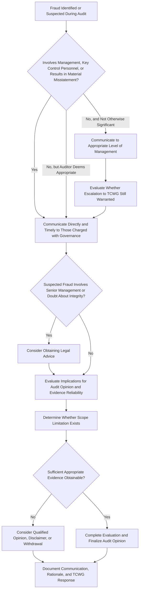

## Communicating Fraud Findings to Those Charged with Governance

### Overview

Communication of fraud findings to those charged with governance (TCWG) is a distinct, mandatory phase of the audit process governed principally by ISA 240 (paired with ISA 260, "Communication with Those Charged with Governance") and their U.S. counterparts AU-C 240/AU-C 260 and PCAOB AS 1301. It addresses what must be communicated, to whom, when, and how, once the auditor has identified or suspects fraud during an audit. This is a distinct topic from fraud detection procedures themselves — it concerns the auditor's downstream reporting obligations once evidence of possible or actual fraud has been obtained.

### Defining "Those Charged with Governance"

**Key Points**

- ISA 260 defines those charged with governance as the person(s) or organization(s) with responsibility for overseeing the strategic direction of the entity and obligations related to the accountability of the entity, which includes overseeing the financial reporting process.
- In most corporate structures, TCWG is the **board of directors** or, more specifically, the **audit committee** where one exists with delegated authority over financial reporting oversight.
- TCWG is distinguished from "management," who are responsible for the conduct of the entity's operations — though in some entities, particularly smaller ones, the two groups may overlap (e.g., an owner-manager also serving on the governing body).

### Why Separate Communication to TCWG Is Required

The rationale rests on the auditor's presumption that management may itself be complicit in fraud (the presumed risk of management override of controls under ISA 240). If fraud communications were routed exclusively through management, a management-perpetrated fraud could be suppressed before reaching an independent oversight body. Accordingly, ISA 240 requires direct communication to TCWG under specific circumstances, bypassing reliance on management as an intermediary.

### Triggering Circumstances for Communication to TCWG

ISA 240 (para 40-42) specifies that the auditor shall communicate with TCWG on a timely basis, unless all of those charged with governance are involved in managing the entity, in the following circumstances:

1. The auditor has identified or suspects fraud involving:
   - Management,
   - Employees who have significant roles in internal control, or
   - Others where the fraud results in a material misstatement of the financial statements.
2. The auditor identifies fraud that does **not** involve the above parties but nonetheless the auditor considers it appropriate to bring to TCWG's attention (e.g., fraud that, while not material, indicates control environment weaknesses).
3. The auditor has concerns about the entity's control environment, including concerns about the integrity or competence of management.
4. The auditor identifies matters relevant to TCWG's responsibilities regarding fraud that the auditor considers appropriate to communicate.

[Inference] Judgment about what fraud, even if immaterial in dollar terms, is "appropriate" to escalate to TCWG involves professional judgment about the fraud's implications for control environment integrity rather than a strictly quantitative materiality threshold.

### Content of the Communication

Communications to TCWG regarding fraud typically address:

- **Nature and extent of the risks** of material misstatement due to fraud identified during the audit.
- **The auditor's evaluation** of the entity's fraud risk assessment process and the adequacy of related controls.
- **Specific incidents** of identified or suspected fraud, including the nature of the alleged scheme, the individuals potentially involved, and the estimated or actual financial statement effect.
- **Concerns about management's response** to identified fraud, including whether management has taken appropriate corrective or investigative action.
- **Implications for the auditor's opinion**, including whether the fraud affects the auditor's ability to rely on management representations or requires expanded procedures.
- **Any scope limitations** encountered, including situations where the auditor was unable to obtain sufficient appropriate audit evidence related to the suspected fraud.

### Escalation Path When Management Is Implicated

A critical procedural nuance: if the suspected fraud involves senior management (e.g., the CEO or CFO), and the auditor doubts management's integrity, the auditor should communicate directly with TCWG, and may consider it necessary to obtain legal advice regarding:

- Appropriate course of action given the circumstances.
- Possible legal implications of actions taken by individuals involved (e.g., fraud, presumed illegal acts, and the entity's related obligations).
- Whether it remains appropriate to continue with the engagement, and if so, on what terms.

### Communication Workflow

### Communication Timing and Form

- **Timing**: Communications should occur on a timely basis, which may necessitate communication during the audit rather than only at its conclusion, particularly for significant or urgent findings (e.g., suspected ongoing fraud requiring immediate governance action).
- **Form**: While ISA 260 permits oral or written communication depending on significance, **fraud-related communications are typically documented in writing** (e.g., in a formal letter to the audit committee or within the auditor's required communications memo) given their sensitivity and potential legal implications.
- **Two-way dialogue**: ISA 240 emphasizes that communication with TCWG is not one-directional; the auditor should also make inquiries of TCWG to determine whether they have knowledge of any actual, suspected, or alleged fraud affecting the entity, since TCWG's oversight role may give them insight not available to management-level inquiries alone.

### Interaction with Regulatory Reporting Duties (Jurisdiction-Specific)

Depending on jurisdiction and entity type, communication to TCWG may trigger or run parallel to additional statutory obligations:

- In the U.S., for issuers, Sarbanes-Oxley Section 10A requires that if an illegal act (which may overlap with fraud) is detected, the audit committee must be adequately informed, with potential escalation to the SEC if senior management or the board fails to take timely remedial action.
- In some jurisdictions, external auditors of certain regulated entities (e.g., banks, insurers) have statutory duties to report suspected fraud directly to a prudential regulator, separate from and in addition to TCWG communication.

[Unverified] The specific statutory reporting triggers, thresholds, and protections (e.g., legal privilege or safe harbor provisions for auditors reporting suspected fraud) vary considerably by jurisdiction and industry sector; auditors should consult jurisdiction-specific legal and regulatory guidance rather than assuming ISA 240's communication requirements alone satisfy all local statutory obligations.

**Example**

During the audit of a publicly listed retail company, the audit team identifies that the CFO directed a series of manual adjustments to inventory reserves in the final two weeks of the fiscal year, materially reducing a previously recorded obsolescence provision without adequate support. Because the suspected fraud involves senior management and results in a material misstatement, the audit partner does not rely on communicating solely to the CFO's own finance team. Instead, the partner directly contacts the audit committee chair, requesting a closed session (excluding the CFO) to present the finding, and separately recommends the audit committee engage outside legal counsel to assess further action. The auditor documents this communication, the audit committee's response (engaging a forensic accounting firm), and the impact on the audit team's revised risk assessment and expanded substantive procedures over inventory valuation.

### Documentation of the Communication Process

Auditors must document:

- The substance of oral communications with TCWG regarding fraud, including when and to whom made.
- Written communications issued (e.g., management letters, required communications reports).
- TCWG's response to the communicated findings, including any actions taken or declined.
- The auditor's evaluation of whether TCWG's response was adequate, and the implications of that evaluation for the audit opinion (e.g., if TCWG fails to act on a material fraud finding, this may itself indicate a broader control environment or integrity concern requiring further auditor response).

### Common Pitfalls in Practice

- Routing fraud-related findings only through management-level contacts (e.g., the controller) without escalating to the audit committee, undermining the independence rationale behind the requirement.
- Delaying communication until the final audit committee meeting of the cycle, rather than communicating on a "timely basis" as required, particularly where ongoing fraud risk exists.
- Failing to document TCWG's specific response to a fraud communication, which can weaken the auditor's position if the adequacy of governance oversight is later challenged (e.g., in litigation or regulatory enforcement).
- Treating the communication as purely a compliance formality rather than substantively evaluating whether the fraud communicated affects audit risk assessment, evidence reliability, and the auditor's opinion.

**Conclusion**

Communicating fraud findings to those charged with governance functions as the auditor's structural safeguard against relying exclusively on management — the very party presumed to carry override risk — as the recipient and gatekeeper of fraud-related information. ISA 240's triggering circumstances (management involvement, significant control personnel involvement, or material misstatement) determine when direct, timely communication to TCWG is mandatory rather than discretionary, while the requirement for a two-way dialogue ensures TCWG's own knowledge of suspected fraud is captured. Where senior management integrity is in doubt, this framework extends into considerations of legal advice, potential scope limitations, and reassessment of whether the engagement can continue — linking communication obligations directly to the auditor's ultimate opinion decision.

**Related Topics**

- ISA 260 general communication requirements with those charged with governance
- Auditor withdrawal from an engagement due to fraud-related integrity concerns
- Sarbanes-Oxley Section 10A audit committee notification requirements
- Forensic accountant engagement following auditor-identified fraud indicators
- Management representation letters and their limitations when fraud is suspected
- Qualified opinions, disclaimers, and scope limitations arising from fraud investigations
- Audit committee's responsibilities upon receiving a fraud communication from the auditor