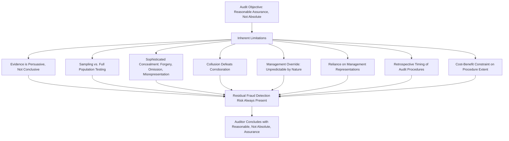

## Limitations of Audits in Detecting Fraud

### Overview

The limitations of audits in detecting fraud describe the inherent constraints that prevent a financial statement audit — even one performed with full diligence and in strict compliance with ISA 240, AU-C 240, or PCAOB AS 2401 — from guaranteeing that all material fraud will be discovered. This topic sits alongside the auditor's responsibilities as its necessary counterweight: it clarifies why "reasonable assurance," rather than absolute assurance, is the maximum achievable standard, and helps explain the persistent "expectation gap" between what the public believes auditors do and what auditing standards actually require.

### The Concept of Inherent Audit Limitations

**Key Points**

- ISA 200 ("Overall Objectives of the Independent Auditor") establishes that an audit conducted in accordance with ISAs is designed to provide reasonable assurance, not absolute assurance, because of inherent limitations of an audit that affect the auditor's ability to detect material misstatements.
- ISA 240 explicitly reiterates and extends this concept specifically for fraud, stating that the risk of not detecting a material misstatement resulting from fraud is higher than the risk of not detecting one resulting from error.
- These limitations are structural and methodological, not simply a matter of auditor competence or effort — meaning even a highly skilled, diligent auditor operating in full compliance with standards may fail to detect sophisticated fraud.

### Categories of Inherent Limitation

#### 1. Nature of Audit Evidence

- Audit evidence is **persuasive rather than conclusive**; auditors form conclusions based on a reasonable basis, not certainty.
- Much audit evidence derives from testing samples of transactions rather than the entire population, meaning fraud embedded in untested items may not surface. [Inference] The extent to which continuous controls monitoring or full-population data analytics techniques mitigate this specific limitation depends on the auditor's use of such tools, which is not uniformly mandated by the standards themselves.

#### 2. Concealment and Sophistication of Fraud

ISA 240 specifically identifies that fraud may involve sophisticated and carefully organized schemes designed to conceal it, such as:

- **Forgery** of documents.
- **Deliberate failure to record transactions**.
- **Intentional misrepresentations** made to the auditor.
- **Collusion**, which can cause the auditor to believe audit evidence is persuasive when it is in fact false, since collusion may involve seemingly independent sources of corroboration that are, in reality, coordinated.

#### 3. Management Override of Controls

Because management is typically in a position to directly or indirectly manipulate accounting records and present fraudulent financial information, override of otherwise effective controls can occur in unpredictable ways — a risk present in every audit regardless of the auditor's specific assessment, precisely because its methods cannot be fully anticipated in advance.

#### 4. Reliance on Management Representations

Auditors necessarily rely to some extent on representations from management and those charged with governance, particularly regarding matters not susceptible to independent verification (e.g., management's intent regarding a transaction, or completeness of disclosures of related party transactions). Deliberately false representations undermine this reliance in ways the auditor may not be positioned to detect through ordinary procedures.

#### 5. Timing and Retrospective Nature of Audits

Audits are typically performed after the period being audited has closed, meaning the auditor's procedures are largely retrospective. This creates a structural lag: fraud committed and concealed during the period may only be examined well after the fact, by which point evidence may have been destroyed, altered, or become harder to trace.

#### 6. Cost-Benefit and Reasonable Assurance Constraints

An audit is not designed to provide, and does not provide, assurance on all possible fraud, error, or noncompliance; extending audit procedures to a level that would provide near-certain fraud detection would generally be commercially impractical and cost-prohibitive relative to the economic value of the audit to users. This trade-off is implicit in the reasonable assurance concept itself.

### Illustrating the Limitation Structure

### The "Expectation Gap"

A well-documented phenomenon in auditing literature and regulatory discourse: the divergence between what financial statement users (investors, regulators, the public) believe an audit guarantees regarding fraud, and what auditing standards actually require and can realistically deliver.

- **Public perception (often)**: an unqualified audit opinion implies the company is free of fraud.
- **Standard-based reality**: the auditor provides reasonable assurance that financial statements are free of *material* misstatement, whether from fraud or error — not a certification of fraud-free operations, and not necessarily extending to immaterial frauds that do not affect the financial statements as a whole.

[Speculation] The precise magnitude and persistence of the expectation gap across different investor and stakeholder groups is a subject of ongoing academic and regulatory debate rather than a settled, quantifiable metric; regulatory responses (e.g., enhanced auditor reporting, expanded key audit matters disclosures) reflect efforts to narrow but not necessarily eliminate this gap.

### Distinguishing Limitations from Auditor Negligence

It is important to distinguish inherent, unavoidable limitations from situations involving auditor negligence or standard non-compliance:

| Scenario | Classification |
| --- | --- |
| Auditor performs required journal entry testing per ISA 240 but sophisticated collusion between the CFO and an external party still conceals fraud despite this testing | Inherent limitation |
| Auditor fails to perform required procedures addressing the presumed risk of management override at all | Potential standard non-compliance / negligence |
| Auditor relies on a single, uncorroborated management representation regarding a material, unusual transaction without further corroboration where corroboration was reasonably obtainable | Potential failure to exercise appropriate professional skepticism |
| Fraud is discovered years later using forensic techniques and data sources not available or reasonably discoverable at the time of the original audit | Generally considered an inherent limitation, subject to case-specific legal analysis |

[Unverified] The legal determination of whether a specific fraud detection failure constitutes an inherent limitation versus a standard of care breach is fact-specific and ultimately a matter for courts, regulators, or disciplinary bodies to determine in individual cases; auditing standards describe the professional expectation but do not themselves adjudicate liability.

**Example**

A publicly traded technology company's CFO, in collusion with a senior sales executive, orchestrates a scheme involving side letters with a major customer that grant unrecorded rights of return, while the formal contracts shown to the auditor omit these terms. The auditor performs the required presumed-risk procedures for revenue recognition, including confirming a sample of receivables and reviewing contract terms provided by management, and finds no discrepancies because the side letters were deliberately withheld and the confirmed customer, complicit in the scheme, corroborates the false terms. The fraud is only discovered eighteen months later when a whistleblower from the customer's organization comes forward. This scenario illustrates the collusion and concealment limitation directly: the auditor's procedures were consistent with ISA 240's requirements, but deliberate withholding of documents combined with third-party collusion defeated the confirmation procedure's evidentiary value — a limitation inherent to the audit process rather than a deficiency in the auditor's work.

### Regulatory and Standard-Setting Responses to the Limitations

While the fundamental limitations cannot be eliminated, standard-setters and regulators have introduced measures intended to narrow the resulting risk and expectation gap:

- **Expanded auditor reporting** (e.g., Key Audit Matters under ISA 701, Critical Audit Matters under PCAOB AS 3101) requiring auditors to disclose areas of significant judgment, which often include fraud-related risk areas such as revenue recognition or management estimates.
- **Enhanced requirements for professional skepticism**, reinforced through PCAOB and IAASB guidance and inspection findings emphasizing skepticism as a recurring area of concern.
- **Increased use of data analytics and technology-based audit procedures**, allowing broader (in some cases full-population) testing that can surface anomalies less visible through traditional sampling. [Inference] The degree to which individual firms have operationalized these technologies varies, and standards themselves generally remain principles-based rather than mandating specific technological approaches.
- **Forensic specialist involvement** in higher fraud-risk audits, supplementing the audit team's general skepticism-based approach with specialized investigative techniques.

**Conclusion**

The limitations of audits in detecting fraud are structural, not incidental: they arise from the fundamentally persuasive (rather than conclusive) nature of audit evidence, the deliberate concealment techniques inherent to fraud (forgery, omission, misrepresentation, and especially collusion), the unpredictable nature of management override, and the practical cost-benefit boundaries that define "reasonable" rather than "absolute" assurance. These limitations explain — without excusing substandard performance — why full standards compliance does not guarantee fraud detection, and they underpin the ongoing "expectation gap" between public perception of an audit's guarantees and what auditing standards actually promise. Understanding this distinction is essential both for evaluating auditor performance fairly in hindsight and for appropriately calibrating the reliance financial statement users place on an unqualified audit opinion.

**Related Topics**

- The audit expectation gap: academic and regulatory perspectives
- Key Audit Matters (ISA 701) and Critical Audit Matters (PCAOB AS 3101)
- Collusion as a fraud concealment mechanism and its audit implications
- Forensic accounting techniques that extend beyond standard audit procedures
- Auditor legal liability standards: negligence vs. inherent limitation defenses
- Data analytics and continuous auditing as mitigants to sampling limitations
- Case studies of major frauds that evaded detection despite compliant audits