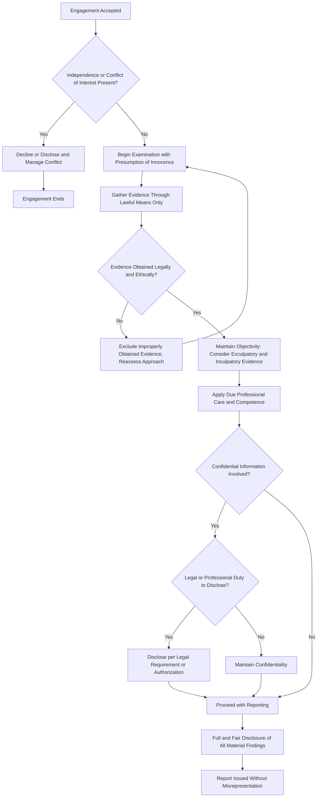

## Professional Code of Ethics for Fraud Examiners

### Overview

The professional code of ethics for fraud examiners establishes the standards of conduct expected of individuals engaged in fraud examination, most authoritatively codified in the **ACFE Code of Professional Ethics**, which governs Certified Fraud Examiners (CFEs) and members of the Association of Certified Fraud Examiners. This code addresses the distinct ethical challenges of fraud examination work — an activity that combines investigative, legal, and accounting dimensions and often involves sensitive, adversarial, and legally consequential findings — distinguishing it from the broader ethical codes governing general accounting or auditing practice (e.g., the AICPA Code of Professional Conduct or IESBA Code).

### Purpose and Scope

**Key Points**

- The ACFE Code of Professional Ethics applies to all ACFE members and CFE credential holders, establishing minimum standards of professional conduct in the performance of fraud examination duties.
- Unlike a purely aspirational statement, violations of the Code can result in disciplinary action by the ACFE, including revocation of the CFE credential.
- The Code is designed to protect the integrity of the fraud examination profession, safeguard the interests of clients and the public, and maintain confidence in the reliability of fraud examination findings, which frequently underpin litigation, criminal referrals, or employment actions with serious consequences for the individuals involved.

### Core Principles of the ACFE Code of Professional Ethics

While specific enumeration and wording should be verified against the current ACFE publication, the Code's principles are commonly organized around the following themes:

#### 1. Professional Competence and Due Diligence

Members shall obtain and maintain the requisite knowledge, skill, and competence to perform fraud examination services professionally, exercising due professional care and diligence in the performance of their duties.

#### 2. High Standards of Moral and Ethical Conduct

Members shall conduct themselves in accordance with the highest ethical standards, whether in their professional capacity or otherwise, given that ethical lapses by fraud examiners in any context can undermine confidence in the profession as a whole.

#### 3. Lawful Conduct

Members shall obtain evidence or other documentation only through lawful means, refraining from any illegal act or unethical means of obtaining information (e.g., unauthorized wiretapping, pretexting in violation of law, unauthorized access to computer systems).

#### 4. Objectivity and Independence

Members shall conduct their examinations with objectivity and independence, avoiding conflicts of interest, and shall not accept engagements where their independence or objectivity may reasonably be questioned.

#### 5. Full and Fair Disclosure

Members shall reveal all material matters discovered during the course of an examination which, if omitted, could cause a distorted view of the situation, avoiding any misrepresentation to the client or other appropriate parties.

#### 6. Confidentiality

Members shall not reveal any confidential information obtained during a professional engagement without proper authorization, subject to legal or professional obligations to disclose (e.g., a legal duty to report a crime, or a subpoena).

#### 7. Support of ACFE Objectives

Members shall serve as advocates for the profession by actively supporting the ACFE's mission and objectives, and shall not bring the profession into disrepute through their conduct.

[Inference] The exact number, ordering, and precise wording of the Code's provisions is subject to periodic revision by the ACFE; practitioners should consult the current published Code directly for verbatim text rather than relying on a paraphrased summary for compliance purposes.

### Distinguishing Fraud Examiner Ethics from General Auditor/Accountant Ethics

| Dimension | Fraud Examiner (ACFE Code) | General Auditor/Accountant (AICPA/IESBA Code) |
| --- | --- | --- |
| Primary orientation | Investigation of specific suspected wrongdoing; often adversarial context | Attestation on financial statements for a broad user base; generally non-adversarial |
| Evidence standards | Must meet legal/forensic standards suitable for litigation or prosecution (chain of custody, admissibility) | Audit evidence standards focused on sufficiency and appropriateness for forming an opinion |
| Confidentiality tension | Frequently balances confidentiality against legal reporting obligations (e.g., to law enforcement, regulators) | Confidentiality obligations generally less frequently tested by active investigative/legal referral scenarios |
| Objectivity focus | Explicit emphasis on avoiding predetermined conclusions before evidence-gathering is complete | Independence focus centers on financial and relationship-based threats (e.g., self-interest, familiarity) |
| Disciplinary body | ACFE (credential-specific) | State boards of accountancy, AICPA, or relevant national professional bodies |

### The Presumption of Innocence Principle

A distinctive and heavily emphasized element of fraud examiner ethics, reflecting the ACFE's broader methodology, is that fraud examinations should be conducted with the recognition that the examiner's role is to gather facts, not to prejudge guilt. Practically, this translates into ethical requirements to:

- Avoid conducting an examination with a predetermined conclusion about whether fraud occurred or who is responsible.
- Base conclusions on the evidence gathered, not on preconceptions, bias, or external pressure to reach a particular outcome.
- Present findings objectively, including exculpatory evidence, rather than selectively presenting only evidence supporting a suspected party's guilt.

This principle is closely tied to the ACFE's standard investigative methodology, which frames examinations as a search for the truth rather than a prosecution-oriented exercise from the outset.

### Ethical Conduct Workflow in a Fraud Examination

### Confidentiality vs. Disclosure: Navigating the Tension

Fraud examiners frequently face situations where confidentiality obligations to a client conflict with broader duties:

- **Legal compulsion**: a subpoena or court order may require disclosure of otherwise confidential findings.
- **Statutory reporting obligations**: certain jurisdictions or industries (e.g., financial institutions under anti-money laundering laws) may impose mandatory reporting duties on individuals who become aware of suspected fraud, regardless of engagement-specific confidentiality agreements.
- **Client authorization**: the client may explicitly authorize disclosure to a third party (e.g., regulators, law enforcement, insurers).

[Unverified] The specific hierarchy and legal precedence between contractual confidentiality obligations and statutory reporting duties varies by jurisdiction and by the specific regulatory regime involved (e.g., banking secrecy laws vs. anti-fraud reporting mandates); fraud examiners facing such conflicts should seek legal counsel rather than resolving the tension unilaterally based on the ethics code alone.

**Example**

A CFE engaged by a mid-sized retailer to investigate suspected inventory theft uncovers, during the course of the examination, evidence suggesting the warehouse manager under suspicion is innocent, while a different employee — the one who initially reported the suspicion — appears to be the actual perpetrator, attempting to divert attention from their own scheme. Adhering to the presumption of innocence and full and fair disclosure principles, the examiner does not simply confirm the client's initial suspicion (which would have been the path of least resistance) but instead presents the complete evidentiary picture, including exculpatory evidence for the originally suspected employee and the evidence implicating the actual perpetrator. This reflects the ethical requirement to reveal all material matters discovered, even when those findings contradict the client's initial expectations or are professionally inconvenient to report.

### Consequences of Ethical Violations

- **Credential revocation**: The ACFE can revoke or suspend the CFE credential for violations of the Code, following its disciplinary процедures.
- **Professional reputational harm**: given fraud examination findings often carry significant legal and employment consequences, ethical lapses can expose the examiner to defamation claims, professional negligence suits, or exclusion from future engagements.
- **Evidentiary exclusion**: evidence obtained through unlawful or unethical means may be excluded in subsequent legal proceedings, undermining the value of the entire examination.
- **Overlap with other professional codes**: a fraud examiner who is also a CPA, CIA, or attorney may face parallel disciplinary action under those respective professional bodies' codes for the same underlying conduct.

### Common Ethical Pitfalls in Practice

- Allowing a client's presumption of an individual's guilt to bias the scope or conduct of the examination before evidence is gathered.
- Obtaining evidence through legally questionable means (e.g., unauthorized access to personal email or devices) under pressure to produce results quickly.
- Overstating findings or conclusions beyond what the evidence supports, particularly in written reports that may be relied upon in litigation or termination decisions.
- Failing to disclose a personal or financial conflict of interest with a party involved in the examination (e.g., a prior business relationship with a suspected individual).
- Breaching confidentiality by discussing case details outside authorized channels, even informally.

**Conclusion**

The professional code of ethics for fraud examiners, anchored in the ACFE Code of Professional Ethics, addresses the unique ethical terrain of investigative work: examiners must combine rigorous objectivity and a presumption of innocence with the practical realities of client relationships, legal evidentiary standards, and confidentiality obligations that frequently intersect with mandatory disclosure duties. Its core principles — competence, lawful evidence-gathering, objectivity, full and fair disclosure, and confidentiality — function together to ensure that fraud examination findings remain both ethically sound and legally defensible, given the serious consequences (criminal referral, termination, litigation) that typically follow from an examiner's conclusions.

**Related Topics**

- ACFE fraud examination methodology and evidence standards
- Chain of custody and admissibility of forensic evidence
- Comparison with AICPA Code of Professional Conduct and IESBA Code
- Conflicts of interest in forensic accounting engagements
- Legal privilege and confidentiality in internal investigations
- Whistleblower protections and their interaction with examiner confidentiality duties
- Disciplinary procedures and credential revocation under the ACFE