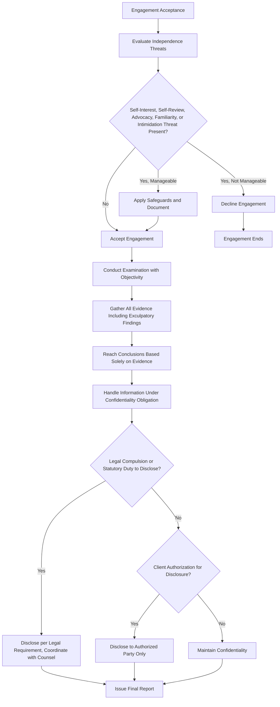

## Independence, Objectivity, and Confidentiality

### Overview

Independence, objectivity, and confidentiality form three interrelated but distinct ethical pillars governing the conduct of forensic accountants and fraud examiners. While closely related, each addresses a different dimension of professional integrity: independence concerns the examiner's relationship to the parties involved, objectivity concerns the mental state and methodology applied during the examination, and confidentiality concerns the handling of information obtained. These principles are drawn from the ACFE Code of Professional Ethics, the IESBA (International Ethics Standards Board for Accountants) Code, and, where the examiner is also a CPA, the AICPA Code of Professional Conduct.

### Independence

**Key Points**

- Independence refers to the absence of relationships or circumstances that would compromise, or reasonably appear to compromise, the examiner's ability to conduct an unbiased examination.
- The IESBA Code frames independence through two distinct but related concepts: **independence of mind** (the state of mind that permits the expression of a conclusion without being affected by influences that compromise professional judgment) and **independence in appearance** (the avoidance of facts and circumstances that would cause a reasonable and informed third party to conclude that integrity, objectivity, or professional skepticism had been compromised).
- For fraud examiners specifically, independence is critical not only for the credibility of findings but because examination results frequently underpin high-stakes decisions: termination of employment, litigation, criminal referral, or insurance claims.

#### Threats to Independence

The IESBA conceptual framework identifies categories of threats applicable to forensic engagements:

1. **Self-interest threat**: a financial or other interest that could inappropriately influence judgment (e.g., a contingent fee tied to the examination's outcome).
2. **Self-review threat**: evaluating one's own prior work or judgment (e.g., a forensic accountant reviewing internal controls they themselves previously designed).
3. **Advocacy threat**: promoting a client's position to a degree that compromises objectivity (e.g., being retained explicitly to build a case supporting a predetermined conclusion).
4. **Familiarity threat**: a close or long-standing relationship with a client or subject of the examination leading to excessive sympathy or trust.
5. **Intimidation threat**: being deterred from acting objectively due to actual or perceived pressure, including threats (litigation threats, aggressive client demands, or job security concerns for internal examiners).

[Inference] The relative significance of each threat category varies by engagement type; for example, self-review threats are more commonly relevant to internal fraud examiners reviewing their own department's prior controls, while advocacy threats are more commonly relevant to litigation support engagements.

#### Independence Safeguards

- Disclosure and evaluation of any prior relationship with the client, subject, or related parties before accepting an engagement.
- Avoidance of contingent fee arrangements tied to the outcome of a fraud examination (e.g., a fee based on the dollar amount of fraud "found" or recovered), which the ACFE Code specifically discourages given the incentive it creates to overstate findings.
- Rotation or use of an independent reviewer for engagements presenting elevated self-review or familiarity risk.
- Documented engagement acceptance procedures evaluating independence threats and safeguards applied.

### Objectivity

**Key Points**

- Objectivity is a state of mind that has the quality of value, credibility, and weight in evidence gathering and reporting. It requires the examiner to approach an engagement without predetermined conclusions.
- The ACFE explicitly emphasizes the **presumption of innocence** principle: the examiner's role is to gather facts and evidence to determine whether fraud occurred and, if so, who is responsible, rather than to build a case against a predetermined suspect.
- Objectivity requires considering **all evidence**, including exculpatory evidence that may contradict a client's or referring party's initial suspicion.

#### Distinguishing Objectivity from Independence

While related, objectivity and independence are conceptually distinct:

- **Independence** concerns external relationships and circumstances (who the examiner is connected to).
- **Objectivity** concerns the internal mental approach and methodology applied during the examination (how the examiner reasons through evidence), regardless of whether an independence threat is technically present.

An examiner could theoretically be independent (no disqualifying relationship) yet lack objectivity (e.g., due to unconscious bias, premature conclusions, or confirmation bias in evidence interpretation) — illustrating why both principles are addressed separately rather than treated as a single combined requirement.

#### Practical Manifestations of Objectivity

- Following evidence wherever it leads, even when it contradicts the engaging party's expectations or is professionally inconvenient to report.
- Applying consistent investigative standards regardless of the suspect's seniority, likability, or relationship to the engaging party.
- Documenting the basis for conclusions with reference to specific evidence rather than inference or assumption.
- Avoiding the use of accusatory or conclusory language before the investigation is complete (e.g., referring to a "suspect" or "person of interest" rather than prematurely labeling someone "the perpetrator" in working notes or interim communications).

### Confidentiality

**Key Points**

- Confidentiality obligates the examiner to protect information obtained during an engagement from unauthorized disclosure, whether to third parties or for personal benefit.
- Confidentiality is not absolute: it yields to legal compulsion (subpoenas, court orders), statutory reporting obligations, and situations where disclosure is authorized by the client or required to prevent a crime, depending on the applicable legal and professional framework.
- Confidentiality obligations typically survive the conclusion of the engagement and the termination of any contractual relationship with the client.

#### Common Confidentiality Tensions in Forensic Engagements

| Scenario | Tension |
| --- | --- |
| Subpoena issued for the examiner's work papers in litigation | Confidentiality to client vs. legal compulsion to produce documents |
| Discovery of a separate, unrelated crime during the examination (e.g., evidence of a different fraud scheme uncovered incidentally) | Confidentiality vs. potential legal or ethical duty to report |
| Client requests examiner discuss findings with a third party (e.g., insurer, regulator) | Requires explicit client authorization before disclosure |
| Examiner engaged by legal counsel under attorney work-product protection | Confidentiality interacts with legal privilege, which may shield findings from compelled disclosure differently than a non-privileged engagement |

[Unverified] The interaction between attorney-client privilege, work-product doctrine, and a forensic accountant's confidentiality obligations is a matter of legal doctrine that varies by jurisdiction and the specific structure of the engagement (e.g., whether the forensic accountant is engaged directly by counsel versus directly by the company); examiners should coordinate closely with legal counsel on privilege-related confidentiality questions rather than relying on the ethics code alone.

### Interrelationship Diagram

### Comparative Framework: ACFE, IESBA, and AICPA

| Principle | ACFE Code | IESBA Code | AICPA Code |
| --- | --- | --- | --- |
| Independence | General independence and objectivity requirement in examinations | Independence of mind and in appearance; detailed conceptual framework of threats and safeguards | Independence rules primarily for attest engagements; separate integrity and objectivity rule for non-attest work |
| Objectivity | Presumption of innocence; evidence-based conclusions emphasized | Objectivity as a fundamental principle avoiding bias, conflict of interest, or undue influence | Objectivity as a fundamental principle under the Integrity and Objectivity Rule |
| Confidentiality | Confidentiality of client information subject to legal/professional exceptions | Confidentiality as a fundamental principle, with specific guidance on public interest exceptions | Confidentiality under the Confidential Client Information Rule, with exceptions for legal process and peer review |

### Application to Internal vs. External Fraud Examiners

- **External forensic accountants/CFEs** (e.g., engaged by outside counsel or as independent consultants) generally face fewer built-in familiarity or self-review threats but must still evaluate prior relationships with the client or subject.
- **Internal fraud examiners** (e.g., employed within a company's internal audit or corporate security function) face heightened familiarity and intimidation threats, given ongoing employment relationships with potential subjects or with executives who may be implicated, and potential self-review threats if examining processes or controls they previously helped design.

**Example**

An internal forensic accountant employed by a manufacturing company is assigned to investigate suspected expense fraud by a regional sales director — a longtime colleague with whom the examiner has a personal friendship extending outside work. Recognizing this as a familiarity threat under the independence framework, the examiner discloses the relationship to the audit committee before beginning work. The audit committee determines the threat is significant enough to warrant a safeguard: an independent, unaffiliated internal auditor is assigned as co-lead on the engagement, and all findings are reviewed by this second individual before the final report is issued. During the examination, evidence emerges that partially exonerates the sales director on one allegation while substantiating a separate, unrelated allegation. Maintaining objectivity, the examiner documents both findings fully rather than omitting the exculpatory finding out of personal discomfort, and confidentiality is maintained throughout except for the authorized reporting to the audit committee and, ultimately, to legal counsel once the substantiated allegation is confirmed.

### Consequences of Failures in Each Principle

- **Independence failure**: findings may be challenged or discredited in litigation or disciplinary proceedings on grounds of bias; the examiner's credential (e.g., CFE) may be subject to disciplinary review.
- **Objectivity failure**: conclusions may be legally or professionally unsupportable, exposing the examiner and engaging organization to wrongful termination claims, defamation suits, or reversal of disciplinary/legal action taken based on flawed findings.
- **Confidentiality failure**: breach of contractual or professional confidentiality obligations can expose the examiner to civil liability, professional disciplinary action, and damage to the examiner's and engaging organization's reputation, particularly where disclosure harms an individual's reputation or a company's competitive position.

**Conclusion**

Independence, objectivity, and confidentiality operate as complementary but distinct safeguards protecting the integrity of forensic accounting and fraud examination work. Independence addresses the examiner's relationship to the parties involved and is evaluated through a threats-and-safeguards framework (self-interest, self-review, advocacy, familiarity, intimidation); objectivity addresses the examiner's evidentiary methodology and mental approach, anchored in the presumption of innocence and full consideration of exculpatory evidence; and confidentiality governs the handling of sensitive information obtained, subject to well-defined exceptions for legal compulsion and authorized disclosure. Because fraud examination findings frequently carry serious legal, employment, and reputational consequences for the individuals investigated, rigorous adherence to all three principles — rather than any one in isolation — is what ultimately gives forensic conclusions their evidentiary and professional weight.

**Related Topics**

- IESBA conceptual framework for threats and safeguards in depth
- Contingent fee arrangements and their prohibition in fraud examination ethics
- Attorney-client privilege and work-product doctrine in forensic engagements
- Presumption of innocence methodology in ACFE fraud examination standards
- Internal vs. external forensic accountant engagement models
- Documenting engagement acceptance and independence evaluations
- Legal and professional exceptions to confidentiality obligations