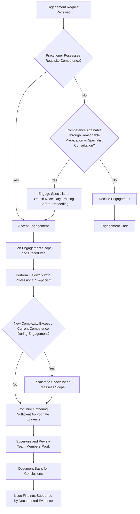

## Competence and Due Professional Care

### Overview

Competence and due professional care constitute foundational ethical obligations requiring fraud examiners and forensic accountants to possess adequate knowledge and skill for the engagements they accept, and to apply that skill with the diligence, thoroughness, and prudent judgment the circumstances demand. These principles appear across the ACFE Code of Professional Ethics, the IESBA Code (as "Professional Competence and Due Care"), and the AICPA Code of Professional Conduct, and they function as a safeguard against both overreach (accepting work beyond one's expertise) and negligence (performing work carelessly within one's expertise).

### Defining the Two Components

**Key Points**

- **Competence** is a threshold, engagement-acceptance question: does the practitioner possess the requisite knowledge, training, credentials, and experience to perform this specific type of engagement?
- **Due professional care** is a performance-standard question: given that the practitioner is competent to accept the engagement, did they apply the level of skill, diligence, and judgment that a reasonably prudent fraud examiner would apply under similar circumstances?
- The IESBA Code frames this as a two-stage obligation: (1) attaining professional competence, and (2) maintaining professional competence, both of which require a commitment to continuing learning and professional development, given the evolving nature of fraud schemes, technology, and legal standards.

### Attaining Professional Competence

Competence is typically built and evidenced through:

- **Formal education**: accounting, auditing, criminology, or related academic training.
- **Professional credentials**: the Certified Fraud Examiner (CFE) credential, Certified Public Accountant (CPA), Certified Internal Auditor (CIA), or specialized credentials such as the Certified in Financial Forensics (CFF) accreditation.
- **Relevant experience**: direct experience conducting fraud examinations, forensic accounting engagements, or related investigative work under appropriate supervision.
- **Engagement-specific expertise**: some engagements require specialized subject-matter knowledge beyond general fraud examination competence (e.g., cryptocurrency tracing, complex derivatives valuation, specific industry regulatory frameworks) that the examiner must possess or obtain through consultation with qualified specialists.

[Inference] The specific combination of credentials, education, and experience considered sufficient for "competence" in a given engagement is inherently context-dependent and not reducible to a single universal checklist; professional judgment is required to assess fit between the examiner's background and the engagement's specific demands.

### Maintaining Professional Competence

Given the dynamic nature of fraud schemes (which evolve alongside technology, business models, and detection methods), maintaining competence requires ongoing effort:

- **Continuing Professional Education (CPE)**: the ACFE requires CFE credential holders to complete a specified number of CPE hours periodically to maintain the credential, reflecting the profession's recognition that static competence degrades over time.
- **Staying current on emerging fraud typologies**: e.g., cryptocurrency-based fraud, business email compromise schemes, deepfake-enabled social engineering, and evolving money laundering techniques.
- **Monitoring changes in relevant law, regulation, and professional standards** that affect fraud examination methodology or admissibility of evidence.

### Due Professional Care in Practice

Due professional care requires the fraud examiner to:

1. **Plan the engagement appropriately**, scoping procedures to the specific allegations, risk factors, and objectives at hand rather than applying a generic, unscoped approach.
2. **Exercise professional skepticism** throughout, neither assuming dishonesty nor unquestioningly accepting representations without corroboration where corroboration is reasonably obtainable.
3. **Gather sufficient and appropriate evidence** to support conclusions, recognizing that conclusions must be defensible under subsequent scrutiny (cross-examination, regulatory review, or peer review).
4. **Properly supervise and review the work of assistants or team members**, ensuring less experienced staff perform procedures correctly and that their work is reviewed before being relied upon in final conclusions.
5. **Document the basis for conclusions** thoroughly enough that a knowledgeable third party could understand the evidence supporting the findings without needing to rely solely on the examiner's personal assurance.
6. **Recognize the limits of one's own expertise** during the engagement itself, escalating or bringing in specialists when the engagement's complexity exceeds the examiner's competence (e.g., engaging a valuation specialist for complex asset tracing, or a digital forensics expert for advanced data recovery).

### Competence and Due Care Workflow

### Competence vs. Due Care: A Comparative View

| Dimension | Competence | Due Professional Care |
| --- | --- | --- |
| Timing focus | Primarily assessed at engagement acceptance | Applied throughout the engagement's performance |
| Nature of failure | Accepting work beyond one's qualifications | Performing qualified work carelessly or incompletely |
| Typical remediation | Decline engagement, obtain training, or bring in a specialist | Improve planning, supervision, documentation, and skepticism |
| Example of violation | A CFE with no digital forensics training personally attempting complex data recovery from an encrypted device | A qualified, experienced examiner failing to follow up on an obvious red flag due to time pressure or inattention |

### The Role of Specialization and Multidisciplinary Engagement Teams

Given the breadth of modern fraud schemes, competence often requires assembling a multidisciplinary team rather than expecting a single practitioner to possess all relevant expertise:

- **Forensic accountants** for financial statement and transaction analysis.
- **Digital forensics specialists** for electronic evidence recovery and analysis.
- **Valuation experts** for asset tracing and damages quantification.
- **Legal counsel** for privilege, evidentiary admissibility, and regulatory compliance guidance.
- **Industry specialists** for sector-specific schemes (e.g., healthcare billing fraud, construction cost fraud, financial derivatives fraud).

Recognizing when an engagement's complexity exceeds an individual's or a firm's internal competence, and appropriately bringing in such specialists, is itself an application of the due care principle rather than an admission of inadequacy.

[Unverified] The specific point at which an engagement's complexity is deemed to "exceed" an examiner's competence, triggering an obligation to bring in specialists, is a matter of professional judgment rather than a bright-line, quantifiable threshold defined in the ethics codes themselves.

**Example**

A CFE with a strong background in traditional accounts-payable and payroll fraud schemes is engaged to investigate suspected fraud involving a company's cryptocurrency treasury holdings, where funds appear to have been diverted through a series of wallet transfers. Recognizing that blockchain transaction tracing and cryptocurrency forensics require specialized technical knowledge outside their core competence, the examiner — consistent with the due care obligation to recognize the limits of one's expertise — brings in a blockchain forensics specialist to handle the technical tracing while the CFE continues to lead the overall investigation, evidence coordination, and financial statement impact analysis. This division of labor reflects appropriate application of both competence (declining to personally perform work outside one's expertise) and due care (ensuring the overall engagement is adequately resourced to reach a defensible conclusion).

### Consequences of Competence and Due Care Failures

- **Flawed or indefensible conclusions**: findings based on inadequate expertise or careless procedures may be successfully challenged in litigation, arbitration, or regulatory proceedings, undermining the engagement's purpose.
- **Professional liability exposure**: a fraud examiner who accepts work beyond their competence, or who performs qualified work negligently, may face professional negligence claims from the engaging party or affected third parties.
- **Disciplinary action**: the ACFE, AICPA, or relevant licensing board may impose disciplinary measures, including credential suspension or revocation, for demonstrated failures to meet competence or due care standards.
- **Reputational harm to the profession**: high-profile instances of incompetent or careless fraud examination work can contribute to the broader "expectation gap" and erode public confidence in fraud examination and forensic accounting generally.

### Common Pitfalls

- Accepting an engagement primarily due to client relationship or financial incentive despite recognizing a competence gap, rationalizing that "it will probably be fine."
- Failing to pursue continuing education, resulting in outdated knowledge of fraud schemes, technology, or legal standards that renders procedures ineffective against modern techniques.
- Rushing engagements due to client-imposed time or budget pressure in a manner that compromises the thoroughness of evidence-gathering.
- Inadequate supervision of junior staff, resulting in unreviewed procedural gaps that surface only after conclusions have already been communicated.
- Overconfidence in generalist fraud examination skills when a specific engagement genuinely requires specialized technical expertise (e.g., complex IT systems, international asset tracing, sophisticated financial instruments).

**Conclusion**

Competence and due professional care function as complementary safeguards spanning the full lifecycle of a fraud examination engagement: competence governs the threshold decision of whether to accept an engagement at all, given the practitioner's knowledge, credentials, and experience, while due professional care governs the diligence, skepticism, and rigor applied throughout the engagement's actual performance. Because fraud examination conclusions frequently carry significant legal, financial, and reputational consequences for the individuals and organizations involved, the profession — through the ACFE, IESBA, and AICPA codes alike — treats these as non-negotiable ethical obligations rather than aspirational best practices, with recognized remediation paths (specialist consultation, additional training, appropriate scope limitation) available when an examiner identifies a genuine competence gap before or during an engagement.

**Related Topics**

- Certified Fraud Examiner (CFE) credentialing and CPE requirements
- Multidisciplinary team structuring for complex forensic engagements
- Professional negligence standards applicable to fraud examiners
- Continuing education requirements across ACFE, AICPA, and IESBA frameworks
- Emerging fraud typologies requiring specialized competence (cryptocurrency, deepfakes, BEC schemes)
- Documentation standards for defensible forensic conclusions
- Comparative analysis: IESBA "Professional Competence and Due Care" vs. ACFE due diligence requirements