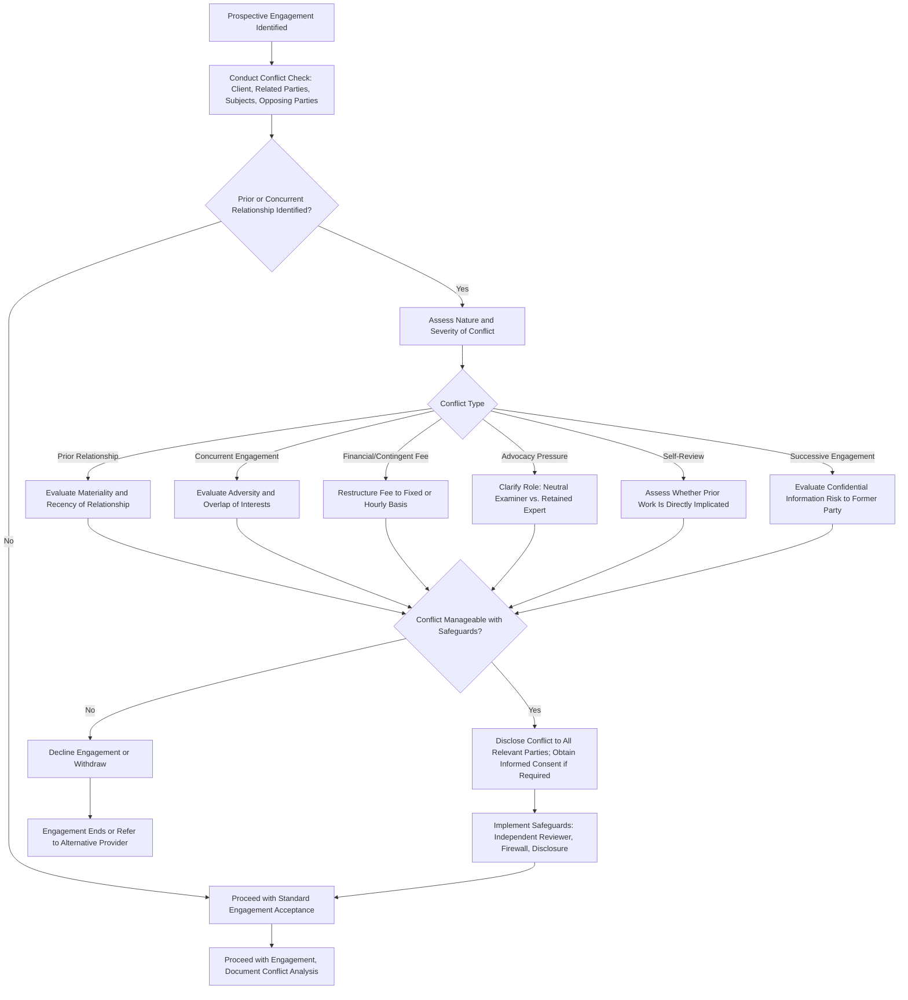

## Conflicts of Interest in Forensic Engagements

### Overview

Conflicts of interest in forensic engagements arise when a fraud examiner's or forensic accountant's personal, financial, or professional interests could improperly influence — or reasonably appear to influence — their judgment, objectivity, or loyalty during an examination. This topic extends the independence and objectivity principles into a more granular, practical framework specifically addressing how conflicts arise, how they are identified, and how they are managed or resolved across the range of relationships forensic accountants encounter: clients, subjects of investigation, opposing parties in litigation, and even prior engagements.

### Defining Conflict of Interest in the Forensic Context

**Key Points**

- A conflict of interest exists when a professional relationship or circumstance creates an incentive, whether financial, personal, or professional, that could compromise the objectivity of the examiner's work or the loyalty owed to the client.
- Conflicts are evaluated not only on whether actual bias occurs, but on whether a **reasonable and informed third party** would conclude that the examiner's objectivity was likely compromised — an appearance standard consistent with the independence-in-appearance concept discussed in the broader ethics framework.
- Forensic engagements are particularly conflict-prone because they often involve **multiple parties with adverse interests** (e.g., a company and a terminated employee, insurer and claimant, plaintiff and defendant in litigation), each of whom may have a stake in the examiner's conclusions.

### Categories of Conflicts of Interest in Forensic Engagements

#### 1. Prior Relationship Conflicts

The examiner, or their firm, has a pre-existing personal, financial, or professional relationship with the client, a related party, or the subject of the investigation (e.g., a former employer, a close friend, a family member, or a prior consulting client).

#### 2. Concurrent Engagement Conflicts

The examiner or firm simultaneously serves, or has recently served, another party with adverse or competing interests in the same or a related matter (e.g., previously consulting for the opposing party in related litigation, or currently auditing a company while being engaged to investigate that same company's management).

#### 3. Self-Interest and Financial Conflicts

The examiner has a financial stake in the outcome of the engagement beyond the standard professional fee — most notably, **contingent fee arrangements** tied to the amount of fraud recovered, or fees indexed to a favorable litigation outcome, both of which the ACFE Code specifically discourages given the direct incentive created to skew findings.

#### 4. Advocacy Conflicts

The examiner is retained by one party (often through legal counsel) in an adversarial context and faces pressure — explicit or implicit — to reach or emphasize conclusions favorable to the retaining party rather than following the evidence neutrally, a particular risk in litigation support and expert witness engagements.

#### 5. Self-Review Conflicts

The examiner or their firm previously performed work relevant to the matter under examination (e.g., designed the very internal controls now being tested, or previously performed an audit or consulting engagement whose adequacy is now in question), creating an incentive to avoid findings that would implicitly criticize the examiner's own prior work.

#### 6. Successive Engagement Conflicts

The examiner previously represented or consulted for a party now adverse to the current client in a related matter, raising concerns about confidential information obtained in the prior engagement being used to the detriment of the former party.

### Conflict Identification and Management Workflow

### Disclosure and Informed Consent

Where a conflict is identified but assessed as manageable, standard practice — consistent across ACFE, IESBA, and AICPA frameworks — generally requires:

1. **Full disclosure** of the nature of the conflict to all relevant parties (the client, and in some contexts, the subject of investigation or other affected parties).
2. **Informed consent**, where the affected party, having been made aware of the conflict's nature and potential implications, agrees to proceed with the engagement despite the conflict.
3. **Safeguard implementation**, such as assigning an independent reviewer, establishing information barriers ("firewalls") between conflicted and non-conflicted team members, or restructuring the engagement scope to exclude the conflicted area.

[Inference] Whether disclosure alone is sufficient, or whether affirmative informed consent is additionally required, depends on the severity of the conflict and the specific professional or regulatory framework governing the engagement; some conflicts (e.g., certain self-review or advocacy conflicts in litigation contexts) may be considered non-consentable regardless of disclosure, requiring decline or withdrawal instead.

### Litigation Support and Expert Witness Context

Forensic accountants frequently serve as retained experts in litigation, a context with heightened conflict sensitivity:

- **Retained expert vs. neutral examiner distinction**: an expert retained by one party in litigation is understood to be advocating within the bounds of professional ethics for that party's position based on the evidence, which differs from a neutral internal fraud examiner's presumption-of-innocence stance. This distinction itself must be clearly understood and disclosed, since conflating the two roles risks misleading the trier of fact about the nature of the expert's independence.
- **Court-appointed or jointly retained experts** face a different, heightened independence standard, as their role is explicitly to provide neutral, unbiased analysis to the court or to both parties jointly, making conflicts of interest particularly consequential in that specific context.
- **Prior consulting relationships with either party** in the same or related litigation must be disclosed during the expert qualification process (e.g., under discovery rules in the relevant jurisdiction), and undisclosed conflicts discovered later can result in the expert's testimony being excluded or significantly discredited.

[Unverified] The specific procedural rules governing expert witness conflict disclosure (e.g., required disclosures under discovery rules, Daubert-type admissibility challenges) vary by jurisdiction and court system; forensic accountants serving as expert witnesses should consult retaining counsel regarding jurisdiction-specific disclosure obligations rather than relying solely on the ethics codes.

### Internal vs. External Examiner Conflict Considerations

| Dimension | Internal Fraud Examiner | External Forensic Accountant |
| --- | --- | --- |
| Common conflict source | Ongoing employment relationships, reporting lines to potentially implicated executives | Prior client relationships, concurrent engagements with related or adverse parties |
| Structural safeguard | Independent reporting line to audit committee; escalation protocols bypassing implicated management | Formal conflict check processes at the firm level before engagement acceptance |
| Self-review risk | Examining controls or processes the examiner previously helped design or operate | Reviewing prior audit or consulting work performed by the same firm |
| Typical mitigation | Recusal and reassignment to a different internal examiner or external specialist | Engagement letter disclosures, ethical walls, or engagement decline |

### Firm-Level Conflict Management

Beyond individual practitioner conflicts, forensic accounting firms typically implement systemic conflict management processes:

- **Conflict check databases** cross-referencing prospective engagements against current and past clients, related parties, and known adverse parties across the firm.
- **Engagement partner sign-off** requiring documented conflict analysis before engagement acceptance.
- **Information barriers ("Chinese walls")** between teams serving potentially conflicting clients within the same firm, particularly relevant for large multi-service firms that may provide audit, consulting, and forensic services to related or competing entities.

**Example**

A forensic accounting firm is approached to investigate suspected embezzlement at a mid-sized construction company. During the conflict check process, the firm identifies that it previously performed a due diligence engagement for a competitor bidding to acquire the same construction company two years prior, during which confidential financial information about the target was reviewed. While the current engagement (investigating internal fraud) and the prior engagement (acquisition due diligence for a different party) do not directly overlap in subject matter, the firm's ethics committee evaluates whether confidential information obtained during the prior engagement could improperly inform or influence the current investigation, and whether the construction company (now the prospective client) would reasonably view this history as a conflict if disclosed. The firm determines the conflict is manageable: it discloses the prior engagement to the construction company, obtains informed consent to proceed, and assigns an entirely different engagement team with no access to the prior due diligence files, documenting this information barrier in the engagement acceptance file.

### Consequences of Unmanaged Conflicts

- **Findings challenged or excluded**: in litigation, an undisclosed conflict discovered during discovery or cross-examination can result in an expert's testimony being struck or given substantially reduced weight.
- **Loss of engagement or client relationship**: a client discovering an undisclosed conflict after the fact may terminate the relationship and pursue damages for breach of professional duty.
- **Disciplinary action**: professional bodies (ACFE, AICPA, state boards) may discipline practitioners who accept or continue engagements despite disqualifying, non-consentable conflicts.
- **Reputational damage to the firm**: conflict-of-interest failures, particularly in high-profile matters, can generate lasting reputational harm extending beyond the specific engagement.

### Common Pitfalls

- Relying on informal memory of prior client relationships rather than systematic conflict-check databases, particularly in larger firms with many engagements.
- Accepting a contingent fee arrangement under client pressure, rationalizing it as acceptable due to the client's insistence, despite the ACFE Code's clear caution against such arrangements.
- Failing to reassess conflicts when an engagement's scope expands mid-course (e.g., an investigation initially limited to one department later expanding to implicate a party with whom the examiner has an undisclosed relationship).
- Conflating the "retained expert" advocacy role in litigation with the "neutral examiner" role in internal investigations, leading to methodological or ethical confusion about the appropriate standard of objectivity to apply.

**Conclusion**

Conflicts of interest in forensic engagements demand a structured identification-disclosure-safeguard process precisely because forensic conclusions routinely determine high-stakes outcomes — termination, litigation exposure, criminal referral, or contractual disputes — for multiple parties with often directly adverse interests. The framework distinguishes several conflict categories (prior relationships, concurrent engagements, financial self-interest, advocacy pressure, self-review, and successive engagements), each requiring a tailored assessment of materiality and manageability, with contingent fee arrangements and certain advocacy or self-review conflicts treated with particular caution or as potentially non-consentable. Robust firm-level conflict-check processes, combined with individual practitioner vigilance and a clear-eyed distinction between neutral-examiner and retained-expert roles, are what allow forensic accountants to maintain both the reality and the appearance of objectivity that their conclusions depend upon.

**Related Topics**

- IESBA conceptual framework for independence threats and safeguards
- Contingent fee prohibitions in fraud examination engagements
- Expert witness qualification and Daubert-type admissibility standards
- Firm-level conflict check systems and information barriers
- Distinction between neutral internal examiners and retained litigation experts
- Successive representation conflicts and confidential information risk
- ACFE, IESBA, and AICPA comparative conflict-of-interest provisions