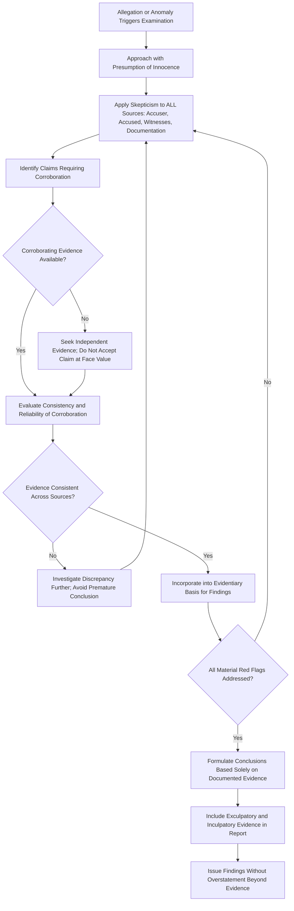

## Professional Skepticism in Fraud Examinations

### Overview

Professional skepticism in fraud examinations refers to the mindset and methodological discipline requiring examiners to maintain a questioning attitude, critically assess evidence, and avoid unwarranted assumptions of either guilt or innocence throughout an investigation. While the concept originates in auditing standards (ISA 200, ISA 240), its application in fraud examination is distinct and, in several respects, more demanding: examiners must balance active suspicion sufficient to uncover concealed wrongdoing against the ethical requirement to maintain objectivity and the presumption of innocence until evidence establishes otherwise.

### Defining Professional Skepticism in the Examination Context

**Key Points**

- Professional skepticism is commonly defined as an attitude that includes a questioning mind, being alert to conditions that may indicate possible misstatement or fraud, and a critical assessment of evidence.
- In fraud examination specifically, skepticism operates on two levels simultaneously: skepticism toward the possibility that fraud has occurred (avoiding complacency or premature dismissal of red flags), and skepticism toward any particular conclusion about who committed it (avoiding premature or biased attribution of guilt).
- This dual application distinguishes fraud examination skepticism from general audit skepticism, which is primarily oriented toward the risk of material misstatement in financial statements rather than toward the guilt or innocence of specific individuals.

### The Two Failure Modes Skepticism Guards Against

#### 1. Excessive Trust (Under-Skepticism)

- Accepting management or employee explanations at face value without corroboration, particularly regarding unusual transactions, missing documentation, or inconsistent records.
- Assuming that a long-standing, trusted, or senior employee is unlikely to commit fraud, a bias often exploited by perpetrators who deliberately cultivate trust and reputation to reduce scrutiny.
- Failing to follow up on red flags because doing so would be socially or professionally uncomfortable, particularly when the suspected individual is well-regarded or influential within the organization.

#### 2. Presumptive Guilt (Over-Suspicion Without Evidentiary Basis)

- Approaching an examination with a predetermined conclusion about a suspect's guilt, then selectively interpreting evidence to confirm that conclusion (confirmation bias) while disregarding exculpatory evidence.
- Allowing a referring party's (e.g., a manager's or HR's) initial accusation to substitute for independent evidence-gathering.
- Applying disproportionate scrutiny to certain individuals based on demographic, personality, or unrelated behavioral factors rather than evidence-based indicators.

[Inference] Both failure modes are recognized as significant risks in fraud examination literature and ACFE training materials; the relative prevalence of each in practice likely varies by examiner experience, organizational culture, and the specific circumstances triggering the examination, though this is not precisely quantifiable from the standards themselves.

### Professional Skepticism vs. Presumption of Innocence: Reconciling the Two

A common conceptual tension exists between "maintaining skepticism" (which implies active suspicion) and "presuming innocence" (which implies neutrality). The ACFE's methodological resolution:

- Skepticism is directed at **evidence and explanations**, not at the individual's character or presumed guilt.
- The examiner should be skeptical of *any* unverified claim — whether it comes from the accused, a witness, or the party alleging fraud — rather than skeptical specifically and only toward the suspected individual.
- The presumption of innocence governs the examiner's overall orientation and conclusion-drawing process; professional skepticism governs the rigor applied to *testing* every piece of evidence encountered, regardless of which "side" it appears to support.

### Practical Indicators Requiring Skeptical Follow-Up (Red Flags)

Fraud examination methodology commonly directs skeptical attention toward:

- Unusual or unexplained discrepancies in documentation (altered dates, inconsistent signatures, sequential gaps in numbering).
- Transactions lacking adequate business purpose or economic substance.
- Employees who resist segregation of duties, refuse to take vacation, or exhibit unusual control over specific processes.
- Behavioral indicators sometimes associated with deception during interviews (though examiners must apply substantial caution here, as behavioral cues alone are not reliable standalone evidence of guilt).
- Lifestyle changes inconsistent with known compensation (a classic fraud triangle "opportunity realized" indicator, though this too requires corroboration rather than standing alone as proof).

[Speculation] The reliability of behavioral or demeanor-based indicators (e.g., nervousness, avoidance of eye contact) as evidence of deception during interviews is a subject of ongoing debate in investigative and psychological literature; well-trained fraud examiners are generally cautioned against relying on such indicators in isolation, treating them at most as prompts for further factual inquiry rather than as evidence of guilt in themselves.

### Skepticism Application Workflow

### Skepticism in Specific Examination Activities

#### Interviewing

- Skepticism requires probing inconsistencies in a subject's or witness's account without presuming the inconsistency proves deception (inconsistencies can arise from memory limitations, misunderstanding, or genuine error, not only from dishonesty).
- The ACFE's widely referenced interview methodology (often summarized as informational, then increasingly focused, non-accusatory questioning progressing toward an admission-seeking phase only when warranted by evidence) is itself structured to prevent premature accusation before sufficient evidence has been gathered.

#### Document Examination

- Skepticism requires verifying the authenticity and completeness of documents provided, rather than assuming produced documents represent the complete and unaltered record (recognizing that concealment often involves selective production or alteration of records).
- Cross-referencing documents against independent third-party sources (bank records, vendor confirmations, public records) where the risk of internally fabricated or altered documentation is elevated.

#### Data Analysis

- Applying skepticism to data itself — verifying that extracted data has not been filtered, altered, or incompletely provided by a party with an interest in the examination's outcome.
- Being alert to anomalies surfaced through analytics (e.g., Benford's Law deviations, duplicate payments, round-dollar transactions) as prompts for further inquiry rather than as conclusive proof of fraud in themselves.

### Comparative Note: Auditor Skepticism vs. Fraud Examiner Skepticism

| Dimension | External Auditor Skepticism (ISA 240) | Fraud Examiner Skepticism (ACFE Methodology) |
| --- | --- | --- |
| Primary object of skepticism | Risk of material misstatement in financial statements | Truthfulness of specific factual claims and the existence/scope of a specific suspected fraud |
| Orientation toward individuals | Generally not directed at determining a specific individual's guilt | Directly engages with determining whether and by whom fraud was committed |
| Standard trigger | Applied continuously across the entire audit as a general mindset | Often triggered by a specific allegation, tip, or anomaly requiring focused investigation |
| Relationship to interviewing | Auditor inquiries are one audit evidence source among many | Structured interviewing (informational to admission-seeking) is a core, specialized examination technique |

**Example**

An HR manager reports suspected time-card fraud by a warehouse supervisor, alleging the supervisor has been approving inflated hours for a friend on the team. A fraud examiner applying professional skepticism does not simply accept the HR manager's account as established fact, recognizing that the HR manager's own motivations and completeness of information require independent verification, just as the supervisor's eventual explanation will. The examiner independently pulls badge-swipe data, security camera footage timestamps, and system login records rather than relying solely on the time-card system the supervisor controls (recognizing the supervisor's control over that system as a red flag warranting corroboration from independent sources). During this process, the examiner discovers that the "friend" in question was, in several instances, working from a client site not tracked by the badge system, and the supervisor's approvals — while unusual in form — were substantively accurate. Because skepticism was applied to the original allegation as rigorously as it would have been applied to the supervisor's defense, the examiner avoids an unwarranted conclusion of fraud and instead identifies a legitimate process gap (a client-site time-tracking mechanism) as the actual root cause.

### Consequences of Skepticism Failures

- **Under-skepticism**: allows fraud to continue undetected, potentially escalating in scope and financial impact, and can expose the examiner and organization to claims of negligent investigation if red flags were identifiable but ignored.
- **Over-suspicion / confirmation bias**: can result in wrongful termination, reputational harm to an innocent individual, defamation exposure, and successful legal challenges to any disciplinary or legal action taken based on the flawed examination.
- Both failure modes can undermine the evidentiary weight and legal defensibility of the examination's conclusions if challenged in litigation, arbitration, or regulatory review.

### Common Pitfalls

- Treating an initial referral or tip as established fact rather than as one input requiring independent verification.
- Allowing organizational hierarchy or personal reputation of a suspect to reduce the rigor of scrutiny applied ("they would never do that").
- Stopping the investigation once evidence consistent with a preferred conclusion is found, rather than continuing to test for alternative explanations.
- Relying on a single source of corroboration (e.g., one witness statement) as sufficient, particularly where that source has a potential motive to mislead.
- Conflating discomfort or evasiveness during an interview with proof of guilt, absent corroborating factual evidence.

**Conclusion**

Professional skepticism in fraud examinations operates as a disciplined, evenly applied questioning mindset directed at every source of information encountered — accuser, accused, witnesses, and documentary or electronic evidence alike — rather than as suspicion selectively directed at a presumed wrongdoer. Its dual function, guarding simultaneously against excessive trust that allows fraud to go undetected and against premature or biased conclusions that presume guilt before evidence warrants it, distinguishes it from the more narrowly financial-statement-oriented skepticism required of external auditors. Properly applied, skepticism and the presumption of innocence are not in tension but work together: skepticism supplies the rigor with which every claim is tested, while the presumption of innocence ensures that rigor is applied even-handedly until the evidence itself, rather than initial assumption, determines the examination's conclusion.

**Related Topics**

- ACFE structured interviewing methodology (informational to admission-seeking phases)
- Confirmation bias and cognitive bias mitigation in investigative work
- Benford's Law and data analytics as skepticism-driven investigative tools
- Document authentication techniques in forensic examinations
- Fraud triangle indicators (pressure, opportunity, rationalization) as skepticism triggers
- Comparative analysis: ISA 240 auditor skepticism vs. ACFE examiner skepticism
- Legal defensibility of fraud examination conclusions in litigation contexts