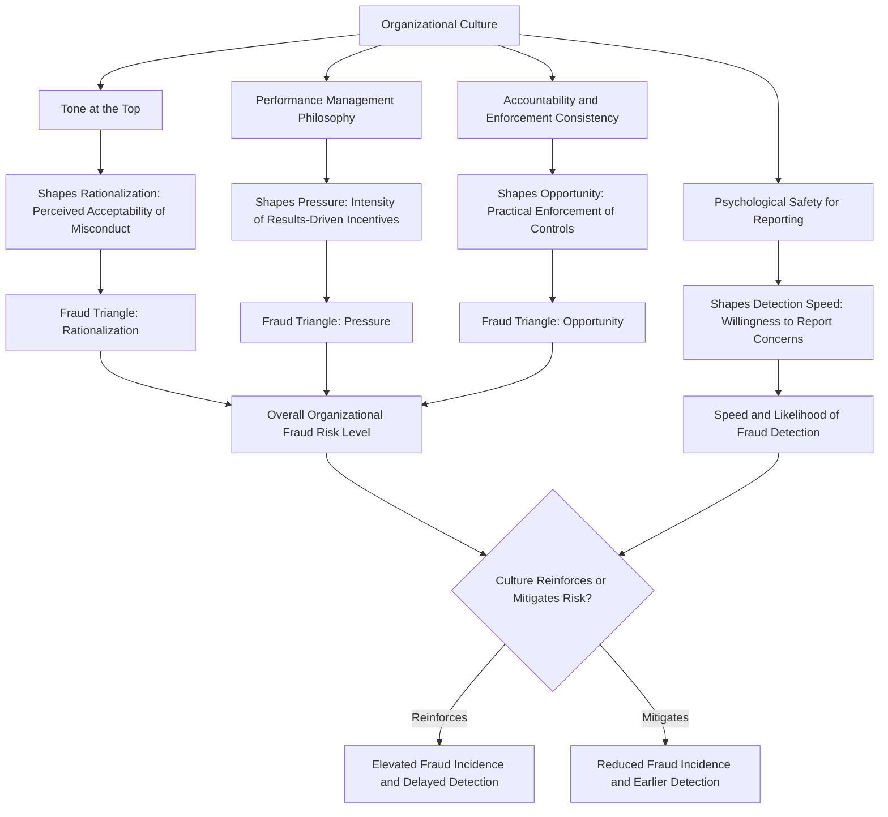

## Organizational Culture and Fraud Risk

### Overview

Organizational culture and fraud risk examines how the shared values, norms, leadership behaviors, and unwritten rules within an entity influence the likelihood that fraud will occur, go undetected, or be tolerated once discovered. While formal controls (segregation of duties, authorization limits, reconciliations) address the *opportunity* dimension of the Fraud Triangle, organizational culture operates primarily on the *rationalization* dimension and significantly shapes the perceived *pressure* environment, making it one of the most influential — yet hardest to measure and control — determinants of an organization's overall fraud risk profile.

### Conceptual Foundation

**Key Points**

- Organizational culture is commonly understood as the shared assumptions, values, and behavioral norms that shape how members of an organization act, particularly in ambiguous or unmonitored situations where formal rules do not provide explicit guidance.
- The COSO Internal Control–Integrated Framework designates the **Control Environment** as the foundational component of internal control, explicitly stating that the control environment sets the tone of an organization, influencing the control consciousness of its people, and is the foundation for all other components of internal control.
- "Tone at the top" — the ethical climate established and demonstrated by senior leadership and the board — is widely recognized in fraud examination literature as a primary driver of the broader organizational culture that either restrains or enables fraudulent behavior.

### Culture's Influence on the Fraud Triangle

#### Rationalization

Organizational culture most directly shapes rationalization — the internal justification an individual constructs to reconcile fraudulent conduct with their self-image as a fundamentally honest person.

- A culture that normalizes minor ethical compromises (e.g., inflating expense reports "because everyone does it," or manipulating minor performance metrics) can lower the psychological barrier to larger-scale fraud by establishing a precedent of tolerated dishonesty.
- Cultures characterized by perceived unfairness (e.g., employees believing they are underpaid relative to peers, or passed over unjustly for promotion) can generate rationalizations framed around "entitlement" or "getting what I'm owed."

#### Pressure

While pressure often originates from external circumstances (financial hardship, gambling debts, addiction), organizational culture can *generate or intensify* internal pressure:

- Aggressive, unrealistic performance targets combined with a culture that punishes missed targets severely can create intense pressure to manipulate results rather than report shortfalls honestly.
- A "win at all costs" sales or performance culture can pressure employees toward misconduct to meet quotas, particularly where compensation is heavily incentive-based.

#### Opportunity

Culture indirectly affects opportunity through its influence on control adherence:

- A culture with weak accountability, where control violations are routinely overlooked or unenforced, effectively expands the practical opportunity for fraud even where formal controls exist on paper.
- Conversely, a culture of genuine accountability — where control breaches are consistently addressed regardless of the violator's seniority — narrows the practical opportunity gap even when formal controls are imperfect.

[Inference] The relative weighting of culture's influence across the three fraud triangle elements is a matter of professional and academic interpretation rather than a precisely measurable allocation; the framework above reflects commonly cited fraud examination perspectives (e.g., materials associated with the ACFE and COSO) rather than a single universally quantified model.

### Characteristics of High-Fraud-Risk Cultures

Fraud examination and organizational behavior literature commonly identify the following cultural indicators as associated with elevated fraud risk:

- **Weak or inconsistent tone at the top**, where leadership espouses ethical values verbally but does not model them in practice (e.g., executives who circumvent expense policies or pressure subordinates to "make the numbers work").
- **Excessive emphasis on results over process**, where achieving targets is rewarded regardless of the methods used to achieve them, and questions about methodology are discouraged or penalized.
- **Fear-based or retaliatory environments**, where employees who raise concerns about questionable practices face professional or social retaliation, suppressing the natural whistleblowing mechanism that might otherwise surface fraud early.
- **Excessive trust and lack of accountability**, particularly around long-tenured or high-performing employees, who may be exempted from scrutiny or control requirements applied to others.
- **Diffusion of responsibility**, where unclear ownership of ethical and control obligations allows individuals to rationalize inaction or complicity ("it's not my job to police this").
- **Normalization of minor rule-breaking**, where small, seemingly inconsequential violations of policy are tolerated, gradually eroding the perceived seriousness of larger violations.

### Characteristics of Low-Fraud-Risk (Ethical) Cultures

- **Consistent tone at the top**, where leadership visibly models the ethical standards it espouses and holds itself accountable to the same standards applied to others.
- **Psychological safety for reporting concerns**, supported by credible, well-publicized, and genuinely non-retaliatory whistleblower mechanisms.
- **Balanced performance management**, where results and the integrity of methods used to achieve them are both explicitly valued and evaluated.
- **Visible and consistent consequences** for ethical violations, applied uniformly regardless of the violator's seniority or performance contribution.
- **Regular, substantive ethics communication** that goes beyond a static code of conduct document to include ongoing training, discussion of real (anonymized) case examples, and leadership engagement.

### Culture-Fraud Risk Relationship Model

### Assessing Organizational Culture as Part of Fraud Risk Assessment

Because culture is qualitative and harder to measure than formal controls, fraud risk assessments increasingly incorporate culture-specific evaluation techniques:

- **Employee surveys and ethics climate assessments**, measuring perceived tone at the top, comfort reporting concerns, and perceived consequences for misconduct.
- **Whistleblower hotline data analysis**, where usage patterns (volume, types of concerns raised, substantiation rates) can serve as an indirect proxy for the health of the reporting culture.
- **Exit interview analysis**, which can surface cultural concerns that departing employees are more willing to disclose than current employees.
- **Review of performance management and compensation structures**, evaluating whether incentive design creates disproportionate pressure relative to the ethical safeguards in place.
- **Direct observation and interviews with internal audit or compliance personnel**, who often have visibility into how consistently policies are actually enforced versus how they are formally documented.

[Unverified] The specific methodologies and metrics used to quantify "culture risk" vary significantly across organizations and consulting frameworks; no single universally standardized measurement instrument for organizational fraud-risk culture exists comparable to, for example, a standardized financial ratio.

### Culture's Role in Detection and Response, Not Just Prevention

Organizational culture influences not only whether fraud occurs but how quickly it is detected and how effectively the organization responds:

- The ACFE's Report to the Nations has, across multiple survey cycles, identified tips (often from employees) as the most common detection method for occupational fraud — a detection channel directly dependent on a culture that encourages and protects reporting.
- A culture that punishes or ostracizes whistleblowers, even informally, suppresses this primary detection mechanism regardless of how well-designed the formal hotline infrastructure may be.
- Post-discovery culture also matters: an organization with a genuinely accountable culture investigates and remediates findings thoroughly regardless of the perpetrator's seniority, while a culture prioritizing reputation management over accountability may minimize, delay, or suppress findings involving influential individuals.

**Example**

A regional bank's sales division operates under an intense, publicly ranked performance culture where branch managers who miss quarterly cross-selling targets face public criticism in company-wide meetings, while top performers are celebrated regardless of how targets were met. Over several years, this culture — combined with weak enforcement of account-opening verification procedures — contributes to a scheme in which employees open unauthorized accounts in customers' names to inflate their sales figures. When early internal complaints from customers are raised, they are handled as isolated customer service issues rather than escalated as a systemic control or cultural concern, partly because the sales division's leadership, whose own compensation depends on division performance, has limited incentive to investigate the root cause. This scenario illustrates how a "results over process" culture combined with weak accountability and a suppressed reporting channel can allow a fraud scheme to scale significantly before detection, ultimately surfacing not through internal controls but through external complaints and regulatory scrutiny.

### Leadership's Role in Shaping Culture

- **Modeling behavior**: leaders who visibly adhere to the same policies and controls expected of all employees (e.g., submitting expense reports through the same process, complying with the same approval thresholds) reinforce that ethical standards are not situational.
- **Communication consistency**: aligning what leadership says about ethics and integrity with what leadership actually rewards and tolerates in practice; a mismatch between stated values and revealed behavior is a well-recognized driver of cultural cynicism.
- **Response to violations**: how leadership responds to identified misconduct — particularly involving high performers or senior individuals — sends a strong signal throughout the organization about whether ethical standards are genuinely enforced or selectively applied.

### Common Pitfalls in Addressing Culture-Related Fraud Risk

- Treating a code of conduct document or annual ethics training as sufficient to establish a healthy culture, without addressing underlying incentive structures or enforcement consistency.
- Failing to recognize that culture, once measured as problematic, requires sustained, visible leadership action to change rather than a one-time communication or policy update.
- Overlooking how compensation and performance evaluation design can create cultural pressure that undermines stated ethical values, even when the stated values themselves are well-articulated.
- Assuming a "strong culture" at the corporate level automatically extends uniformly to all divisions, subsidiaries, or geographic locations, when subcultures (e.g., within a specific sales unit or foreign subsidiary) may diverge significantly from the stated organizational norm.

**Conclusion**

Organizational culture functions as a pervasive, often underappreciated determinant of fraud risk, operating principally through its influence on the rationalization and pressure dimensions of the fraud triangle while also shaping the practical, day-to-day enforcement of formal controls that govern opportunity. Because culture is difficult to observe and measure directly, fraud risk assessments increasingly rely on proxy indicators — employee surveys, whistleblower data patterns, incentive structure reviews, and tone-at-top consistency — to evaluate cultural risk alongside traditional control testing. Critically, culture influences not only whether fraud occurs but how quickly and effectively it is detected and remediated, given that employee tips remain the most commonly cited fraud detection channel in industry surveys, making a genuinely safe and accountable reporting culture one of the highest-leverage, if hardest-to-engineer, elements of an effective anti-fraud program.

**Related Topics**

- Tone at the top and its measurement in fraud risk assessments
- ACFE Report to the Nations: detection methods and the role of tips
- Whistleblower hotline design and non-retaliation policy effectiveness
- Compensation and incentive structure design as a fraud risk factor
- Fraud triangle and fraud diamond (adding "capability") theoretical models
- Subculture divergence risk in multinational or decentralized organizations
- COSO control environment principle and its linkage to organizational culture