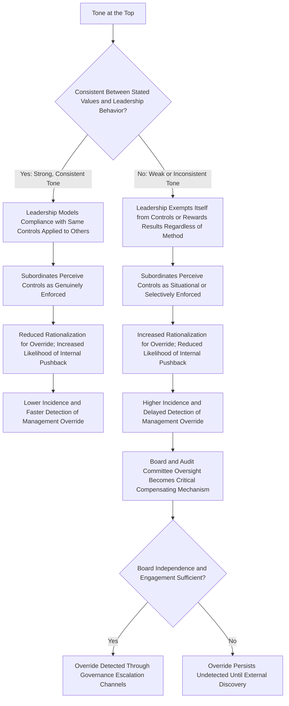

## Management Override and Tone at the Top

### Overview

Management override of controls refers to management's ability to circumvent otherwise properly designed and operating internal controls, typically by using their authority to bypass, ignore, or manipulate control procedures for illegitimate purposes. Tone at the top refers to the ethical climate established and demonstrated by senior leadership and the board of directors. These two concepts are treated together because they exist in a direct causal relationship: weak or inconsistent tone at the top is the primary organizational condition that enables management override to occur, be tolerated, or go unchallenged, while strong tone at the top is the most effective structural deterrent against it.

### Management Override of Controls: Conceptual Foundation

**Key Points**

- Auditing standards (ISA 240, AU-C 240, PCAOB AS 2401) explicitly recognize management override as a **presumed fraud risk in every audit**, requiring specific procedures regardless of the auditor's engagement-specific risk assessment, because management is often in a position to directly or indirectly manipulate accounting records and present fraudulent financial information by overriding controls that otherwise appear to be operating effectively.
- Override differs conceptually from a simple **control deficiency**: a deficiency means a control is poorly designed or not operating as intended; override means management deliberately circumvents a control that is otherwise well-designed and could have functioned effectively.
- Because senior management typically possesses the authority to instruct subordinates, approve exceptions, and access or modify financial systems, override can occur in unpredictable ways that are difficult to anticipate through standard control design alone.

### Common Mechanisms of Management Override

- **Directing subordinates to bypass approval procedures**, using positional authority to instruct employees to process transactions without required documentation or authorization.
- **Manipulating accounting estimates and judgments**, such as adjusting reserves, allowances, or impairment assessments to achieve a desired financial outcome rather than reflecting the most accurate estimate supportable by available information.
- **Recording fictitious or backdated transactions**, particularly near period-end, to meet earnings targets or debt covenant requirements.
- **Suppressing or altering information provided to the board, audit committee, or external auditors**, including selective disclosure or withholding of unfavorable information.
- **Exploiting exception-handling authority**, using legitimate override permissions (which exist in most systems for genuine business exceptions) for illegitimate purposes, exploiting the fact that override capability itself is often a necessary and appropriate feature of a functioning control system.

[Inference] The specific mechanisms most likely to be employed vary by industry, organizational structure, and the specific financial reporting or asset misappropriation objective involved; the list above reflects commonly cited override techniques in fraud examination and auditing literature rather than an exhaustive enumeration.

### Why Standard Controls Cannot Fully Prevent Override

A structural reality underlying the auditor's presumed-risk treatment of override: many internal controls are designed on the assumption that the person executing or approving a transaction is acting in good faith within their authorized role. When the person with override authority is precisely the one perpetrating or facilitating fraud, the control's normal operation is defeated from within rather than circumvented from outside. This is why:

- **Segregation of duties**, while effective against lower-level employee fraud, is less effective when senior management can direct or coerce multiple parties within the segregated chain.
- **Authorization limits** are ineffective when the override originates from the very authority responsible for granting or approving exceptions to those limits.
- **Detective controls** (reconciliations, variance analysis) may be manipulated or suppressed if management controls the reporting or review process itself.

### Tone at the Top: Conceptual Foundation

- Tone at the top is the ethical climate, communicated both explicitly (through stated policies, codes of conduct, and communications) and implicitly (through observed leadership behavior, incentive structures, and responses to misconduct), that senior leadership and the board establish for the organization.
- The COSO Internal Control–Integrated Framework designates the control environment — of which tone at the top is the central driver — as the foundational component upon which all other internal control components (risk assessment, control activities, information and communication, monitoring) depend.
- Tone at the top operates on two levels: the **explicit tone** (formal codes of conduct, ethics policies, stated commitments) and the **implicit or revealed tone** (what leadership actually does, rewards, and tolerates in practice) — with fraud examination literature consistently emphasizing that the implicit, revealed tone is the more powerful determinant of actual organizational behavior.

### The Tone-Override Relationship

### The Board and Audit Committee as the Compensating Control for Tone-Driven Override Risk

Because management override originates at or near the top of the organization, internal, management-level controls are inherently limited in their ability to prevent it. This is why governance structures place particular weight on:

- **Board and audit committee independence**, ensuring that oversight of senior management does not rely on individuals who report to or are otherwise beholden to the very executives whose conduct is being overseen.
- **Direct auditor communication channels to the audit committee**, bypassing management, specifically designed to surface concerns about senior management's integrity or conduct (as required under ISA 240's communication provisions when fraud involving management is suspected).
- **Whistleblower mechanisms that route directly to the audit committee or an independent party**, rather than through management's own reporting chain, recognizing that employees may be reluctant or unable to report concerns about override through normal channels if management itself is implicated.
- **Internal audit's dual reporting line**, functionally to the audit committee rather than solely to management, precisely to preserve the capacity to identify and escalate management override without being suppressed by the party being examined.

### Illustrative Historical Pattern (Generalized, Not Case-Specific)

[Inference] Across widely studied historical instances of major financial statement fraud discussed in fraud examination and auditing education, a recurring pattern involves senior executives directing accounting personnel to record transactions or adjust estimates inconsistent with underlying economic substance, often justified internally through rationalizations tied to short-term market or covenant pressures, while a permissive or complicit tone at the top (sometimes including inadequate board challenge or oversight) allowed the practice to continue and escalate over multiple reporting periods before external discovery. This generalized pattern is drawn from common themes across such cases as discussed in fraud examination literature rather than referring to any single specific, unverified case.

### Distinguishing Weak Tone at the Top from Active Complicity

| Scenario | Characterization |
| --- | --- |
| Leadership genuinely believes in ethical conduct but fails to consistently enforce policies or model behavior due to inattention or poor management practice | Weak or inconsistent tone at the top (negligent, not necessarily complicit) |
| Leadership is aware of specific override activity and takes no corrective action, whether from complicity, willful blindness, or fear of disrupting favorable results | Active tolerance bordering on complicity |
| Leadership directly participates in or orders the override for its own benefit or to meet targets | Direct management override / fraud perpetration |

[Unverified] The legal and disciplinary consequences differ substantially across these scenarios (e.g., negligent oversight failures versus direct fraudulent intent carry different legal exposure), and determining which category applies in a specific real-world situation requires fact-specific legal and forensic analysis rather than a general framework alone.

### Assessing Tone at the Top in Practice

Fraud risk assessments and audits commonly evaluate tone at the top through:

- **Consistency review**: comparing stated ethical commitments (code of conduct, public statements) against observable leadership behavior (expense report compliance, adherence to approval hierarchies, responses to identified violations).
- **Board and audit committee engagement assessment**: evaluating whether the board actively challenges management's assumptions and estimates, or passively defers to management's presentations without independent scrutiny.
- **Historical response to prior findings**: reviewing how leadership responded to previously identified control deficiencies or ethical concerns — whether corrective action was substantive or superficial.
- **Compensation structure review**: assessing whether executive compensation incentives (bonus targets, equity vesting tied to short-term metrics) create disproportionate pressure that could motivate override behavior.

**Example**

An external audit team, applying the required procedures to address the presumed risk of management override under ISA 240, selects a sample of journal entries posted by the CFO personally in the final three days of the fiscal year. Several entries reclassify a significant liability from current to long-term without a corresponding change in the underlying loan terms, improving a key financial ratio relevant to a debt covenant. When questioned, the CFO provides an explanation that lacks supporting documentation and is inconsistent with the loan agreement's actual terms. The audit team escalates this finding directly to the audit committee, bypassing the CFO, consistent with the governance principle that override findings involving senior management require independent escalation. The audit committee's subsequent inquiry reveals that the CEO was aware of and had implicitly encouraged the reclassification to avoid a covenant breach disclosure, illustrating how a permissive tone at the top — where a senior executive's implicit encouragement created pressure on the CFO — directly enabled the override, and how the audit committee's independent reporting channel served as the compensating mechanism that ultimately surfaced it.

### Consequences of Unaddressed Management Override

- **Financial statement misstatement** that may go undetected for extended periods, compounding in magnitude across reporting periods.
- **Erosion of internal control credibility**, as employees who witness or become aware of override activity may become more willing to rationalize their own control violations.
- **Legal and regulatory exposure**, including securities fraud liability, regulatory enforcement action, and potential criminal liability for executives directly involved.
- **Loss of stakeholder trust**, with reputational damage extending to the board (for oversight failure) and, in audited entities, potentially to the external auditor (for failing to adequately address the presumed override risk, depending on the specific facts).

**Conclusion**

Management override and tone at the top are inseparable in fraud risk analysis: override represents the mechanism by which senior individuals with authority can defeat otherwise sound controls, while tone at the top represents the primary cultural condition that either enables such override to occur and persist or creates internal resistance and early detection. Because standard controls are structurally limited in their ability to prevent override from within the very authority structure they rely upon, governance mechanisms — independent board and audit committee oversight, direct auditor and whistleblower communication channels bypassing management, and internal audit's protected reporting line — serve as the essential compensating controls. The consistency between an organization's stated ethical commitments and its leadership's actual, observable behavior remains the most reliable indicator of whether tone at the top will restrain or enable management override in practice.

**Related Topics**

- ISA 240 presumed risk procedures for management override in depth
- Board and audit committee independence as a governance safeguard
- Executive compensation design and its influence on override incentives
- Whistleblower reporting channels bypassing implicated management
- COSO control environment principle and its foundational role in internal control
- Journal entry testing techniques for detecting override indicators
- Distinguishing negligent oversight failure from active management complicity