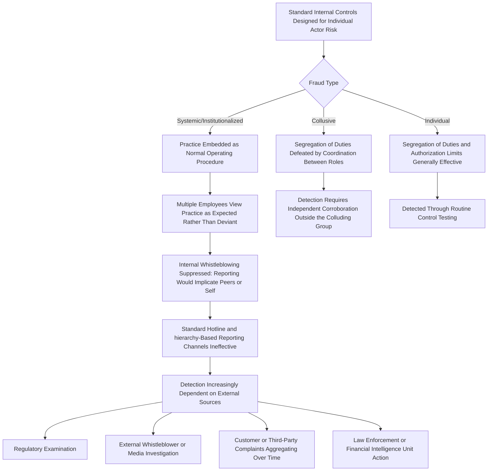

## Systemic and Organized Financial Crime

### Overview

Systemic and organized financial crime refers to fraud and illicit financial activity that extends beyond isolated individual misconduct into coordinated, structural, or institutionalized schemes — whether embedded across multiple levels of a single organization, orchestrated by external organized criminal networks, or arising from systemic weaknesses shared across an industry or market. This topic distinguishes such crime from the more commonly studied occupational fraud committed by a single employee acting alone, requiring distinct detection, investigation, and governance responses given its greater scale, coordination, and resistance to standard internal controls.

### Defining the Spectrum: Individual, Collusive, and Systemic Fraud

**Key Points**

- **Individual (occupational) fraud**: a single employee exploits a control weakness or override authority for personal gain, typically the type of fraud most directly addressed by standard internal controls and the ACFE Fraud Tree taxonomy (asset misappropriation, corruption, financial statement fraud).
- **Collusive fraud**: two or more individuals coordinate to defeat controls that would otherwise be effective against a single actor (e.g., segregation-of-duties controls defeated when the separated roles collude), a scenario ISA 240 explicitly identifies as harder to detect than individual fraud.
- **Systemic/organized fraud**: fraud that is structurally embedded — occurring across multiple business units, involving numerous participants (sometimes across organizational or even corporate boundaries), often sustained over extended periods, and in some cases connected to organized criminal enterprises rather than purely opportunistic individual actors.

[Inference] These categories exist on a continuum rather than as strictly discrete classifications; a scheme may begin as individual or collusive fraud and evolve into a more systemic pattern as it scales, or a fraud initially appearing systemic may, upon investigation, be attributable to a smaller coordinating group than initially assumed.

### Characteristics Distinguishing Systemic Fraud

- **Institutionalization**: the fraudulent practice becomes embedded in routine business processes, sometimes formalized through internal training, scripts, or informal but widely understood expectations (e.g., sales staff informally trained to use deceptive practices to meet quotas).
- **Scale and duration**: systemic fraud typically persists over multiple reporting periods or business cycles, often escalating in scope as the underlying pressures (financial targets, competitive positioning) persist or intensify.
- **Multiple complicit or willfully blind participants**: rather than a single perpetrator, systemic fraud frequently involves numerous employees who participate directly, facilitate through inaction, or maintain willful blindness to indicators they might otherwise be expected to notice.
- **Structural enablement**: the organization's incentive structures, reporting hierarchies, or control design create conditions that make the fraudulent practice a rational (if unethical) response to organizational pressures, rather than an isolated deviation from otherwise sound practice.
- **Cross-boundary coordination (organized crime dimension)**: in some cases, systemic financial crime connects to external organized criminal networks engaged in money laundering, trade-based fraud, or coordinated schemes spanning multiple entities or jurisdictions specifically to evade detection by any single regulator or institution.

### Organized Financial Crime: External Criminal Networks

A distinct but related dimension involves financial crime perpetrated by organized criminal enterprises rather than originating from within a legitimate organization's own workforce:

- **Money laundering networks**: structured schemes designed to disguise the origin of illicit funds, often involving layering transactions across multiple jurisdictions, shell companies, and financial institutions specifically to defeat anti-money laundering (AML) controls.
- **Organized payment fraud rings**: coordinated schemes such as business email compromise (BEC) networks, synthetic identity fraud rings, or organized card-not-present fraud operations, often operating across borders and exploiting jurisdictional and regulatory gaps.
- **Trade-based money laundering**: manipulation of trade transactions (over- or under-invoicing, misrepresentation of goods) to move value across borders while evading currency controls, taxes, or AML detection.
- **Corruption networks**: organized bribery and kickback schemes involving multiple complicit parties across procurement, regulatory approval, or contracting processes, sometimes spanning both private organizations and public officials.

[Unverified] The scale, prevalence, and evolving methodologies of organized financial crime networks are subjects of ongoing assessment by law enforcement, financial intelligence units, and international bodies (e.g., FATF — the Financial Action Task Force); specific current statistics or emerging typologies should be verified against current regulatory and law enforcement publications rather than assumed static over time.

### Why Systemic Fraud Resists Standard Detection Methods

### Detection Approaches for Systemic Fraud

Given that internal, hierarchy-based reporting mechanisms are often structurally compromised in systemic fraud scenarios (since the practice may be normalized or protected by the very managers who would otherwise receive escalations), detection commonly relies on:

- **Aggregate data analytics** identifying patterns across business units or time periods that a single-transaction or single-employee review would not surface (e.g., a consistent pattern of a specific type of manipulation recurring across many branches or regions simultaneously).
- **External whistleblowers**, including customers, business partners, or former employees who are outside the organizational structure that might otherwise suppress internal reporting.
- **Regulatory examinations**, particularly in regulated industries (financial services, healthcare, government contracting), where external supervisory bodies conduct independent reviews not dependent on the organization's internal reporting channels.
- **Cross-organizational or cross-jurisdictional information sharing**, particularly relevant for organized criminal networks operating across multiple institutions or countries, often facilitated through financial intelligence units, law enforcement cooperation, and industry information-sharing arrangements.
- **Litigation and civil discovery**, where legal proceedings (e.g., class action lawsuits, individual wrongful termination suits) can surface internal documents or testimony revealing the systemic nature of a practice.

### Governance and Institutional Response Challenges

Systemic fraud presents distinct governance challenges compared to individual fraud:

- **Root cause analysis complexity**: because the practice is embedded rather than isolated, remediation requires addressing underlying incentive structures, performance management systems, and cultural norms — not simply disciplining a single identified perpetrator.
- **Scale of remediation and disclosure**: systemic fraud discovered in a publicly traded or regulated entity often triggers substantial financial statement restatement, regulatory penalties, and extensive remediation program requirements far exceeding the scope typically associated with individual fraud.
- **Accountability diffusion challenges**: determining appropriate individual accountability when many employees participated in or tolerated a widely normalized practice requires careful, fact-specific analysis distinguishing principal architects from lower-level participants who may have reasonably believed the practice was sanctioned.
- **Cultural remediation requirement**: addressing systemic fraud typically requires sustained cultural and structural change (discussed further under organizational culture and fraud risk) rather than the more limited corrective action (e.g., strengthened segregation of duties) sufficient for individual fraud cases.

### Comparative Framework

| Dimension | Individual Fraud | Collusive Fraud | Systemic/Organized Fraud |
| --- | --- | --- | --- |
| Number of participants | One | Two or more, coordinated | Many, often institutionalized across the organization or network |
| Primary defeat mechanism | Control weakness or override authority exploitation | Coordination defeating segregation of duties | Institutional normalization and structural incentive alignment |
| Typical detection channel | Internal controls, reconciliations, internal audit testing | Requires independent corroboration beyond the colluding parties | External sources: regulators, external whistleblowers, litigation, aggregate analytics |
| Remediation scope | Disciplinary action against identified individual, targeted control enhancement | Disciplinary action against identified group, targeted control redesign | Organization-wide cultural, structural, and incentive redesign; potential regulatory remediation program |
| Governance implication | Standard internal audit and control testing generally sufficient | Enhanced skepticism and independent corroboration required | Board-level governance overhaul, potential external monitorship, sustained cultural change program |

### Organized Crime Interface with Corporate Fraud

In some cases, what initially appears to be internal organizational fraud has connections to external organized criminal networks:

- Employees may be recruited, coerced, or bribed by external organized crime networks to facilitate fraud from within (e.g., an insider providing account information enabling external payment fraud).
- Corporate entities themselves may be knowingly or unknowingly used as vehicles for money laundering by organized criminal networks, particularly where weak AML controls or willful blindness by certain personnel allows illicit funds to be processed through legitimate-appearing transactions.
- Trade-based money laundering schemes often require complicit participation from within legitimate trading or logistics companies to falsify documentation, blurring the line between purely external organized crime and internal organizational complicity.

[Speculation] The extent to which any given instance of internal fraud has connections to broader organized criminal networks, as opposed to being purely internally motivated and executed, often cannot be determined without specialized investigative techniques (financial intelligence analysis, law enforcement cooperation) beyond the scope of a standard internal fraud examination.

**Example**

A multinational manufacturing company discovers, through an anonymous external whistleblower report to a regulator rather than through its internal hotline, that its regional sales offices in several countries have for years engaged in a coordinated practice of paying facilitation payments to customs officials to expedite shipments, with the practice informally taught to new regional sales staff as "how things are done here" rather than documented in any formal policy. Internal audit's standard testing had not surfaced the pattern because the payments were structured as legitimate-appearing "expediting fees" recorded consistently across multiple entities, and no single transaction or employee's conduct, viewed in isolation, appeared anomalous. Only the aggregation of the pattern across multiple countries — surfaced through the external whistleblower's broader knowledge of practices across regions — revealed the systemic nature of the scheme. The company's response required not only disciplinary action against identified individuals but a comprehensive anti-corruption program overhaul, revised regional compensation structures that had implicitly rewarded fast shipment times without regard to method, and a multi-year remediation program often required under corporate anti-corruption enforcement frameworks.

### Consequences and Regulatory Dimensions

- **Extended regulatory enforcement**: systemic fraud, particularly involving cross-border corruption or money laundering, frequently triggers enforcement actions under multiple regulatory regimes (e.g., anti-corruption statutes, securities law, AML regulations) simultaneously.
- **Deferred prosecution agreements and corporate monitorships**: in significant systemic fraud or corruption cases, regulatory or law enforcement resolution frequently includes extended independent monitoring of the organization's remediation efforts over multiple years.
- **Reputational and market consequences**: systemic fraud revelations often produce more severe and sustained reputational and market value impacts than isolated individual fraud, given the implication of broader institutional failure rather than a single bad actor.

**Conclusion**

Systemic and organized financial crime represents a qualitatively different challenge from individual occupational fraud: rather than a control weakness exploited by a single actor, it involves institutionalized practices, multiple complicit or willfully blind participants, and — in its organized crime dimension — coordination with external criminal networks specifically designed to evade detection across institutional and jurisdictional boundaries. Because standard internal controls and hierarchy-dependent reporting mechanisms are frequently structurally compromised or ineffective against such schemes, detection increasingly depends on external sources — regulators, external whistleblowers, aggregate data analytics, and cross-institutional information sharing — while effective remediation requires addressing underlying cultural and structural incentives rather than simply disciplining identified individuals.

**Related Topics**

- Anti-money laundering (AML) frameworks and financial intelligence units
- Trade-based money laundering detection and red flags
- Foreign Corrupt Practices Act (FCPA) and international anti-corruption enforcement
- Corporate monitorships and deferred prosecution agreement structures
- Organizational culture's role in normalizing systemic misconduct
- External whistleblower mechanisms and regulatory reporting channels
- Cross-border regulatory cooperation in organized financial crime investigations