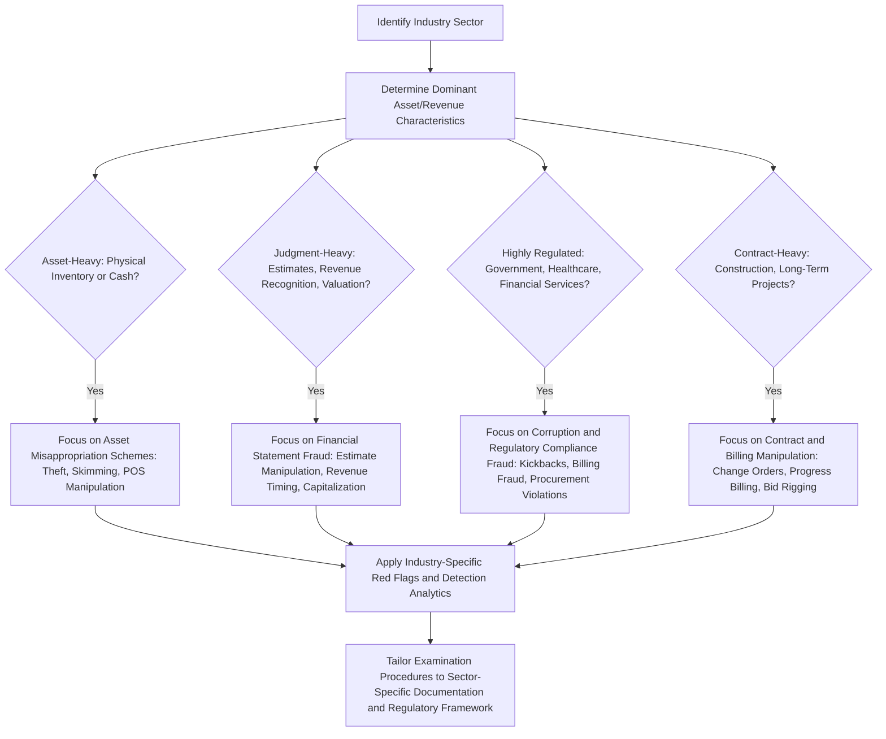

## Industry-Specific Financial Crime Patterns

### Overview

Industry-specific financial crime patterns examines how the distinct operational structures, regulatory environments, transaction types, and business models of different sectors give rise to characteristic fraud schemes unique to each industry. While the underlying fraud triangle (pressure, opportunity, rationalization) and the ACFE's broad fraud classification taxonomy (asset misappropriation, corruption, financial statement fraud) apply universally, the specific manifestations, red flags, and detection techniques differ substantially by sector, making industry knowledge a critical component of effective fraud risk assessment and forensic investigation.

### Conceptual Foundation

**Key Points**

- Generic fraud risk assessment frameworks (e.g., COSO, the ACFE Fraud Tree) provide the structural taxonomy, but effective application requires mapping these general categories to the specific transaction types, revenue models, and regulatory context of a given industry.
- Industry-specific patterns arise from differences in: the nature of assets held (physical inventory vs. financial instruments vs. intangible intellectual property), the complexity and judgment involved in revenue recognition, the degree of regulatory oversight, and the typical structure of counterparty relationships (consumers, government, business-to-business).
- [Inference] Fraud examiners and forensic accountants specializing in a given industry generally develop pattern-recognition capabilities specific to that sector's typical schemes, which is why industry specialization is a common feature of forensic accounting practice areas.

### Financial Services and Banking

- **Loan fraud**: falsified income documentation, inflated collateral valuations, or straw borrowers used to obtain financing that would not otherwise be approved.
- **Check kiting and account fraud**: exploiting float time between account balances at different institutions to create artificial, temporary funds availability.
- **Insider trading and market manipulation**: employees exploiting non-public information or coordinated trading activity to improperly influence security prices.
- **Money laundering facilitation**: structuring transactions to evade currency transaction reporting thresholds, or willful blindness by relationship managers regarding suspicious client activity.
- **Loan loss reserve manipulation**: adjusting reserve estimates to manage reported earnings or regulatory capital ratios, a form of financial statement fraud specific to the estimation-heavy nature of banking accounting.

### Healthcare

- **Upcoding and unbundling**: billing for more expensive procedures than were actually performed (upcoding), or billing separately for procedures that should be billed as a single bundled service (unbundling), to inflate reimbursement.
- **Phantom billing**: billing for services, equipment, or supplies never actually provided to the patient.
- **Kickback arrangements**: improper payments between healthcare providers, pharmaceutical companies, or referral sources in exchange for patient referrals, implicating anti-kickback statutes specific to the healthcare regulatory environment.
- **Medical necessity fraud**: performing or billing for procedures not medically necessary for the patient's condition, often difficult to detect without clinical expertise alongside financial analysis.

[Unverified] Specific prevalence rates or dollar-impact estimates for these healthcare fraud categories vary by jurisdiction, payer type (government vs. private insurance), and time period; current statistics should be verified against current government and industry fraud reports (e.g., relevant national health fraud enforcement agencies) rather than assumed static.

### Government and Public Sector

- **Procurement fraud**: bid-rigging, bid-splitting to avoid competitive bidding thresholds, and collusion between vendors and procurement officials.
- **Grant fraud**: misrepresentation of eligibility, misuse of grant funds for unauthorized purposes, or falsified performance reporting to continue receiving grant disbursements.
- **Payroll and benefits fraud**: ghost employees on government payrolls, or falsified overtime and benefits claims.
- **Conflicts of interest in contracting**: public officials awarding contracts to entities in which they or related parties hold undisclosed interests.

[Inference] Government sector fraud is frequently subject to specialized public-sector audit and oversight bodies (e.g., inspectors general, government auditing agencies) whose specific mandates and procedures vary by jurisdiction; the patterns above reflect commonly discussed categories in public financial management and fraud examination literature rather than a jurisdiction-specific enumeration.

### Retail and Consumer Goods

- **Inventory shrinkage and theft**: employee theft of physical inventory, often concealed through falsified inventory counts or point-of-sale manipulation (voided transactions, fraudulent returns/refunds).
- **Vendor fraud**: fictitious vendors created by employees with purchasing authority, or kickback arrangements with legitimate vendors involving inflated pricing.
- **Gift card and return fraud**: exploitation of return policies or gift card systems, sometimes involving external organized schemes rather than solely internal employee fraud.
- **Point-of-sale (POS) system manipulation**: employees using system access to process fraudulent discounts, voids, or refunds to themselves or accomplices.

### Construction and Real Estate

- **Cost overrun and change order manipulation**: inflating or fabricating change orders to extract additional payment beyond the original contract scope.
- **Bid rigging and collusion**: contractors coordinating to manipulate competitive bidding outcomes, often involving payments to procurement personnel.
- **Mortgage and appraisal fraud**: inflated property appraisals or falsified loan applications to obtain financing exceeding a property's actual value.
- **Progress billing fraud**: billing for construction work or materials not yet completed or delivered, exploiting the judgment-intensive nature of percentage-of-completion accounting.

### Insurance

- **Claims fraud**: exaggerated, staged, or entirely fabricated claims submitted by policyholders or, in organized schemes, coordinated networks (e.g., staged automobile accidents).
- **Premium diversion**: insurance agents or brokers collecting premiums from policyholders without remitting them to the insurer, leaving policyholders unknowingly uninsured.
- **Underwriting fraud**: misrepresentation of risk factors by applicants (or complicit agents) to obtain more favorable premium terms than the actual risk would justify.

### Technology and Intangible-Asset-Heavy Industries

- **Revenue recognition manipulation**: given the judgment-intensive nature of recognizing revenue for software licenses, subscriptions, or multi-element arrangements, this sector faces elevated risk of channel stuffing, premature revenue recognition, or improperly structured side agreements affecting recognition timing.
- **Capitalization of expenses**: improperly capitalizing costs that should be expensed (e.g., research and development costs, software development costs not meeting capitalization criteria) to inflate reported earnings and assets.
- **Intellectual property valuation manipulation**: overstating the value of acquired intangible assets or goodwill to support favorable reported financial metrics, particularly relevant in industries where intangible assets dominate the balance sheet.

### Cross-Industry Pattern Recognition Framework

### Comparative Red Flag Summary

| Industry | Primary Fraud Category | Characteristic Red Flag |
| --- | --- | --- |
| Banking/Financial Services | Asset misappropriation, financial statement fraud | Unusual loan loss reserve volatility; structuring transactions near reporting thresholds |
| Healthcare | Billing fraud, corruption | Statistically unusual billing code patterns; referral volume inconsistent with patient population |
| Government/Public Sector | Corruption, procurement fraud | Repeated single-bid awards; contracts split to fall below competitive bidding thresholds |
| Retail | Asset misappropriation | High void/refund rates concentrated with specific employees; inventory shrinkage exceeding industry benchmarks |
| Construction | Billing fraud, corruption | Frequent, poorly documented change orders; consistent bid-award patterns favoring the same vendor |
| Insurance | Claims fraud, premium diversion | Claims clustering around policy inception or cancellation dates; agent-level premium remittance delays |
| Technology | Financial statement fraud | Revenue recognized before contractual delivery or acceptance criteria are met; unusual quarter-end sales spikes |

### Why Industry Knowledge Matters for Detection

- **Baseline establishment**: understanding what "normal" looks like within a specific industry (typical margins, standard billing codes, expected transaction volumes) is a prerequisite for identifying statistically or operationally anomalous patterns.
- **Regulatory context awareness**: industries with sector-specific regulation (healthcare billing rules, banking capital requirements, government procurement statutes) require examiners to understand the specific compliance framework the fraud may also violate, which affects both detection approach and potential legal consequences.
- **Documentation and evidence familiarity**: each industry has characteristic documentation (medical claims codes, bid tabulation sheets, loan files, POS transaction logs) that examiners must know how to interpret and analyze effectively.

[Inference] While general fraud examination training (e.g., the CFE credential) provides a broad methodological foundation, effective investigation of complex industry-specific schemes often benefits from supplementary industry expertise or collaboration with subject-matter specialists, particularly in highly technical or heavily regulated sectors such as healthcare billing or complex financial instruments.

**Example**

A forensic accounting team engaged to investigate suspected fraud at a regional hospital network applies general fraud examination methodology but supplements it with healthcare-specific analytical techniques: rather than only reviewing general ledger entries, the team analyzes the hospital's billing data using healthcare-specific tools to identify statistically anomalous patterns in Current Procedural Terminology (CPT) code usage, comparing the hospital's coding distribution against regional and national benchmarks for similar facilities. This analysis reveals that one physician's billing pattern shows a disproportionate concentration of a specific high-reimbursement procedure code relative to peer physicians treating similar patient populations — a red flag that would not have been apparent through general financial statement analysis alone, illustrating how industry-specific analytical techniques (in this case, medical coding benchmarking) surface patterns invisible to generic fraud examination approaches.

### Common Pitfalls in Cross-Industry Application

- Applying detection techniques or red flag benchmarks developed for one industry directly to another without adjusting for structurally different business models (e.g., applying retail inventory shrinkage benchmarks to a service-based industry with minimal physical inventory).
- Underestimating the specialized regulatory knowledge required in heavily regulated sectors (healthcare billing codes, banking regulatory capital rules, government procurement statutes), leading to missed violations that require sector-specific expertise to recognize.
- Failing to update industry pattern knowledge as business models evolve (e.g., the shift toward subscription and platform-based revenue models introducing new revenue recognition fraud risks not present in traditional product-sale models).
- Assuming a single industry classification captures a diversified organization's full fraud risk profile, when conglomerates or diversified entities may face materially different fraud patterns across their various business segments.

**Conclusion**

Industry-specific financial crime patterns demonstrate that while the fundamental fraud triangle and classification taxonomy provide a universal analytical foundation, effective fraud risk assessment, detection, and investigation require translating these general principles into sector-specific manifestations shaped by each industry's asset structure, revenue recognition complexity, regulatory environment, and characteristic transaction types. Recognizing that a healthcare billing anomaly, a construction change-order pattern, and a technology company's revenue recognition timing each represent fundamentally different expressions of the same underlying fraud triangle dynamics — pressure, opportunity, and rationalization — is what allows fraud examiners and forensic accountants to develop the sector-specific baseline knowledge, analytical techniques, and red flag recognition necessary for effective detection within any given industry context.

**Related Topics**

- Healthcare billing fraud detection and CPT code analytics
- Government procurement fraud and bid-rigging detection techniques
- Revenue recognition fraud schemes in subscription and technology business models
- Insurance claims fraud detection and staged-accident network identification
- Construction industry change order and progress billing fraud analysis
- Banking sector loan loss reserve manipulation and regulatory capital fraud
- Cross-industry data analytics benchmarking for fraud red flag identification