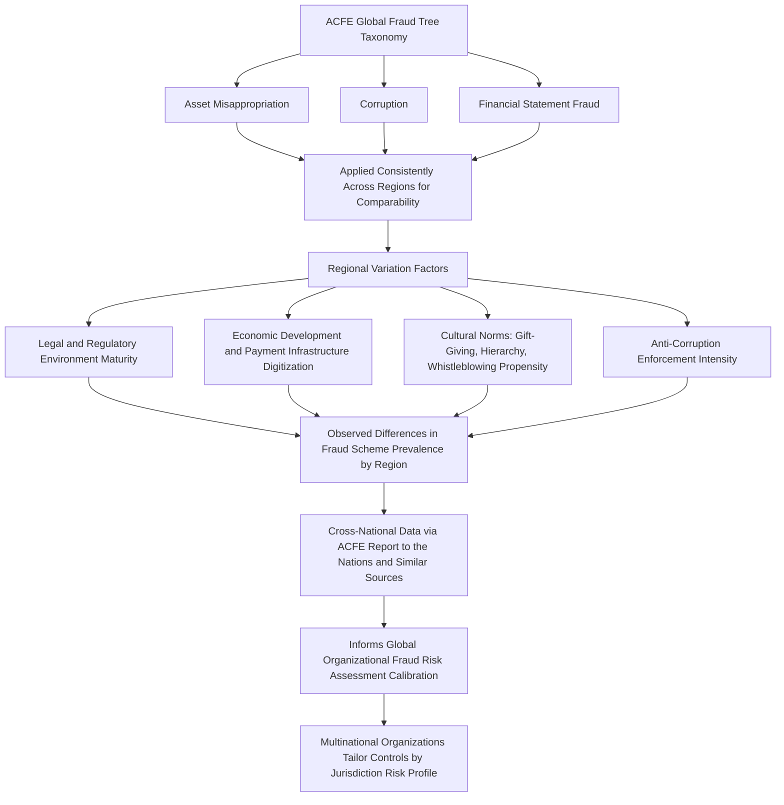

## Global Perspectives on Occupational Fraud

### Overview

Global perspectives on occupational fraud examines how occupational fraud — defined by the ACFE as the use of one's occupation for personal enrichment through the deliberate misuse or misapplication of the employing organization's resources or assets — manifests differently across regions, legal systems, economic conditions, and cultural contexts. While the core ACFE Fraud Tree taxonomy (asset misappropriation, corruption, financial statement fraud) provides a globally applicable classification framework, the prevalence, detection methods, regulatory response, and organizational response to occupational fraud vary meaningfully across jurisdictions, informed primarily by cross-national research such as the ACFE's biennial Report to the Nations.

### Occupational Fraud: A Globally Consistent Definitional Framework

**Key Points**

- The ACFE's occupational fraud definition and classification system (asset misappropriation, corruption, financial statement fraud) is applied consistently across the organization's global research, allowing meaningful cross-regional comparison despite differing legal and cultural contexts.
- The ACFE Report to the Nations, published biennially, aggregates data from certified fraud examiners investigating cases across numerous countries and regions, providing one of the most widely cited sources for cross-national occupational fraud trend analysis.
- [Inference] While the ACFE's global dataset provides valuable comparative insight, it reflects cases investigated and reported by CFEs who choose to participate in the survey, meaning findings should be understood as reflective of observed patterns within this specific dataset rather than a fully comprehensive census of all occupational fraud globally.

### Regional Variation in Fraud Scheme Prevalence

Cross-national fraud research has commonly identified regional differences, though specific figures shift across survey cycles and should be verified against the current report:

- **Corruption schemes** have historically been reported at notably higher relative frequency in certain regions compared to others, often correlated with broader country-level indices of perceived corruption (such as Transparency International's Corruption Perceptions Index) and regulatory enforcement intensity.
- **Financial statement fraud**, while generally the least frequent but most costly category globally in ACFE data, shows variation in relative prevalence tied to differences in capital market development, public company density, and financial reporting regulatory rigor across regions.
- **Asset misappropriation** remains the most commonly reported category globally across nearly all regions in ACFE data, though the specific sub-schemes (cash theft vs. billing schemes vs. payroll schemes) show some regional variation tied to differing business practices and payment infrastructure.

[Unverified] Specific percentage breakdowns and dollar-loss figures by region change with each ACFE Report to the Nations survey cycle; readers requiring current statistics should consult the most recently published report rather than relying on any single historical figure as current.

### Drivers of Cross-National Variation

#### Legal and Regulatory Environment

- Countries with more developed securities regulation, mandatory financial reporting standards (e.g., IFRS or equivalent), and robust auditor oversight bodies tend to have more structured mechanisms for detecting and prosecuting financial statement fraud.
- Anti-corruption legal frameworks vary substantially in scope and enforcement intensity; some jurisdictions have extraterritorial anti-corruption statutes (such as the U.S. Foreign Corrupt Practices Act or the UK Bribery Act) that influence multinational organizations' compliance behavior even in jurisdictions with weaker domestic enforcement.

#### Economic Development and Business Infrastructure

- The degree of digitization in payment systems and financial infrastructure affects both the types of fraud schemes feasible (e.g., cash-based schemes remaining more prevalent in economies with lower banking penetration) and the availability of electronic data trails supporting detection and investigation.
- Economic volatility and financial pressure at a macro level can influence the "pressure" component of the fraud triangle at a population level, though this relationship is complex and mediated by many other factors.

#### Cultural and Organizational Norms

- Cultural attitudes toward gift-giving, facilitation payments, and relationship-based business practices vary across regions, creating genuine complexity in distinguishing culturally normative business courtesies from corrupt practices under globally applied anti-corruption frameworks — a tension multinational compliance programs must navigate carefully.
- Whistleblowing propensity and the social acceptability of reporting a colleague's or superior's misconduct varies across cultural contexts, potentially affecting both fraud detection rates (via the tip channel) and the comparability of reported statistics across regions.

[Speculation] The extent to which cultural attitudes toward hierarchy, collectivism versus individualism, or trust in institutions causally influence occupational fraud reporting and prevalence rates is a subject of academic research and debate rather than a definitively established causal relationship; correlational patterns observed in cross-national data should not be interpreted as proving direct causation.

### Detection Method Variation Across Regions

The ACFE's global research has consistently identified **tips** as the most common detection method for occupational fraud across most regions studied, though the relative strength of this pattern and the specific secondary detection methods (internal audit, management review, external audit, accident) can show some regional variation, potentially influenced by:

- The maturity and prevalence of formal whistleblower hotline infrastructure in a given region.
- Cultural comfort with anonymous or confidential reporting mechanisms.
- The relative development of internal audit and corporate governance infrastructure across regions and company sizes.

### Global Occupational Fraud Analysis Framework

### Implications for Multinational Organizations

- **Risk-differentiated control design**: multinational organizations commonly calibrate fraud risk assessments and control intensity by jurisdiction, applying enhanced anti-corruption due diligence and monitoring in jurisdictions with higher perceived corruption risk indices, while maintaining baseline global standards consistently across all operations.
- **Extraterritorial compliance obligations**: organizations subject to extraterritorial anti-corruption statutes (FCPA, UK Bribery Act) must maintain compliance standards that may exceed local legal requirements in jurisdictions with less stringent domestic anti-corruption law, creating a compliance floor set by the most stringent applicable jurisdiction rather than local law alone.
- **Whistleblower mechanism localization**: effective global whistleblower programs often require localization considerations — language accessibility, cultural sensitivity regarding anonymous reporting, and awareness of local legal protections (or lack thereof) for whistleblowers — rather than a uniform global hotline design assumed to function identically everywhere.
- **Cross-border investigation complexity**: fraud investigations spanning multiple jurisdictions introduce additional complexity regarding differing evidentiary standards, data privacy regulations (e.g., GDPR in the European Union affecting cross-border data transfer for investigation purposes), and varying legal protections for both investigators and subjects.

[Unverified] Specific data privacy and cross-border investigation legal requirements vary significantly and change over time (e.g., evolving GDPR guidance, new national data localization laws); organizations conducting multinational investigations should obtain current jurisdiction-specific legal advice rather than relying on general awareness of these frameworks.

### International Standard-Setting Convergence

Despite regional variation in fraud patterns and enforcement, meaningful convergence exists at the standard-setting level:

- **International Standards on Auditing (ISA 240)**, issued by the IAASB, is adopted or used as a reference framework by many jurisdictions globally, providing a common baseline for auditor fraud responsibilities even where local adoption details vary.
- **The Financial Action Task Force (FATF)** sets international standards for anti-money laundering and counter-terrorist financing that most jurisdictions globally have committed to implementing, creating a degree of convergence in AML-related fraud and financial crime frameworks despite differing domestic implementation details.
- **International Financial Reporting Standards (IFRS)**, adopted or converged with in a substantial majority of jurisdictions globally, provide a common financial reporting framework that shapes the specific accounting judgments (and therefore the specific financial statement fraud opportunities) organizations face, distinct from jurisdictions using other frameworks such as U.S. GAAP.

**Example**

A multinational consumer goods company headquartered in the United States, with operations across Southeast Asia, Eastern Europe, and Latin America, conducts a global fraud risk assessment that applies the same ACFE Fraud Tree taxonomy consistently across all regions but calibrates specific control intensity based on regional risk indicators: in a jurisdiction with a lower ranking on international corruption perception indices, the company implements enhanced due diligence for third-party sales agents and more frequent anti-corruption training, reflecting the FCPA's extraterritorial application to the company's global operations regardless of local anti-corruption enforcement intensity. Simultaneously, the company's global whistleblower hotline is offered in each region's primary language with guidance materials addressing local cultural context around reporting, recognizing that a hotline designed solely around practices common in the headquarters jurisdiction might see substantially different utilization rates elsewhere due to differing cultural comfort with formal reporting mechanisms.

### Common Pitfalls in Applying Global Fraud Perspectives

- Assuming fraud risk assessment frameworks and control designs developed for one jurisdiction transfer directly and effectively to another without adaptation for local legal, cultural, and infrastructure differences.
- Over-relying on aggregate global statistics (e.g., from the ACFE Report to the Nations) without recognizing the dataset's inherent limitations (voluntary CFE-reported cases) as a basis for jurisdiction-specific risk calibration.
- Conflating culturally normative business practices (e.g., certain gift-giving customs) with corrupt practices without careful, fact-specific analysis under the specific anti-corruption legal framework applicable to the organization.
- Failing to account for data privacy and cross-border legal complexity when planning multinational fraud investigations, potentially compromising evidence admissibility or exposing the organization to separate legal liability under data protection regimes.

**Conclusion**

Global perspectives on occupational fraud reveal that while the ACFE's Fraud Tree taxonomy and the broader fraud triangle framework provide a consistent analytical foundation applicable across jurisdictions, the actual prevalence, typical schemes, detection methods, and effective organizational response to occupational fraud are meaningfully shaped by each region's legal and regulatory maturity, economic and payment infrastructure development, and cultural context around hierarchy, gift-giving, and whistleblowing. For multinational organizations, this translates into a practical imperative: applying a single, globally uniform fraud risk assessment and control framework without jurisdiction-specific calibration risks both under-protecting against elevated risks in higher-risk jurisdictions and over-engineering controls poorly suited to local business practices and infrastructure in others, making internationally informed, locally calibrated fraud risk management the standard practice for effective global organizations.

**Related Topics**

- ACFE Report to the Nations: methodology and cross-national comparative findings
- Foreign Corrupt Practices Act and UK Bribery Act extraterritorial application
- Financial Action Task Force (FATF) international AML standard-setting
- Cross-border data privacy regulation (GDPR) and its impact on fraud investigations
- Cultural dimensions theory and its application to organizational fraud risk
- IFRS vs. U.S. GAAP: implications for financial statement fraud opportunity differences
- Localization strategies for global whistleblower hotline programs