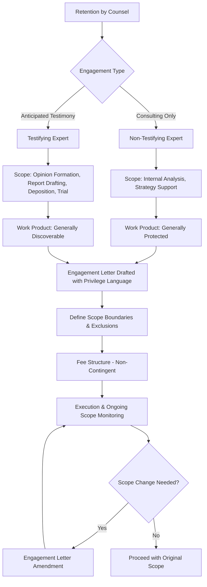

## Engagement Letters and Scope of Forensic Engagements

### Overview

An engagement letter is the contractual foundation of any forensic accounting assignment. It defines the relationship between the forensic accountant (or firm) and the client (often legal counsel), establishes the boundaries of the work to be performed, and allocates risk between the parties. In litigation support contexts, the engagement letter carries heightened importance because the forensic accountant's work product may become subject to discovery, cross-examination, and judicial scrutiny regarding independence, scope, and methodology.

### Purposes of the Engagement Letter

**Key Points**

- Establishes a legally binding contract between practitioner and client
- Defines the nature, timing, and extent of services (scope)
- Clarifies whether the engagement is consulting (non-testifying) or testifying in nature
- Protects the practitioner from scope creep and unauthorized reliance by third parties
- Documents fee arrangements, ensuring compliance with professional independence rules
- Establishes confidentiality, conflict-of-interest checks, and privilege considerations
- Serves as evidence of the terms under which work was performed if challenged in court (e.g., during a *Daubert* or *Kumho Tire* challenge)

### Distinguishing Consulting vs. Testifying Expert Engagements

The scope defined in the engagement letter directly affects the discoverability of the forensic accountant's work.

| Attribute | Consulting Expert | Testifying Expert |
| --- | --- | --- |
| Work product discoverable? | Generally protected under work-product doctrine | Generally discoverable (reports, drafts in many jurisdictions, communications) |
| Role | Assists counsel's strategy, damages modeling, internal analysis | Renders opinions in reports/depositions/trial |
| Engagement letter language | Should explicitly state "non-testifying," "trial preparation," or "litigation consulting" | Should state expectation of testimony, reference to applicable rules (e.g., FRE 702, FRCP 26) |
| Communication protocol | Can be more open with counsel | Must be mindful that draft reports and certain communications with counsel may be discoverable (FRCP 26(b)(4)) |

[Inference] The exact discoverability protections vary by jurisdiction and by whether the matter is federal or state court, so engagement letters should be reviewed against applicable procedural rules before finalizing scope language.

### Core Components of a Forensic Engagement Letter

#### 1. Identification of Parties

- Retaining party (often counsel, not the ultimate client, to preserve attorney-client privilege via *Kovel*-type arrangements)
- The underlying client (company, individual, estate, etc.)
- Any other stakeholders (co-counsel, insurers, regulators)

#### 2. Purpose and Nature of Engagement

- Litigation support, fraud investigation, damages quantification, valuation dispute, matrimonial dissolution, bankruptcy/insolvency analysis, regulatory inquiry, etc.
- Statement of whether the engagement anticipates testimony

#### 3. Scope of Work

- Specific procedures to be performed (e.g., tracing of funds, lost profits analysis, reconstruction of records, review of internal controls)
- Time period under examination
- Entities, accounts, or transactions covered
- Explicit exclusions (what is NOT covered) to prevent scope creep

#### 4. Standards and Methodology

- Applicable professional standards (e.g., AICPA Statement on Standards for Forensic Services, NACVA standards, ASA Business Valuation Standards where valuation is involved)
- Reference to relevant legal standards for admissibility (Daubert factors, FRE 702)

#### 5. Deliverables

- Type of report (oral consultation, written report, expert report per FRCP 26(a)(2)(B), rebuttal report)
- Format and timing of deliverables

#### 6. Fee Structure and Billing Terms

- Hourly rates, retainer, cap, or fixed fee
- **Critical constraint**: fees must NOT be contingent on the outcome of litigation or the conclusions reached — contingent fee arrangements violate independence standards (AICPA Code of Professional Conduct) and can disqualify expert testimony
- Retainer replenishment terms
- Billing frequency and invoicing procedures

#### 7. Confidentiality and Privilege Provisions

- Non-disclosure obligations
- Statement regarding privilege (e.g., engagement routed through counsel to preserve attorney-client privilege and work-product protection)
- Data security and handling of sensitive/PII data

#### 8. Independence and Conflict-of-Interest Representations

- Conflict check disclosure
- Statement of independence from parties to the litigation
- Disclosure of any prior relationships with parties, counsel, or subject matter

#### 9. Termination Clauses

- Conditions under which either party may terminate
- Treatment of work product and fees upon termination

#### 10. Limitation of Liability

- Reliance limitations (report prepared solely for the stated purpose/audience)
- Disclaimers regarding reliance by unauthorized third parties
- Indemnification provisions, where applicable

#### 11. Record Retention Policy

- Duration for which work papers will be retained
- Procedures for retrieval or destruction post-engagement

### Sample Scope Language Structure

### Scope Creep and Amendment Procedures

Forensic engagements frequently evolve as investigations uncover new facts (e.g., discovering additional entities involved in a fraud scheme). The engagement letter should anticipate this by including:

- A defined change-order or amendment process
- Requirement for written approval of scope expansions before additional work begins
- Re-assessment of independence and conflicts if new parties are implicated

**Example**

> Initial engagement: "Analyze accounts receivable aging and cash disbursements for XYZ Corp for fiscal years 2023–2025 to identify indicators of misappropriation."
>
> Mid-engagement discovery: Evidence suggests a related shell entity received diverted funds.
>
> Required action: Issue an engagement letter amendment expanding scope to include the shell entity's financial records, with updated fee estimate and re-confirmation of independence (no prior relationship with the newly identified entity).

### Interaction with Professional Standards

- **AICPA Statement on Standards for Forensic Services No. 1 (SSFS No. 1)**: Requires that engagements be documented, that the practitioner exercise professional judgment, and imposes requirements around engagement acceptance, planning, and conclusion.
- **AICPA Code of Professional Conduct**: Independence and integrity rules that constrain fee structures (no contingent fees for services requiring independence, such as attest-adjacent forensic work, though pure litigation consulting has more flexibility — jurisdiction and rule-specific).
- **FRCP 26**: Governs disclosure requirements for testifying experts in U.S. federal litigation, including timing of reports and the scope of discoverable materials.
- **FRE 702 / Daubert standard**: Courts may examine whether the expert's opinions were formed pursuant to a properly scoped, methodologically sound engagement — a poorly scoped engagement letter can be used to attack the reliability of the resulting opinion.

[Unverified] Specific state-court equivalents to FRCP 26 vary significantly (e.g., some states have no equivalent expert disclosure timeline), so scope and deliverable language should be tailored to the governing procedural rules of the forum.

### Common Pitfalls in Scope Definition

**Key Points**

- Vague scope language ("review the company's finances") invites disputes over whether procedures performed were sufficient or exceeded authorization
- Failure to specify the applicable date range or population of transactions
- Omitting a clear statement of the intended use and users of the report (critical for limiting third-party reliance claims)
- Not addressing what happens if underlying data is incomplete, altered, or unavailable
- Failing to reconcile the engagement letter's scope with what is ultimately disclosed in expert reports (inconsistency can be exploited during cross-examination)

### Illustrative Engagement Workflow

<svg xmlns="http://www.w3.org/2000/svg" viewBox="0 0 900 320" font-family="Arial, sans-serif">
<text x="450" y="25" font-size="16" font-weight="bold" text-anchor="middle">Forensic Engagement Lifecycle (svg_diagram)</text>
<rect x="20" y="60" width="150" height="60" rx="8" fill="#e8f0fe" stroke="#4285f4" />
<text x="95" y="85" font-size="11" text-anchor="middle">Conflict Check &amp;</text>
<text x="95" y="100" font-size="11" text-anchor="middle">Independence Review</text>
<rect x="210" y="60" width="150" height="60" rx="8" fill="#e8f0fe" stroke="#4285f4" />
<text x="285" y="85" font-size="11" text-anchor="middle">Draft Engagement</text>
<text x="285" y="100" font-size="11" text-anchor="middle">Letter (Scope Defined)</text>
<rect x="400" y="60" width="150" height="60" rx="8" fill="#e8f0fe" stroke="#4285f4" />
<text x="475" y="85" font-size="11" text-anchor="middle">Execution by Counsel</text>
<text x="475" y="100" font-size="11" text-anchor="middle">and/or Client</text>
<rect x="590" y="60" width="150" height="60" rx="8" fill="#e8f0fe" stroke="#4285f4" />
<text x="665" y="85" font-size="11" text-anchor="middle">Fieldwork Begins</text>
<text x="665" y="100" font-size="11" text-anchor="middle">per Defined Scope</text>
<rect x="780" y="60" width="100" height="60" rx="8" fill="#fce8e6" stroke="#ea4335" />
<text x="830" y="85" font-size="11" text-anchor="middle">Scope</text>
<text x="830" y="100" font-size="11" text-anchor="middle">Change?</text>
<rect x="590" y="180" width="150" height="60" rx="8" fill="#fef7e0" stroke="#fbbc04" />
<text x="665" y="205" font-size="11" text-anchor="middle">Amend Engagement</text>
<text x="665" y="220" font-size="11" text-anchor="middle">Letter (Written)</text>
<rect x="400" y="180" width="150" height="60" rx="8" fill="#e6f4ea" stroke="#34a853" />
<text x="475" y="205" font-size="11" text-anchor="middle">Report Drafting /</text>
<text x="475" y="220" font-size="11" text-anchor="middle">Opinion Formation</text>
<rect x="210" y="180" width="150" height="60" rx="8" fill="#e6f4ea" stroke="#34a853" />
<text x="285" y="205" font-size="11" text-anchor="middle">Deposition / Trial</text>
<text x="285" y="220" font-size="11" text-anchor="middle">Testimony (if applicable)</text>
<line x1="170" y1="90" x2="210" y2="90" stroke="black" marker-end="url(#arrow)" />
<line x1="360" y1="90" x2="400" y2="90" stroke="black" marker-end="url(#arrow)" />
<line x1="550" y1="90" x2="590" y2="90" stroke="black" marker-end="url(#arrow)" />
<line x1="740" y1="90" x2="780" y2="90" stroke="black" marker-end="url(#arrow)" />
<line x1="830" y1="120" x2="830" y2="150" stroke="black" />
<line x1="830" y1="150" x2="665" y2="150" stroke="black" />
<line x1="665" y1="150" x2="665" y2="180" stroke="black" marker-end="url(#arrow)" />
<line x1="590" y1="210" x2="550" y2="210" stroke="black" marker-end="url(#arrow)" />
<line x1="400" y1="210" x2="360" y2="210" stroke="black" marker-end="url(#arrow)" />
<line x1="475" y1="180" x2="475" y2="150" stroke="black" />
<line x1="475" y1="150" x2="830" y2="150" stroke="black" stroke-dasharray="4" />
<text x="700" y="145" font-size="9" text-anchor="middle">No change → proceed</text>
</svg>

### Fee Independence Constraint (Illustrative)

If a forensic fee arrangement is expressed as a function of recovered damages $D$, independence is compromised. Acceptable structures avoid any formula of the form:

$$\text{Fee} = k \times D$$

where $k$ is a proportionality constant tied to litigation outcome. Instead, engagement letters should specify:

$$\text{Fee} = \sum_{i=1}^{n} (h_i \times r_i)$$

where $h_i$ is hours worked by staff level $i$ and $r_i$ is the corresponding hourly rate — an outcome-independent structure.

### Conclusion

The engagement letter is not merely an administrative formality but a substantive risk-management and credibility tool in forensic and litigation support work. A well-drafted letter clearly delineates consulting versus testifying roles, precisely bounds the scope of procedures, embeds independence-preserving fee terms, and anticipates the discovery and admissibility scrutiny the forensic accountant's work may later face. Deficiencies in scope definition are a common vector for opposing counsel to challenge an expert's credibility, making careful drafting and rigorous scope discipline throughout the engagement essential.

**Next Steps**

- Attorney-client privilege and work-product doctrine in forensic engagements (*Kovel* letters)
- AICPA Statement on Standards for Forensic Services (SSFS No. 1) in depth
- Daubert and Kumho Tire standards for expert admissibility
- FRCP 26 expert disclosure requirements and report content mandates
- Drafting expert witness reports: structure and content requirements
- Deposition preparation and cross-examination defense strategies for forensic experts
- Independence and conflict-of-interest protocols in forensic accounting
- Contingent fee restrictions under AICPA Code of Professional Conduct
- Chain-of-custody and evidence-handling procedures in fraud investigations
- Damages quantification methodologies (lost profits, unjust enrichment, reasonable royalty)