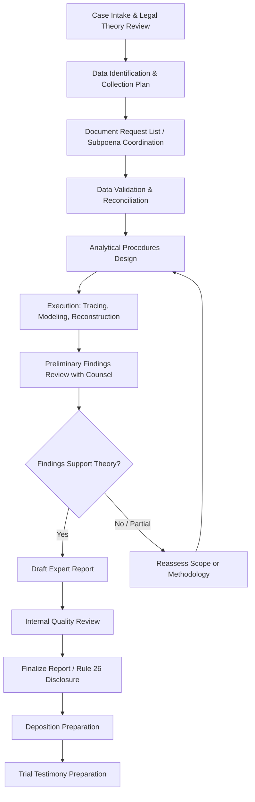

## Litigation Support Workplan Development

### Overview

A litigation support workplan is the operational roadmap that translates the engagement letter's scope into executable procedures, timelines, staffing assignments, and deliverables. Where the engagement letter defines *what* the forensic accountant is authorized to do, the workplan defines *how*, *when*, and *by whom* the work will be performed. Effective workplan development is critical for controlling costs, ensuring defensible methodology, meeting court-imposed deadlines, and producing a work product that withstands scrutiny under cross-examination or Daubert-type challenges.

### Objectives of a Litigation Support Workplan

**Key Points**

- Translate legal theory and engagement scope into discrete, assignable tasks
- Sequence procedures logically (data collection before analysis before reporting)
- Align work with litigation deadlines (discovery cutoffs, expert disclosure deadlines, trial dates)
- Allocate staff by skill level to control cost and ensure quality review
- Build in contingency for scope changes as facts develop
- Create a documented audit trail supporting the reliability of conclusions reached

### Key Inputs to Workplan Development

1. **Engagement letter** — defines scope boundaries, deliverables, and constraints
2. **Legal theory of the case** — from counsel: what must be proven or disproven (e.g., breach of contract damages, fraudulent transfer, lost profits, valuation dispute)
3. **Procedural timeline** — court scheduling order, discovery deadlines, expert report deadlines (e.g., FRCP 26(a)(2) disclosure dates), deposition dates, trial date
4. **Available data universe** — general ledgers, bank records, contracts, emails, tax returns, prior expert reports
5. **Applicable damages or fraud theory framework** — e.g., benefit-of-the-bargain, out-of-pocket loss, lost profits (before-and-after, yardstick, or market-share methods), unjust enrichment
6. **Budget constraints** — client/counsel fee expectations and any court-imposed fee-shifting considerations

### Structuring the Workplan: Core Phases

#### Phase 1: Case Intake and Legal Theory Alignment

- Review pleadings, complaint, answer, and counterclaims
- Interview counsel to understand the theory of liability and damages
- Identify the specific accounting or financial questions the engagement must answer
- Determine testifying vs. consulting posture (affects documentation protocols)

#### Phase 2: Data Identification and Collection Planning

- Compile a document request list (DRL) mapped to specific analytical needs
- Coordinate with counsel on subpoenas or third-party discovery requests
- Identify data custodians and systems (ERP systems, banking portals, payroll systems)
- Establish chain-of-custody procedures for sensitive or potentially disputed evidence

#### Phase 3: Data Validation

- Reconcile received data to known totals (e.g., trial balances to financial statements)
- Identify gaps, missing periods, or suspicious alterations
- Document data limitations that may affect conclusions

#### Phase 4: Analytical Procedures Design

- Select methodologies appropriate to the legal theory (see table below)
- Define sampling approach if full population testing is infeasible
- Determine software/tools required (e.g., ACL, IDEA, SQL queries, Excel-based models, Benford's Law screening tools)

#### Phase 5: Execution

- Perform tracing, tracking, reconstruction, or modeling procedures
- Maintain contemporaneous workpapers documenting each step
- Conduct interim reviews with supervising professional (partner/director sign-off)

#### Phase 6: Reporting and Testimony Preparation

- Draft report per applicable disclosure rules
- Internal technical and independence review
- Deposition and trial preparation, including anticipation of cross-examination themes

### Mapping Legal Theory to Analytical Methodology

| Legal Theory | Typical Analytical Approach | Key Workplan Task |
| --- | --- | --- |
| Lost profits (breach of contract) | Before-and-after method, yardstick method, market-share method | Build financial model projecting "but-for" revenue/profit |
| Fraudulent financial reporting | Benford's Law, journal entry testing, related-party tracing | Data analytics screening + manual sample review |
| Asset misappropriation | Bank reconciliation analysis, net worth method, expenditure method | Reconstruct cash flows and lifestyle analysis |
| Business valuation dispute | Income approach (DCF), market approach, asset approach | Build valuation model with sensitivity analysis |
| Fraudulent transfer / insolvency | Solvency analysis (balance sheet, cash flow, adequate capital tests) | Reconstruct historical balance sheets at transfer date |
| Marital dissolution (forensic) | Income normalization, lifestyle analysis, hidden asset tracing | Bank/credit card tracing, business valuation of marital estate |

### Staffing and Resource Allocation

**Key Points**

- Partner/Director: overall strategy, opinion formation, testimony
- Senior Manager/Manager: workplan execution oversight, complex analysis, report drafting
- Senior Associate/Associate: data extraction, reconciliation, schedule preparation
- Data analytics specialist: where large datasets require scripted analysis
- Budget should map hours by phase and by staff level to prevent scope creep from eroding profitability or triggering fee disputes

### Timeline Management Against Legal Deadlines

A workplan must be built backward from binding procedural deadlines:

$$T_{\text{report due}} - T_{\text{analysis complete}} \geq T_{\text{drafting}} + T_{\text{review}} + T_{\text{buffer}}$$

Where:

- $T_{\text{report due}}$ = court-ordered expert disclosure deadline
- $T_{\text{drafting}}$ = time required to draft the report
- $T_{\text{review}}$ = internal QC and independence review time
- $T_{\text{buffer}}$ = contingency for data delays or follow-up requests

[Inference] Buffer periods are typically calibrated based on firm risk tolerance and case complexity; there is no universal standard percentage, though many practitioners informally target 15–20% of total projected engagement time as contingency.

### Documentation Standards Within the Workplan

- Each workpaper should reference: objective, source data, procedure performed, results, and conclusion drawn
- Cross-referencing system linking workpapers to specific report exhibits
- Version control for models (especially damages models, which are frequently revised as discovery progresses)
- Retention of superseded drafts consistent with firm policy and applicable discovery obligations (testifying experts should be aware that draft reports may be discoverable in certain jurisdictions/circumstances under FRCP 26(b)(4))

### Coordination with Counsel

**Example**

> A workplan for a lost-profits dispute might include a scheduled midpoint check-in: "By Week 6, present preliminary but-for revenue model to counsel for factual assumption validation before finalizing damages calculation." This ensures legal and factual assumptions (e.g., causation theory) are vetted before the forensic accountant finalizes quantification, reducing rework risk.

### Handling Scope Evolution During Execution

Workplans should build in decision points where:

- New evidence triggers a re-scoping conversation
- Budget overruns are flagged early (variance analysis: actual hours vs. budgeted hours by phase)
- Methodology pivots are documented with rationale to preserve defensibility

### Risk Areas in Workplan Development

**Key Points**

- Underestimating data volume/complexity, leading to timeline slippage
- Failing to build in sufficient QC/review time before report deadlines
- Not aligning analytical methodology with the specific legal standard applicable in the jurisdiction (e.g., differing lost-profits certainty standards across states)
- Inadequate documentation trail, weakening defensibility under cross-examination
- Miscommunication between legal theory and financial analysis, resulting in an expert report that is technically sound but legally irrelevant

### Illustrative Workplan Timeline Structure

<svg xmlns="http://www.w3.org/2000/svg" viewBox="0 0 900 280" font-family="Arial, sans-serif">
<text x="450" y="22" font-size="16" font-weight="bold" text-anchor="middle">Litigation Support Workplan Timeline (svg_diagram)</text>
<line x1="60" y1="240" x2="850" y2="240" stroke="black" stroke-width="2" />
<text x="60" y="260" font-size="10" text-anchor="middle">Week 0</text>
<text x="850" y="260" font-size="10" text-anchor="middle">Report Due</text>
<rect x="60" y="60" width="120" height="40" fill="#e8f0fe" stroke="#4285f4" />
<text x="120" y="85" font-size="10" text-anchor="middle">Intake &amp; Theory</text>
<rect x="200" y="60" width="140" height="40" fill="#e8f0fe" stroke="#4285f4" />
<text x="270" y="85" font-size="10" text-anchor="middle">Data Collection</text>
<rect x="360" y="60" width="140" height="40" fill="#fef7e0" stroke="#fbbc04" />
<text x="430" y="85" font-size="10" text-anchor="middle">Validation</text>
<rect x="520" y="60" width="160" height="40" fill="#e6f4ea" stroke="#34a853" />
<text x="600" y="85" font-size="10" text-anchor="middle">Analysis &amp; Modeling</text>
<rect x="700" y="60" width="90" height="40" fill="#fce8e6" stroke="#ea4335" />
<text x="745" y="85" font-size="10" text-anchor="middle">Drafting</text>
<rect x="800" y="60" width="50" height="40" fill="#f3e8fd" stroke="#a142f4" />
<text x="825" y="80" font-size="8" text-anchor="middle">QC/</text>
<text x="825" y="90" font-size="8" text-anchor="middle">Review</text>
<line x1="120" y1="100" x2="120" y2="235" stroke="gray" stroke-dasharray="3" />
<line x1="270" y1="100" x2="270" y2="235" stroke="gray" stroke-dasharray="3" />
<line x1="430" y1="100" x2="430" y2="235" stroke="gray" stroke-dasharray="3" />
<line x1="600" y1="100" x2="600" y2="235" stroke="gray" stroke-dasharray="3" />
<line x1="745" y1="100" x2="745" y2="235" stroke="gray" stroke-dasharray="3" />
<line x1="825" y1="100" x2="825" y2="235" stroke="gray" stroke-dasharray="3" />
<circle cx="850" cy="240" r="5" fill="red" />
</svg>

### Conclusion

Litigation support workplan development is the disciplined translation of legal strategy into a structured, resourced, and time-bound program of accounting procedures. A well-constructed workplan aligns analytical methodology with legal theory, sequences tasks to respect court deadlines, allocates staff efficiently, and builds in documented checkpoints for scope validation with counsel. Because the resulting work product may be tested rigorously in deposition and at trial, the workplan's structure directly underpins the defensibility, credibility, and ultimate persuasive value of the forensic accountant's conclusions.

**Next Steps**

- Document request list (DRL) design and subpoena coordination
- Damages quantification methodologies in depth (before-and-after, yardstick, market-share)
- Data analytics techniques in fraud investigation (Benford's Law, journal entry testing)
- Chain-of-custody protocols for financial evidence
- Expert report drafting standards and FRCP 26(a)(2)(B) requirements
- Budget-to-actual variance monitoring in forensic engagements
- Deposition preparation and testimony coaching
- Business valuation methodologies (income, market, asset approaches)
- Solvency and fraudulent transfer analysis frameworks
- Internal quality control and independent technical review protocols in forensic accounting