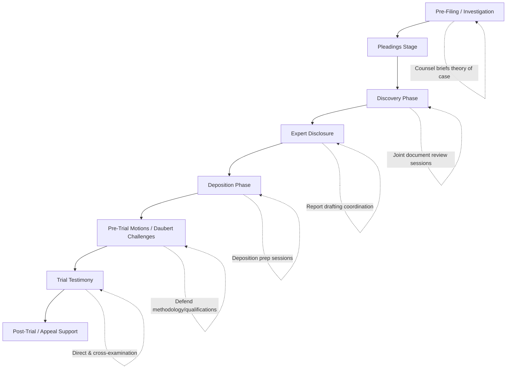

## Working with Legal Counsel Throughout Litigation

### Overview

The forensic accountant's relationship with legal counsel is the central operational and ethical axis of any litigation support engagement. This relationship governs communication protocols, privilege preservation, scope management, and ultimately the credibility of the expert's work product. Unlike traditional attest engagements where the accountant serves the entity being audited, in litigation support the forensic accountant typically serves at the direction of counsel, creating a distinct set of professional, legal, and practical dynamics that must be actively managed across each phase of the litigation lifecycle.

### The Nature of the Counsel-Expert Relationship

**Key Points**

- Counsel is typically the retaining party, even when the ultimate beneficiary is the client (company, individual, insurer)
- The forensic accountant must maintain independence and objectivity despite being retained and directed by an advocate
- Communication must be managed carefully to preserve attorney work-product protection and, where applicable, attorney-client privilege
- The expert's ultimate duty is to the court/trier of fact for opinions rendered, not to advocate for the retaining party's position

### Phases of Litigation and Corresponding Counsel Interaction

#### 1. Pre-Filing / Investigation Stage

- Counsel briefs the forensic accountant on preliminary facts, legal theory, and objectives
- Forensic accountant may assist in evaluating the financial merits of a potential claim before filing
- Early conflict checks and independence assessments performed

#### 2. Pleadings Stage

- Forensic accountant may assist counsel in drafting damages allegations or reviewing opposing pleadings for financial assertions requiring rebuttal
- Scope of engagement letter often finalized at this stage

#### 3. Discovery Phase

- Joint identification of relevant financial records, custodians, and data sources
- Forensic accountant may help draft or respond to interrogatories and document requests involving financial/accounting matters
- Regular status communications with counsel regarding findings, without prematurely committing to conclusions

#### 4. Expert Disclosure

- Coordination on report content, ensuring compliance with jurisdictional disclosure rules (e.g., FRCP 26(a)(2)(B) in U.S. federal courts)
- Balancing counsel's strategic input on presentation with the expert's independent obligation to state genuinely held opinions

#### 5. Deposition Phase

- Counsel prepares the expert for likely lines of cross-examination
- Discussion of prior testimony, potential impeachment material, and consistency across engagements
- Attorney-client privilege does NOT extend to the substance of the expert's opinions or the facts/data considered, which are generally discoverable for testifying experts

#### 6. Pre-Trial Motions / Daubert Challenges

- Forensic accountant may assist counsel in responding to motions challenging the expert's methodology or qualifications
- Preparation of affidavits or declarations defending the reliability of methods used

#### 7. Trial Testimony

- Direct examination preparation with counsel (question outlines, exhibit sequencing)
- Cross-examination readiness, anticipating opposing counsel's attack strategies

#### 8. Post-Trial / Appeal Support

- Assistance with post-trial motions, damages recalculation if remanded, or appellate briefing support on financial issues

### Communication Protocols and Privilege Preservation

| Communication Type | Privilege/Protection Status | Practical Guidance |
| --- | --- | --- |
| Draft reports (testifying expert) | May be discoverable depending on jurisdiction and FRCP 26(b)(4) protections | Maintain awareness that draft exchanges with counsel may need to be produced; some jurisdictions protect drafts, others do not |
| Communications regarding compensation | Generally discoverable | Ensure fee arrangements are clearly documented and non-contingent |
| Communications regarding facts/data considered | Generally discoverable | Maintain organized record of all materials reviewed |
| Communications regarding assumptions provided by counsel | Generally discoverable | Document which assumptions were provided by counsel vs. independently derived |
| Consulting (non-testifying) expert communications | Generally protected under work-product doctrine | Clearly designate non-testifying role in engagement letter |
| Mental impressions/strategy discussions with testifying expert | Protection varies; U.S. federal rules narrowed protection in 2010 amendments to FRCP 26(b)(4) for draft reports and most attorney-expert communications, but facts, data, and assumptions remain discoverable | Structure communications to separate strategic discussion from opinion-forming materials where the jurisdiction requires it |

[Inference] The scope of protection for attorney-expert communications shifted meaningfully after the 2010 FRCP amendments; however, state court rules vary widely and some do not mirror the federal approach, so practitioners should confirm the governing rule for each engagement rather than assume uniform protection.

### Managing Independence While Serving an Advocate's Client

**Key Points**

- The forensic accountant should resist pressure (explicit or implicit) to reach predetermined conclusions
- If factual findings are unfavorable to the retaining party, this must be communicated promptly and candidly to counsel
- Professional standards (AICPA SSFS No. 1, Code of Professional Conduct) require the practitioner to maintain objectivity regardless of the advocacy context of the engagement
- Counsel may vigorously advocate for a legal position; the forensic expert's role is to provide an objective analysis supporting or informing that position, not to construct results to fit it

**Example**

> During a lost-profits analysis, preliminary findings show damages are substantially lower than what counsel initially estimated in the complaint. The forensic accountant's obligation is to communicate this promptly and transparently, allowing counsel to adjust litigation strategy, rather than adjusting assumptions to reach a higher number.

### Practical Coordination Mechanisms

- **Kickoff meetings**: Align on legal theory, key dates, and communication cadence
- **Status update calls**: Regular (e.g., biweekly) updates on data collection progress and preliminary observations, calibrated to avoid premature opinion formation
- **Assumption memos**: Written documentation of factual/legal assumptions provided by counsel (e.g., causation assumptions, contract interpretation) that the expert is instructed to rely upon, clearly distinguished from independently verified facts
- **Draft review cycles**: Structured review of report drafts, balancing counsel's interest in clarity/persuasiveness with the expert's need to preserve independent voice and accuracy
- **Mock cross-examination sessions**: Conducted with counsel prior to deposition/trial to pressure-test the expert's positions

### Handling Disagreements with Counsel

**Key Points**

- If counsel requests analysis or conclusions the forensic accountant believes are unsupportable, the practitioner should:
  - Document the disagreement and the basis for professional judgment
  - Propose alternative, defensible approaches
  - Decline to state opinions not genuinely held, even under pressure
  - Consider withdrawal from the engagement if irreconcilable conflicts arise between professional obligations and counsel's expectations

### Working with Co-Counsel and Multiple Parties

- In complex litigation, multiple law firms (co-counsel, local counsel) may be involved; the forensic accountant should clarify which counsel holds primary direction authority
- In multi-defendant or multi-plaintiff matters, conflict checks must consider all represented parties
- Common interest or joint defense agreements may affect privilege treatment of communications; the engagement letter should clarify how the expert's work product will be shared and protected in such arrangements

### Testifying Expert Conduct During Deposition and Trial (Counsel Coordination)

**Key Points**

- Counsel typically conducts pre-deposition and pre-trial preparation sessions covering:
  - Reviewing the expert report and underlying workpapers for consistency
  - Anticipating opposing counsel's likely challenges to methodology, qualifications, or assumptions
  - Practicing clear, jargon-free explanations of technical accounting concepts for a lay jury
- The expert must maintain independence during testimony — answering truthfully and objectively even when responses may be unfavorable to the retaining party's position
- Coaching on demeanor and communication style is appropriate; coaching on substantive answers to fit a desired narrative is not

### Risk Areas in Counsel Coordination

**Key Points**

- Over-reliance on counsel-provided assumptions without independent verification where verification is feasible and expected
- Blurring the line between consulting and testifying roles mid-engagement without updating the engagement letter and communication protocols
- Inadequate documentation distinguishing counsel-provided assumptions from independently derived findings (creates vulnerability on cross-examination)
- Miscommunication regarding case deadlines, leading to compressed report drafting timelines
- Insufficient conflict-of-interest reassessment when additional parties or entities are added to the litigation

### Illustrative Communication Boundary Diagram

<svg xmlns="http://www.w3.org/2000/svg" viewBox="0 0 850 300" font-family="Arial, sans-serif">
<text x="425" y="22" font-size="16" font-weight="bold" text-anchor="middle">Counsel-Expert Communication Boundaries (svg_diagram)</text>
<rect x="40" y="50" width="350" height="200" rx="10" fill="#e6f4ea" stroke="#34a853" stroke-width="2" />
<text x="215" y="75" font-size="13" font-weight="bold" text-anchor="middle">Generally Protected</text>
<text x="60" y="105" font-size="11">• Non-testifying consulting work</text>
<text x="60" y="130" font-size="11">• Internal strategy discussions</text>
<text x="60" y="155" font-size="11">• Mental impressions (jurisdiction-dependent)</text>
<text x="60" y="180" font-size="11">• Draft reports (in some jurisdictions)</text>
<text x="60" y="205" font-size="11">• Litigation strategy memos</text>
<rect x="450" y="50" width="350" height="200" rx="10" fill="#fce8e6" stroke="#ea4335" stroke-width="2" />
<text x="625" y="75" font-size="13" font-weight="bold" text-anchor="middle">Generally Discoverable</text>
<text x="470" y="105" font-size="11">• Facts/data considered</text>
<text x="470" y="130" font-size="11">• Assumptions relied upon</text>
<text x="470" y="155" font-size="11">• Compensation arrangements</text>
<text x="470" y="180" font-size="11">• Final expert opinions/reports</text>
<text x="470" y="205" font-size="11">• Prior testimony history</text>
<line x1="390" y1="150" x2="450" y2="150" stroke="black" stroke-dasharray="5" stroke-width="2" />
<text x="420" y="270" font-size="10" text-anchor="middle">Boundary varies by jurisdiction and role</text>
</svg>

### Conclusion

Working effectively with legal counsel throughout litigation requires the forensic accountant to balance responsiveness to counsel's strategic needs with unwavering commitment to independence and objectivity. Success depends on clear communication protocols established at engagement inception, disciplined documentation distinguishing counsel-provided assumptions from independent analysis, careful navigation of privilege boundaries (particularly for testifying experts), and the professional courage to communicate unfavorable findings candidly. This relationship, properly managed, produces work product that serves both counsel's advocacy needs and the broader goal of assisting the trier of fact with reliable, credible financial analysis.

**Next Steps**

- Attorney work-product doctrine and *Kovel* letter arrangements
- FRCP 26(a)(2)(B) expert report content requirements in depth
- Deposition strategy and cross-examination defense techniques
- Daubert/Kumho Tire challenges to expert methodology
- Managing multi-party and joint defense privilege issues
- Assumption documentation and reliance memoranda best practices
- Ethical obligations under AICPA SSFS No. 1 in adversarial contexts
- Trial testimony delivery techniques for financial experts
- Post-trial and appellate support for damages recalculation
- Conflict-of-interest identification and resolution procedures