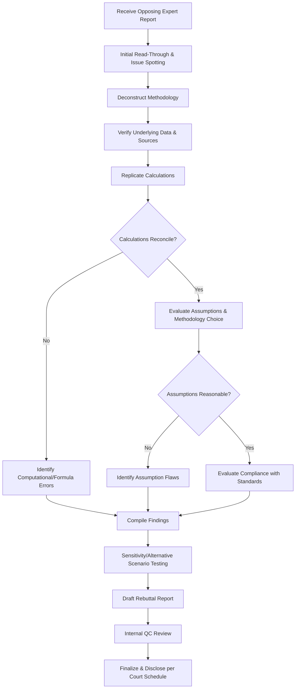

## Rebuttal Analysis and Opposing Expert Critique

### Overview

Rebuttal analysis is the process by which a forensic accounting expert reviews, critiques, and formally responds to the methodology, assumptions, and conclusions of an opposing expert. Rather than independently restating the case, rebuttal work is inherently reactive and comparative — it exists to identify and articulate specific flaws in another expert's analysis, thereby undermining the reliability or admissibility of that analysis in the eyes of the court or jury. Rebuttal reports are typically governed by specific procedural rules and deadlines distinct from initial (affirmative) expert disclosures.

### Purpose and Procedural Context

**Key Points**

- Rebuttal reports respond specifically to opinions disclosed in an opposing expert's initial report
- Scope of rebuttal is generally limited to matters raised in the opposing report — introducing new, unrelated affirmative opinions may be excluded by courts as improper rebuttal
- Under FRCP 26(a)(2)(D)(ii), rebuttal disclosures are typically due within 30 days of the opposing party's disclosure absent a different court-ordered schedule
- Rebuttal work may also inform pre-trial Daubert/Kumho Tire motions challenging the admissibility of the opposing expert's testimony

[Unverified] Specific rebuttal deadlines and scope limitations vary by jurisdiction and by the governing scheduling order in a given case; the FRCP default should not be assumed to control in state court or in federal cases where the court has set a different schedule.

### The Rebuttal Analysis Workflow

#### Step 1: Initial Read-Through and Issue Spotting

- Read the opposing report in full before beginning detailed analysis to understand overall structure and conclusions
- Flag areas of immediate concern: unsupported assumptions, unfamiliar methodologies, internal inconsistencies

#### Step 2: Deconstruct Methodology

- Identify the specific approach used (e.g., discounted cash flow, before-and-after method, net worth method)
- Compare the chosen methodology against generally accepted approaches for the type of claim
- Assess whether the methodology is appropriate given the facts of the case and industry context

#### Step 3: Verify Underlying Data and Sources

- Trace figures used in the opposing report back to source documents (financial statements, general ledgers, contracts)
- Identify any data not disclosed, or reliance on data not produced in discovery
- Check whether the opposing expert used data selectively (cherry-picking favorable periods or subsets)

#### Step 4: Replicate Calculations

- Independently rebuild the opposing expert's model/calculations using the same stated inputs and methodology
- Identify computational errors, formula errors, or internal inconsistencies (e.g., mismatched time periods, incorrect discount rate application)

#### Step 5: Evaluate Assumptions

- Scrutinize key assumptions: growth rates, discount rates, causation linkages, "but-for" scenario construction
- Assess whether assumptions are supported by record evidence, industry data, or are speculative
- Test sensitivity of conclusions to changes in key assumptions

#### Step 6: Evaluate Compliance with Professional/Legal Standards

- Assess adherence to relevant standards (e.g., AICPA valuation standards, NACVA/ASA standards, SSFS No. 1)
- Evaluate whether the opinions would satisfy Daubert/Kumho Tire reliability factors (testability, peer review/publication, known error rate, general acceptance)

#### Step 7: Draft the Rebuttal Report

- Organize critique thematically (methodology flaws, data flaws, assumption flaws, computational errors) rather than merely following the opposing report's structure
- Support each critique point with objective evidence (recalculations, source document citations, authoritative literature)
- Where appropriate, quantify the impact of identified errors on the opposing expert's conclusion (e.g., "correcting for the discount rate error reduces the claimed damages from $X to $Y")

### Common Categories of Critique

| Category | Examples of Flaws to Identify |
| --- | --- |
| **Methodological** | Wrong valuation approach for the asset type; failure to consider alternative methods; use of an outdated or non-standard model |
| **Data integrity** | Reliance on unverified or unproduced data; selective use of favorable time periods; failure to reconcile to audited financials |
| **Assumptions** | Unsupported growth/discount rate assumptions; speculative causation linkages; failure to account for intervening/superseding causes |
| **Computational** | Formula errors, transposition errors, inconsistent unit application (e.g., annual vs. monthly rates) |
| **Standards compliance** | Departure from applicable professional valuation or forensic standards without justification |
| **Qualifications/bias** | Lack of relevant credential or experience in the specific industry/transaction type; undisclosed conflicts of interest; history of one-sided testimony |
| **Logical consistency** | Internal contradictions between report sections; conclusions not following from stated premises |

### Quantitative Rebuttal Techniques

**Example**

> Opposing expert calculates lost profits using a perpetual growth rate of 8% applied to a $2M base-year profit figure, discounted at 10%.
>
> Rebuttal approach: Recompute the same terminal value formula
>
> $$TV = \frac{CF_1}{(r - g)}$$
>
> substituting a more defensible, evidence-supported growth rate ($g$) derived from historical company or industry data (e.g., 3%) while holding the discount rate ($r$) constant, to demonstrate the sensitivity of the conclusion to an unsupported assumption:
>
> $$TV_{\text{revised}} = \frac{2{,}000{,}000}{(0.10 - 0.03)} = 28{,}571{,}429$$
>
> versus the opposing expert's original:
>
> $$TV_{\text{original}} = \frac{2{,}000{,}000}{(0.10 - 0.08)} = 100{,}000{,}000$$
>
> This demonstrates that the growth rate assumption alone drives a disproportionate share of the damages conclusion, making it a focal point for cross-examination.

[Inference] The magnitude of sensitivity shown above is illustrative of how small changes in growth/discount rate spreads can produce large swings in perpetuity-based valuations; actual case-specific sensitivity will depend on the particular inputs involved.

### Sensitivity and Scenario Analysis in Rebuttal

- Build a sensitivity table varying key assumptions (discount rate, growth rate, causation period) to show the range of outcomes under different, more defensible inputs
- Present tornado charts or scenario tables to visually demonstrate which assumptions have the greatest impact on the conclusion
- Avoid simply substituting the rebuttal expert's own preferred number without transparent methodology — the goal is to show the fragility or unreliability of the opposing analysis, not merely to advocate a competing figure (unless also serving as the affirmative expert)

### Rebuttal vs. Affirmative Opinion: Scope Discipline

**Key Points**

- A rebuttal report should generally stay within the four corners of what the opposing expert addressed
- Introducing wholly new damages theories or calculations in a "rebuttal" report risks being struck by the court as untimely and outside proper rebuttal scope
- Where the same expert serves both affirmative and rebuttal roles, clear organizational separation between the two analyses helps preserve procedural compliance

### Preparing for Cross-Examination on Rebuttal Opinions

- Anticipate that opposing counsel will attempt to characterize rebuttal critique as "merely negative" or lacking an affirmative alternative — be prepared to explain that identifying unreliable methodology is a valid and recognized expert function independent of proposing a substitute number
- Maintain meticulous documentation of all recalculations and source verification performed, as these will likely be probed in deposition
- Be prepared to acknowledge legitimate points in the opposing analysis where warranted — selective, defensible critique is more credible than blanket dismissal of every aspect of the opposing report

### Interaction with Daubert/Kumho Tire Challenges

Rebuttal analysis often directly supports a motion to exclude or limit the opposing expert's testimony:

| Daubert Factor | How Rebuttal Analysis Supports Challenge |
| --- | --- |
| Testability | Demonstrate the opposing methodology cannot be independently verified or replicated |
| Known error rate | Quantify computational errors found during replication |
| Peer review/publication | Show the methodology departs from recognized, published valuation/forensic standards |
| General acceptance | Cite authoritative standards (AICPA, ASA, NACVA) the opposing approach fails to follow |
| Fit to the facts | Demonstrate assumptions are not tied to actual record evidence in the case |

### Risk Areas and Pitfalls

**Key Points**

- Overly aggressive or ad hominem critique that undermines the rebuttal expert's own credibility and perceived objectivity
- Failing to replicate calculations independently, relying instead on assumed errors without verification
- Exceeding proper rebuttal scope by introducing new affirmative theories, risking exclusion
- Inadequate sensitivity analysis, leaving conclusions vulnerable to the argument that critique is result-driven rather than principled
- Ignoring legitimate strengths in the opposing analysis, which can appear one-sided to a judge or jury

### Illustrative Rebuttal Report Structure

<svg xmlns="http://www.w3.org/2000/svg" viewBox="0 0 850 260" font-family="Arial, sans-serif">
<text x="425" y="22" font-size="16" font-weight="bold" text-anchor="middle">Typical Rebuttal Report Structure (svg_diagram)</text>
<rect x="30" y="50" width="150" height="50" fill="#e8f0fe" stroke="#4285f4" />
<text x="105" y="80" font-size="10" text-anchor="middle">Qualifications &amp;</text>
<text x="105" y="92" font-size="9" text-anchor="middle">Scope of Rebuttal</text>
<rect x="200" y="50" width="150" height="50" fill="#fef7e0" stroke="#fbbc04" />
<text x="275" y="80" font-size="10" text-anchor="middle">Summary of</text>
<text x="275" y="92" font-size="9" text-anchor="middle">Opposing Opinions</text>
<rect x="370" y="50" width="150" height="50" fill="#fce8e6" stroke="#ea4335" />
<text x="445" y="80" font-size="10" text-anchor="middle">Methodology &amp;</text>
<text x="445" y="92" font-size="9" text-anchor="middle">Data Critique</text>
<rect x="540" y="50" width="150" height="50" fill="#e6f4ea" stroke="#34a853" />
<text x="615" y="80" font-size="10" text-anchor="middle">Recalculations &amp;</text>
<text x="615" y="92" font-size="9" text-anchor="middle">Sensitivity Analysis</text>
<rect x="710" y="50" width="110" height="50" fill="#f3e8fd" stroke="#a142f4" />
<text x="765" y="80" font-size="10" text-anchor="middle">Conclusions</text>
<line x1="180" y1="75" x2="200" y2="75" stroke="black" marker-end="url(#arrow2)" />
<line x1="350" y1="75" x2="370" y2="75" stroke="black" marker-end="url(#arrow2)" />
<line x1="520" y1="75" x2="540" y2="75" stroke="black" marker-end="url(#arrow2)" />
<line x1="690" y1="75" x2="710" y2="75" stroke="black" marker-end="url(#arrow2)" />
<rect x="30" y="150" width="790" height="80" fill="#f8f9fa" stroke="#ccc" />
<text x="45" y="170" font-size="10" font-weight="bold">Supporting Appendices:</text>
<text x="45" y="190" font-size="9">• Recalculation workpapers • Source document citations • Sensitivity tables • Standards/literature references</text>
<text x="45" y="210" font-size="9">• Comparison exhibits (opposing conclusion vs. corrected conclusion)</text>
</svg>

### Conclusion

Rebuttal analysis and opposing expert critique demand a disciplined, evidence-based methodology that goes well beyond simple disagreement with an opposing expert's conclusions. Effective rebuttal work requires independent replication of calculations, rigorous evaluation of assumptions and data sources, careful adherence to procedural scope limitations, and clear, quantified articulation of identified flaws. When executed properly, rebuttal analysis not only weakens the persuasive force of opposing testimony but can provide the evidentiary foundation for Daubert-type motions seeking to exclude unreliable expert opinions altogether. As with affirmative expert work, credibility in rebuttal is built through objectivity, transparency, and technical rigor rather than adversarial advocacy.

**Related Topics**

- Daubert and Kumho Tire admissibility standards in depth
- Damages quantification methodologies (lost profits, valuation, unjust enrichment)
- Business valuation standards and discount/growth rate support
- Deposition strategy for cross-examining opposing experts
- Motions in limine and expert exclusion procedures
- Sensitivity analysis and scenario modeling techniques
- Expert qualification challenges and voir dire of experts
- FRCP 26(a)(2)(D) rebuttal disclosure timing and scope rules
- Data analytics tools for forensic recalculation and verification
- Report writing standards for testifying experts