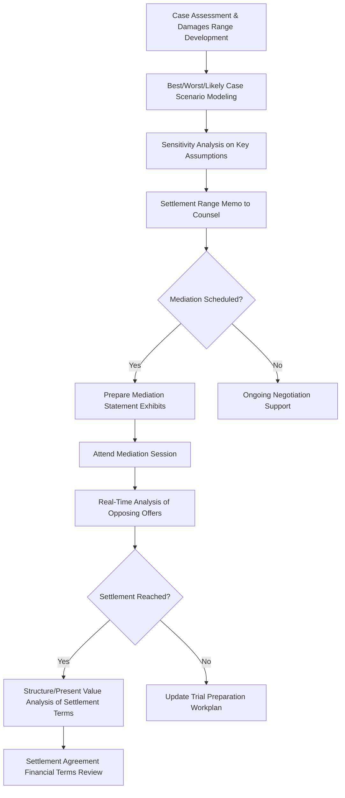

## Settlement and Mediation Support

### Overview

Settlement and mediation support encompasses the forensic accountant's role in assisting counsel and clients during alternative dispute resolution (ADR) processes — negotiation, mediation, and settlement conferences — that occur outside of, or in parallel with, formal trial proceedings. Unlike trial testimony, this work is typically advisory and strategic rather than adjudicative, focused on quantifying settlement ranges, evaluating opposing positions, and providing real-time financial analysis to support negotiation strategy.

### Purpose and Context Within Litigation

**Key Points**

- The majority of civil litigation resolves via settlement rather than trial, making settlement support a high-frequency, high-value forensic accounting function
- Forensic accountants may be engaged specifically for settlement/mediation support without any expectation of testimony (a purely consulting role)
- Even in matters heading toward trial, settlement support often runs in parallel with trial preparation, informed by the same underlying financial analysis
- Work product in this context, when conducted as non-testifying consulting, is generally protected from discovery under the work-product doctrine, subject to jurisdictional variation

### Types of Engagements Requiring Settlement Support

| Context | Forensic Accountant's Role |
| --- | --- |
| Pre-litigation negotiation | Evaluate claim/defense financial merit before filing to inform settlement posture |
| Mediation (formal, mediator-facilitated) | Prepare mediation statements, present financial analysis to mediator, respond to opposing positions in real time |
| Settlement conference (court-ordered or voluntary) | Provide counsel with updated damages ranges reflecting discovery developments |
| Structured settlements | Model present value of proposed periodic payment structures |
| Post-verdict settlement (pending appeal) | Reassess risk-adjusted settlement value considering appellate uncertainty |

### The Settlement Support Workflow

#### Step 1: Case Assessment and Damages Range Development

- Develop a defensible range of potential outcomes rather than a single point estimate, reflecting litigation uncertainty
- Incorporate best-case, worst-case, and most-likely scenarios based on differing legal theories, causation assumptions, or methodology choices

#### Step 2: Scenario and Sensitivity Modeling

- Model how key assumptions (growth rates, causation periods, liability allocation percentages) affect the damages range
- Present a probability-weighted or scenario-weighted expected value where appropriate to aid negotiation strategy

#### Step 3: Settlement Range Memorandum

- Provide counsel with a confidential memorandum summarizing the financial analysis underlying recommended settlement parameters
- Clearly distinguish legal risk factors (liability uncertainty, jury unpredictability) — typically assessed by counsel — from financial/damages calculation factors, which are the forensic accountant's domain

#### Step 4: Mediation Statement Preparation

- Prepare financial exhibits summarizing damages theories in a persuasive but defensible format for presentation to a mediator
- Anticipate and prepare rebuttal points to the opposing party's anticipated financial arguments

#### Step 5: Real-Time Mediation Support

- Attend mediation sessions (in person or virtually) to respond to new financial arguments raised by the opposing party
- Perform on-the-spot recalculations as settlement offers and counteroffers are exchanged, testing the financial implications of proposed terms

#### Step 6: Structuring and Present Value Analysis of Settlement Terms

- Where settlements involve deferred or structured payments, calculate present value using an appropriate discount rate:

$$PV = \sum_{t=1}^{n} \frac{CF_t}{(1+r)^t}$$

- Evaluate tax implications, security of future payments (e.g., annuity-backed structures), and comparison to lump-sum alternatives

### Damages Range Presentation Techniques

**Example**

> For a breach-of-contract lost-profits claim, a settlement range memo might present:
>
> - **Low scenario**: Conservative causation period (6 months) and historical (non-growth) baseline → $1.2M
> - **Mid scenario**: Moderate causation period (12 months) with modest industry-consistent growth → $2.4M
> - **High scenario**: Full causation period claimed (24 months) with plaintiff's growth assumptions → $4.1M
>
> This range allows counsel to negotiate with an understanding of how sensitive the ultimate number is to contestable factual and legal assumptions.

### Evaluating Opposing Settlement Positions

**Key Points**

- Deconstruct the opposing party's settlement demand or offer using the same rigor applied to a formal opposing expert report, even though it may not be formally disclosed as expert testimony
- Identify unsupported assumptions embedded in the opposing position's implied damages calculation
- Quantify the financial gap between positions and identify which specific assumptions are driving the gap — this focuses negotiation on resolvable, fact-based disputes rather than unfocused back-and-forth

### Mediator Interaction Considerations

- Mediators often request separate caucuses with each side; the forensic accountant may need to present technical analysis directly to the mediator in a simplified, persuasive format
- Confidentiality of mediation communications is typically protected under mediation privilege statutes/rules (e.g., state mediation confidentiality statutes, Federal Rule of Evidence 408 protections against admissibility of settlement negotiations) — but this protection generally covers admissibility of settlement discussions themselves, not the independent facts or data underlying the analysis presented

[Unverified] The precise scope of mediation confidentiality protections (statutory privilege vs. mere evidentiary exclusion under FRE 408) varies by jurisdiction and by whether the mediation is court-annexed or private; practitioners should confirm applicable rules before assuming blanket confidentiality of all materials shared.

### Financial Structuring Considerations in Settlement

| Structuring Element | Forensic Accountant's Analytical Role |
| --- | --- |
| Lump sum vs. structured payments | Present value comparison at negotiated discount rates |
| Tax treatment of settlement proceeds | Coordinate with tax advisors on characterization (compensatory vs. punitive, capital vs. ordinary) |
| Security/collateral for deferred payments | Assess creditworthiness or collateral adequacy of paying party |
| Allocation among multiple claims/plaintiffs | Develop allocation methodology consistent with relative damages contribution |
| Offset/credit for prior payments | Reconcile settlement terms against amounts already paid or received |

### Distinguishing Settlement Support from Testifying Work

**Key Points**

- When engaged purely for settlement/mediation support with no anticipated testimony, the engagement letter should explicitly designate the role as non-testifying/consulting to preserve work-product protection
- If the matter does not settle and proceeds toward trial, counsel and the forensic accountant must reassess whether the same individual will transition to a testifying role — this transition can affect discoverability of prior settlement-support work product
- Firms sometimes use a "shadow expert" (consulting-only) model specifically to preserve the option of a separate, later-designated testifying expert whose work remains untainted by settlement positioning

[Inference] The use of separate consulting and testifying experts is a common risk-mitigation practice precisely because materials developed for aggressive settlement advocacy may be viewed as less "neutral" than materials developed strictly for trial testimony; however, this is a matter of practice convention rather than a universal legal requirement.

### Post-Settlement Financial Review

- Review final settlement agreement language for consistency with the financial analysis and structuring discussed during negotiation
- Verify calculation of any formulaic settlement terms (e.g., earn-outs, contingent payments tied to future financial performance)
- Assist with allocation schedules where settlement proceeds must be distributed among multiple parties or claim categories

### Risk Areas in Settlement Support

**Key Points**

- Presenting a single point-estimate damages figure without a defensible range can weaken negotiating credibility if challenged
- Failing to clearly document which figures/analyses were developed for settlement purposes only, versus for potential trial use, risking confusion if the matter proceeds to litigation
- Inadequate sensitivity analysis, leaving counsel unable to respond effectively to shifting settlement offers in real time
- Overlooking tax and structuring implications that materially affect the economic value of a proposed settlement to the client

### Illustrative Settlement Range Visualization

<svg xmlns="http://www.w3.org/2000/svg" viewBox="0 0 850 260" font-family="Arial, sans-serif">
<text x="425" y="22" font-size="16" font-weight="bold" text-anchor="middle">Settlement Range Scenario Analysis (svg_diagram)</text>
<line x1="80" y1="220" x2="780" y2="220" stroke="black" stroke-width="1" />
<line x1="80" y1="60" x2="80" y2="220" stroke="black" stroke-width="1" />
<text x="40" y="225" font-size="9">$0</text>
<text x="20" y="65" font-size="9">$4.5M</text>
<rect x="150" y="180" width="120" height="40" fill="#e6f4ea" stroke="#34a853" />
<text x="210" y="205" font-size="10" text-anchor="middle">$1.2M</text>
<text x="210" y="240" font-size="10" text-anchor="middle">Low</text>
<rect x="360" y="120" width="120" height="100" fill="#fef7e0" stroke="#fbbc04" />
<text x="420" y="175" font-size="10" text-anchor="middle">$2.4M</text>
<text x="420" y="240" font-size="10" text-anchor="middle">Mid</text>
<rect x="570" y="70" width="120" height="150" fill="#fce8e6" stroke="#ea4335" />
<text x="630" y="150" font-size="10" text-anchor="middle">$4.1M</text>
<text x="630" y="240" font-size="10" text-anchor="middle">High</text>
<line x1="150" y1="150" x2="690" y2="150" stroke="gray" stroke-dasharray="4" />
<text x="700" y="145" font-size="8">Negotiation zone</text>
</svg>

### Conclusion

Settlement and mediation support requires the forensic accountant to shift from the singular, defensible-opinion posture of trial testimony toward a more dynamic, range-based advisory role that directly informs negotiation strategy. Effective support depends on well-constructed scenario and sensitivity analyses, clear communication of the financial drivers behind competing positions, careful attention to the tax and structuring implications of proposed settlement terms, and disciplined documentation practices that preserve appropriate work-product protections. Because most litigated disputes ultimately resolve through settlement rather than trial, this function represents one of the most frequently exercised and highest-impact applications of forensic accounting expertise in the litigation lifecycle.

**Related Topics**

- Present value and structured settlement analysis techniques
- Work-product doctrine and consulting vs. testifying expert distinctions
- Damages range and scenario/sensitivity modeling methodologies
- Mediation confidentiality rules and FRE 408 protections
- Tax treatment and characterization of litigation settlement proceeds
- Allocation methodologies in multi-party settlements
- Negotiation strategy support and real-time financial analysis techniques
- Earn-out and contingent payment calculation verification
- Structured settlement annuity and creditworthiness assessment
- Transitioning from consulting to testifying expert roles mid-litigation