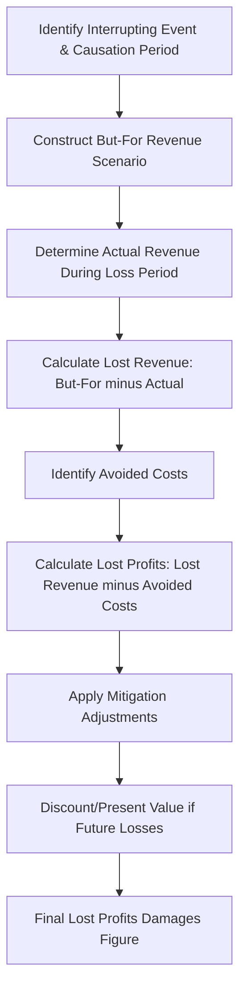

## Lost Profits and Business Interruption Calculations

### Overview

Lost profits and business interruption calculations quantify the economic harm suffered by a business as a result of a wrongful act — breach of contract, tortious interference, insurable property loss, antitrust violation, intellectual property infringement, or similar events. The core analytical objective is to reconstruct the "but-for" scenario (what the business's financial performance would have been absent the interrupting event) and compare it to the "actual" scenario (what did happen), with the difference representing the measure of loss.

### Foundational Legal and Economic Framework

**Key Points**

- Damages must generally be proven with "reasonable certainty" — a legal standard that varies by jurisdiction but universally requires more than speculation
- The plaintiff typically bears the burden of establishing both the fact of damage (causation) and the amount of damage (quantification)
- Lost profits are typically net, not gross — the analysis must account for costs avoided as a result of not generating the lost revenue
- Business interruption claims arising under insurance policies are governed by policy language (e.g., "period of restoration," "actual loss sustained") in addition to general damages principles

### The But-For Framework

### Core Methodologies for Estimating the But-For Scenario

| Method | Description | Best Suited For |
| --- | --- | --- |
| **Before-and-After Method** | Compares the business's actual performance before the wrongful act to its performance during/after the act, using pre-event trends to project the but-for scenario | Established businesses with stable historical performance and a clear causation date |
| **Yardstick Method** | Uses comparable businesses, industry benchmarks, or a similar business unaffected by the wrongful act as a proxy for expected performance | New businesses lacking sufficient history, or where industry-wide comparables are available |
| **Market Model / Market Share Method** | Projects the plaintiff's expected performance based on its historical market share applied to actual total market performance during the loss period | Markets with reliable industry-wide data and a stable historical market share relationship |
| **Sales Projections Method** | Relies on the business's own pre-existing projections, budgets, or business plans as evidence of expected performance | Cases where credible, contemporaneous internal projections exist and are not overly optimistic/self-serving |

[Inference] Courts often favor methods with the strongest empirical grounding in actual historical or comparable data over methods relying heavily on internal projections, given the risk that projections may be viewed as self-serving; however, acceptance varies by jurisdiction and the specific facts of the case.

### Before-and-After Method: Illustrative Calculation

**Example**

> A distributor's contract is breached, cutting off product supply for 12 months. Historical monthly revenue growth averaged 2% for the 24 months prior to breach.
>
> But-for monthly revenue projection:
>
> $$R_t = R_0 \times (1 + g)^t$$
>
> where $R_0$ = last pre-breach monthly revenue, $g$ = 2% monthly growth rate, $t$ = months since breach
>
> If $R_0 = \$500{,}000$ and the loss period is 12 months:
>
> $$R_{12} = 500{,}000 \times (1.02)^{12} \approx 634{,}000$$
>
> Total but-for revenue over the 12-month period is calculated by summing $R_t$ for $t = 1$ to $12$, then compared against actual revenue earned during the same period (which may be $0 if operations ceased, or reduced if partially mitigated).

### Calculating Net Lost Profits: The Avoided Cost Analysis

**Key Points**

- Lost profits ≠ lost revenue; the analysis must subtract costs the business avoided by not generating that revenue
- Costs are typically categorized as:
  - **Variable costs** (directly tied to production/sales volume — e.g., cost of goods sold, sales commissions): generally fully avoided and must be subtracted
  - **Fixed costs** (rent, salaried overhead): generally NOT avoided in the short run and should NOT be subtracted from lost revenue
  - **Semi-variable/mixed costs**: require decomposition into fixed and variable components (e.g., using regression analysis or high-low method)

$$\text{Lost Profits} = \text{Lost Revenue} - \text{Avoided Variable Costs}$$

**Example**

> Lost revenue of $1,000,000 with a historical variable cost ratio of 60% (COGS + variable selling expenses):
>
> $$\text{Avoided Costs} = 1{,}000{,}000 \times 0.60 = 600{,}000$$
>
>
>
> $$\text{Lost Profits} = 1{,}000{,}000 - 600{,}000 = 400{,}000$$

### Fixed vs. Variable Cost Classification Techniques

| Technique | Description |
| --- | --- |
| **High-Low Method** | Uses the highest and lowest activity levels and associated costs to estimate the variable cost per unit and fixed cost component |
| **Regression Analysis** | Statistically estimates the fixed and variable cost relationship using historical cost and volume data: $Cost = a + b(\text{Volume})$, where $a$ = fixed component, $b$ = variable rate |
| **Account Classification (Scattergraph/Judgment)** | Line-item review of the chart of accounts, classifying each account as fixed, variable, or mixed based on nature and historical behavior |
| **Contribution Margin Analysis** | Direct use of the company's own contribution margin reporting, where available and reliable |

[Inference] Regression-based cost classification is generally viewed as more empirically rigorous than simple high-low or judgmental classification, but it requires a sufficient volume of historical data points and reasonably stable cost behavior to produce a reliable result; with limited or volatile data, simpler methods may be more defensible.

### Mitigation of Damages

**Key Points**

- Plaintiffs generally have a legal duty to mitigate damages (take reasonable steps to reduce the loss)
- Forensic accountant must assess whether, and to what extent, the plaintiff mitigated losses (e.g., securing replacement customers, alternative suppliers, or redeployed resources)
- Failure to mitigate can reduce the recoverable damages amount; the analysis should quantify any income earned through mitigation efforts and net it against the calculated loss
- Evidence of reasonable mitigation efforts (or their absence) is often a significant point of contention between opposing experts

### Business Interruption Insurance Claims: Specific Considerations

Business interruption claims under property/casualty insurance policies involve additional, policy-specific elements beyond general lost profits analysis:

| Element | Description |
| --- | --- |
| **Period of Restoration** | The policy-defined time period during which the interruption is compensable, typically ending when the property "should" reasonably have been repaired/restored |
| **Actual Loss Sustained** | Many policies limit recovery to actual net income loss plus continuing normal operating expenses, not gross revenue loss |
| **Extra Expense Coverage** | Additional costs incurred to minimize the interruption (e.g., renting temporary facilities) may be separately compensable, subject to policy limits |
| **Ordinary Payroll Exclusion/Limitation** | Some policies limit continued payroll expense coverage during interruption to a specified number of days |
| **Civil Authority Coverage** | Covers losses when a civil authority (e.g., government order) prohibits access to the property, subject to specific triggering conditions |

[Unverified] Business interruption policy language varies substantially by insurer and policy form; the specific definitions of "period of restoration," covered perils, and applicable sub-limits must be reviewed against the actual policy at issue rather than assumed from general industry norms.

### Discounting Future Losses to Present Value

Where lost profits extend into the future beyond the valuation/trial date, the projected future losses must be discounted to present value using a rate reflecting the risk of the projected cash flows:

$$PV = \sum_{t=1}^{n} \frac{LP_t}{(1+r)^t}$$

where $LP_t$ = lost profits in period $t$, and $r$ = the discount rate (often derived from a weighted average cost of capital or risk-adjusted rate appropriate to the business's risk profile).

[Inference] Selection of an appropriate discount rate is one of the most frequently disputed elements in lost profits litigation, as small changes in $r$ can materially affect present value over long loss periods; the appropriate rate should reflect the specific risk characteristics of the projected cash flows rather than a generic market rate.

### Common Analytical Pitfalls

**Key Points**

- Using gross revenue loss instead of net lost profits (failing to deduct avoided variable costs)
- Extending the loss period beyond what is causally and legally supportable (e.g., assuming permanent loss where evidence suggests only temporary disruption)
- Applying unsupported or overly optimistic growth rates in the but-for projection
- Failing to account for external, non-defendant-caused factors affecting the business during the loss period (e.g., broader industry downturn, pandemic-related disruption)
- Ignoring or inadequately assessing the plaintiff's duty to mitigate
- Double-counting damages across multiple claims or theories in the same case

### Illustrative Damages Bridge

<svg xmlns="http://www.w3.org/2000/svg" viewBox="0 0 850 280" font-family="Arial, sans-serif">
<text x="425" y="22" font-size="16" font-weight="bold" text-anchor="middle">Lost Profits Damages Bridge (svg_diagram)</text>
<rect x="30" y="80" width="130" height="120" fill="#e8f0fe" stroke="#4285f4" />
<text x="95" y="145" font-size="10" text-anchor="middle">But-For</text>
<text x="95" y="160" font-size="10" text-anchor="middle">Revenue</text>
<text x="95" y="175" font-size="10" text-anchor="middle">$1,000,000</text>
<rect x="190" y="140" width="130" height="60" fill="#fce8e6" stroke="#ea4335" />
<text x="255" y="165" font-size="9" text-anchor="middle">Less: Actual</text>
<text x="255" y="178" font-size="9" text-anchor="middle">Revenue Earned</text>
<text x="255" y="191" font-size="9" text-anchor="middle">($0)</text>
<rect x="350" y="100" width="130" height="100" fill="#fef7e0" stroke="#fbbc04" />
<text x="415" y="140" font-size="9" text-anchor="middle">Lost Revenue</text>
<text x="415" y="155" font-size="9" text-anchor="middle">$1,000,000</text>
<rect x="510" y="140" width="130" height="60" fill="#fce8e6" stroke="#ea4335" />
<text x="575" y="165" font-size="9" text-anchor="middle">Less: Avoided</text>
<text x="575" y="178" font-size="9" text-anchor="middle">Variable Costs</text>
<text x="575" y="191" font-size="9" text-anchor="middle">($600,000)</text>
<rect x="670" y="100" width="130" height="100" fill="#e6f4ea" stroke="#34a853" />
<text x="735" y="140" font-size="9" text-anchor="middle">Net Lost</text>
<text x="735" y="155" font-size="9" text-anchor="middle">Profits</text>
<text x="735" y="170" font-size="10" font-weight="bold" text-anchor="middle">$400,000</text>
<line x1="160" y1="140" x2="190" y2="140" stroke="black" marker-end="url(#arrow3)" />
<line x1="320" y1="150" x2="350" y2="150" stroke="black" marker-end="url(#arrow3)" />
<line x1="480" y1="150" x2="510" y2="150" stroke="black" marker-end="url(#arrow3)" />
<line x1="640" y1="150" x2="670" y2="150" stroke="black" marker-end="url(#arrow3)" />
</svg>

### Conclusion

Lost profits and business interruption calculations require a disciplined reconstruction of the but-for scenario, rigorous separation of fixed and variable costs to arrive at net (not gross) damages, careful attention to causation and loss-period boundaries, and appropriate treatment of mitigation and present value discounting. The reliability of the resulting damages figure depends heavily on the empirical grounding of the chosen methodology and the reasonableness of key assumptions — factors that are frequently the central battleground in expert testimony and cross-examination in commercial litigation and insurance disputes alike.

**Related Topics**

- Fixed, variable, and mixed cost classification techniques (regression, high-low method)
- Discount rate selection and cost of capital analysis for damages present value
- Mitigation of damages: legal standards and financial quantification
- Business interruption insurance policy interpretation and "period of restoration" disputes
- Reasonable certainty standard and admissibility of damages projections
- Yardstick and market-share methodologies in emerging business damages claims
- Rebuttal analysis of opposing lost profits models
- Causation analysis: separating wrongful-act effects from external market factors
- Extra expense and civil authority coverage in business interruption claims
- Present value and terminal value modeling in long-horizon damages claims