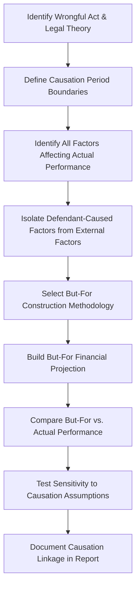

## But-For Analysis and Causation

### Overview

But-for analysis and causation form the analytical and legal bridge between a wrongful act and the economic damages claimed to flow from it. Before any damages figure can be quantified, it must be established that the defendant's conduct actually caused the plaintiff's financial harm, and that the magnitude of harm can be isolated from other contributing factors. This topic addresses both the legal causation framework within which forensic accountants operate and the technical methods used to construct a credible "but-for" world — the hypothetical scenario representing what would have occurred absent the wrongful conduct.

### Legal Causation Framework

**Key Points**

- **Cause-in-fact (factual causation)**: Typically established using the "but-for" test — would the harm have occurred but for the defendant's conduct? Some jurisdictions apply a "substantial factor" test in cases involving multiple potential causes
- **Proximate cause (legal causation)**: Limits liability to harms that are a reasonably foreseeable consequence of the wrongful conduct, even where factual causation is established
- **Reasonable certainty standard**: Most jurisdictions require damages to be proven with reasonable certainty, not mathematical precision — courts generally tolerate some degree of estimation once causation and the fact of damage are established
- The forensic accountant's role is generally confined to the economic/financial aspects of causation and quantification; the ultimate legal determination of causation is typically a question for the trier of fact, informed by both legal argument and expert economic analysis

[Inference] The precise articulation of causation standards (but-for vs. substantial factor, foreseeability limitations) varies meaningfully across jurisdictions and claim types (contract vs. tort vs. statutory claims), so the applicable standard should be confirmed with retaining counsel for each specific engagement rather than assumed uniform.

### The But-For World Construction Process

#### Step 1: Identify the Wrongful Act and Legal Theory

- Clarify precisely what conduct is alleged to be wrongful (breach of specific contract terms, tortious interference, fraudulent misrepresentation, antitrust violation, IP infringement)
- Understand from counsel the specific legal elements that must be satisfied for causation to be established under the governing legal theory

#### Step 2: Define Causation Period Boundaries

- Establish the start date (when the wrongful conduct began to have financial impact) and end date (when the effect of the wrongful conduct ceased, or a reasonable projection horizon)
- Avoid conflating the date of the wrongful act with the date financial impact began, if these differ (e.g., a contract breach may have delayed downstream effects)

#### Step 3: Identify All Factors Affecting Actual Performance

- Catalog both the alleged wrongful conduct and all other potential explanatory factors for the plaintiff's financial performance during the period at issue: macroeconomic conditions, industry trends, competitive actions, management decisions, prior existing problems

#### Step 4: Isolate Defendant-Caused Factors from External Factors

- This is the analytical core of causation analysis — separating the portion of financial underperformance attributable to the defendant's conduct from portions attributable to other factors
- Statistical and comparative techniques are used to test whether the timing and magnitude of the performance decline align with the timing of the alleged wrongful conduct

#### Step 5–7: Methodology Selection, Projection, and Comparison

- (See Methodologies table below — mirrors approaches used in lost profits analysis but with explicit focus on isolating causal contribution)

#### Step 8: Document Causation Linkage

- The report must explicitly connect the quantitative but-for/actual comparison back to the legal theory of wrongful conduct, rather than presenting quantification in isolation from causation reasoning

### Techniques for Isolating Causation from Confounding Factors

| Technique | Description | Application |
| --- | --- | --- |
| **Regression Analysis** | Statistically models the relationship between a dependent variable (e.g., revenue) and independent variables (e.g., industry index, marketing spend, an indicator variable for the wrongful conduct period) to isolate the effect attributable to the event | Useful where sufficient historical data exists and a plausible statistical model can be specified |
| **Difference-in-Differences** | Compares the change in performance for the affected business/segment against the change in performance for a comparable, unaffected control group over the same period | Useful when a clean control group (e.g., unaffected division, comparable competitor) exists |
| **Event Study Methodology** | Commonly used in securities litigation; measures abnormal stock price movement around a specific event date, controlling for broader market movements | Securities fraud, disclosure violation cases |
| **Time-Series Trend Analysis** | Extends pre-event historical trends forward and compares to actual post-event performance, attributing the gap to the event, adjusted for known external factors | Simpler, more transparent alternative when regression is not well-supported by available data |
| **Comparable/Benchmark Analysis** | Uses industry or peer-company performance during the same period as a proxy for what would have occurred absent the wrongful conduct | Useful when firm-specific historical data is limited (e.g., new business) |

[Inference] Regression and difference-in-differences approaches are generally regarded as more rigorous where data supports them, because they explicitly control for confounding variables rather than assuming all deviation from trend is attributable to the defendant; however, courts have accepted simpler trend-based approaches in many cases, particularly where data limitations make more sophisticated modeling impractical or where the simpler method better fits the facts.

### Illustrative Regression-Based Causation Model

**Example**

> To isolate the effect of a defendant's alleged tortious interference on the plaintiff's monthly sales, a regression model might be specified as:
>
> $$Sales_t = \beta_0 + \beta_1 (IndustryIndex_t) + \beta_2 (MarketingSpend_t) + \beta_3 (EventIndicator_t) + \varepsilon_t$$
>
> where $EventIndicator_t$ equals 1 during the period the wrongful conduct is alleged to have affected sales and 0 otherwise. The coefficient $\beta_3$, if statistically significant, represents the estimated causal impact attributable to the event, holding other explanatory variables constant.
>
> The statistical significance of $\beta_3$ (e.g., via a $t$-test with $p < 0.05$) provides evidentiary support that the observed decline is not merely attributable to random variation or the other included variables.

[Inference] The reliability of this type of model depends heavily on model specification choices (which variables are included, functional form, whether autocorrelation or heteroscedasticity in the error term $\varepsilon_t$ is properly addressed) — these specification choices are frequently the subject of vigorous dispute between opposing experts.

### Addressing Multiple or Concurrent Causes

**Key Points**

- Litigation frequently involves multiple defendants or multiple potential causes of harm occurring simultaneously (e.g., a breach of contract occurring during a broader industry downturn)
- Analytical approaches to concurrent causation include:
  - **Apportionment**: Allocating the total harm among multiple causal factors based on their relative contribution (e.g., using regression coefficients or comparable-period analysis)
  - **Joint and several liability considerations**: A legal (not accounting) determination of how liability is shared among multiple defendants once total causation-based damages are established
  - **Superseding cause analysis**: Assessing whether an intervening event breaks the causal chain between the defendant's conduct and the ultimate harm

### Distinguishing "Fact of Damage" from "Amount of Damage"

| Concept | Standard Typically Applied | Forensic Accountant's Role |
| --- | --- | --- |
| Fact of damage (causation) | Often requires a higher degree of certainty that some harm occurred | Support with clear before/after or comparable evidence showing the wrongful conduct correlates with financial harm |
| Amount of damage (quantification) | Generally allows for reasonable estimation once fact of damage is established | Apply methodologies (before-and-after, yardstick, regression) to quantify magnitude, acknowledging inherent estimation |

[Unverified] Some jurisdictions apply a more relaxed standard to the amount of damages once causation is clearly established (sometimes summarized as "difficulty of exact measurement should not preclude recovery"), but the degree of relaxation and its precise articulation vary by jurisdiction and claim type.

### Sensitivity Testing of Causation Assumptions

- Present alternative causation period boundaries (shorter/longer) and show resulting impact on damages
- Test alternative allocation of harm between defendant conduct and external factors (e.g., 100% attribution vs. a more conservative 60–70% attribution reflecting acknowledged external headwinds)
- This sensitivity analysis both strengthens the credibility of the primary opinion and anticipates likely cross-examination or rebuttal challenges

### Common Analytical Pitfalls

**Key Points**

- Assuming all post-event underperformance is attributable to the wrongful conduct without testing alternative explanations
- Selecting a causation period that extends well beyond the period supported by the actual mechanism of harm (e.g., assuming permanent damage from a temporary supply disruption without evidentiary support)
- Failing to control for concurrent macroeconomic or industry-wide conditions that independently affected performance
- Over-reliance on statistical significance without also assessing practical/economic significance and the reasonableness of underlying data
- Conflating correlation between the timing of the event and a performance decline with proof of causation, without ruling out alternative explanations

### Illustrative But-For vs. Actual Comparison

<svg xmlns="http://www.w3.org/2000/svg" viewBox="0 0 850 280" font-family="Arial, sans-serif">
<text x="425" y="22" font-size="16" font-weight="bold" text-anchor="middle">But-For vs. Actual Performance (svg_diagram)</text>
<line x1="70" y1="230" x2="800" y2="230" stroke="black" />
<line x1="70" y1="230" x2="70" y2="50" stroke="black" />
<text x="30" y="55" font-size="9">Revenue</text>
<text x="420" y="250" font-size="10" text-anchor="middle">Time →</text>
<line x1="70" y1="200" x2="350" y2="150" stroke="black" stroke-width="2" />
<line x1="350" y1="150" x2="780" y2="60" stroke="#4285f4" stroke-width="2" stroke-dasharray="6,3" />
<line x1="350" y1="150" x2="780" y2="190" stroke="#ea4335" stroke-width="2" />
<circle cx="350" cy="150" r="4" fill="black" />
<text x="350" y="140" font-size="9" text-anchor="middle">Event Date</text>
<text x="785" y="55" font-size="9" fill="#4285f4">But-For (projected)</text>
<text x="785" y="195" font-size="9" fill="#ea4335">Actual</text>
<line x1="700" y1="90" x2="700" y2="175" stroke="gray" stroke-dasharray="3" />
<text x="710" y="130" font-size="9">Damages Gap</text>
</svg>

### Conclusion

But-for analysis and causation together establish both the legal predicate and the analytical scaffolding for any economic damages claim. The forensic accountant's task extends beyond mechanical quantification to the rigorous isolation of defendant-caused harm from the many other factors — market conditions, competitive dynamics, pre-existing business trends — that may simultaneously affect a plaintiff's financial performance. Because causation is frequently the most heavily litigated element of a damages claim, the credibility of the entire economic analysis often turns on the transparency, statistical rigor, and factual grounding of the methodology used to construct the but-for scenario and connect it convincingly to the alleged wrongful conduct.

**Related Topics**

- Lost profits and business interruption quantification methodologies
- Regression analysis and statistical significance testing in damages litigation
- Event study methodology in securities litigation
- Reasonable certainty standard and admissibility of damages testimony
- Apportionment of damages among multiple defendants or causes
- Rebuttal analysis and critique of opposing causation models
- Daubert/Kumho Tire challenges to statistical and economic methodologies
- Difference-in-differences and comparable/benchmark analysis techniques
- Mitigation of damages and its interaction with causation analysis
- Discount rate and present value analysis for future damages projections