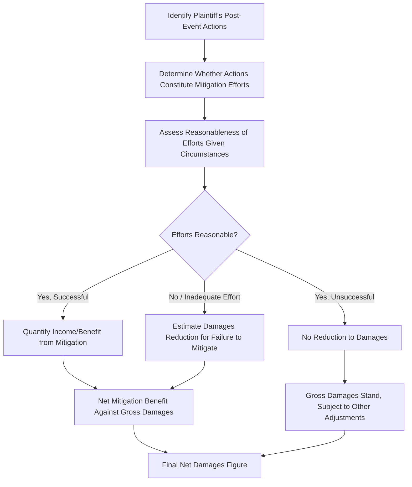

## Mitigation and Offsetting Benefits

### Overview

Mitigation and offsetting benefits address the reduction of otherwise recoverable damages to account for the injured party's duty to minimize losses and for any financial gains realized as a consequence of the wrongful act. These concepts operate as a check on gross damages calculations, ensuring that a damages award compensates for actual net economic harm rather than overstating loss by ignoring the plaintiff's own responsive actions or incidental financial benefits arising from the same event.

### The Duty to Mitigate: Legal Foundation

**Key Points**

- Most jurisdictions impose a legal duty on an injured party to take reasonable steps to minimize damages flowing from a wrongful act
- The duty requires only *reasonable* efforts, not extraordinary, unduly burdensome, or financially risky measures
- The burden of proving failure to mitigate (and the amount by which damages should be reduced as a result) typically falls on the defendant, not the plaintiff
- Mitigation efforts that are undertaken, even if ultimately unsuccessful, generally do not defeat the underlying damages claim — only a failure to make *reasonable* efforts reduces recovery

[Inference] The specific burden allocation (defendant must prove failure to mitigate) is a widely followed common-law principle, but its precise application and evidentiary thresholds can vary by jurisdiction and claim type, so this should be confirmed with counsel for the specific engagement.

### Categories of Mitigation in Economic Damages Contexts

| Context | Typical Mitigation Actions |
| --- | --- |
| Lost profits (breach of contract) | Securing replacement suppliers, customers, or contracts; redeploying idle resources to alternative revenue-generating activities |
| Employment-related claims (wrongful termination) | Seeking comparable alternative employment |
| Business interruption (property/casualty) | Relocating operations temporarily, expediting repairs, securing alternative production capacity |
| Intellectual property infringement | Pursuing alternative licensing arrangements or non-infringing product substitutes |
| Personal injury / lost earning capacity | Vocational rehabilitation, alternative employment within revised capacity |

### The Mitigation Analysis Workflow

#### Step 1: Identify Post-Event Actions

- Review the plaintiff's conduct following the wrongful act: new contracts entered, alternative markets pursued, cost-cutting measures, redeployment of assets or personnel

#### Step 2: Assess Reasonableness

- Reasonableness is evaluated based on what a similarly situated business/individual would be expected to do under the circumstances, not with the benefit of hindsight
- Factors include: financial capacity to pursue mitigation, availability of reasonable alternatives, time constraints, and industry practice

#### Step 3: Quantify Mitigation Income or Benefit

- Where mitigation was successful, quantify the income or cost savings realized and net it against gross damages
- Where mitigation efforts were reasonable but unsuccessful, the cost of those efforts (to the extent not already captured elsewhere) may itself be a recoverable component of damages, while gross lost profits remain otherwise intact

#### Step 4: Estimate Impact of Inadequate Mitigation (if applicable)

- If the defendant establishes that reasonable mitigation would have reduced the loss and the plaintiff failed to undertake it, the forensic accountant may be asked to estimate the hypothetical damages reduction that reasonable mitigation would have achieved

### Quantifying Mitigation: Net Damages Formula

$$\text{Net Damages} = \text{Gross Lost Profits} - \text{Income/Benefits from Mitigation} + \text{Reasonable Costs Incurred in Mitigation Efforts}$$

**Example**

> A distributor loses a key supply contract due to breach, with gross lost profits calculated at $800,000 over the loss period. During that period, the distributor secures a replacement supplier and generates $150,000 in profit from substitute sales, while incurring $25,000 in reasonable transition costs (new supplier onboarding, expedited freight).
>
> $$\text{Net Damages} = 800{,}000 - 150{,}000 + 25{,}000 = 675{,}000$$

### Offsetting Benefits Distinguished from Mitigation

**Key Points**

- **Mitigation** involves affirmative steps taken by the injured party to reduce loss
- **Offsetting benefits** (sometimes analyzed under the "collateral source rule" in some jurisdictions, though that rule itself varies in application) refer to financial gains the plaintiff receives that are related to, but not the result of active mitigation efforts — e.g., insurance proceeds, tax benefits, or incidental cost savings arising directly from the wrongful act itself
- Some offsetting benefits are excluded from netting against damages by law or policy (e.g., in many jurisdictions, insurance proceeds are not deducted from a tortfeasor's liability under the collateral source rule), while others (such as costs genuinely avoided as a direct consequence of not performing the lost business, as in standard lost-profits netting) are properly included in the damages calculation itself, not as a separate "offset"

[Unverified] The collateral source rule and its exceptions vary significantly by jurisdiction and by claim type (tort vs. contract), and some jurisdictions have modified or abolished aspects of the rule by statute; the applicable treatment should be confirmed with counsel rather than assumed.

### Distinguishing Avoided Costs from Mitigation Income

| Concept | Nature | Treatment |
| --- | --- | --- |
| Avoided costs (e.g., variable costs not incurred because lost sales did not occur) | A direct arithmetic component of calculating *net* lost profits from lost revenue | Subtracted from lost revenue as part of the core lost-profits calculation itself |
| Mitigation income (e.g., profit from replacement business obtained through affirmative effort) | A separate, subsequent benefit resulting from the plaintiff's own responsive actions | Netted against the calculated gross lost profits as a mitigation credit |
| Offsetting benefits (e.g., insurance proceeds, incidental windfalls) | Financial benefit connected to the loss event but not the result of the plaintiff's mitigation effort | Treatment depends on jurisdiction-specific rules (e.g., collateral source rule); not automatically netted |

### Analytical Challenges in Mitigation Assessment

**Key Points**

- **Attribution difficulty**: Determining whether new business obtained during the loss period is genuinely a substitute for the lost business, or would have been obtained regardless (i.e., incremental vs. simply coincidental revenue)
- **Timing mismatches**: Mitigation income may occur in a different period than the loss it is meant to offset, requiring careful period-matching in the analysis
- **Capacity constraints**: Assessing whether the plaintiff had the practical capacity (financial, operational, market access) to pursue mitigation opportunities that a defendant may argue were available
- **Double-counting risk**: Ensuring that costs already treated as "avoided costs" in the gross-to-net lost profits calculation are not also subtracted a second time as a mitigation benefit

### Evaluating the Reasonableness of Mitigation Efforts

**Example**

> In a wrongful termination claim, the defendant argues the plaintiff failed to mitigate by not accepting an available lower-paying position. Reasonableness assessment typically considers:
>
> - Whether the position was substantially similar in status, responsibility, and compensation
> - Whether accepting it would have been considered a demotion under prevailing employment standards
> - The plaintiff's documented job search efforts (applications submitted, interviews attended)
> - Prevailing market conditions for comparable employment during the relevant period
>
> A forensic accountant or vocational expert may quantify the hypothetical earnings from the declined position and compare them to the plaintiff's actual mitigation efforts and outcomes to assist the trier of fact in assessing reasonableness.

### Documentation and Evidentiary Support

- Contemporaneous business records demonstrating mitigation efforts (correspondence with potential replacement customers/suppliers, job search logs, board minutes discussing responsive strategy) materially strengthen the credibility of a mitigation analysis
- Absence of such documentation can support a defense argument that mitigation efforts were inadequate or that claimed replacement income is not genuinely attributable to mitigation
- Forensic accountants should request and review this category of evidence specifically, as it is often not captured in standard financial statements or general ledger data

### Common Analytical Pitfalls

**Key Points**

- Failing to distinguish between avoided costs (part of gross-to-net lost profits calculation) and separate mitigation income (a further offset), risking double-counting or omission
- Assuming all post-loss-period revenue growth is unrelated "coincidental" business without adequately testing whether it is genuinely substitute business
- Applying hindsight bias when assessing reasonableness of mitigation decisions, rather than evaluating information reasonably available to the plaintiff at the time
- Overlooking jurisdiction-specific treatment of offsetting benefits (e.g., collateral source rule variations), leading to an incorrect netting approach
- Insufficient period-matching between when mitigation income was earned and when the corresponding loss occurred

### Illustrative Net Damages Bridge

<svg xmlns="http://www.w3.org/2000/svg" viewBox="0 0 850 260" font-family="Arial, sans-serif">
<text x="425" y="22" font-size="16" font-weight="bold" text-anchor="middle">Mitigation-Adjusted Damages Bridge (svg_diagram)</text>
<rect x="30" y="90" width="140" height="90" fill="#e8f0fe" stroke="#4285f4" />
<text x="100" y="130" font-size="9" text-anchor="middle">Gross Lost</text>
<text x="100" y="143" font-size="9" text-anchor="middle">Profits</text>
<text x="100" y="160" font-size="10" font-weight="bold" text-anchor="middle">$800,000</text>
<rect x="200" y="120" width="140" height="60" fill="#fce8e6" stroke="#ea4335" />
<text x="270" y="145" font-size="9" text-anchor="middle">Less: Mitigation</text>
<text x="270" y="158" font-size="9" text-anchor="middle">Income ($150,000)</text>
<rect x="370" y="90" width="140" height="90" fill="#fef7e0" stroke="#fbbc04" />
<text x="440" y="130" font-size="9" text-anchor="middle">Add: Mitigation</text>
<text x="440" y="143" font-size="9" text-anchor="middle">Costs</text>
<text x="440" y="160" font-size="10" text-anchor="middle">$25,000</text>
<rect x="540" y="90" width="150" height="90" fill="#e6f4ea" stroke="#34a853" />
<text x="615" y="130" font-size="9" text-anchor="middle">Net Damages</text>
<text x="615" y="150" font-size="11" font-weight="bold" text-anchor="middle">$675,000</text>
<line x1="170" y1="135" x2="200" y2="135" stroke="black" marker-end="url(#arrow4)" />
<line x1="340" y1="135" x2="370" y2="135" stroke="black" marker-end="url(#arrow4)" />
<line x1="510" y1="135" x2="540" y2="135" stroke="black" marker-end="url(#arrow4)" />
</svg>

### Conclusion

Mitigation and offsetting benefits require the forensic accountant to look beyond the mechanical gross-to-net lost profits calculation and carefully evaluate the plaintiff's post-event conduct and any incidental financial benefits connected to the loss event. Proper treatment demands clear conceptual separation between avoided costs (part of core damages calculation), mitigation income (a subsequent offsetting credit tied to affirmative effort), and offsetting benefits governed by jurisdiction-specific doctrines such as the collateral source rule. Rigorous documentation review, careful attribution analysis, and period-matching are essential to avoid double-counting or omission errors that can materially distort the final net damages figure presented to the trier of fact.

**Related Topics**

- Lost profits and business interruption calculation methodologies
- Collateral source rule variations across jurisdictions
- Fixed and variable cost classification for gross-to-net damages calculations
- Reasonable certainty standard in damages quantification
- Employment damages and vocational mitigation assessment
- Documentation and evidentiary support for damages claims
- Rebuttal analysis of opposing mitigation assumptions
- But-for analysis and causation frameworks
- Period-matching and timing issues in multi-period damages claims
- Insurance recovery interaction with tort and contract damages claims