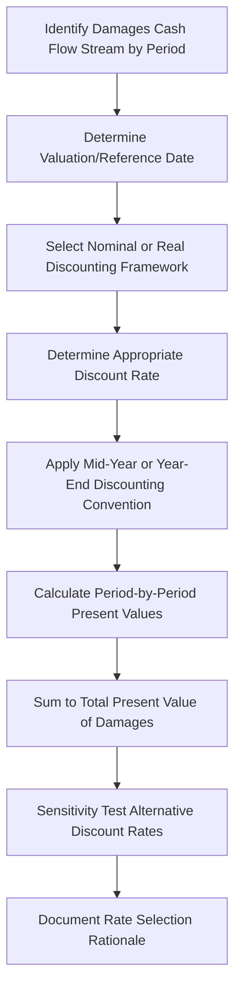

## Present Value and Discounting of Damages

### Overview

Present value and discounting techniques convert future or multi-period damages into a single, economically equivalent value as of a specific reference date — typically the date of injury, the date of trial, or the date of judgment, depending on jurisdictional rules and the nature of the claim. This process recognizes the fundamental time value of money principle: a dollar received in the future is worth less than a dollar received today, due to both the opportunity cost of capital and the risk associated with future, uncertain cash flows. Discounting is central to converting projected lost profits, future medical costs, lost earning capacity, or other multi-year damages streams into a legally awardable lump-sum figure.

### Time Value of Money Foundations

**Key Points**

- Present value (PV) reflects the current worth of a future sum or stream of sums, given a specified rate of return (discount rate)
- Future value (FV) is the converse: the value a current sum will grow to at a specified rate over time
- The choice of discount rate is one of the most contested elements in damages litigation, as it directly and often materially affects the final award
- Discounting for risk/time value should be conceptually distinct from adjusting cash flows for inflation, though the two are often integrated using either nominal or real methodologies (see below)

### Core Present Value Formulas

For a single future cash flow:

$$PV = \frac{FV}{(1+r)^n}$$

For a stream of periodic cash flows:

$$PV = \sum_{t=1}^{n} \frac{CF_t}{(1+r)^t}$$

For a growing perpetuity (used in terminal value calculations for indefinite-duration damages):

$$PV = \frac{CF_1}{(r-g)}$$

where:

- $CF_t$ = cash flow (damages) in period $t$
- $r$ = discount rate
- $g$ = growth rate (must be less than $r$ for the formula to converge)
- $n$ = number of periods

### The Discounting Workflow in a Damages Context

### Selecting the Appropriate Discount Rate

**Key Points**

- The discount rate should reflect the risk profile of the specific cash flows being discounted — riskier, more uncertain projected cash flows warrant a higher discount rate; more certain cash flows (e.g., a contractually fixed payment stream) warrant a lower rate
- Common rate benchmarks include:

| Rate Basis | Typical Use Case |
| --- | --- |
| **Risk-free rate** (e.g., U.S. Treasury yields matched to the damages period duration) | Highly certain cash flows, or where courts require a conservative, low-risk discount rate |
| **Weighted Average Cost of Capital (WACC)** | Business-specific lost profits where cash flows carry business and market risk similar to the company's overall risk profile |
| **Cost of equity** (e.g., via Capital Asset Pricing Model) | Cash flows accruing to equity holders specifically, reflecting equity-level risk |
| **Risk-adjusted specific rate** | Custom-built rate reflecting the unique risk characteristics of the projected damages stream (e.g., a build-up method incorporating company-specific risk premiums) |

[Inference] Courts in personal injury and wrongful death cases have historically shown a preference for more conservative, lower-risk discount rates (often tied to risk-free or near-risk-free instruments) given the compensatory, non-speculative nature of future earnings/medical cost streams, whereas commercial lost-profits cases more often employ business-risk-adjusted rates such as WACC; however, this is a general pattern rather than a universal rule, and practice varies by jurisdiction.

### Nominal vs. Real Discounting Frameworks

| Framework | Cash Flow Treatment | Discount Rate Treatment | Consistency Requirement |
| --- | --- | --- | --- |
| **Nominal** | Cash flows include expected inflation | Discount rate includes an inflation component (nominal rate) | Must match — nominal cash flows discounted at nominal rate |
| **Real** | Cash flows exclude inflation (constant dollars) | Discount rate excludes inflation (real rate) | Must match — real cash flows discounted at real rate |

The relationship between nominal and real rates is approximated by the Fisher equation:

$$(1 + r_{nominal}) = (1 + r_{real}) \times (1 + \pi)$$

where $\pi$ = expected inflation rate.

**Key Points**

- A critical and frequently litigated error is mismatching nominal cash flows with a real discount rate (or vice versa), which systematically overstates or understates present value
- Some practitioners use a "net discount rate" approach in wage-loss and personal injury contexts, netting an assumed wage growth rate against the discount rate to simplify the calculation while implicitly using a real framework

### Discounting Conventions: Timing Assumptions

**Key Points**

- **Year-end convention**: Assumes cash flows occur at the end of each period — simpler, but can understate present value for cash flows that actually accrue throughout the period
- **Mid-year convention**: Assumes cash flows occur, on average, at the midpoint of each period — often considered more representative of cash flows that accrue evenly throughout a year (e.g., monthly lost wages or monthly lost profits)
- **Reference/valuation date**: The specific date to which all cash flows are discounted back must be clearly established and is often dictated by jurisdictional rule or case-specific stipulation (date of injury, date of breach, date of trial, date of judgment)

**Example**

> Comparing year-end vs. mid-year convention for a single $100,000 annual cash flow expected in Year 1, discounted at 8%:
>
> Year-end convention:
>
> $$PV = \frac{100{,}000}{(1.08)^1} = 92{,}593$$
>
> Mid-year convention:
>
> $$PV = \frac{100{,}000}{(1.08)^{0.5}} = 96{,}225$$
>
> The mid-year convention produces a higher present value because it assumes the cash flow, on average, is received earlier within the period than the year-end assumption implies.

### Discounting Multi-Year Damages Streams: Worked Example

**Example**

> A lost profits claim projects the following annual net lost profits, to be discounted to present value as of the valuation date using a 10% discount rate (year-end convention):
>
| Year | Lost Profits | Discount Factor | Present Value |
| --- | --- | --- | --- |
| 1 | $200,000 | $1/(1.10)^1 = 0.9091$ | $181,818 |
| 2 | $220,000 | $1/(1.10)^2 = 0.8264$ | $181,818 |
| 3 | $240,000 | $1/(1.10)^3 = 0.7513$ | $180,316 |
| **Total PV** |  |  | **$543,952** |

### Terminal Value for Indefinite or Long-Horizon Damages

Where damages are projected to continue indefinitely (e.g., permanent loss of earning capacity, permanent business impairment), a terminal value calculation using the growing perpetuity formula captures value beyond an explicit projection period:

$$TV_n = \frac{CF_{n+1}}{(r - g)}$$

This terminal value, calculated as of the end of the explicit projection period ($n$), must itself then be discounted back to the valuation date:

$$PV(TV_n) = \frac{TV_n}{(1+r)^n}$$

[Inference] Terminal value calculations are particularly sensitive to the spread between the discount rate and the assumed long-term growth rate; a narrow spread can produce a disproportionately large terminal value relative to the explicit projection period, making this assumption a common focal point in rebuttal analysis and cross-examination.

### Jurisdictional and Procedural Considerations

**Key Points**

- Some jurisdictions have statutory or case-law-established methodologies for discounting specific categories of damages (e.g., statutory discount rates in certain wrongful death or workers' compensation contexts)
- Federal and state courts may differ in their acceptance of specific discount rate methodologies (WACC vs. risk-free rate) depending on the nature of the claim
- Pre-judgment interest (compensating for the period between injury/breach and judgment) and post-judgment interest (compensating for the period after judgment until payment) are related but analytically distinct from present value discounting of future damages, and are often governed by separate statutory rates

[Unverified] The interplay between present value discounting of future losses and pre-/post-judgment interest calculations varies considerably by jurisdiction, and double-counting (e.g., both discounting future losses to present value at trial and separately awarding pre-judgment interest on the same amounts) is a recognized risk that should be reviewed carefully against the specific procedural rules of the forum.

### Sensitivity Analysis on Discount Rate Selection

**Key Points**

- Given the outsized impact of discount rate selection on long-horizon damages, presenting a sensitivity table showing present value at several plausible discount rates strengthens both settlement negotiation position and trial credibility
- This also preemptively addresses likely cross-examination challenges to the specific rate selected

### Common Analytical Pitfalls

**Key Points**

- Mismatching nominal cash flows with a real discount rate (or vice versa), leading to systematic over- or under-statement of present value
- Applying a discount rate that does not reflect the actual risk profile of the specific cash flow stream (e.g., using a low risk-free rate for highly speculative business projections)
- Inconsistent timing conventions between the cash flow projection and the discounting calculation (e.g., mid-year cash flows discounted using year-end factors)
- Failing to address potential double-counting between present value discounting and separately awarded pre-judgment interest
- Overstating terminal value through an unsupported, aggressive long-term growth rate assumption relative to the discount rate

### Illustrative Present Value Decay Curve

<svg xmlns="http://www.w3.org/2000/svg" viewBox="0 0 850 280" font-family="Arial, sans-serif">
<text x="425" y="22" font-size="16" font-weight="bold" text-anchor="middle">Present Value Decay Over Time (svg_diagram)</text>
<line x1="70" y1="230" x2="800" y2="230" stroke="black" />
<line x1="70" y1="230" x2="70" y2="50" stroke="black" />
<text x="30" y="55" font-size="9">PV Factor</text>
<text x="420" y="255" font-size="10" text-anchor="middle">Years →</text>
<path d="M 70 60 Q 200 100 350 150 T 780 210" stroke="#4285f4" stroke-width="2" fill="none" />
<text x="100" y="70" font-size="9">1.0</text>
<text x="750" y="220" font-size="9">→0</text>
<line x1="70" y1="230" x2="70" y2="60" stroke="gray" stroke-dasharray="2" />
<text x="450" y="130" font-size="9" fill="#4285f4">Discount Rate = 10%</text>
</svg>

### Conclusion

Present value and discounting of damages translate multi-period or future economic harm into a single, legally usable figure grounded in the time value of money. The reliability of this conversion hinges on selecting a discount rate that appropriately reflects the risk of the specific cash flow stream, maintaining strict internal consistency between nominal/real frameworks and cash flow/rate pairing, applying appropriate timing conventions, and transparently documenting the rationale for all rate and methodology choices. Because discount rate selection can materially swing the ultimate damages figure — particularly for long-horizon or terminal-value-dependent claims — this element is frequently a central point of contention in expert reports, rebuttal analysis, and cross-examination.

**Related Topics**

- Weighted average cost of capital (WACC) and cost of equity estimation (CAPM)
- Lost profits and business interruption calculation methodologies
- Terminal value and growing perpetuity modeling in long-horizon claims
- Pre-judgment and post-judgment interest rules and interaction with present value
- Personal injury and wrongful death earning capacity discounting conventions
- Sensitivity analysis techniques for damages assumptions
- Rebuttal analysis of opposing discount rate and terminal value assumptions
- Inflation adjustment and real vs. nominal cash flow modeling
- Business valuation income approach and discounted cash flow methodology
- Statutory and case-law discount rate requirements by jurisdiction